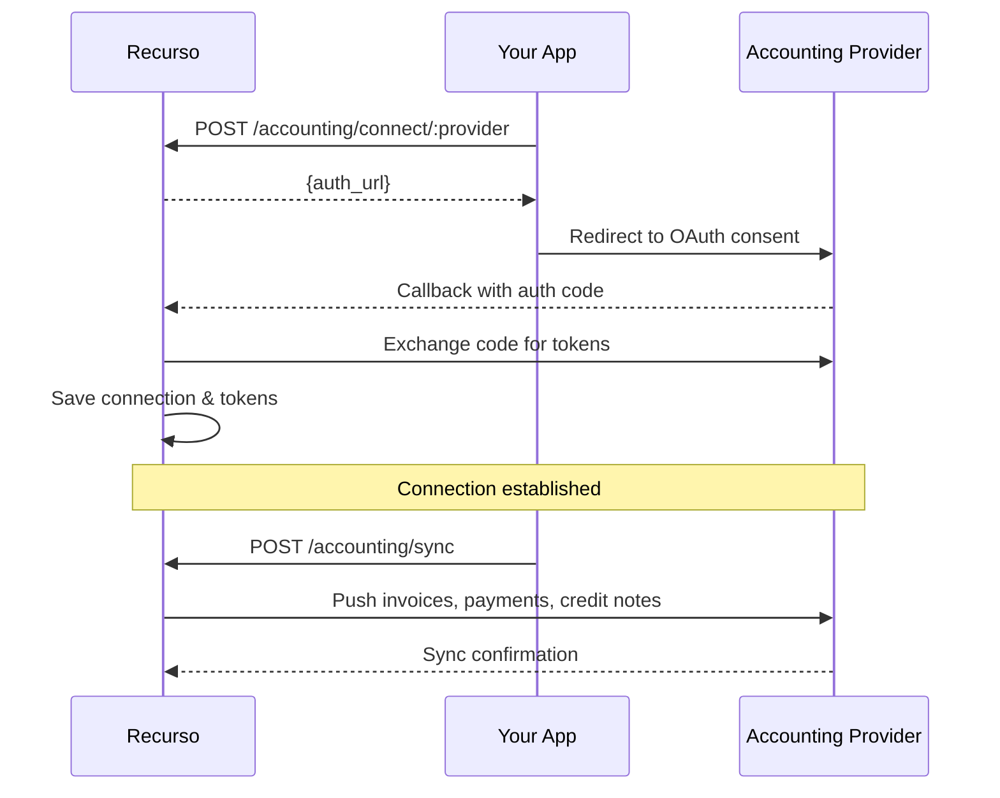
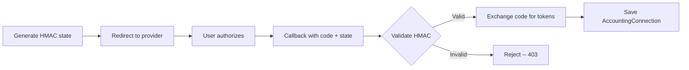

## Overview

Recurso integrates with popular accounting platforms so your billing data flows directly into your general ledger. Connect your accounting software via OAuth, and Recurso will automatically sync invoices, payments, and credit notes.

<CardGroup cols={3}>
  <Card title="QuickBooks" icon="building-columns">
    Full two-way sync for invoices, payments, and credit notes
  </Card>
  <Card title="Xero" icon="file-invoice">
    Automated journal entries and invoice sync
  </Card>
  <Card title="Tally" icon="calculator">
    Coming soon -- sync billing data to Tally ERP
  </Card>
</CardGroup>

## How It Works



## Supported Providers

| Provider | Status | Sync Direction | ID Prefix |
|----------|--------|----------------|-----------|
| QuickBooks Online | GA | Recurso to QBO | `acc_qb_` |
| Xero | GA | Recurso to Xero | `acc_xr_` |
| Tally | Planned | -- | -- |

## Setting Up OAuth Credentials

Before connecting an accounting provider, configure the OAuth credentials for your tenant.

<Steps>
  <Step title="Register an app with the provider">
    Create a developer app in [QuickBooks Developer Portal](https://developer.intuit.com) or [Xero Developer Portal](https://developer.xero.com). Set the redirect URI to `https://api.recurso.dev/v1/accounting/callback/:provider`.
  </Step>
  <Step title="Add credentials to Recurso">
    Provide the client ID and client secret via your Recurso dashboard or environment configuration.

    **QuickBooks:**
    - `QBO_CLIENT_ID` -- your QuickBooks app client ID
    - `QBO_CLIENT_SECRET` -- your QuickBooks app client secret

    **Xero:**
    - `XERO_CLIENT_ID` -- your Xero app client ID
    - `XERO_CLIENT_SECRET` -- your Xero app client secret
  </Step>
  <Step title="Initiate the connection">
    Call the connect endpoint to begin the OAuth flow.
  </Step>
</Steps>

<Warning>
Store OAuth client secrets securely. Never expose them in client-side code or version control. Recurso encrypts stored tokens at rest.
</Warning>

## Connect a Provider

Initiate the OAuth flow to link your accounting software.

<CodeGroup>

```bash cURL
curl -X POST https://api.recurso.dev/v1/accounting/connect/quickbooks \
  -H "Authorization: Bearer $API_KEY"
```
</CodeGroup>

### Connect Parameters

| Parameter | Type | Location | Description |
|-----------|------|----------|-------------|
| `provider` | `string` | Path | The accounting provider: `quickbooks` or `xero` |

### OAuth State Security

Recurso generates an HMAC-signed `state` parameter for each OAuth flow to prevent CSRF attacks. The callback handler validates the state signature before exchanging the authorization code for tokens.



## OAuth Callback

The callback at `GET /v1/accounting/callback/:provider` is handled automatically. Recurso validates the HMAC state, exchanges the code for tokens, saves the connection with `sync_status: "idle"`, and redirects the user back.

<Info>
You do not need to implement the callback handler yourself. Recurso manages the full token exchange and storage, including automatic token refresh.
</Info>

## List Connections

Retrieve all accounting connections for your tenant.

<CodeGroup>

```bash cURL
curl https://api.recurso.dev/v1/accounting/connections \
  -H "Authorization: Bearer $API_KEY"
```
</CodeGroup>

### AccountingConnection Object

| Field | Type | Description |
|-------|------|-------------|
| `id` | `string` | Unique connection ID |
| `tenant_id` | `string` | Your tenant identifier |
| `provider` | `string` | `quickbooks` or `xero` |
| `realm_id` | `string` | Provider-specific company/org ID |
| `sync_status` | `string` | Current sync state: `idle`, `syncing`, `error` |
| `is_active` | `boolean` | Whether the connection is active |
| `token_expires_at` | `string` | When the current access token expires |
| `created_at` | `string` | When the connection was established |

## Disconnect a Provider

Remove an accounting connection. This revokes tokens and stops all syncing.

<CodeGroup>

```bash cURL
curl -X DELETE https://api.recurso.dev/v1/accounting/connections/acc_qb_abc123 \
  -H "Authorization: Bearer $API_KEY"
```
</CodeGroup>

<Warning>
Disconnecting does not delete previously synced data from the accounting provider. It only stops future syncs and revokes Recurso's access tokens.
</Warning>

## Trigger a Sync

Manually trigger a sync to push billing data to your connected accounting platforms.

<CodeGroup>

```bash cURL
curl -X POST https://api.recurso.dev/v1/accounting/sync \
  -H "Authorization: Bearer $API_KEY"
```
</CodeGroup>

<Info>
Recurso also runs automatic syncs on a daily schedule. The two differ in
scope: the daily sync is **incremental** (unchanged entities are skipped —
see below), while the manual endpoint **forces a full re-push** of every
mapped entity. Use manual sync when you need data pushed immediately, or to
repair provider-side records that were edited or deleted outside Recurso.
</Info>

## Incremental Sync (Dirty Tracking)

The scheduled daily sync does not re-push every mapped entity. An entity is
skipped as unchanged when both of these hold:

1. it already has an ID mapping on the connection (it has synced
   successfully before), and
2. its source `updated_at` is **not newer** than the mapping's last
   successful push.

Anything that fails those checks is (re-)pushed. In practice a re-push is
triggered by whatever bumps the entity's `updated_at` — editing a customer's
billing details, an invoice changing status, a plan rename, and so on.

When it cannot be sure, the sync **fails open** and pushes anyway: entities
with no mapping yet, rows predating change tracking (zero `updated_at`), or
a failed mapping lookup are all treated as dirty. Skipping never risks a
stale ledger; the worst case is a redundant push.

Each connection's sync log records how much work was actually done:

```text
synced=3 skipped_unchanged=241 force=false
```

<Note>
The manual [`POST /v1/accounting/sync`](/api-reference/accounting/sync)
endpoint sets `force=true` and bypasses the dirty check entirely — every
mapped entity is re-pushed.
</Note>

## Xero Item Linkage

Plans sync to Xero as **Items**, and invoice lines reference them by item
`Code` (Xero links lines to items by code, not by ID):

- the Item is created with a `Code` derived from the **plan's code** (e.g.
  `PRO-USD`), not an internal ID
- invoice lines for that plan carry the same value as `ItemCode`, so revenue
  rolls up under the item in Xero reports
- Xero caps item codes at **30 characters**; Recurso applies the same
  truncation on both sides so the item's `Code` and the line's `ItemCode`
  always match

Invoice lines for plans that have not synced as items yet are sent bare,
with just a description and the default sales account code.

## Check Sync Status

View recent sync logs to monitor sync health and troubleshoot failures.

<CodeGroup>

```bash cURL
curl https://api.recurso.dev/v1/accounting/sync/status \
  -H "Authorization: Bearer $API_KEY"
```
</CodeGroup>

### Sync Status Values

| Status | Description |
|--------|-------------|
| `idle` | No sync in progress |
| `syncing` | Sync currently running |
| `completed` | Last sync finished successfully |
| `error` | Last sync encountered errors |

## What Data Syncs

Recurso pushes the following billing objects to your accounting platform:

<AccordionGroup>
  <Accordion title="Invoices">
    All finalized invoices are synced as invoices/bills in the accounting platform. Fields mapped include invoice number, customer name, line items, tax amounts, due date, and currency.
  </Accordion>
  <Accordion title="Payments">
    Successful payments are synced as payment receipts linked to their corresponding invoices. This keeps your accounts receivable accurate and up to date.
  </Accordion>
  <Accordion title="Credit Notes">
    Credit notes and refunds are synced as credit memos. They are automatically linked to the original invoice in the accounting platform.
  </Accordion>
</AccordionGroup>

| Recurso Object | QuickBooks Mapping | Xero Mapping |
|----------------|-------------------|--------------|
| Invoice (`inv_`) | Invoice | Invoice |
| Payment | Payment | Payment |
| Credit Note | Credit Memo | Credit Note |
| Customer (`cust_`) | Customer | Contact |
| Plan | Item (lines reference it by `ItemRef`) | Item (lines reference it by `Code` — see [Xero Item Linkage](#xero-item-linkage)) |

## Webhook Events

| Event | Description |
|-------|-------------|
| `accounting.connection_created` | New accounting provider connected |
| `accounting.connection_revoked` | Connection disconnected or tokens revoked |
| `accounting.sync_completed` | Sync finished successfully |
| `accounting.sync_failed` | Sync encountered errors |

## Best Practices

<CardGroup cols={2}>
  <Card title="Monitor Sync Logs" icon="list-check">
    Check sync status regularly to catch token expirations and mapping errors early
  </Card>
  <Card title="Re-authorize Proactively" icon="rotate">
    Refresh connections before tokens expire to avoid sync interruptions
  </Card>
  <Card title="Use Automatic Syncs" icon="clock">
    Let Recurso handle scheduled syncs rather than triggering manual syncs for every invoice
  </Card>
  <Card title="Reconcile Monthly" icon="scale-balanced">
    Cross-check synced totals against your accounting platform at the end of each month
  </Card>
</CardGroup>

<Tip>
If a sync fails due to an expired token, Recurso will attempt an automatic token refresh. If the refresh also fails, you will receive an `accounting.sync_failed` webhook and the connection's `is_active` flag will be set to `false`. Re-authorize by calling the connect endpoint again.
</Tip>
