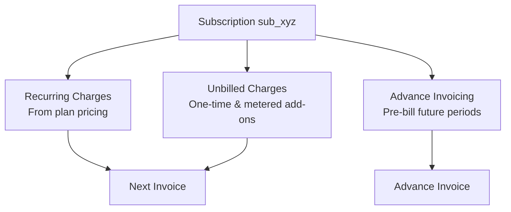
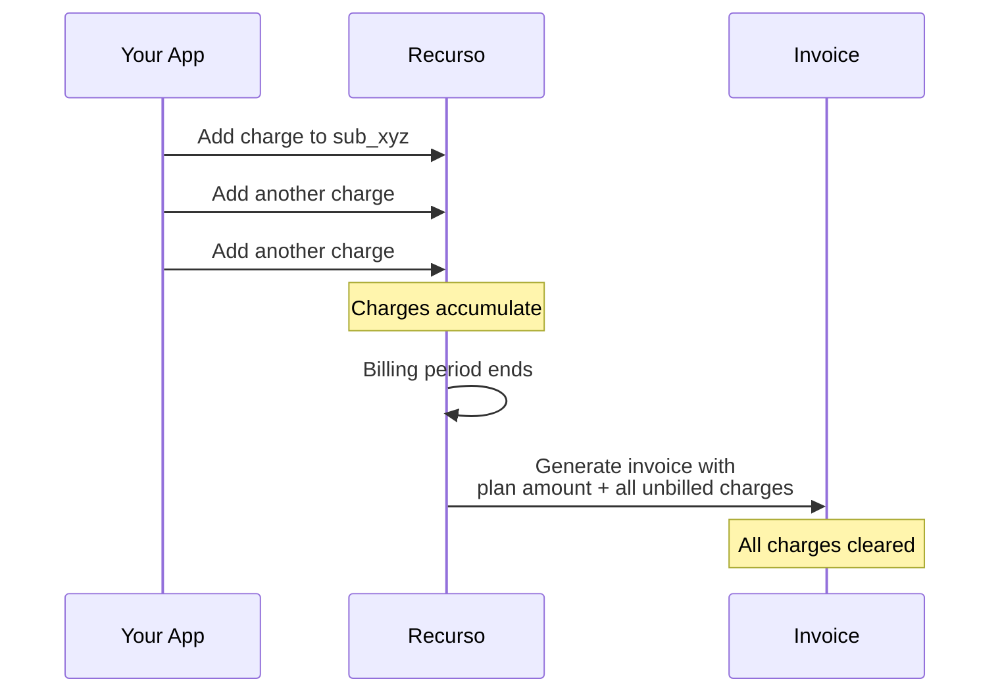

## Overview

Beyond standard recurring billing, Recurso supports advanced billing patterns that let you add one-time or metered charges to subscriptions and pre-bill customers for future periods. These capabilities cover common SaaS scenarios like overage charges, professional services fees, and annual prepayment.



## Unbilled Charges

Unbilled charges are line items attached to a subscription that accumulate until the next invoice is generated. They are ideal for:

- **Metered add-ons** — additional API calls, storage, or compute beyond the plan allowance
- **One-time charges** — setup fees, professional services, custom development
- **Overage fees** — charges triggered when usage exceeds a threshold
- **Ad hoc adjustments** — manual billing adjustments applied by your team

### How Unbilled Charges Work



Unbilled charges sit in a pending state until the subscription's billing period ends. At that point, Recurso rolls them into the next invoice alongside the regular plan amount. Once invoiced, the charges are cleared from the pending queue.

### Add an Unbilled Charge

<CodeGroup>
```typescript TypeScript
const charge = await recurso.subscriptions.charges.add("sub_xyz", {
  amount: 250000,       // ₹2,500.00 in minor units
  currency: "INR",
  description: "Additional 50GB storage — June 2025"
});

// Response
{
  id: "chrg_abc123",
  subscription_id: "sub_xyz",
  amount: 250000,
  currency: "INR",
  description: "Additional 50GB storage — June 2025",
  status: "pending",
  created_at: "2025-06-15T14:30:00Z"
}
```

```bash cURL
curl -X POST https://billing.example.com/v1/subscriptions/sub_xyz/charges \
  -H "Authorization: Bearer $API_KEY" \
  -H "Content-Type: application/json" \
  -d '{
    "amount": 250000,
    "currency": "INR",
    "description": "Additional 50GB storage — June 2025"
  }'
```
</CodeGroup>

### Request Parameters

| Parameter | Type | Required | Description |
|-----------|------|----------|-------------|
| `amount` | `integer` | Yes | Charge amount in minor currency units |
| `currency` | `string` | Yes | ISO 4217 currency code (must match subscription currency) |
| `description` | `string` | Yes | Human-readable description shown on the invoice |

### Charge Object

| Field | Type | Description |
|-------|------|-------------|
| `id` | `string` | Unique identifier (prefixed `chrg_`) |
| `subscription_id` | `string` | The subscription this charge belongs to |
| `amount` | `integer` | Amount in minor currency units |
| `currency` | `string` | ISO 4217 currency code |
| `description` | `string` | Description of the charge |
| `status` | `string` | `pending` until invoiced, then `invoiced` |
| `created_at` | `string` | ISO 8601 timestamp |

### List Unbilled Charges

Retrieve all pending charges for a subscription that have not yet been invoiced.

<CodeGroup>
```typescript TypeScript
const charges = await recurso.subscriptions.charges.list("sub_xyz");

// Response
{
  data: [
    {
      id: "chrg_abc123",
      subscription_id: "sub_xyz",
      amount: 250000,
      currency: "INR",
      description: "Additional 50GB storage — June 2025",
      status: "pending",
      created_at: "2025-06-15T14:30:00Z"
    },
    {
      id: "chrg_def456",
      subscription_id: "sub_xyz",
      amount: 75000,
      currency: "INR",
      description: "Premium support — one-time",
      status: "pending",
      created_at: "2025-06-18T09:15:00Z"
    }
  ]
}
```

```bash cURL
curl https://billing.example.com/v1/subscriptions/sub_xyz/charges \
  -H "Authorization: Bearer $API_KEY"
```
</CodeGroup>

### How Charges Appear on Invoices

When the billing period ends, all pending charges are added as line items on the invoice alongside the recurring plan amount:

```json
{
  "id": "inv_m8k29x",
  "subscription_id": "sub_xyz",
  "currency": "INR",
  "line_items": [
    {
      "description": "Pro Plan — July 2025",
      "amount": 499900,
      "type": "plan"
    },
    {
      "description": "Additional 50GB storage — June 2025",
      "amount": 250000,
      "type": "charge"
    },
    {
      "description": "Premium support — one-time",
      "amount": 75000,
      "type": "charge"
    }
  ],
  "subtotal": 824900,
  "total": 824900,
  "status": "open"
}
```

## Advance Invoicing

Advance invoicing lets you generate an invoice for one or more future billing periods. This is commonly used for:

- **Annual prepayment** — Bill a customer for 12 months upfront at a discounted rate
- **Multi-period commitments** — Collect payment for a committed contract term
- **Cash flow optimization** — Collect revenue earlier in the contract

### Generate an Advance Invoice

<CodeGroup>
```typescript TypeScript
const invoice = await recurso.subscriptions.advance("sub_xyz", {
  periods: 6  // Pre-bill for 6 upcoming periods
});

// Response
{
  id: "inv_adv_xyz",
  subscription_id: "sub_xyz",
  type: "advance",
  periods: 6,
  currency: "INR",
  line_items: [
    { description: "Pro Plan — Aug 2025", amount: 499900 },
    { description: "Pro Plan — Sep 2025", amount: 499900 },
    { description: "Pro Plan — Oct 2025", amount: 499900 },
    { description: "Pro Plan — Nov 2025", amount: 499900 },
    { description: "Pro Plan — Dec 2025", amount: 499900 },
    { description: "Pro Plan — Jan 2026", amount: 499900 }
  ],
  subtotal: 2999400,
  total: 2999400,
  status: "open"
}
```

```bash cURL
curl -X POST https://billing.example.com/v1/subscriptions/sub_xyz/advance \
  -H "Authorization: Bearer $API_KEY" \
  -H "Content-Type: application/json" \
  -d '{
    "periods": 6
  }'
```
</CodeGroup>

### Request Parameters

| Parameter | Type | Required | Description |
|-----------|------|----------|-------------|
| `periods` | `integer` | Yes | Number of future billing periods to invoice (minimum: `1`) |

<Warning>
Advance invoicing does not change the subscription's billing cycle. Regular invoices will be skipped for the pre-billed periods. If the subscription is cancelled before the advance-billed periods are consumed, the remaining amount becomes eligible for credit or refund per your cancellation policy.
</Warning>

### How Advance Invoicing Interacts with Revenue Recognition

When an advance invoice is paid, the full amount enters the Deferred Revenue account (`2100`). Revenue is then recognized month by month as each period elapses, following the standard recognition schedule described in the [Revenue Recognition](/advanced/revenue-recognition) guide.

```
Advance invoice paid (6 months × ₹4,999):
  Debit   1000 (Cash)               ₹29,994.00
  Credit  2100 (Deferred Revenue)   ₹29,994.00

End of each month (×6):
  Debit   2100 (Deferred Revenue)    ₹4,999.00
  Credit  4000 (Revenue)             ₹4,999.00
```

## Use Cases

<AccordionGroup>
  <Accordion title="Metered storage add-on">
    Your plan includes 10GB of storage. When a customer exceeds the limit, add an unbilled charge for the overage:

    ```typescript
    // Check storage usage
    const usage = await getCustomerStorageGB("cust_abc");
    const included = 10; // GB included in plan
    const overageGB = Math.max(0, usage - included);

    if (overageGB > 0) {
      await recurso.subscriptions.charges.add("sub_xyz", {
        amount: overageGB * 5000,  // ₹50.00 per GB
        currency: "INR",
        description: `Storage overage: ${overageGB}GB × ₹50.00`
      });
    }
    ```
  </Accordion>

  <Accordion title="One-time setup fee">
    Charge a setup fee when onboarding a new customer:

    ```typescript
    // After creating the subscription
    await recurso.subscriptions.charges.add("sub_xyz", {
      amount: 1500000,  // ₹15,000.00
      currency: "INR",
      description: "One-time platform setup and onboarding"
    });
    ```

    The setup fee will appear on the customer's first invoice alongside their initial plan charge.
  </Accordion>

  <Accordion title="Professional services hours">
    Bill for consulting or implementation hours consumed during the period:

    ```typescript
    const hours = 8;
    const ratePerHour = 500000; // ₹5,000.00

    await recurso.subscriptions.charges.add("sub_xyz", {
      amount: hours * ratePerHour,
      currency: "INR",
      description: `Professional services: ${hours} hours × ₹5,000.00`
    });
    ```
  </Accordion>

  <Accordion title="Annual prepayment with discount">
    Offer a discount for paying annually. Generate an advance invoice for 12 periods:

    ```typescript
    // First, apply an annual discount coupon
    await recurso.subscriptions.update("sub_xyz", {
      coupon_id: "coup_annual20"  // 20% off
    });

    // Then generate the advance invoice
    const invoice = await recurso.subscriptions.advance("sub_xyz", {
      periods: 12
    });

    // Customer receives one invoice for the full year at the discounted rate
    ```
  </Accordion>

  <Accordion title="Committed contract term">
    For enterprise customers signing a 24-month contract, generate an advance invoice for the full term:

    ```typescript
    const invoice = await recurso.subscriptions.advance("sub_xyz", {
      periods: 24
    });
    // Invoice total: 24 × plan amount
    // Revenue recognized monthly over 24 months
    ```
  </Accordion>
</AccordionGroup>

## Webhook Events

| Event | Description |
|-------|-------------|
| `invoice.created` | Fired when an advance invoice or charge-bearing invoice is generated |
| `invoice.paid` | Fired when the invoice (including charges) is paid |
| `subscription.charge.added` | Fired when an unbilled charge is added to a subscription |

## API Reference Summary

| Endpoint | Method | Description |
|----------|--------|-------------|
| `/v1/subscriptions/:id/charges` | `POST` | Add an unbilled charge |
| `/v1/subscriptions/:id/charges` | `GET` | List pending unbilled charges |
| `/v1/subscriptions/:id/advance` | `POST` | Generate an advance invoice |

## Best Practices

<CardGroup cols={2}>
  <Card title="Describe Charges Clearly" icon="file-lines">
    Always include a detailed description with dates and quantities. Customers see these on their invoices and vague descriptions cause support tickets.
  </Card>
  <Card title="Match Currency" icon="coins">
    The charge currency must match the subscription's currency. If a subscription is billed in EUR, all charges must also be in EUR.
  </Card>
  <Card title="Review Before Billing" icon="eye">
    Use the list endpoint to review pending charges before the billing cycle closes. This gives your team a chance to correct errors.
  </Card>
  <Card title="Limit Advance Periods" icon="calendar-check">
    Avoid invoicing too far in advance. Long advance periods increase refund risk if the customer cancels. For most cases, 3-12 periods is appropriate.
  </Card>
</CardGroup>

<Tip>
Combine unbilled charges with advance invoicing for maximum flexibility. For example, add a one-time implementation charge and then generate an advance invoice for 12 months — the one-time charge rolls into the next regular invoice while the advance invoice covers future periods separately.
</Tip>

<Info>
Unbilled charges are not prorated. If you add a charge mid-cycle, the full amount appears on the next invoice. If you need prorated charges, calculate the prorated amount before calling the add charge endpoint.
</Info>
