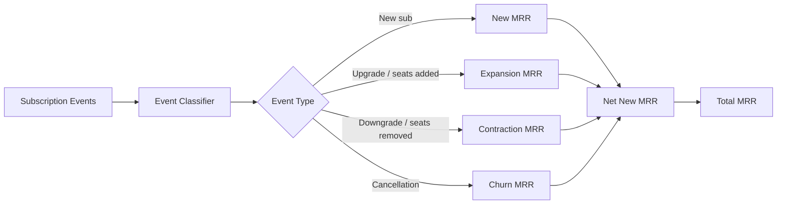

## Overview

Recurso provides built-in analytics that give you real-time visibility into your billing performance. Track monthly recurring revenue (MRR) movements, monitor usage patterns, and ask free-form questions about your data using GenAI-powered natural-language queries.

<CardGroup cols={3}>
  <Card title="MRR Tracking" icon="chart-line">
    New, expansion, contraction, and churn MRR broken down by period
  </Card>
  <Card title="Usage Statistics" icon="gauge">
    Aggregate usage metrics across meters and customers
  </Card>
  <Card title="AI Queries" icon="brain">
    Ask questions about your data in plain English
  </Card>
</CardGroup>

## MRR Tracking

Monthly Recurring Revenue is the core health metric for any subscription business. Recurso automatically calculates MRR and breaks it down into movement categories.

### MRR Components

| Component | Description |
|-----------|-------------|
| `new_mrr` | Revenue from newly created subscriptions |
| `expansion_mrr` | Revenue increase from upgrades or seat additions |
| `contraction_mrr` | Revenue decrease from downgrades or seat removals |
| `churn_mrr` | Revenue lost from cancelled subscriptions |
| `net_new_mrr` | Net change: new + expansion - contraction - churn |
| `total_mrr` | Total active MRR at end of period |

### Get MRR Metrics

<CodeGroup>
```typescript TypeScript
const mrr = await recurso.analytics.getMRR({
  start_date: '2026-01-01',
  end_date: '2026-06-30'
});

// Response
{
  data: {
    start_date: '2026-01-01',
    end_date: '2026-06-30',
    total_mrr: 4850000,          // in smallest currency unit (paise)
    new_mrr: 1200000,
    expansion_mrr: 350000,
    contraction_mrr: 75000,
    churn_mrr: 180000,
    net_new_mrr: 1295000,
    currency: 'INR',
    periods: [
      {
        month: '2026-01',
        total_mrr: 3555000,
        new_mrr: 250000,
        expansion_mrr: 50000,
        contraction_mrr: 10000,
        churn_mrr: 30000
      },
      // ... one entry per month
    ]
  }
}
```

```bash cURL
curl -G https://billing.example.com/v1/analytics/mrr \
  -H "Authorization: Bearer $API_KEY" \
  -d start_date=2026-01-01 \
  -d end_date=2026-06-30
```
</CodeGroup>

### MRR Parameters

| Parameter | Type | Required | Description |
|-----------|------|----------|-------------|
| `start_date` | `string` | Yes | Start of date range (YYYY-MM-DD) |
| `end_date` | `string` | Yes | End of date range (YYYY-MM-DD) |

<Info>
MRR values are returned in the smallest currency unit (e.g., paise for INR, cents for USD). Divide by 100 to get the display value.
</Info>

### MRR Calculation Flow



## Usage Statistics

Monitor consumption metrics across all metered subscriptions. Usage statistics help you understand customer engagement, forecast revenue, and identify upsell opportunities.

### Get Usage Stats

<CodeGroup>
```typescript TypeScript
const usage = await recurso.analytics.getUsageStats({
  start_date: '2026-06-01',
  end_date: '2026-06-23',
  meter_id: 'meter_api_calls'
});

// Response
{
  data: {
    meter_id: 'meter_api_calls',
    start_date: '2026-06-01',
    end_date: '2026-06-23',
    total_usage: 12450000,
    unique_subscriptions: 342,
    daily_breakdown: [
      { date: '2026-06-01', usage: 540000 },
      { date: '2026-06-02', usage: 610000 },
      // ...
    ],
    top_consumers: [
      { subscription_id: 'sub_acme01', customer_id: 'cust_acme', usage: 2100000 },
      { subscription_id: 'sub_globex', customer_id: 'cust_globex', usage: 1850000 }
    ]
  }
}
```

```bash cURL
curl -G https://billing.example.com/v1/analytics/usage \
  -H "Authorization: Bearer $API_KEY" \
  -d start_date=2026-06-01 \
  -d end_date=2026-06-23 \
  -d meter_id=meter_api_calls
```
</CodeGroup>

### Usage Parameters

| Parameter | Type | Required | Description |
|-----------|------|----------|-------------|
| `start_date` | `string` | Yes | Start of date range (YYYY-MM-DD) |
| `end_date` | `string` | Yes | End of date range (YYYY-MM-DD) |
| `meter_id` | `string` | No | Filter to a specific meter. Omit for all meters. |

<Tip>
Query usage stats without a `meter_id` to get an aggregate view across all metered dimensions -- useful for executive dashboards.
</Tip>

## GenAI Natural-Language Queries

The `/analytics/ask` endpoint lets you query your billing data using plain English. Recurso uses an LLM to translate your question into a data query, executes it, and returns both the answer and the underlying data.

### Ask a Question

<CodeGroup>
```typescript TypeScript
const result = await recurso.analytics.ask({
  question: 'Which customers churned last month and what was their MRR?'
});

// Response
{
  answer: "3 customers churned in May 2026 with a combined MRR of ₹45,000. The largest was Acme Corp at ₹28,000/mo.",
  data: [
    { customer_id: 'cust_acme', name: 'Acme Corp', churned_mrr: 2800000, churned_at: '2026-05-12' },
    { customer_id: 'cust_beta', name: 'BetaWorks', churned_mrr: 1000000, churned_at: '2026-05-18' },
    { customer_id: 'cust_nova', name: 'Nova Labs', churned_mrr: 700000, churned_at: '2026-05-25' }
  ],
  query: "SELECT c.id, c.name, s.mrr, s.cancelled_at FROM subscriptions s JOIN customers c ON s.customer_id = c.id WHERE s.status = 'canceled' AND s.cancelled_at BETWEEN '2026-05-01' AND '2026-05-31'"
}
```

```bash cURL
curl -X POST https://billing.example.com/v1/analytics/ask \
  -H "Authorization: Bearer $API_KEY" \
  -H "Content-Type: application/json" \
  -d '{
    "question": "Which customers churned last month and what was their MRR?"
  }'
```
</CodeGroup>

### Ask Parameters

| Parameter | Type | Required | Description |
|-----------|------|----------|-------------|
| `question` | `string` | Yes | A natural-language question about your billing data |

### Response Fields

| Field | Type | Description |
|-------|------|-------------|
| `answer` | `string` | Human-readable answer generated by the LLM |
| `data` | `object/array` | Structured data backing the answer |
| `query` | `string` | The generated query that was executed |

### Example Queries

Here are some questions the AI query engine handles well:

<AccordionGroup>
  <Accordion title="Revenue Questions">
    - "What is my MRR growth rate over the last 6 months?"
    - "Which plan generates the most revenue?"
    - "What is the average revenue per customer?"
    - "Show me revenue by currency for Q1 2026"
  </Accordion>
  <Accordion title="Customer Questions">
    - "How many customers signed up this month?"
    - "Which customers have been on a trial for more than 14 days?"
    - "List my top 10 customers by lifetime value"
    - "What is my customer churn rate?"
  </Accordion>
  <Accordion title="Subscription Questions">
    - "How many subscriptions are past due right now?"
    - "What is the upgrade-to-downgrade ratio this quarter?"
    - "Show me subscriptions expiring in the next 7 days"
    - "What is the average subscription duration before churn?"
  </Accordion>
  <Accordion title="Usage Questions">
    - "Which customers are approaching their usage limits?"
    - "What is the 95th percentile API usage across all customers?"
    - "Show me usage trends for meter_api_calls over the last 30 days"
    - "Which subscriptions have zero usage this month?"
  </Accordion>
</AccordionGroup>

<Warning>
The AI query engine operates in read-only mode. It cannot modify data. Responses are generated based on your tenant's data only -- queries are fully isolated.
</Warning>

## Dunning Analytics

Track the performance of your payment recovery efforts with dedicated dunning analytics endpoints.

### Dunning Overview

Get a high-level summary of dunning activity across your tenant:

<CodeGroup>
```typescript TypeScript
const overview = await recurso.analytics.getDunningOverview({
  start_date: '2026-06-01',
  end_date: '2026-06-30'
});

// Response
{
  data: {
    total_invoices_in_dunning: 47,
    total_amount_at_risk: 2350000,
    recovered_amount: 1890000,
    recovery_rate: 0.804,  // 80.4%
    currency: 'INR'
  }
}
```

```bash cURL
curl -G https://billing.example.com/v1/analytics/dunning/overview \
  -H "Authorization: Bearer $API_KEY" \
  -d start_date=2026-06-01 \
  -d end_date=2026-06-30
```
</CodeGroup>

### Dunning Weights

Understand which retry strategies are most effective. Weights indicate how much each retry attempt contributes to overall recovery:

<CodeGroup>
```typescript TypeScript
const weights = await recurso.analytics.getDunningWeights();

// Response
{
  data: {
    weights: [
      { retry_number: 1, recovery_rate: 0.45, avg_days_after_failure: 1 },
      { retry_number: 2, recovery_rate: 0.25, avg_days_after_failure: 3 },
      { retry_number: 3, recovery_rate: 0.10, avg_days_after_failure: 7 }
    ]
  }
}
```

```bash cURL
curl https://billing.example.com/v1/analytics/dunning/weights \
  -H "Authorization: Bearer $API_KEY"
```
</CodeGroup>

### Dunning History

View the timeline of dunning events for a specific period:

<CodeGroup>
```typescript TypeScript
const history = await recurso.analytics.getDunningHistory({
  start_date: '2026-06-01',
  end_date: '2026-06-30',
  limit: 50
});

// Response
{
  data: [
    {
      invoice_id: 'inv_042',
      customer_id: 'cust_abc',
      amount: 5899,
      retry_count: 2,
      status: 'recovered',
      first_failed_at: '2026-06-10T00:00:00Z',
      recovered_at: '2026-06-13T14:30:00Z'
    }
    // ...
  ]
}
```

```bash cURL
curl -G https://billing.example.com/v1/analytics/dunning/history \
  -H "Authorization: Bearer $API_KEY" \
  -d start_date=2026-06-01 \
  -d end_date=2026-06-30 \
  -d limit=50
```
</CodeGroup>

See the [Smart Retry guide](/advanced/smart-retry) for configuring retry strategies and the [Dunning Campaigns guide](/advanced/dunning-campaigns) for email sequences.

## Dashboard Integration

Pull analytics data into your own dashboards using the API endpoints above.

<Steps>
  <Step title="Fetch MRR on a schedule">
    Call `GET /v1/analytics/mrr` daily or hourly to pull the latest MRR breakdown into your data warehouse.
  </Step>
  <Step title="Fetch usage stats per meter">
    Call `GET /v1/analytics/usage` for each meter to power real-time usage charts.
  </Step>
  <Step title="Use AI queries for ad-hoc reporting">
    Expose `POST /v1/analytics/ask` in an internal tool so finance and ops teams can self-serve answers.
  </Step>
</Steps>

## Webhook Events

Analytics-related events you can subscribe to:

| Event | Description |
|-------|-------------|
| `analytics.mrr_milestone` | MRR crosses a defined threshold (e.g., 1M ARR) |
| `analytics.churn_spike` | Churn rate exceeds configured alert threshold |
| `analytics.usage_anomaly` | Unusual usage pattern detected for a customer |

## Best Practices

<CardGroup cols={2}>
  <Card title="Track Net New MRR" icon="chart-mixed">
    Focus on net new MRR (new + expansion - contraction - churn) as your primary growth indicator
  </Card>
  <Card title="Set Date Ranges Wisely" icon="calendar">
    Use consistent date ranges (calendar months, quarters) to avoid misleading comparisons
  </Card>
  <Card title="Cache AI Responses" icon="database">
    Cache results from the /ask endpoint for repeated questions to reduce latency and cost
  </Card>
  <Card title="Automate Reporting" icon="robot">
    Schedule MRR and usage fetches to keep dashboards always up to date
  </Card>
</CardGroup>

<Tip>
Combine MRR tracking with usage statistics to identify customers whose usage is growing but whose plan has not expanded -- prime upsell candidates.
</Tip>
