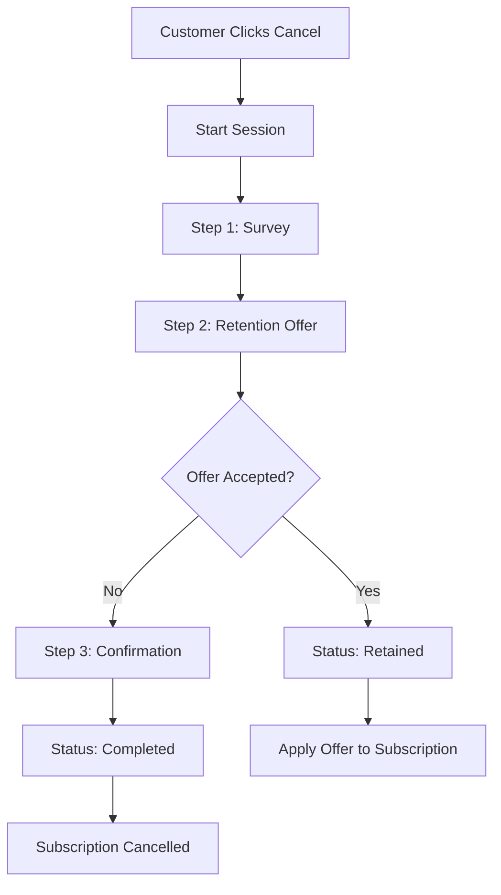

## Overview

Cancellation flows create guided, multi-step experiences when customers attempt to cancel. Instead of a single "Cancel" button, you present a structured flow that collects feedback, offers retention incentives, and requires explicit confirmation.

- **Multi-step sequences** -- Survey, offer, and confirmation steps in any order
- **Retention offers** -- Discounts, trial extensions, pauses, and custom offers
- **Cooldown periods** -- Prevent repeated cancellation attempts within a time window
- **Session tracking** -- Track every cancellation attempt and its outcome
- **Retention analytics** -- Measure retention rates and top cancellation reasons

<Info>
Cancellation flows integrate with [Churn Prediction](/advanced/churn-prediction) to proactively engage at-risk customers before they reach the cancel button.
</Info>

## How It Works



## Create a Cancellation Flow

<CodeGroup>
```typescript TypeScript
const flow = await recurso.cancelFlows.create({
  name: 'Standard Cancel Flow',
  description: 'Survey, retention offer, and confirmation',
  cooldown_hours: 48,
  steps: [
    {
      type: 'survey',
      title: 'We\'re sorry to see you go',
      description: 'Help us understand why you\'re leaving',
      required: true
    },
    {
      type: 'offer',
      title: 'Before you go...',
      description: 'We\'d love to keep you. How about a special offer?',
      required: false,
      offer: {
        type: 'discount',
        value: 50,
        duration_days: 90,
        description: '50% off for the next 3 months'
      }
    },
    {
      type: 'confirmation',
      title: 'Confirm cancellation',
      description: 'Your subscription will remain active until the end of your billing period.',
      required: true
    }
  ]
});
```

```bash cURL
curl -X POST https://api.recurso.dev/v1/cancel-flows \
  -H "Authorization: Bearer $API_KEY" \
  -H "Content-Type: application/json" \
  -d '{
    "name": "Standard Cancel Flow",
    "cooldown_hours": 48,
    "steps": [
      { "type": "survey", "title": "We are sorry to see you go", "required": true },
      { "type": "offer", "title": "Before you go...", "required": false,
        "offer": { "type": "discount", "value": 50, "duration_days": 90 } },
      { "type": "confirmation", "title": "Confirm cancellation", "required": true }
    ]
  }'
```
</CodeGroup>

### Flow Parameters

| Parameter | Type | Required | Description |
|-----------|------|----------|-------------|
| `name` | string | Yes | Flow name |
| `description` | string | No | Flow description |
| `cooldown_hours` | integer | No | Hours before a customer can start a new session |
| `steps` | array | Yes | Ordered list of flow steps |

## Step Types

| Type | Purpose | Key Fields |
|------|---------|------------|
| `survey` | Collect cancellation reason and feedback | `title`, `description`, `required` |
| `offer` | Present a retention offer | `title`, `description`, `required`, `offer` |
| `confirmation` | Require explicit cancellation confirmation | `title`, `description`, `required` |

## Retention Offers

| Offer Type | Value Meaning | Example |
|------------|---------------|---------|
| `discount` | Percentage off subscription price | `value: 50` = 50% off |
| `extension` | Free days added to current period | `value: 30` = 30 extra days |
| `pause` | Subscription paused for N days | `value: 60` = 2-month pause |
| `custom` | Custom offer described in `description` | `value: 0`, custom description |

```typescript
// Offer structure
{
  type: 'discount',       // discount | extension | pause | custom
  value: 50,              // Percentage, days, or 0 for custom
  duration_days: 90,      // How long the offer applies
  description: '50% off for 3 months'
}
```

## Session Lifecycle

### Start a Session

<CodeGroup>
```typescript TypeScript
const session = await recurso.cancelFlows.sessions.start({
  customer_id: 'cust_abc123',
  subscription_id: 'sub_xyz789',
  flow_id: 'cf_flow_001'  // Optional: uses default flow if omitted
});

// Returns
{
  id: 'cfs_session_001',
  flow_id: 'cf_flow_001',
  customer_id: 'cust_abc123',
  subscription_id: 'sub_xyz789',
  status: 'in_progress',
  current_step_index: 0,
  responses: {},
  accepted_offer_id: null,
  started_at: '2025-06-01T14:30:00Z',
  completed_at: null
}
```

```bash cURL
curl -X POST https://api.recurso.dev/v1/cancel-flows/sessions/start \
  -H "Authorization: Bearer $API_KEY" \
  -H "Content-Type: application/json" \
  -d '{
    "customer_id": "cust_abc123",
    "subscription_id": "sub_xyz789",
    "flow_id": "cf_flow_001"
  }'
```
</CodeGroup>

<Warning>
If the customer has an active cooldown from a previous session, starting a new session returns a `409 Conflict` with the cooldown expiry time.
</Warning>

### Submit a Step

<CodeGroup>
```typescript TypeScript
// Submit survey response
await recurso.cancelFlows.sessions.submitStep('cfs_session_001', {
  step_id: 'step_survey_001',
  response: {
    reason: 'too_expensive',
    feedback: 'Looking for a cheaper alternative'
  },
  accepted_offer: false
});

// Submit offer step (customer accepts the discount)
await recurso.cancelFlows.sessions.submitStep('cfs_session_001', {
  step_id: 'step_offer_001',
  response: {},
  accepted_offer: true  // Session status changes to 'retained'
});
```

```bash cURL
curl -X POST https://api.recurso.dev/v1/cancel-flows/sessions/cfs_session_001/submit \
  -H "Authorization: Bearer $API_KEY" \
  -H "Content-Type: application/json" \
  -d '{
    "step_id": "step_survey_001",
    "response": { "reason": "too_expensive" },
    "accepted_offer": false
  }'
```
</CodeGroup>

### Session Statuses

| Status | Description |
|--------|-------------|
| `in_progress` | Customer is stepping through the flow |
| `completed` | Customer confirmed cancellation |
| `cancelled` | Customer abandoned the flow |
| `retained` | Customer accepted a retention offer |

### Get Session

<CodeGroup>
```typescript TypeScript
const session = await recurso.cancelFlows.sessions.get('cfs_session_001');
```

```bash cURL
curl -X GET https://api.recurso.dev/v1/cancel-flows/sessions/cfs_session_001 \
  -H "Authorization: Bearer $API_KEY"
```
</CodeGroup>

## Cooldown Periods

The `cooldown_hours` parameter prevents a customer from starting a new session too frequently, giving retention offers time to take effect.

```typescript
const flow = await recurso.cancelFlows.create({
  name: 'With Cooldown',
  cooldown_hours: 72,  // 3 days between cancellation attempts
  steps: [...]
});
```

## Manage Flows

```typescript
// List all flows
const flows = await recurso.cancelFlows.list();

// Update a flow
await recurso.cancelFlows.update('cf_flow_001', { cooldown_hours: 24 });

// Manage steps
await recurso.cancelFlows.steps.create('cf_flow_001', { type: 'survey', title: 'Quick question', required: false });
await recurso.cancelFlows.steps.update('cf_flow_001', 'step_xyz', { title: 'Updated title' });
await recurso.cancelFlows.steps.delete('cf_flow_001', 'step_xyz');
```

## Retention Analytics

<CodeGroup>
```typescript TypeScript
const stats = await recurso.cancelFlows.stats();

// Returns
{
  total_sessions: 1250,
  completed_sessions: 480,
  retained_customers: 385,
  retention_rate: 0.445,
  top_reasons: [
    { reason: 'too_expensive', count: 312 },
    { reason: 'not_using', count: 245 },
    { reason: 'missing_features', count: 198 },
    { reason: 'competitor', count: 156 },
    { reason: 'temporary', count: 134 }
  ]
}
```

```bash cURL
curl -X GET https://api.recurso.dev/v1/cancel-flows/stats \
  -H "Authorization: Bearer $API_KEY"
```
</CodeGroup>

| Field | Type | Description |
|-------|------|-------------|
| `total_sessions` | integer | Total cancellation sessions started |
| `completed_sessions` | integer | Sessions where the customer confirmed cancellation |
| `retained_customers` | integer | Customers who accepted a retention offer |
| `retention_rate` | float | Ratio of retained to total sessions |
| `top_reasons` | array | Most common cancellation reasons from surveys |

## Webhooks

| Event | Description |
|-------|-------------|
| `cancel_flow.session_started` | Customer started a cancellation flow |
| `cancel_flow.step_submitted` | Customer submitted a step response |
| `cancel_flow.offer_accepted` | Customer accepted a retention offer |
| `cancel_flow.session_completed` | Customer confirmed cancellation |
| `cancel_flow.session_abandoned` | Customer left without completing |

## Best Practices

<CardGroup cols={2}>
  <Card title="Keep It Short" icon="clock">
    Limit flows to 2-3 steps. Long flows frustrate customers and damage brand trust.
  </Card>
  <Card title="Make Offers Relevant" icon="bullseye">
    Use churn prediction risk factors to tailor offers. Price-sensitive customers need discounts; underutilizers need onboarding.
  </Card>
  <Card title="Set Reasonable Cooldowns" icon="hourglass">
    24-72 hours is typical. Too short and you spam; too long and you trap customers.
  </Card>
  <Card title="Analyze Top Reasons" icon="chart-bar">
    Review cancellation reasons regularly to drive product decisions and reduce churn at the source.
  </Card>
</CardGroup>

<AccordionGroup>
  <Accordion title="What happens when a customer accepts an offer?">
    The session status changes to `retained`, and the offer is applied to the subscription automatically. For discount offers, a coupon is created and applied for the specified duration.
  </Accordion>
  <Accordion title="Can I have multiple active flows?">
    Yes. Create multiple flows and specify which to use when starting a session. If no `flow_id` is provided, the default active flow is used.
  </Accordion>
  <Accordion title="Are survey responses stored?">
    Yes. All step responses are stored in the session's `responses` field as JSON keyed by step ID, retrievable via the session API.
  </Accordion>
</AccordionGroup>
