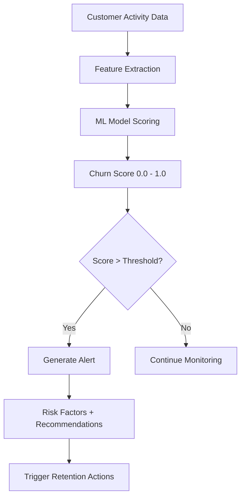
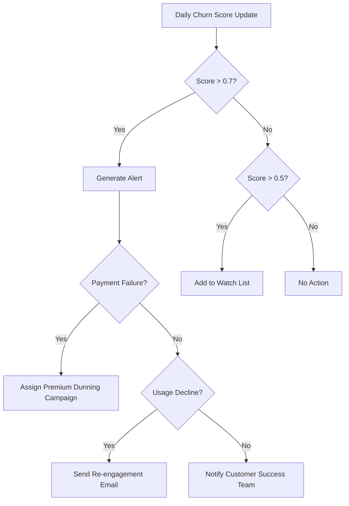

## Overview

Recurso's churn prediction system uses machine learning to score every customer's likelihood of churning. It analyzes payment patterns, usage behavior, support interactions, and subscription history to generate a churn score between 0.0 (no risk) and 1.0 (certain churn).

- **Individual churn scores** -- Detailed risk assessment for any customer
- **Risk factor analysis** -- Understand why a customer is at risk
- **Actionable recommendations** -- Specific suggestions to retain each customer
- **High-risk identification** -- Query all customers above a risk threshold
- **Churn alerts** -- Notifications when customers cross risk thresholds

<Info>
Churn prediction integrates with [Cancellation Flows](/advanced/cancel-flows) for targeted retention offers and [Dunning Campaigns](/advanced/dunning-campaigns) to prioritize recovery for high-value, at-risk customers.
</Info>

## How It Works



## Risk Levels

| Score Range | Risk Level | Description |
|-------------|------------|-------------|
| 0.0 - 0.3 | Low | Customer is healthy and engaged |
| 0.3 - 0.5 | Moderate | Some warning signs present |
| 0.5 - 0.7 | Elevated | Multiple risk factors detected |
| 0.7 - 0.9 | High | Customer is likely to churn soon |
| 0.9 - 1.0 | Critical | Immediate intervention recommended |

## Get Customer Churn Score

Retrieve a detailed churn assessment including the score, contributing risk factors, and personalized recommendations.

<CodeGroup>
```typescript TypeScript
const churn = await recurso.customers.churn('cust_abc123');

// Returns
{
  customer_id: 'cust_abc123',
  score: 0.78,
  risk_level: 'high',
  risk_factors: [
    { factor: 'payment_failures', description: '3 failed payments in the last 60 days', weight: 0.35 },
    { factor: 'usage_decline', description: 'API usage dropped 65% month-over-month', weight: 0.25 },
    { factor: 'support_tickets', description: '4 unresolved support tickets', weight: 0.10 },
    { factor: 'downgrade_history', description: 'Downgraded from Enterprise to Pro 30 days ago', weight: 0.08 }
  ],
  recommendations: [
    'Offer a 30% discount for the next 3 months to address price sensitivity',
    'Schedule a customer success call to resolve open support tickets',
    'Send a personalized email highlighting underutilized features'
  ],
  last_updated: '2025-06-23T08:00:00Z'
}
```

```bash cURL
curl -X GET https://api.recurso.dev/v1/customers/cust_abc123/churn \
  -H "Authorization: Bearer $API_KEY"
```
</CodeGroup>

### Response Fields

| Field | Type | Description |
|-------|------|-------------|
| `customer_id` | string | The customer ID |
| `score` | float | Churn probability from 0.0 to 1.0 |
| `risk_level` | string | Human-readable risk level |
| `risk_factors` | array | Contributing factors with descriptions and weights |
| `recommendations` | array | Actionable retention suggestions |
| `last_updated` | string | When the score was last computed |

## High-Risk Customers

Query all customers whose churn score exceeds a configurable threshold.

<CodeGroup>
```typescript TypeScript
const highRisk = await recurso.churn.highRisk({ threshold: 0.7 });

// Returns
{
  data: [
    {
      customer_id: 'cust_abc123',
      name: 'Acme Corp',
      score: 0.85,
      risk_level: 'high',
      subscription_id: 'sub_xyz789',
      plan: 'Enterprise',
      mrr: 49900,
      risk_factors: [
        { factor: 'payment_failures', description: '3 failed payments in 60 days', weight: 0.35 },
        { factor: 'usage_decline', description: 'Usage dropped 65% MoM', weight: 0.25 }
      ],
      recommendations: ['Offer a 30% discount', 'Schedule a CS call']
    }
  ],
  meta: {
    threshold: 0.7,
    total_count: 23
  }
}
```

```bash cURL
curl -X GET "https://api.recurso.dev/v1/churn/high-risk?threshold=0.7" \
  -H "Authorization: Bearer $API_KEY"
```
</CodeGroup>

<Tip>
Start with the default threshold of 0.7 and adjust based on your capacity. Lower it to 0.6 to catch more customers early, or raise to 0.8 if overwhelmed with alerts.
</Tip>

## Churn Alerts

When a customer's score crosses the high-risk threshold, Recurso generates an alert.

### Get Alerts

<CodeGroup>
```typescript TypeScript
const alerts = await recurso.churn.alerts();

// Returns
{
  data: [
    {
      id: 'alert_001',
      type: 'churn_risk_high',
      customer_id: 'cust_abc123',
      score: 0.85,
      risk_factors: [
        { factor: 'payment_failures', description: '3 failed payments in 60 days', weight: 0.35 }
      ],
      created_at: '2025-06-23T08:00:00Z',
      acknowledged_at: null
    }
  ]
}
```

```bash cURL
curl -X GET https://api.recurso.dev/v1/churn/alerts \
  -H "Authorization: Bearer $API_KEY"
```
</CodeGroup>

### Acknowledge an Alert

Mark an alert as handled after taking action.

<CodeGroup>
```typescript TypeScript
await recurso.churn.alerts.acknowledge('alert_001');
```

```bash cURL
curl -X POST https://api.recurso.dev/v1/churn/alerts/alert_001/acknowledge \
  -H "Authorization: Bearer $API_KEY"
```
</CodeGroup>

## Common Risk Factors

| Factor | Description |
|--------|-------------|
| `payment_failures` | Recent failed payment attempts |
| `usage_decline` | Significant drop in product usage |
| `no_recent_login` | Extended period without logging in |
| `support_tickets` | Unresolved support tickets or high volume |
| `downgrade_history` | Recent plan downgrade |
| `short_tenure` | Customer is in their first 90 days |
| `billing_disputes` | Recent chargebacks or refund requests |
| `contract_ending` | Annual contract approaching renewal |
| `feature_underuse` | Key features not adopted |

## Integration with Other Features

### With Cancellation Flows

Use churn scores to dynamically select retention offers in a [cancellation flow](/advanced/cancel-flows):

```typescript
const churn = await recurso.customers.churn(customerId);

if (churn.score > 0.8) {
  // Aggressive retention flow with bigger discount
  await recurso.cancelFlows.sessions.start({
    customer_id: customerId,
    subscription_id: subscriptionId,
    flow_id: 'cf_aggressive_retention'
  });
} else {
  // Standard flow
  await recurso.cancelFlows.sessions.start({
    customer_id: customerId,
    subscription_id: subscriptionId
  });
}
```

### Proactive Outreach Workflow



## Webhooks

| Event | Description |
|-------|-------------|
| `churn.score_updated` | A customer's churn score was recalculated |
| `churn.risk_high` | Customer score crossed the high-risk threshold |
| `churn.risk_resolved` | Customer score dropped below the threshold |
| `churn.alert_created` | A new churn alert was generated |
| `churn.alert_acknowledged` | A churn alert was acknowledged |

## Best Practices

<CardGroup cols={2}>
  <Card title="Act on Alerts Promptly" icon="bell">
    Churn alerts are time-sensitive. Aim to acknowledge and act within 24 hours for best retention outcomes.
  </Card>
  <Card title="Automate Where Possible" icon="robot">
    Use webhooks to trigger automated workflows for common risk factors. Reserve manual outreach for high-value accounts.
  </Card>
  <Card title="Tune Your Threshold" icon="sliders">
    Start at 0.7 and adjust based on team capacity and retention results.
  </Card>
  <Card title="Close the Loop" icon="arrows-rotate">
    Track whether interventions reduce churn. Acknowledge alerts and monitor retention over time.
  </Card>
</CardGroup>

<AccordionGroup>
  <Accordion title="How often are churn scores recalculated?">
    Scores are recalculated daily for all active customers. Significant events (payment failure, plan downgrade) can trigger immediate recalculation.
  </Accordion>
  <Accordion title="How does the model handle new customers?">
    New customers (under 30 days) have less data, so the model relies on early signals like onboarding completion and first-week usage. The `short_tenure` factor accounts for naturally higher early churn.
  </Accordion>
  <Accordion title="What is the difference between alerts and the high-risk endpoint?">
    Alerts are generated once when a customer crosses the threshold and must be acknowledged. The high-risk endpoint returns a real-time list of all customers currently above the threshold. Use alerts for triggers and the endpoint for dashboards.
  </Accordion>
  <Accordion title="Does acknowledging an alert affect the churn score?">
    No. Acknowledging is a workflow action. The score continues to be recalculated independently based on customer behavior.
  </Accordion>
</AccordionGroup>
