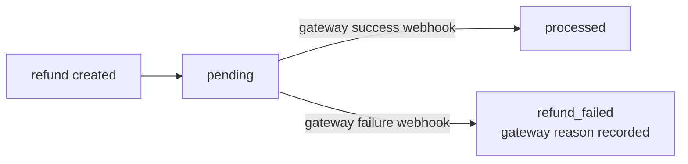

## Overview

Credit notes represent refunds or credits issued to customers. They can be:

- **Invoice adjustments** (incorrect charges)
- **Refunds** (returned payments)
- **Credits** (goodwill, service issues)

## Create a Credit Note

```typescript
const creditNote = await recurso.creditNotes.create({
  customer_id: 'cust_abc',
  invoice_id: 'inv_001',  // Optional: link to original invoice

  line_items: [{
    description: 'Refund for service downtime',
    quantity: 1,
    unit_amount: 2500
  }],

  reason: 'service_issue',
  memo: 'Compensation for 2 hours of downtime on Jan 15'
});
```

## Refund Reasons

| Reason | Description |
|--------|-------------|
| `duplicate` | Duplicate charge |
| `fraudulent` | Fraudulent charge |
| `order_change` | Customer changed order |
| `product_unsatisfactory` | Not satisfied |
| `service_issue` | Service problem |
| `other` | Other reason |

## Apply to Invoice

Credit notes can offset future invoices:

```typescript
await recurso.creditNotes.applyToInvoice({
  credit_note_id: 'cn_xyz',
  invoice_id: 'inv_002',
  amount: 2500
});
```

### Apply to Future Invoices

When a credit note has remaining balance, it can be applied to the customer's next invoice automatically:

```typescript
const creditNote = await recurso.creditNotes.create({
  customer_id: 'cust_abc',
  line_items: [{
    description: 'Goodwill credit',
    quantity: 1,
    unit_amount: 5000
  }],
  reason: 'service_issue',
  auto_apply: true  // Automatically apply to next invoice
});
```

With `auto_apply: true`, Recurso deducts the credit note balance from the customer's next invoice. If the credit exceeds the invoice total, the remaining balance carries forward.

## Issue Refund

Process an actual refund to the payment method:

```typescript
const refund = await recurso.creditNotes.refund('cn_xyz', {
  amount: 2500,  // Partial or full
  payment_method: 'original'  // or specific method
});
```

## Credit Note Lifecycle

| Status | Description |
|--------|-------------|
| `draft` | Being created |
| `issued` | Finalized, visible to customer |
| `applied` | Applied to invoices |
| `refunded` | Refund processed |
| `voided` | Cancelled |

## Refund Lifecycle

Refund credit notes additionally track the gateway refund in `refund_status`:

| `refund_status` | Description |
|-----------------|-------------|
| `none` | No refund involved (adjustment/goodwill credit notes) |
| `pending` | Refund initiated at the gateway, not yet settled |
| `processed` | The gateway confirmed the refund |
| `refund_failed` | The refund failed at the gateway; the gateway's reason is recorded — needs operator action |
| `manual_required` | The invoice has no refundable gateway payment ID; refund the payment manually |

### Automatic settlement via gateway webhooks

Pending refunds no longer sit at `pending` forever. When the gateway settles a refund asynchronously, Recurso consumes its webhooks and advances the credit note automatically:

- **Stripe**: `charge.refunded` / `refund.updated` / `refund.failed`
- **Razorpay**: `refund.processed` / `refund.failed`



Only `pending` credit notes move; every other state is a no-op, so re-delivered or late gateway webhooks cannot flip a settled refund. The credit note is looked up by the stored gateway refund ID.

### Mandate payments are refundable

Invoices collected via mandate auto-debit (UPI Autopay, cards on file) now capture the real gateway payment ID when the payment-captured webhook arrives, so their credit notes can be refunded through the normal flow instead of landing in `manual_required`.

## List Credit Notes

Retrieve credit notes with filters:

<CodeGroup>
```typescript TypeScript
const creditNotes = await recurso.creditNotes.list({
  customer_id: 'cust_abc',
  status: 'issued',
  limit: 20,
  offset: 0
});

// Response
{
  data: [
    {
      id: 'cn_001',
      customer_id: 'cust_abc',
      invoice_id: 'inv_001',
      status: 'issued',
      total: 2500,
      remaining_balance: 2500,
      reason: 'service_issue',
      created_at: '2026-06-15T10:00:00Z'
    }
  ],
  has_more: false
}
```

```bash cURL
curl -G https://api.recurso.dev/v1/credit-notes \
  -H "Authorization: Bearer $API_KEY" \
  -d customer_id=cust_abc \
  -d status=issued \
  -d limit=20
```
</CodeGroup>

### Filter Parameters

| Parameter | Type | Description |
|-----------|------|-------------|
| `customer_id` | `string` | Filter by customer |
| `invoice_id` | `string` | Filter by original invoice |
| `status` | `string` | Filter by status (`draft`, `issued`, `applied`, `refunded`, `voided`) |
| `limit` | `integer` | Results per page (default 20) |
| `offset` | `integer` | Number of results to skip |

## Credit Note Balance Tracking

Each credit note tracks how much has been used and how much remains:

```typescript
const cn = await recurso.creditNotes.get('cn_xyz');

// Returns
{
  id: 'cn_xyz',
  total: 5000,
  amount_applied: 2500,     // Applied to invoices
  amount_refunded: 0,        // Refunded to payment method
  remaining_balance: 2500,   // Available for future use
  applications: [
    {
      invoice_id: 'inv_002',
      amount: 2500,
      applied_at: '2026-06-20T10:00:00Z'
    }
  ]
}
```

## Void a Credit Note

Cancel a credit note that was issued in error. Only credit notes with no applications or refunds can be voided:

<CodeGroup>
```typescript TypeScript
// There is no void endpoint. To reverse a credit note issued in error,
// offset it (e.g. an adjustment on the next invoice) and record the reason.
```

```bash cURL
# No void endpoint — credit notes are immutable once issued (accounting
# integrity). Offset a mistaken credit note rather than deleting it.
```
</CodeGroup>

<Warning>
Voiding a credit note is irreversible. If the credit note has already been partially applied or refunded, it cannot be voided — create a new invoice to offset the credit instead.
</Warning>

## Get Credit Note PDF

```typescript
const pdf = await recurso.creditNotes.pdf('cn_xyz');
```

## Credit expiry

An adjustment credit can carry an optional `expires_at`. When that date passes
with balance still remaining, a background sweep writes the unused balance off
and moves the credit to status `expired`, posting the reversal of the original
issuance to the ledger:

- **DR Customer Credit (2300)** — the liability we no longer owe
- **CR Credits & Adjustments (5100)** — reverses the original grant expense

Pass `expires_at` when issuing the credit; omit it for a credit that never
expires:

```bash
curl -X POST https://api.recurso.dev/v1/credit-notes \
  -H "Authorization: Bearer $API_KEY" \
  -H "Content-Type: application/json" \
  -d '{
    "customer_id": "cust_abc123",
    "amount": 5000,
    "currency": "USD",
    "reason": "Goodwill credit",
    "expires_at": "2026-12-31T23:59:59Z"
  }'
```

<Note>
Expiry applies only to spendable **adjustment** credits — a refund carries no
balance to lapse. Once `expired`, a credit is unspendable and its balance is 0.
</Note>

## Customer credit statement

To see a customer's running account credit — the spendable balance, every grant,
and the invoice draw-down history — call the credit-statement endpoint:

```bash
curl https://api.recurso.dev/v1/customers/cust_abc123/credit-statement \
  -H "Authorization: Bearer $API_KEY"
```

It returns `balances` (spendable, per currency), `grants` (every credit note),
`applications` (the draw-down trail), and a per-currency `summary`. The spendable
balance equals what the billing engine can actually apply, and reconciles to the
Customer Credit (2300) ledger account. See
[Customer credit statement](/api-reference/customers/credit-statement) for the
full schema.

## Webhooks

| Event | Description |
|-------|-------------|
| `credit_note.created` | Credit note issued |
| `credit_note.applied` | Applied to invoice |
| `credit_note.refunded` | Refund processed |
| `credit_note.voided` | Credit note cancelled |
