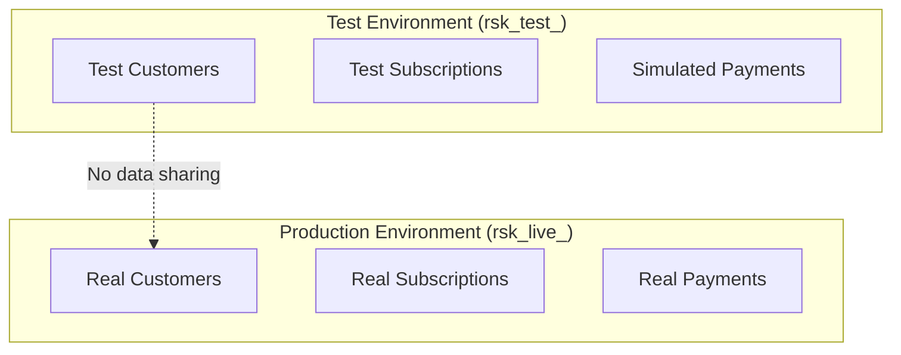

## Overview

Developer settings give you control over how your application integrates with Recurso. From here you manage API keys, configure webhook endpoints, switch between test and production environments, and set tenant-level preferences.

<CardGroup cols={3}>
  <Card title="API Keys" icon="key">
    Create, rotate, and revoke live and test API keys
  </Card>
  <Card title="Environments" icon="flask">
    Isolated test and production environments with separate data
  </Card>
  <Card title="Webhooks" icon="satellite-dish">
    Configure endpoint URLs and event subscriptions
  </Card>
</CardGroup>

## API Key Management

Every Recurso account has two environments, each with its own set of API keys:

| Key Prefix | Environment | Purpose |
|------------|-------------|---------|
| `rsk_test_` | Test | Development and staging — no real charges |
| `rsk_live_` | Production | Live transactions with real payment processing |

<Warning>
Live API keys (`rsk_live_`) process real payments. Never use live keys in development, CI pipelines, or client-side code.
</Warning>

### Create an API Key

<CodeGroup>

```bash cURL
curl -X POST https://api.recurso.dev/v1/developer/keys \
  -H "Authorization: Bearer $API_KEY" \
  -H "Content-Type: application/json" \
  -d '{
    "name": "Backend Server — Production",
    "mode": "live"
  }'
```
</CodeGroup>

<Note>
Keys grant **full tenant API access** — there is no per-scope model today.
`mode` is `test` (default, `rsk_test_`) or `live` (`rsk_live_`). Isolate
blast radius by minting separate keys per service, not by scoping.
</Note>

<Warning>
The full API key secret is returned **only once** at creation time. Store it securely in your secrets manager immediately. Recurso cannot retrieve it later.
</Warning>

### List API Keys

```bash
curl https://api.recurso.dev/v1/developer/keys \
  -H "Authorization: Bearer $API_KEY"
```

<Note>
Key **revocation** is a dashboard operation (Developers → API keys →
Revoke) — there is no delete endpoint in the API yet.
</Note>

## Environment Management

Recurso provides fully isolated test and production environments. Data created in one environment is never visible in the other.



### Test Environment

The test environment behaves identically to production with these differences:

| Feature | Test | Production |
|---------|------|------------|
| Payment processing | Simulated (no real charges) | Real charges via Razorpay |
| Webhook delivery | Delivered to test endpoints | Delivered to production endpoints |
| API key prefix | `rsk_test_` | `rsk_live_` |
| Rate limits | Same as your plan tier | Same as your plan tier |
| Data retention | 90 days | Unlimited |

<Tip>
Use the test environment for integration testing, staging deployments, and webhook development. You can create test customers and subscriptions without triggering real payment flows.
</Tip>

### Switching Environments

Environment is determined entirely by the API key used. There is no toggle or environment parameter — simply use the appropriate key:

```typescript
// Test
const testClient = new Recurso({ apiKey: "rsk_test_..." });

// Production
const liveClient = new Recurso({ apiKey: "rsk_live_..." });
```

## Tenant Configuration

Configure tenant-level settings that apply across your account:

<CodeGroup>

```bash cURL
curl -X PUT https://api.recurso.dev/v1/account \
  -H "Authorization: Bearer $API_KEY" \
  -H "Content-Type: application/json" \
  -d '{
    "company_name": "Acme SaaS Pvt Ltd",
    "billing_email": "billing@acme.com",
    "default_currency": "INR",
    "timezone": "Asia/Kolkata",
    "invoice_prefix": "ACME",
    "auto_finalize_invoices": true,
    "payment_terms_days": 30
  }'
```
</CodeGroup>

### Configuration Options

| Setting | Type | Description |
|---------|------|-------------|
| `company_name` | string | Your company name, shown on invoices |
| `billing_email` | string | Reply-to address for billing emails |
| `support_url` | string | Customer support URL shown in the portal |
| `default_currency` | string | Default currency for new plans and invoices |
| `timezone` | string | IANA timezone for billing cycle calculations |
| `invoice_prefix` | string | Prefix for invoice numbers (e.g., `ACME-0001`) |
| `auto_finalize_invoices` | boolean | Automatically finalize invoices when generated |
| `payment_terms_days` | integer | Default payment terms in days (e.g., 30 = Net 30) |

<Note>
`PUT /v1/account` currently updates **name and email** only; the remaining
options above are configured in the dashboard (Settings). Payment terms are
set per subscription (`payment_terms: net0|net15|net30|net60`), not globally.
</Note>

## Webhook Endpoint Configuration

Register endpoints to receive real-time event notifications:

<CodeGroup>
```typescript TypeScript
const endpoint = await recurso.webhooks.create({
  url: "https://api.acme.com/webhooks/recurso",
  events: [
    "subscription.created",
    "subscription.canceled",
    "payment.succeeded",
    "payment.failed",
    "invoice.paid"
  ]
});
```

```bash cURL
curl -X POST https://api.recurso.dev/v1/webhooks \
  -H "Authorization: Bearer $API_KEY" \
  -H "Content-Type: application/json" \
  -d '{
    "url": "https://api.acme.com/webhooks/recurso",
    "events": [
      "subscription.created",
      "subscription.canceled",
      "payment.succeeded",
      "payment.failed",
      "invoice.paid"
    ],
    "environment": "live"
  }'
```
</CodeGroup>

<Info>
You can configure separate webhook endpoints for test and production environments. Test events are never sent to production endpoints and vice versa.
</Info>

## Key Rotation

<Steps>
  <Step title="Create a new key">
    Generate a new API key with the same scopes as the key you are replacing.
  </Step>
  <Step title="Deploy the new key">
    Update your application configuration or secrets manager with the new key. Deploy to all services that use it.
  </Step>
  <Step title="Verify traffic">
    Monitor the `last_used_at` field on both keys. Confirm the new key is handling all traffic.
  </Step>
  <Step title="Revoke the old key">
    Once no traffic is using the old key, revoke it. This is irreversible.
  </Step>
</Steps>

## Best Practices

<CardGroup cols={2}>
  <Card title="Never Expose Keys Client-Side" icon="eye-slash">
    API keys belong in your backend. Never embed them in frontend code, mobile apps, or browser JavaScript.
  </Card>
  <Card title="Use Scoped Keys" icon="shield">
    Create separate keys per service with only the scopes each service needs. A reporting dashboard only needs read scopes.
  </Card>
  <Card title="Rotate Keys Regularly" icon="rotate">
    Rotate API keys at least quarterly. Automate the process with your secrets manager.
  </Card>
  <Card title="Use Environment Variables" icon="terminal">
    Store keys in environment variables or a secrets manager (AWS Secrets Manager, HashiCorp Vault), never in source code.
  </Card>
  <Card title="Monitor Key Usage" icon="chart-bar">
    Review `last_used_at` timestamps to identify unused keys. Revoke keys that haven't been used in 90+ days.
  </Card>
  <Card title="Separate Test and Live" icon="flask">
    Use distinct deployment pipelines for test and production. Never let a test key reach production infrastructure.
  </Card>
</CardGroup>
