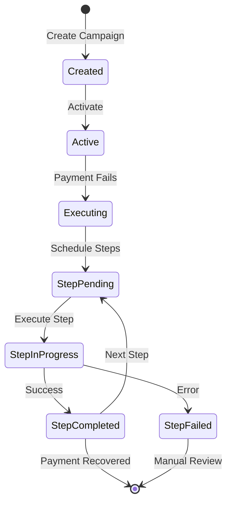
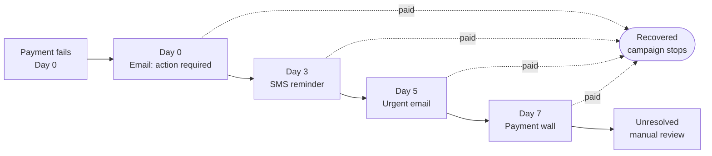
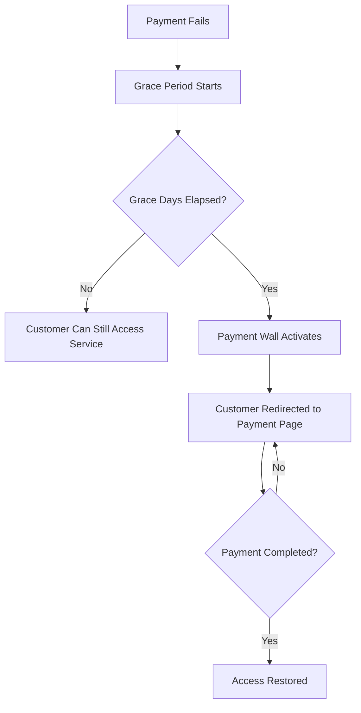

## Overview

Dunning campaigns automate failed payment recovery through multi-step communication sequences. When a payment fails, Recurso executes your configured steps -- sending emails, SMS messages, and optionally activating a payment wall.

- **Multi-channel sequences** -- Combine email, SMS, and payment wall steps
- **Configurable timing** -- Set day offsets for each step relative to the failure date
- **Payment wall** -- Block access with configurable grace periods
- **Custom templates** -- Use your own email/SMS templates or inline content
- **Default campaigns** -- Automatically apply to all failed payments

<Info>
Dunning campaigns handle **customer communication**. For optimizing retry timing, see [Smart Payment Retry](/advanced/smart-retry), which uses reinforcement learning to determine when to retry the actual payment.
</Info>

## Campaign Lifecycle



## Create a Campaign

<CodeGroup>
```typescript TypeScript
const campaign = await recurso.dunningCampaigns.create({
  name: 'Standard Recovery',
  description: 'Default dunning sequence for failed payments',
  is_default: true,
  payment_wall_enabled: true,
  payment_wall_grace_days: 7
});
```

```bash cURL
curl -X POST https://api.recurso.dev/v1/dunning-campaigns \
  -H "Authorization: Bearer $API_KEY" \
  -H "Content-Type: application/json" \
  -d '{
    "name": "Standard Recovery",
    "description": "Default dunning sequence for failed payments",
    "is_default": true,
    "payment_wall_enabled": true,
    "payment_wall_grace_days": 7
  }'
```
</CodeGroup>

### Campaign Parameters

| Parameter | Type | Required | Description |
|-----------|------|----------|-------------|
| `name` | string | Yes | Campaign name |
| `description` | string | No | Description of the campaign |
| `is_default` | boolean | No | If `true`, applies to all failed payments automatically |
| `payment_wall_enabled` | boolean | No | Enable payment wall functionality |
| `payment_wall_grace_days` | integer | No | Days before payment wall activates |

<Warning>
Only one campaign can be the default at a time. Setting `is_default: true` will remove the default flag from any existing default campaign.
</Warning>

## Add Campaign Steps

Build your recovery sequence by adding steps at specific day offsets.

| Channel | Description |
|---------|-------------|
| `email` | Send an email notification to the customer |
| `sms` | Send an SMS message to the customer |
| `payment_wall` | Activate a payment wall blocking service access |

<Steps>
  <Step title="Day 0: Immediate email notification">
    ```typescript
    await recurso.dunningCampaigns.steps.create('dc_abc123', {
      day_offset: 0,
      channel: 'email',
      subject: 'Action required: Payment failed',
      body: 'Hi {{customer_name}}, your payment of {{amount}} for {{plan_name}} failed. Please update your payment method.'
    });
    ```
  </Step>
  <Step title="Day 3: Follow-up SMS">
    ```typescript
    await recurso.dunningCampaigns.steps.create('dc_abc123', {
      day_offset: 3,
      channel: 'sms',
      body: 'Your {{plan_name}} payment is overdue. Update at {{payment_link}}'
    });
    ```
  </Step>
  <Step title="Day 5: Urgent email with template">
    ```typescript
    await recurso.dunningCampaigns.steps.create('dc_abc123', {
      day_offset: 5,
      channel: 'email',
      template_id: 'tmpl_urgent_payment',
      subject: 'Urgent: Service suspension in 2 days'
    });
    ```
  </Step>
  <Step title="Day 7: Payment wall activation">
    ```typescript
    await recurso.dunningCampaigns.steps.create('dc_abc123', {
      day_offset: 7,
      channel: 'payment_wall'
    });
    ```
  </Step>
</Steps>

Steps execute in `day_offset` order, escalating from a gentle reminder to a
hard payment wall. If the invoice is paid at any point, the campaign stops
immediately and any remaining steps are cancelled:



### Step Parameters

| Parameter | Type | Required | Description |
|-----------|------|----------|-------------|
| `day_offset` | integer | Yes | Days after payment failure to execute this step |
| `channel` | string | Yes | `email`, `sms`, or `payment_wall` |
| `template_id` | string | No | ID of a pre-configured message template |
| `subject` | string | No | Email subject line (email channel only) |
| `body` | string | No | Message body content |

## Payment Wall

The payment wall blocks customer access until payment is resolved. Customers are redirected to a payment page instead of your application.



### Check Payment Wall Status

<CodeGroup>
```typescript TypeScript
const status = await recurso.invoices.paymentWall('inv_overdue_456');

// Returns
{
  payment_wall_active: true,
  grace_days_remaining: 0,
  blocked_at: '2025-03-22T00:00:00Z',
  invoice_id: 'inv_overdue_456'
}
```

```bash cURL
curl -X GET https://api.recurso.dev/v1/invoices/inv_overdue_456/payment-wall \
  -H "Authorization: Bearer $API_KEY"
```
</CodeGroup>

| Field | Type | Description |
|-------|------|-------------|
| `payment_wall_active` | boolean | Whether the wall is currently blocking access |
| `grace_days_remaining` | integer | Days remaining before activation (0 if active) |
| `blocked_at` | string | Timestamp when activated (null if not active) |
| `invoice_id` | string | The overdue invoice triggering the wall |

## Manage Campaigns

### List and Get Campaigns

<CodeGroup>
```typescript TypeScript
const campaigns = await recurso.dunningCampaigns.list();
const campaign = await recurso.dunningCampaigns.get('dc_abc123');
```

```bash cURL
curl -X GET https://api.recurso.dev/v1/dunning-campaigns \
  -H "Authorization: Bearer $API_KEY"

curl -X GET https://api.recurso.dev/v1/dunning-campaigns/dc_abc123 \
  -H "Authorization: Bearer $API_KEY"
```
</CodeGroup>

### Update Campaign and Steps

<CodeGroup>
```typescript TypeScript
await recurso.dunningCampaigns.update('dc_abc123', {
  name: 'Aggressive Recovery',
  payment_wall_grace_days: 3
});

await recurso.dunningCampaigns.steps.update('dc_abc123', 'step_002', {
  day_offset: 2,
  body: 'Updated SMS content'
});

await recurso.dunningCampaigns.steps.delete('dc_abc123', 'step_004');
```

```bash cURL
curl -X PUT https://api.recurso.dev/v1/dunning-campaigns/dc_abc123 \
  -H "Authorization: Bearer $API_KEY" \
  -H "Content-Type: application/json" \
  -d '{ "name": "Aggressive Recovery", "payment_wall_grace_days": 3 }'

curl -X PUT https://api.recurso.dev/v1/dunning-campaigns/dc_abc123/steps/step_002 \
  -H "Authorization: Bearer $API_KEY" \
  -H "Content-Type: application/json" \
  -d '{ "day_offset": 2, "body": "Updated SMS content" }'

curl -X DELETE https://api.recurso.dev/v1/dunning-campaigns/dc_abc123/steps/step_004 \
  -H "Authorization: Bearer $API_KEY"
```
</CodeGroup>

## Execution Tracking

Every step execution is logged with its status for monitoring and debugging.

| Status | Description |
|--------|-------------|
| `pending` | Step is scheduled and waiting to execute |
| `in_progress` | Step is currently being executed |
| `completed` | Step executed successfully |
| `failed` | Step execution failed (see error field) |

| Field | Type | Description |
|-------|------|-------------|
| `id` | string | Unique execution ID |
| `campaign_id` | string | The parent campaign |
| `invoice_id` | string | The overdue invoice |
| `step_id` | string | The step that was executed |
| `status` | string | Execution status |
| `executed_at` | string | When the step was executed |
| `error` | string | Error message if status is `failed` |

## Recovered Revenue

Recurso attributes revenue back to the recovery machinery: whenever an
invoice is paid **after at least one failed payment attempt** (or while an
active dunning action or campaign was driving it), a recovery record is
written with the amount, the number of attempts it took, the strategy that
was in effect, and how many days the invoice took to recover.

- **Qualification** — paid on the first try counts as nothing recovered;
  at least one failed attempt or an active dunning action/campaign must
  precede the payment
- **Strategy attribution** — the tenant-wide retry strategy
  (`DUNNING_STRATEGY`, defaulting to the smart retry engine), or
  `campaign` when a dunning campaign execution was driving the invoice
- **Idempotent** — one record per invoice, however many success paths fire

Query totals and a last-12-months series:

```bash
curl https://api.recurso.dev/v1/analytics/dunning/recovered \
  -H "Authorization: Bearer $API_KEY"
```

```json
{
  "recovered_amount_total": { "INR": 1249750, "USD": 89900 },
  "recovered_count": 42,
  "avg_attempts": 2.4,
  "avg_days_to_recover": 3.7,
  "monthly": [
    { "month": "2026-06", "currency": "INR", "amount": 249950, "count": 8 },
    { "month": "2026-06", "currency": "USD", "amount": 19900, "count": 2 }
  ]
}
```

Amounts are in minor units, keyed by currency (never summed across
currencies). The dunning dashboard renders the same data as a recovered
revenue panel. See the
[API reference](/api-reference/analytics/dunning-recovered) for details.

<Tip>
Recovered revenue is the number that justifies your dunning configuration:
it is literally the money that would have churned without retries and
campaigns.
</Tip>

## Webhooks

| Event | Description |
|-------|-------------|
| `dunning.campaign_started` | A dunning campaign has begun for an invoice |
| `dunning.step_executed` | A campaign step was executed |
| `dunning.step_failed` | A campaign step failed to execute |
| `dunning.payment_wall_activated` | Payment wall was activated for a customer |
| `dunning.payment_wall_resolved` | Customer paid and the wall was removed |
| `dunning.campaign_completed` | Campaign ended (recovered or all steps exhausted) |

## Best Practices

<CardGroup cols={2}>
  <Card title="Escalate Gradually" icon="stairs">
    Start with a friendly email and escalate through SMS and payment wall over days, not hours.
  </Card>
  <Card title="Set a Default Campaign" icon="shield">
    Always have a default campaign so no failed payment goes unaddressed.
  </Card>
  <Card title="Use Templates" icon="file-lines">
    Use template IDs for consistent branding rather than inline body content.
  </Card>
  <Card title="Test Before Deploying" icon="flask">
    Create a non-default campaign first and test with internal invoices before making it the default.
  </Card>
</CardGroup>

<AccordionGroup>
  <Accordion title="What happens if a payment is recovered mid-campaign?">
    The campaign stops immediately. Pending steps are cancelled and any active payment wall is deactivated automatically.
  </Accordion>
  <Accordion title="Can I run different campaigns for different plans?">
    Yes. Only one campaign can be the default, but you can assign specific campaigns to subscriptions or customer segments. The default is a fallback for invoices without an explicit assignment.
  </Accordion>
  <Accordion title="What template variables are available?">
    Available variables include `{{customer_name}}`, `{{amount}}`, `{{currency}}`, `{{plan_name}}`, `{{invoice_id}}`, `{{payment_link}}`, `{{due_date}}`, and `{{grace_days_remaining}}`.
  </Accordion>
</AccordionGroup>
