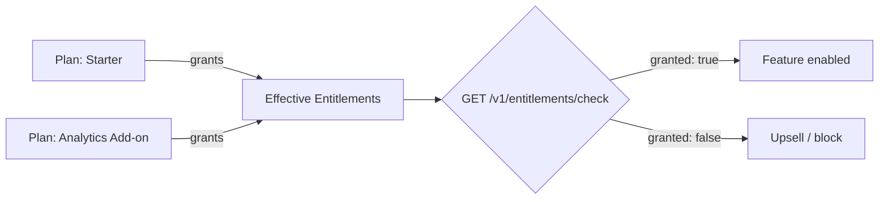

## Overview

Entitlements answer the question your application asks on every request:
**"can this customer use this feature, and how much of it?"** Instead of
hard-coding plan names into your product (`if (plan === 'pro')`), you attach
feature grants to plans in Recurso and query the customer's *effective*
entitlements at runtime. Change what a plan includes and every subscriber
picks it up immediately — no deploy.

- **Plan-level grants** — each plan carries a set of features it grants
- **Two kinds** — `boolean` (on/off features) and `limit` (numeric quotas)
- **Effective resolution** — a customer's entitlements are computed as the
  union across all of their **active and trialing** subscriptions
- **Fast check endpoint** — a single-query hot path built for per-request
  feature gating



## Entitlement Kinds

| Kind | Value field | Example |
|------|-------------|---------|
| `boolean` | `bool_value` | `sso: true`, `api_access: true` |
| `limit` | `limit_value` | `seats: 25`, `api_calls_per_month: 100000` |

Feature keys are machine identifiers: up to 128 characters matching
`^[A-Za-z0-9][A-Za-z0-9._:-]*$` (letters, digits, `.`, `_`, `:`, `-`).

Validation is strict per kind: `boolean` entitlements require `bool_value`
and must omit `limit_value`; `limit` entitlements require a `limit_value`
of `>= 0` and must omit `bool_value`. Violations return a
`validation_failed` error.

## Grant Features to a Plan

Setting a plan's entitlements is a **full replacement** (PUT semantics):
feature keys absent from the request are removed from the plan.

<CodeGroup>
```typescript TypeScript
await recurso.entitlements.setForPlan(plan.id, [
  { feature_key: 'sso', kind: 'boolean', bool_value: true },
  { feature_key: 'api_access', kind: 'boolean', bool_value: true },
  { feature_key: 'seats', kind: 'limit', limit_value: 25 },
  { feature_key: 'api_calls_per_month', kind: 'limit', limit_value: 100000 },
]);
```

```bash cURL
curl -X PUT https://api.recurso.dev/v1/plans/8f14e45f-.../entitlements \
  -H "Authorization: Bearer $API_KEY" \
  -H "Content-Type: application/json" \
  -d '[
    { "feature_key": "sso", "kind": "boolean", "bool_value": true },
    { "feature_key": "api_access", "kind": "boolean", "bool_value": true },
    { "feature_key": "seats", "kind": "limit", "limit_value": 25 },
    { "feature_key": "api_calls_per_month", "kind": "limit", "limit_value": 100000 }
  ]'
```
</CodeGroup>

<Warning>
Because the endpoint replaces the whole set, always send the complete list
of features the plan should grant. Sending only the one you changed deletes
the rest. Duplicate `feature_key` values in one request are rejected.
</Warning>

Read a plan's grants back with `GET /v1/plans/{id}/entitlements` (or
`recurso.entitlements.getForPlan(planId)`). Plan entitlements are also
editable on the plan detail page in the dashboard.

## Effective Entitlements: Union Semantics

A customer may hold several subscriptions at once — a base plan plus an
add-on plan, or an old and a new plan overlapping during a migration. Their
effective entitlements are the **union across the plans of every active and
trialing subscription**:

| Kind | Resolution rule | Example |
|------|-----------------|---------|
| `boolean` | **Any-true wins** — granted if *any* contributing plan grants it | Starter grants `sso: false`, Add-on grants `sso: true` → `sso: true` |
| `limit` | **Maximum wins** — the highest `limit_value` across plans | Starter grants `seats: 5`, Pro grants `seats: 25` → `seats: 25` |

Additional rules:

- Subscriptions in any other state (`canceled`, `paused`, `past_due`, …)
  contribute **nothing** — only `active` and `trialing` count. Trials get
  full feature access; expiry removes it automatically.
- If the same `feature_key` appears as `boolean` on one plan and `limit` on
  another, the effective entitlement resolves to `limit`.

Fetch the effective set — each entry lists the `plan_ids` that contributed
to it, so you can show *why* a customer has a feature:

<CodeGroup>
```typescript TypeScript
const { data } = await recurso.entitlements.forCustomer(customer.id);
```

```bash cURL
curl https://api.recurso.dev/v1/customers/1b9d6bcd-.../entitlements \
  -H "Authorization: Bearer $API_KEY"
```
</CodeGroup>

```json
{
  "data": [
    {
      "feature_key": "seats",
      "kind": "limit",
      "bool_value": null,
      "limit_value": 25,
      "plan_ids": ["8f14e45f-...", "6512bd43-..."]
    },
    {
      "feature_key": "sso",
      "kind": "boolean",
      "bool_value": true,
      "limit_value": null,
      "plan_ids": ["6512bd43-..."]
    }
  ]
}
```

## Feature Gating with the Check Endpoint

`GET /v1/entitlements/check` is the hot path: one indexed query answering a
single `customer_id` + `feature` pair. A feature the customer does not have
answers `granted: false` with a `null` limit — it is never a 404.

```bash
curl "https://api.recurso.dev/v1/entitlements/check?customer_id=1b9d6bcd-...&feature=api_access" \
  -H "Authorization: Bearer $API_KEY"
```

```json
{
  "feature_key": "api_access",
  "granted": true,
  "limit_value": null
}
```

### Node SDK gating pattern

```typescript
import { Recurso } from 'recurso';

const recurso = new Recurso(process.env.RECURSO_API_KEY!, process.env.RECURSO_URL!);

// Express middleware: gate a route behind a boolean feature
function requireFeature(feature: string) {
  return async (req, res, next) => {
    const check = await recurso.entitlements.check(req.user.recursoCustomerId, feature);
    if (!check.granted) {
      return res.status(403).json({
        error: { code: 'feature_not_entitled', message: `Upgrade to use ${feature}` },
      });
    }
    next();
  };
}

app.post('/api/sso/configure', requireFeature('sso'), configureSSO);

// Enforcing a limit: compare your own usage counter to the entitled limit
async function canAddSeat(customerId: string, currentSeats: number) {
  const check = await recurso.entitlements.check(customerId, 'seats');
  return check.granted && currentSeats < (check.limit_value ?? 0);
}
```

<Tip>
For latency-sensitive paths, cache check results in your app for a short
TTL (30–60 seconds) keyed by `customer_id:feature`. Entitlements only
change when a subscription or plan changes, so a short cache is safe and
removes the round-trip from your request path.
</Tip>

<Info>
Recurso stores and resolves entitlements; **metering usage against limits
is your application's job**. Recurso tells you the customer is entitled to
25 seats — your app counts how many they have used. For metered billing on
usage, see [Usage-Based Billing](/advanced/usage-billing).
</Info>

## API Reference

| Operation | Endpoint |
|-----------|----------|
| [Replace a plan's entitlements](/api-reference/entitlements/set-plan) | `PUT /v1/plans/{id}/entitlements` |
| [List a plan's entitlements](/api-reference/entitlements/get-plan) | `GET /v1/plans/{id}/entitlements` |
| [Effective entitlements for a customer](/api-reference/entitlements/customer) | `GET /v1/customers/{id}/entitlements` |
| [Check a single feature](/api-reference/entitlements/check) | `GET /v1/entitlements/check` |
