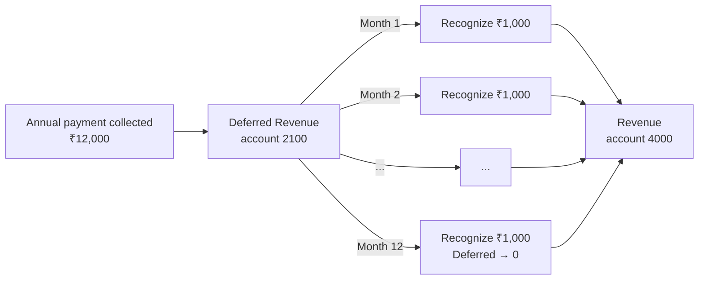

## Overview

Every billing event in Recurso lands in a proper set of books. A built-in **double-entry ledger** records balanced debits and credits for each invoice, payment, and refund — with PostgreSQL as the authoritative store and an optional TigerBeetle mirror for high-throughput environments. On top of the ledger, revenue recognition turns billings into deferred and recognized revenue over time, multi-currency normalizes everything to a reporting currency, and analytics surfaces MRR and other metrics.

Cash collected upfront is not revenue until it is earned. Recurso holds it in
**Deferred Revenue** and recognizes it into **Revenue** as each service period
elapses — the core of ASC 606 reporting:

## Key capabilities

- **Double-entry ledger** — balanced journal entries for every financial event, fully auditable back to source objects
- **Authoritative + mirror** — PostgreSQL is authoritative; TigerBeetle is an optional mirror reconciled by transaction ID
- **Revenue recognition** — move billed amounts from deferred to recognized in line with ASC 606
- **Multi-currency** — FX-normalized reporting so MRR and totals roll up to one currency
- **Analytics** — MRR, usage, and revenue reporting drawn directly from the ledger

## Explore Revenue & Finance

<CardGroup cols={2}>
  <Card title="Double-Entry Ledger" icon="book" href="/advanced/ledger">
    Auditable, balanced journal entries for every payment, invoice, and refund.
  </Card>
  <Card title="Revenue Recognition" icon="chart-column" href="/advanced/revenue-recognition">
    Move billed amounts from deferred to recognized revenue over the service period.
  </Card>
  <Card title="Multi-Currency" icon="coins" href="/advanced/multi-currency">
    Handle exchange rates and normalize reporting to a single currency.
  </Card>
  <Card title="Analytics" icon="chart-line" href="/advanced/analytics">
    Track MRR, usage, and revenue metrics computed from the ledger.
  </Card>
</CardGroup>
