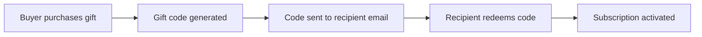
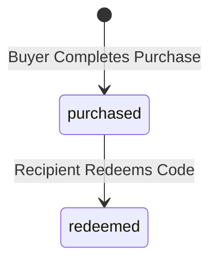
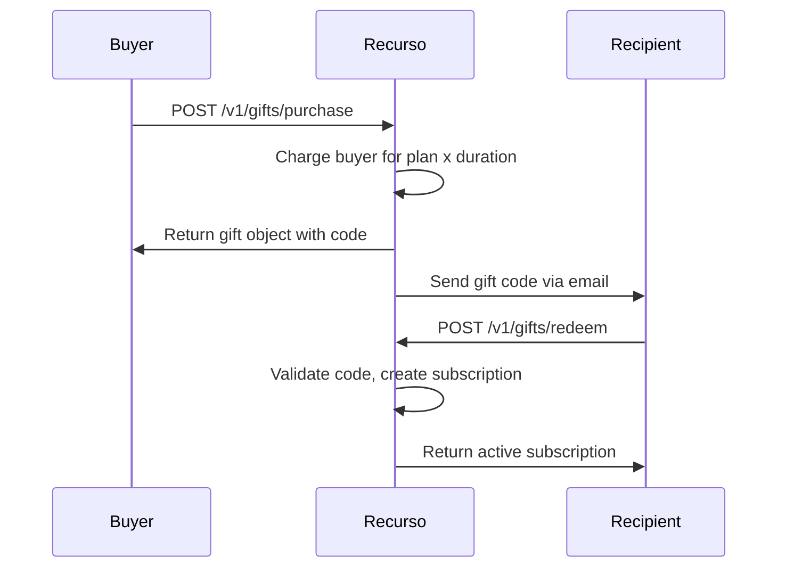

## Overview

Gift subscriptions allow your customers to purchase a subscription plan on behalf of someone else. The recipient receives a unique gift code they can redeem to activate the subscription on their own account.

- **Purchase** -- a buyer selects a plan, duration, and recipient email
- **Deliver** -- Recurso generates a unique gift code and sends it to the recipient
- **Redeem** -- the recipient creates an account (or logs in) and redeems the code



## Gift Object

| Field | Type | Description |
|-------|------|-------------|
| `id` | `string` | Unique gift ID (prefixed `gift_`) |
| `tenant_id` | `string` | Your tenant identifier |
| `code` | `string` | Unique redemption code |
| `plan_id` | `UUID` | The plan being gifted |
| `buyer_customer_id` | `UUID` | Customer ID of the buyer |
| `recipient_email` | `string` | Email address of the recipient |
| `status` | `string` | `purchased` or `redeemed` |
| `redeemed_by_customer_id` | `UUID` | Customer ID of the redeemer (nullable) |
| `redeemed_at` | `datetime` | When the gift was redeemed (nullable) |
| `duration_months` | `integer` | Length of the gifted subscription |
| `created_at` | `datetime` | When the gift was purchased |
| `updated_at` | `datetime` | Last update timestamp |

## Gift Statuses



| Status | Description |
|--------|-------------|
| `purchased` | Gift has been paid for and code generated; awaiting redemption |
| `redeemed` | Recipient has redeemed the code and subscription is active |

## Purchase a Gift

The buyer specifies the plan, recipient email, and subscription duration. Recurso charges the buyer immediately and generates a gift code.

<CodeGroup>
```typescript TypeScript
const gift = await recurso.gifts.purchase({
  buyer_customer_id: 'cust_abc123',
  plan_id: 'plan_pro',
  recipient_email: 'friend@example.com',
  duration_months: 6
});

console.log(gift.id);     // "gift_g4k8m2"
console.log(gift.code);   // "GIFT-PRO-X7K9M2"
console.log(gift.status); // "purchased"
```

```bash cURL
curl -X POST https://billing.example.com/v1/gifts/purchase \
  -H "Authorization: Bearer $API_KEY" \
  -H "Content-Type: application/json" \
  -d '{
    "buyer_customer_id": "cust_abc123",
    "plan_id": "plan_pro",
    "recipient_email": "friend@example.com",
    "duration_months": 6
  }'
```
</CodeGroup>

### Purchase Parameters

| Parameter | Type | Required | Description |
|-----------|------|----------|-------------|
| `buyer_customer_id` | `UUID` | Yes | The customer paying for the gift |
| `plan_id` | `UUID` | Yes | Which plan to gift |
| `recipient_email` | `string` | Yes | Email of the person receiving the gift |
| `duration_months` | `integer` | Yes | How many months the gift subscription lasts |

<Info>
The buyer is charged the full upfront cost for the gifted duration. For example, gifting a $49/month plan for 6 months charges the buyer $294 at purchase time.
</Info>

## Redeem a Gift

The recipient uses the gift code to activate their subscription. They must have (or create) a Recurso customer account.

<CodeGroup>
```typescript TypeScript
const subscription = await recurso.gifts.redeem({
  code: 'GIFT-PRO-X7K9M2',
  recipient_customer_id: 'cust_def456'
});

console.log(subscription.id);     // "sub_s9n3v7"
console.log(subscription.status); // "active"
console.log(subscription.plan.name); // "Pro Plan"
```

```bash cURL
curl -X POST https://billing.example.com/v1/gifts/redeem \
  -H "Authorization: Bearer $API_KEY" \
  -H "Content-Type: application/json" \
  -d '{
    "code": "GIFT-PRO-X7K9M2",
    "recipient_customer_id": "cust_def456"
  }'
```
</CodeGroup>

### Redemption Parameters

| Parameter | Type | Required | Description |
|-----------|------|----------|-------------|
| `code` | `string` | Yes | The gift code to redeem |
| `recipient_customer_id` | `UUID` | Yes | Customer account that will receive the subscription |

<Warning>
Each gift code can only be redeemed once. Attempting to redeem an already-used code returns an error. The `redeemed_by_customer_id` does not need to match the original `recipient_email` -- this allows flexibility if the recipient forwards the code to a different account.
</Warning>

### What Happens on Redemption

<Steps>
  <Step title="Code validation">
    Recurso verifies the code exists and has not already been redeemed.
  </Step>
  <Step title="Subscription creation">
    A new subscription is created for the recipient on the gifted plan, with a duration matching `duration_months`.
  </Step>
  <Step title="Gift status update">
    The gift record transitions from `purchased` to `redeemed`. The `redeemed_by_customer_id` and `redeemed_at` fields are populated.
  </Step>
  <Step title="No payment required">
    The recipient is not charged. The subscription is fully prepaid by the buyer.
  </Step>
</Steps>

## List Gifts

Retrieve all gifts with pagination.

<CodeGroup>
```typescript TypeScript
const gifts = await recurso.gifts.list({
  page: 1,
  per_page: 20
});

// Returns
// {
//   data: [
//     {
//       id: 'gift_g4k8m2',
//       code: 'GIFT-PRO-X7K9M2',
//       plan_id: 'plan_pro',
//       buyer_customer_id: 'cust_abc123',
//       recipient_email: 'friend@example.com',
//       status: 'redeemed',
//       redeemed_by_customer_id: 'cust_def456',
//       redeemed_at: '2026-06-20T10:15:00Z',
//       duration_months: 6,
//       created_at: '2026-06-15T08:00:00Z'
//     },
//     ...
//   ],
//   page: 1,
//   per_page: 20,
//   total: 38
// }
```

```bash cURL
curl -G https://billing.example.com/v1/gifts \
  -H "Authorization: Bearer $API_KEY" \
  -d page=1 \
  -d per_page=20
```
</CodeGroup>

## Gift Lifecycle

The complete gift flow from purchase to subscription activation:



## Webhooks

| Event | Description |
|-------|-------------|
| `gift.purchased` | A gift has been bought and a code generated |
| `gift.redeemed` | A recipient has redeemed a gift code |
| `subscription.created` | Triggered alongside redemption when the subscription is created |

### Example Webhook Payload

```json
{
  "event": "gift.redeemed",
  "data": {
    "id": "gift_g4k8m2",
    "code": "GIFT-PRO-X7K9M2",
    "plan_id": "plan_pro",
    "buyer_customer_id": "cust_abc123",
    "recipient_email": "friend@example.com",
    "status": "redeemed",
    "redeemed_by_customer_id": "cust_def456",
    "redeemed_at": "2026-06-20T10:15:00Z",
    "duration_months": 6
  }
}
```

## Use Cases

<CardGroup cols={2}>
  <Card title="Holiday Promotions" icon="calendar">
    Run seasonal campaigns where customers can gift subscriptions during holidays, birthdays, or special events.
  </Card>
  <Card title="Corporate Gifting" icon="building">
    Let businesses purchase bulk gift subscriptions for clients, partners, or employees.
  </Card>
  <Card title="Onboarding Incentives" icon="user-plus">
    Combine with referral programs -- reward referrers with gift codes they can share instead of account credit.
  </Card>
  <Card title="Charitable Giving" icon="heart">
    Allow customers to sponsor subscriptions for nonprofits or individuals who cannot afford the service.
  </Card>
</CardGroup>

## Best Practices

<AccordionGroup>
  <Accordion title="Set an expiration policy for unredeemed gifts">
    While the API does not enforce an expiration by default, consider implementing a background job that flags gifts older than 12 months as expired. Notify the buyer so they can re-gift or request a refund.
  </Accordion>
  <Accordion title="Send reminder emails for unredeemed codes">
    Listen for the `gift.purchased` event and set up automated email reminders. If the recipient has not redeemed after 7 days, send a follow-up. After 30 days, notify the buyer.
  </Accordion>
  <Accordion title="Handle post-gift subscription renewal">
    When the gifted duration ends, the subscription will not auto-renew unless the recipient adds a payment method. Notify the recipient before the gift period expires so they can choose to continue.
  </Accordion>
  <Accordion title="Offer flexible durations">
    Present buyers with multiple duration options (3, 6, or 12 months). Longer durations can include a discount to increase average order value.
  </Accordion>
  <Accordion title="Allow gift messages">
    While the core API tracks the gift code and recipient email, you can store a personal message in your application layer and include it in the delivery email.
  </Accordion>
</AccordionGroup>
