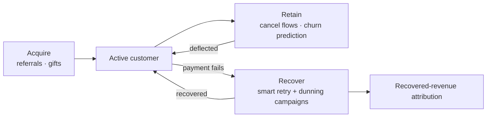

## Overview

Winning a customer is only half the battle — keeping them, and getting paid, is the other half. Growth & Recovery brings together the tools that protect and grow revenue: a reinforcement-learning **smart retry** engine that learns the best time to re-attempt failed payments, multi-step **dunning campaigns** for customer communication, **cancel flows** and **churn prediction** to keep customers, and **referrals** and **gifts** to bring new ones in.

These tools map onto the customer lifecycle — acquire, retain, and recover:

## Key capabilities

- **Smart retry** — epsilon-greedy, Thompson sampling, and UCB1 bandit strategies pick optimal retry timing per context
- **Recovered-revenue attribution** — see exactly how much revenue the recovery engine earned back
- **Dunning campaigns** — multi-step, escalating communication flows for failed payments
- **Retention** — cancel-flow deflection offers and churn-risk scoring with alerts
- **Acquisition** — referral programs and giftable subscriptions

## Explore Growth & Recovery

<CardGroup cols={2}>
  <Card title="Smart Payment Retry" icon="rotate-right" href="/advanced/smart-retry">
    Reinforcement-learning retry scheduling that maximizes payment recovery.
  </Card>
  <Card title="Dunning Campaigns" icon="envelope" href="/advanced/dunning-campaigns">
    Multi-step, escalating communication flows to recover failed payments.
  </Card>
  <Card title="Cancel Flows" icon="door-open" href="/advanced/cancel-flows">
    Build guided cancellation experiences with deflection offers.
  </Card>
  <Card title="Churn Prediction" icon="triangle-exclamation" href="/advanced/churn-prediction">
    Score customers by churn risk and act on early-warning alerts.
  </Card>
  <Card title="Referrals" icon="user-plus" href="/advanced/referrals">
    Run referral programs with codes, tracking, and qualification rules.
  </Card>
  <Card title="Gifts" icon="gift" href="/advanced/gifts">
    Let customers purchase, gift, and redeem subscriptions.
  </Card>
</CardGroup>
