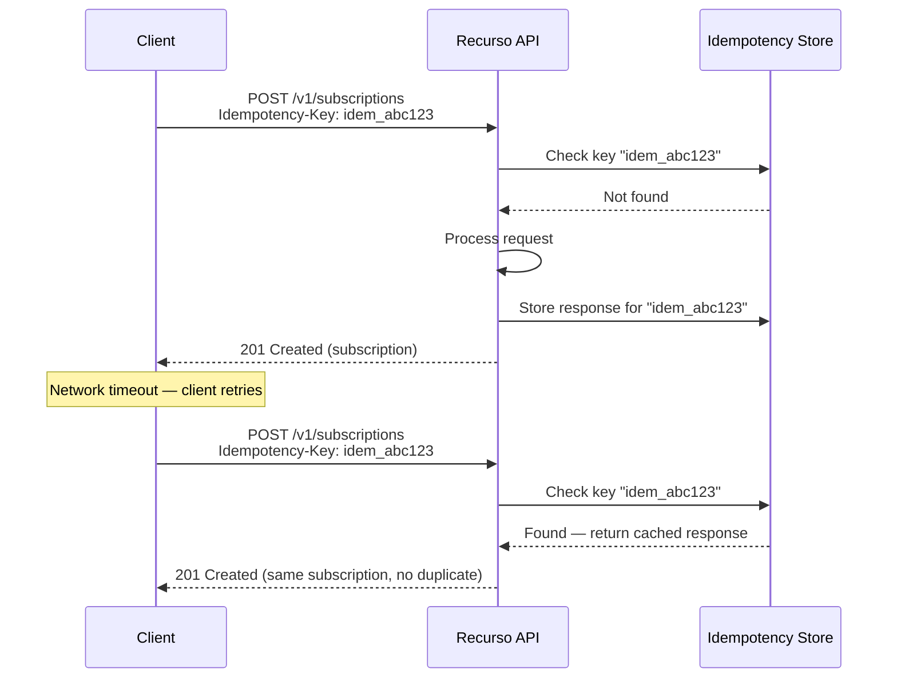

## Overview

Network failures, timeouts, and retries are inevitable in distributed systems. Recurso provides two mechanisms to help you build resilient integrations:

- **Idempotency** — Safely retry requests without causing duplicate side effects (double charges, duplicate subscriptions)
- **Rate Limiting** — Protect the platform and your account from excessive request volume

## Idempotency

### How It Works

Every mutating API request (POST, PUT, PATCH, DELETE) can include an `Idempotency-Key` header. Recurso uses this key to detect duplicate requests and return the original response instead of processing the request again.



### Using the Idempotency-Key Header

Include the header on any request that creates or modifies resources:

<CodeGroup>
```typescript TypeScript
const subscription = await recurso.subscriptions.create(
  {
    customer_id: "cust_8Tj3mKvR",
    plan_id: "plan_pro_monthly",
    payment_method: "pm_card_visa"
  },
  {
    idempotencyKey: "idem_f47ac10b-58cc-4372-a567-0e02b2c3d479"
  }
);
```

```bash cURL
curl -X POST https://api.recurso.dev/v1/subscriptions \
  -H "Authorization: Bearer $API_KEY" \
  -H "Content-Type: application/json" \
  -H "Idempotency-Key: idem_f47ac10b-58cc-4372-a567-0e02b2c3d479" \
  -d '{
    "customer_id": "cust_8Tj3mKvR",
    "plan_id": "plan_pro_monthly",
    "payment_method": "pm_card_visa"
  }'
```
</CodeGroup>

### Key Format Recommendations

| Approach | Example | Best For |
|----------|---------|----------|
| UUID v4 | `idem_f47ac10b-58cc-4372-a567-0e02b2c3d479` | General purpose — guarantees uniqueness |
| Action-based | `idem_create-sub_cust_8Tj3mKvR_plan_pro_2025-07` | Debugging — human-readable, naturally scoped |
| Request hash | `idem_sha256_a1b2c3d4e5f6...` | Deterministic — same input always yields same key |

<Tip>
Use UUID v4 as your default strategy. Prefix with `idem_` for readability in logs. If you need the same request to always produce the same key (e.g., webhook handlers), use a deterministic hash of the request parameters.
</Tip>

### Idempotency Rules

<AccordionGroup>
  <Accordion title="Keys are scoped to your API key">
    Two different API keys can use the same idempotency key value without conflict. Keys are scoped to the authenticated API key making the request.
  </Accordion>
  <Accordion title="Keys expire after 24 hours">
    Idempotency keys are stored for 24 hours. After that, the same key can be reused for a new request. This prevents unbounded storage growth while covering typical retry windows.
  </Accordion>
  <Accordion title="Request body must match">
    If you reuse an idempotency key with a different request body, Recurso returns a `422 Unprocessable Entity` error. This prevents accidental misuse where different operations share a key.
  </Accordion>
  <Accordion title="Only mutating requests are idempotent">
    GET requests are naturally idempotent and do not require an `Idempotency-Key` header. The header is only checked on POST, PUT, PATCH, and DELETE requests.
  </Accordion>
  <Accordion title="Error responses are not cached">
    If the original request returned a 4xx or 5xx error, the idempotency key is released. Retrying with the same key will re-execute the request, giving you a chance to succeed after a transient failure.
  </Accordion>
</AccordionGroup>

### Idempotency Best Practices

1. **Always use idempotency keys for payment-related operations** — Creating subscriptions, recording payments, and issuing refunds should always include an idempotency key
2. **Generate keys client-side** — Generate the key before sending the request so retries use the same key
3. **Store keys alongside business operations** — Log the idempotency key with your internal transaction ID for traceability
4. **Do not reuse keys across different operations** — Each distinct business operation should have a unique key

## Rate Limiting

Recurso enforces rate limits per API key to ensure platform stability and fair usage.

### Rate Limit Tiers

| Plan | Requests per Minute | Burst Limit |
|------|---------------------|-------------|
| Free | 60 | 10 requests/second |
| Pro | 600 | 100 requests/second |
| Enterprise | Custom | Custom |

<Info>
Rate limits are applied per API key, not per tenant. If you have multiple API keys, each has its own independent rate limit counter.
</Info>

### Rate Limit Headers

Every API response includes headers that tell you your current rate limit status:

| Header | Description | Example |
|--------|-------------|---------|
| `X-RateLimit-Limit` | Maximum requests allowed per minute | `600` |
| `X-RateLimit-Remaining` | Requests remaining in the current window | `542` |
| `X-RateLimit-Reset` | Unix timestamp when the current window resets | `1720598460` |

```http
HTTP/1.1 200 OK
X-RateLimit-Limit: 600
X-RateLimit-Remaining: 542
X-RateLimit-Reset: 1720598460
Content-Type: application/json
```

### Handling 429 Too Many Requests

When you exceed the rate limit, Recurso returns a `429 Too Many Requests` response with a `Retry-After` header:

```http
HTTP/1.1 429 Too Many Requests
Retry-After: 23
X-RateLimit-Limit: 600
X-RateLimit-Remaining: 0
X-RateLimit-Reset: 1720598460
Content-Type: application/json

{
  "error": {
    "code": "rate_limited",
    "message": "Rate limit exceeded. Retry after 23 seconds."
  }
}
```

## Retry Strategies

### Exponential Backoff

The recommended retry strategy uses exponential backoff with jitter to avoid thundering-herd problems:

<CodeGroup>
```typescript TypeScript
async function requestWithRetry<T>(
  fn: () => Promise<T>,
  options: {
    maxRetries?: number;
    baseDelayMs?: number;
    idempotencyKey?: string;
  } = {}
): Promise<T> {
  const { maxRetries = 5, baseDelayMs = 1000 } = options;

  for (let attempt = 0; attempt <= maxRetries; attempt++) {
    try {
      return await fn();
    } catch (error) {
      if (!isRetryable(error) || attempt === maxRetries) {
        throw error;
      }

      // Exponential backoff with jitter
      const delay = baseDelayMs * Math.pow(2, attempt);
      const jitter = delay * 0.5 * Math.random();
      const waitMs = delay + jitter;

      console.log(
        `Request failed (attempt ${attempt + 1}/${maxRetries}). ` +
        `Retrying in ${Math.round(waitMs)}ms...`
      );

      await sleep(waitMs);
    }
  }

  throw new Error("Max retries exceeded");
}

function isRetryable(error: any): boolean {
  // Retry on rate limits and server errors
  return error.statusCode === 429 || error.statusCode >= 500;
}

function sleep(ms: number): Promise<void> {
  return new Promise(resolve => setTimeout(resolve, ms));
}

// Usage
const subscription = await requestWithRetry(
  () => recurso.subscriptions.create(
    { customer_id: "cust_8Tj3mKvR", plan_id: "plan_pro_monthly" },
    { idempotencyKey: "idem_f47ac10b-58cc-4372-a567-0e02b2c3d479" }
  ),
  { maxRetries: 3, baseDelayMs: 1000 }
);
```

```bash cURL
# Bash retry loop with exponential backoff
MAX_RETRIES=5
RETRY_DELAY=1

for attempt in $(seq 1 $MAX_RETRIES); do
  response=$(curl -s -w "\n%{http_code}" -X POST https://api.recurso.dev/v1/subscriptions \
    -H "Authorization: Bearer $API_KEY" \
    -H "Content-Type: application/json" \
    -H "Idempotency-Key: idem_f47ac10b-58cc-4372-a567-0e02b2c3d479" \
    -d '{
      "customer_id": "cust_8Tj3mKvR",
      "plan_id": "plan_pro_monthly"
    }')

  http_code=$(echo "$response" | tail -1)

  if [ "$http_code" -ne 429 ] && [ "$http_code" -lt 500 ]; then
    echo "$response" | head -n -1
    break
  fi

  echo "Attempt $attempt failed ($http_code). Retrying in ${RETRY_DELAY}s..."
  sleep $RETRY_DELAY
  RETRY_DELAY=$((RETRY_DELAY * 2))
done
```
</CodeGroup>

### Retry Decision Table

| Status Code | Meaning | Retry? | Strategy |
|-------------|---------|--------|----------|
| `200-299` | Success | No | Process response |
| `400` | Bad Request | No | Fix request parameters |
| `401` | Unauthorized | No | Check API key |
| `404` | Not Found | No | Check resource ID |
| `409` | Conflict | Maybe | Check resource state, retry if transient |
| `422` | Unprocessable Entity | No | Fix request body or idempotency key mismatch |
| `429` | Rate Limited | Yes | Wait for `Retry-After` seconds, then retry |
| `500` | Server Error | Yes | Exponential backoff with idempotency key |
| `502-504` | Gateway Error | Yes | Exponential backoff with idempotency key |

<Warning>
Never retry `400`, `401`, `404`, or `422` errors. These indicate client-side issues that will not resolve on retry. Retrying these wastes your rate limit budget.
</Warning>

## Monitoring Rate Limit Usage

Track your rate limit consumption to proactively avoid hitting limits:

```typescript
const response = await recurso.customers.list({ limit: 10 });

// Access rate limit headers from the response
const remaining = response.headers["x-ratelimit-remaining"];
const resetAt = response.headers["x-ratelimit-reset"];

if (parseInt(remaining) < 50) {
  console.warn(
    `Rate limit running low: ${remaining} requests remaining. ` +
    `Resets at ${new Date(parseInt(resetAt) * 1000).toISOString()}`
  );
}
```

## Best Practices

<CardGroup cols={2}>
  <Card title="Always Use Idempotency Keys" icon="fingerprint">
    Include idempotency keys on every mutating request, especially payments and subscription changes.
  </Card>
  <Card title="Respect Retry-After" icon="hourglass">
    When you receive a 429, always honor the `Retry-After` header rather than using a fixed delay.
  </Card>
  <Card title="Add Jitter to Backoff" icon="shuffle">
    Randomize retry delays to prevent multiple clients from retrying in lockstep and overwhelming the API.
  </Card>
  <Card title="Cache Read Results" icon="database">
    Cache GET responses locally to reduce API calls. Use webhooks for real-time updates instead of polling.
  </Card>
  <Card title="Use Bulk Endpoints" icon="layer-group">
    Prefer batch APIs (e.g., `usage.recordBatch`) over individual calls to stay within rate limits on high-volume operations.
  </Card>
  <Card title="Monitor and Alert" icon="bell">
    Set up monitoring on `X-RateLimit-Remaining`. Alert your team when remaining requests drop below 10% of the limit.
  </Card>
</CardGroup>
