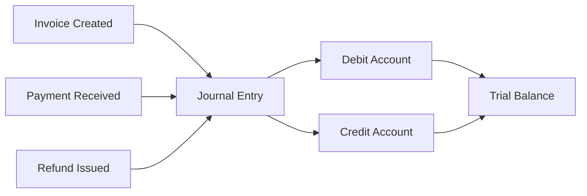

## Overview

Recurso includes a built-in double-entry ledger that automatically records journal entries for every financial event — payments, invoices, refunds, and more. Every transaction creates balanced debits and credits, giving you an auditable, real-time view of your financial position.



### Why Double-Entry?

- **Accuracy** — Every transaction balances to zero. If debits do not equal credits, the entry is rejected.
- **Auditability** — Full history of every financial movement, tied back to source objects (invoices, payments, refunds).
- **Reporting** — Generate balance sheets, income statements, and cash flow reports directly from the ledger.
- **Compliance** — Meets requirements for ASC 606 revenue recognition and standard accounting principles.

## Account Types

Recurso organizes ledger accounts into five standard accounting categories:

| Type | Description | Normal Balance | Example |
|------|-------------|----------------|---------|
| `asset` | Resources owned | Debit | Cash, Accounts Receivable |
| `liability` | Obligations owed | Credit | Deferred Revenue, Tax Payable |
| `equity` | Owner's stake | Credit | Retained Earnings |
| `revenue` | Income earned | Credit | Subscription Revenue |
| `expense` | Costs incurred | Debit | Refunds, Discounts |

## Built-in Account Codes

Recurso provisions the following accounts automatically for each tenant:

| Account Code | Name | Type | Purpose |
|-------------|------|------|---------|
| `1000` | Cash | `asset` | Funds received from payments |
| `1100` | Accounts Receivable | `asset` | Outstanding invoice amounts |
| `4000` | Revenue | `revenue` | Recognized subscription and charge revenue |
| `2100` | Deferred Revenue | `liability` | Prepaid revenue not yet recognized |
| `5000` | Refunds | `expense` | Refund amounts issued to customers |
| `2200` | Tax Payable | `liability` | Collected tax awaiting remittance |
| `5100` | Discounts | `expense` | Coupon and discount amounts applied |

<Info>
Account codes follow standard chart-of-accounts conventions. Assets start with `1xxx`, liabilities with `2xxx`, revenue with `4xxx`, and expenses with `5xxx`.
</Info>

## How Transactions Are Created

Recurso automatically creates journal entries when financial events occur. You never need to create entries manually — they are produced as a side effect of normal billing operations.

### Invoice Finalized

When an invoice is finalized, Recurso records the amount owed:

```
Debit   1100 (Accounts Receivable)   ₹4,999.00
Credit  2100 (Deferred Revenue)      ₹4,999.00
```

### Payment Received

When the customer pays the invoice:

```
Debit   1000 (Cash)                  ₹4,999.00
Credit  1100 (Accounts Receivable)   ₹4,999.00
```

### Revenue Recognized

As the subscription period elapses, deferred revenue is recognized:

```
Debit   2100 (Deferred Revenue)      ₹4,999.00
Credit  4000 (Revenue)               ₹4,999.00
```

### Refund Issued

When a refund is processed:

```
Debit   5000 (Refunds)               ₹4,999.00
Credit  1000 (Cash)                  ₹4,999.00
```

### Tax Collected

When an invoice includes tax:

```
Debit   1100 (Accounts Receivable)   ₹899.82
Credit  2200 (Tax Payable)           ₹899.82
```

### Discount Applied

When a coupon or discount is applied to an invoice:

```
Debit   5100 (Discounts)             ₹500.00
Credit  1100 (Accounts Receivable)   ₹500.00
```

## Querying the Ledger

### List Ledger Accounts

Retrieve all ledger accounts and their current balances.

<CodeGroup>
```typescript TypeScript
const accounts = await recurso.ledger.accounts.list();

// Response
{
  data: [
    {
      id: "lacc_abc123",
      tenant_id: "ten_xyz",
      code: "1000",
      name: "Cash",
      type: "asset",
      balance: 2450000,
      currency: "INR"
    },
    {
      id: "lacc_def456",
      tenant_id: "ten_xyz",
      code: "1100",
      name: "Accounts Receivable",
      type: "asset",
      balance: 875000,
      currency: "INR"
    },
    {
      id: "lacc_ghi789",
      tenant_id: "ten_xyz",
      code: "4000",
      name: "Revenue",
      type: "revenue",
      balance: 1250000,
      currency: "INR"
    }
  ]
}
```

```bash cURL
curl https://api.recurso.dev/v1/ledger/accounts \
  -H "Authorization: Bearer $API_KEY"
```
</CodeGroup>

### List Journal Entries

Query journal entries with optional filters for account, date range, and reference.

<CodeGroup>
```typescript TypeScript
const entries = await recurso.ledger.entries.list({
  account_id: "lacc_abc123",
  start_date: "2025-01-01",
  end_date: "2025-01-31"
});

// Response
{
  data: [
    {
      id: "ltxn_abc123",
      tenant_id: "ten_xyz",
      entries: [
        {
          debit_account_id: "lacc_abc123",
          credit_account_id: "lacc_def456",
          amount: 499900,
          currency: "INR"
        }
      ],
      description: "Payment received for inv_m8k29x",
      reference_type: "payment",
      reference_id: "pay_r4t78p",
      created_at: "2025-01-15T10:30:00Z"
    }
  ]
}
```

```bash cURL
curl "https://api.recurso.dev/v1/ledger/entries?account_id=lacc_abc123&start_date=2025-01-01&end_date=2025-01-31" \
  -H "Authorization: Bearer $API_KEY"
```
</CodeGroup>

### Entry Filter Parameters

| Parameter | Type | Description |
|-----------|------|-------------|
| `account_id` | `string` | Filter entries involving a specific account |
| `start_date` | `string` | ISO 8601 date, inclusive lower bound |
| `end_date` | `string` | ISO 8601 date, inclusive upper bound |

### LedgerAccount Object

| Field | Type | Description |
|-------|------|-------------|
| `id` | `string` | Unique identifier (prefixed `lacc_`) |
| `tenant_id` | `string` | Tenant this account belongs to |
| `code` | `string` | Numeric account code (e.g., `1000`) |
| `name` | `string` | Human-readable account name |
| `type` | `string` | One of `asset`, `liability`, `equity`, `revenue`, `expense` |
| `balance` | `integer` | Current balance in minor units |
| `currency` | `string` | ISO 4217 currency code |

### LedgerTransaction Object

| Field | Type | Description |
|-------|------|-------------|
| `id` | `string` | Unique identifier (prefixed `ltxn_`) |
| `tenant_id` | `string` | Tenant this transaction belongs to |
| `entries` | `array` | Array of entry lines (debit/credit pairs) |
| `entries[].debit_account_id` | `string` | Account being debited |
| `entries[].credit_account_id` | `string` | Account being credited |
| `entries[].amount` | `integer` | Amount in minor currency units |
| `entries[].currency` | `string` | ISO 4217 currency code |
| `description` | `string` | Human-readable description of the transaction |
| `reference_type` | `string` | Source object type (e.g., `payment`, `invoice`, `refund`) |
| `reference_id` | `string` | ID of the source object |
| `created_at` | `string` | ISO 8601 timestamp |

## TigerBeetle Backend

For high-throughput environments, Recurso supports an optional [TigerBeetle](https://tigerbeetle.com) backend. TigerBeetle is a purpose-built financial transactions database that provides:

- **Sub-millisecond latency** for ledger operations
- **Strict serializability** guaranteeing consistency
- **Built-in two-phase transfers** for complex settlement flows
- **Throughput** exceeding 1 million transactions per second

<Tip>
TigerBeetle is optional. The default PostgreSQL-backed ledger handles most workloads. Consider TigerBeetle if you process more than 10,000 transactions per minute or need sub-millisecond ledger writes.
</Tip>

To enable TigerBeetle, set the following environment variables:

```bash .env
LEDGER_BACKEND=tigerbeetle
TIGERBEETLE_ADDRESSES=127.0.0.1:3001
TIGERBEETLE_CLUSTER_ID=0
```

The API surface remains identical — switching backends requires no changes to your integration code.

## Webhook Events

The ledger emits events you can subscribe to:

| Event | Description |
|-------|-------------|
| `ledger.entry.created` | A new journal entry was recorded |
| `ledger.account.balance_updated` | An account balance changed |

## Best Practices

<CardGroup cols={2}>
  <Card title="Use Reference IDs" icon="link">
    Always trace ledger entries back to their source invoice, payment, or refund using `reference_type` and `reference_id`
  </Card>
  <Card title="Reconcile Regularly" icon="scale-balanced">
    Compare ledger balances against your payment gateway settlements weekly to catch discrepancies early
  </Card>
  <Card title="Monitor Imbalances" icon="triangle-exclamation">
    Set alerts on the trial balance. Any non-zero difference indicates a bug or data corruption
  </Card>
  <Card title="Archive Old Entries" icon="box-archive">
    Query with date ranges to keep responses fast. Export older entries to your data warehouse for long-term storage
  </Card>
</CardGroup>

<Warning>
Ledger entries are immutable. To correct an error, create a reversing entry (debit and credit swapped) rather than deleting or modifying the original transaction.
</Warning>
