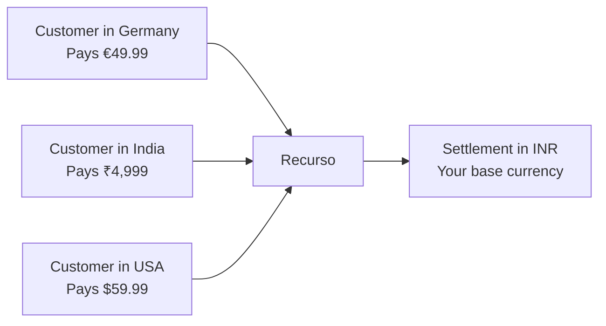

## Overview

Recurso supports billing in multiple currencies, allowing you to charge customers in their local currency while tracking revenue and settling funds in your base currency. Currency is specified at the plan, invoice, and ledger level, giving you full control over international billing.



## Key Concepts

| Concept | Description |
|---------|-------------|
| **Presentment currency** | The currency shown to the customer on invoices and checkout |
| **Base currency** | Your company's home currency used for accounting and reporting |
| **Settlement currency** | The currency deposited into your bank account (often same as base) |
| **FX rate** | The exchange rate applied when converting between currencies |

<Info>
All monetary amounts in the Recurso API are expressed in **minor units** (e.g., cents, paise). An amount of `4999` in `INR` represents ₹49.99. An amount of `5999` in `USD` represents $59.99.
</Info>

## Setting Your Base Currency

Configure your base currency during tenant setup. This is the currency used for financial reporting and ledger balances.

<CodeGroup>
```typescript TypeScript
const tenant = await recurso.tenants.update({
  base_currency: "INR"
});
```

```bash cURL
curl -X PATCH https://billing.example.com/v1/tenant \
  -H "Authorization: Bearer $API_KEY" \
  -H "Content-Type: application/json" \
  -d '{
    "base_currency": "INR"
  }'
```
</CodeGroup>

<Warning>
Changing your base currency after you have active subscriptions and ledger entries is not recommended. It will not retroactively convert historical data. Set this before going live.
</Warning>

## Creating Multi-Currency Plans

Plans can include prices in multiple currencies. When a subscription is created, Recurso selects the appropriate price based on the customer's currency.

<CodeGroup>
```typescript TypeScript
const plan = await recurso.plans.create({
  name: "Pro Plan",
  description: "For growing teams",
  interval: "month",
  prices: [
    { amount: 499900, currency: "INR" },
    { amount: 5999, currency: "USD" },
    { amount: 4999, currency: "EUR" },
    { amount: 4999, currency: "GBP" }
  ]
});
```

```bash cURL
curl -X POST https://billing.example.com/v1/plans \
  -H "Authorization: Bearer $API_KEY" \
  -H "Content-Type: application/json" \
  -d '{
    "name": "Pro Plan",
    "description": "For growing teams",
    "interval": "month",
    "prices": [
      { "amount": 499900, "currency": "INR" },
      { "amount": 5999, "currency": "USD" },
      { "amount": 4999, "currency": "EUR" },
      { "amount": 4999, "currency": "GBP" }
    ]
  }'
```
</CodeGroup>

<Tip>
You do not need to define prices in every currency. If a customer's currency is not listed, the subscription creation will return an error prompting you to add the missing currency or specify a fallback.
</Tip>

## Currency on Subscriptions

When creating a subscription, the currency is determined by the customer's configured currency or can be explicitly specified:

<CodeGroup>
```typescript TypeScript
const subscription = await recurso.subscriptions.create({
  customer_id: "cust_eu_abc",
  plan_id: "plan_pro",
  currency: "EUR"  // Explicitly set to Euro
});

// The subscription object includes the currency
// {
//   id: "sub_xyz789",
//   customer_id: "cust_eu_abc",
//   plan_id: "plan_pro",
//   currency: "EUR",
//   amount: 4999,
//   status: "active",
//   ...
// }
```

```bash cURL
curl -X POST https://billing.example.com/v1/subscriptions \
  -H "Authorization: Bearer $API_KEY" \
  -H "Content-Type: application/json" \
  -d '{
    "customer_id": "cust_eu_abc",
    "plan_id": "plan_pro",
    "currency": "EUR"
  }'
```
</CodeGroup>

## Currency on Invoices

Invoices inherit the currency from the subscription. All line items, taxes, and totals are expressed in the presentment currency.

```json
{
  "id": "inv_m8k29x",
  "subscription_id": "sub_xyz789",
  "customer_id": "cust_eu_abc",
  "currency": "EUR",
  "subtotal": 4999,
  "tax": 950,
  "total": 5949,
  "status": "paid",
  "line_items": [
    {
      "description": "Pro Plan — July 2025",
      "amount": 4999,
      "currency": "EUR"
    }
  ]
}
```

## How FX Rates Work

When payments in foreign currencies are received, Recurso records the exchange rate for ledger entries and reporting.

### Rate Determination

Recurso supports multiple approaches for exchange rates:

| Approach | Description | Use Case |
|----------|-------------|----------|
| **Gateway rate** | Uses the rate from your payment gateway (Stripe, Razorpay) at settlement time | Most common; reflects actual conversion |
| **Fixed rate** | You set a fixed rate per currency pair | Predictable pricing; you absorb FX risk |
| **Daily rate** | Recurso fetches rates from a provider daily | Balance of accuracy and predictability |

### Configuring FX Rate Source

<CodeGroup>
```typescript TypeScript
await recurso.tenants.update({
  fx_rate_source: "gateway",  // "gateway" | "fixed" | "daily"
  fixed_rates: {
    "USD_INR": 83.50,
    "EUR_INR": 90.75,
    "GBP_INR": 106.20
  }
});
```

```bash cURL
curl -X PATCH https://billing.example.com/v1/tenant \
  -H "Authorization: Bearer $API_KEY" \
  -H "Content-Type: application/json" \
  -d '{
    "fx_rate_source": "fixed",
    "fixed_rates": {
      "USD_INR": 83.50,
      "EUR_INR": 90.75,
      "GBP_INR": 106.20
    }
  }'
```
</CodeGroup>

## Currency Conversion in the Ledger

Ledger accounts track balances in the currency of their transactions. When a payment in a foreign currency is received, Recurso creates entries in both the presentment currency and the base currency.

### Example: EUR Payment with INR Base Currency

A customer pays €49.99 for a subscription. The FX rate is 1 EUR = 90.75 INR.

```
Presentment currency entries (EUR):
  Debit   1000 (Cash)                 €49.99
  Credit  1100 (Accounts Receivable)  €49.99

Base currency entries (INR):
  Debit   1000 (Cash)                 ₹4,536.59
  Credit  1100 (Accounts Receivable)  ₹4,536.59
```

<Info>
Each ledger account maintains its balance per currency. When querying account balances, you can filter by currency to see positions in each denomination.
</Info>

## Reporting in Base Currency

All financial reports aggregate to your base currency, giving you a single unified view regardless of how many currencies you bill in.

### Revenue by Currency

<CodeGroup>
```typescript TypeScript
const accounts = await recurso.ledger.accounts.list();
const revenueAccount = accounts.data.find(a => a.code === "4000");

// Revenue account balance is always in base currency
console.log(`Total Revenue: ${revenueAccount.currency} ${revenueAccount.balance / 100}`);
// Total Revenue: INR 1250000.00
```

```bash cURL
curl https://billing.example.com/v1/ledger/accounts \
  -H "Authorization: Bearer $API_KEY"

# The revenue account (code 4000) balance reflects
# all revenue converted to your base currency
```
</CodeGroup>

### Breakdown by Presentment Currency

To see revenue broken down by the currencies your customers paid in, query ledger entries and group by currency:

```typescript
const entries = await recurso.ledger.entries.list({
  account_id: "lacc_rev4000",
  start_date: "2025-06-01",
  end_date: "2025-06-30"
});

const byCurrency: Record<string, number> = {};
entries.data.forEach(txn => {
  txn.entries.forEach(entry => {
    const currency = entry.currency;
    byCurrency[currency] = (byCurrency[currency] || 0) + entry.amount;
  });
});

console.log(byCurrency);
// { INR: 15000000, USD: 119980, EUR: 49990 }
```

## Supported Currencies

Recurso supports all ISO 4217 currencies. Common currencies used by customers:

| Currency | Code | Minor Units | Symbol |
|----------|------|-------------|--------|
| Indian Rupee | `INR` | 100 (paise) | ₹ |
| US Dollar | `USD` | 100 (cents) | $ |
| Euro | `EUR` | 100 (cents) | € |
| British Pound | `GBP` | 100 (pence) | £ |
| Singapore Dollar | `SGD` | 100 (cents) | S$ |
| UAE Dirham | `AED` | 100 (fils) | د.إ |
| Japanese Yen | `JPY` | 1 (no minor) | ¥ |

<Warning>
Zero-decimal currencies like `JPY` have no minor unit. An amount of `5999` in JPY represents ¥5,999 — not ¥59.99. Recurso handles this automatically based on the ISO 4217 exponent, but be careful when constructing amounts in your application.
</Warning>

## Handling FX Gains and Losses

When exchange rates fluctuate between the time an invoice is created and the time payment is received, an FX gain or loss may occur. Recurso records these as separate ledger entries to keep your books accurate.

```
Invoice created at 1 EUR = 90.75 INR:
  Debit   1100 (Accounts Receivable)  ₹4,536.59

Payment received at 1 EUR = 91.00 INR:
  Debit   1000 (Cash)                 ₹4,549.09
  Credit  1100 (Accounts Receivable)  ₹4,536.59
  Credit  4500 (FX Gain)              ₹12.50
```

## Best Practices

<CardGroup cols={2}>
  <Card title="Define All Prices Upfront" icon="tags">
    Add prices for every currency you support when creating a plan. This avoids subscription creation failures.
  </Card>
  <Card title="Use Gateway Rates" icon="building-columns">
    Gateway FX rates reflect what you actually receive after conversion, eliminating discrepancies between billed and settled amounts.
  </Card>
  <Card title="Monitor FX Exposure" icon="chart-line">
    Track your receivables by currency. Large balances in volatile currencies increase FX risk.
  </Card>
  <Card title="Handle Zero-Decimal Currencies" icon="yen-sign">
    Validate your amount logic for currencies like JPY and KRW that have no minor unit.
  </Card>
</CardGroup>

<Tip>
If you only serve customers in one country, you can skip multi-currency entirely. Just set your base currency and define a single price on each plan. Multi-currency features activate only when you add prices in additional currencies.
</Tip>
