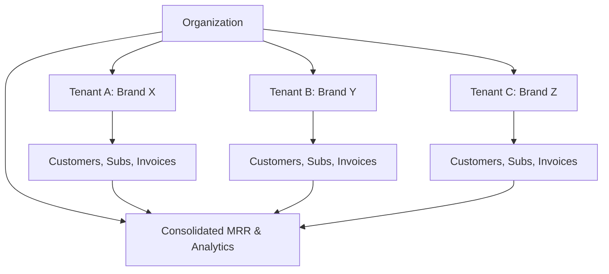

## Overview

Organizations in Recurso let you group multiple tenants under a single parent entity. This is designed for holding companies, multi-brand businesses, and enterprises that operate several billing entities but need consolidated reporting and centralized management.

<CardGroup cols={3}>
  <Card title="Consolidated View" icon="building">
    See MRR and revenue across all tenants in one place
  </Card>
  <Card title="Tenant Isolation" icon="lock">
    Each tenant maintains full data isolation -- customers, subscriptions, and invoices are separate
  </Card>
  <Card title="Centralized Admin" icon="users-gear">
    Manage all tenants from a single organization-level account
  </Card>
</CardGroup>

## How It Works



Each tenant is a fully independent billing entity with its own customers, plans, subscriptions, invoices, and payment gateway configurations. The organization layer sits above tenants and provides cross-entity visibility.

## Organization Object

| Field | Type | Description |
|-------|------|-------------|
| `id` | `string` | Unique organization ID (e.g., `org_abc123`) |
| `name` | `string` | Organization display name |
| `owner_email` | `string` | Email of the organization owner/admin |
| `created_at` | `string` | ISO 8601 timestamp |
| `updated_at` | `string` | ISO 8601 timestamp |

## Create an Organization

<CodeGroup>
```typescript TypeScript
const org = await recurso.organizations.create({
  name: 'Acme Holdings',
  owner_email: 'admin@acmeholdings.com'
});

// Response
{
  data: {
    id: 'org_acme01',
    name: 'Acme Holdings',
    owner_email: 'admin@acmeholdings.com',
    created_at: '2026-06-23T10:00:00Z',
    updated_at: '2026-06-23T10:00:00Z'
  }
}
```

```bash cURL
curl -X POST https://api.recurso.dev/v1/organizations \
  -H "Authorization: Bearer $API_KEY" \
  -H "Content-Type: application/json" \
  -d '{
    "name": "Acme Holdings",
    "owner_email": "admin@acmeholdings.com"
  }'
```
</CodeGroup>

### Create Parameters

| Parameter | Type | Required | Description |
|-----------|------|----------|-------------|
| `name` | `string` | Yes | Display name for the organization |
| `owner_email` | `string` | Yes | Email address of the primary admin |

## Get an Organization

<CodeGroup>
```typescript TypeScript
const org = await recurso.organizations.get('org_acme01');

// Response
{
  data: {
    id: 'org_acme01',
    name: 'Acme Holdings',
    owner_email: 'admin@acmeholdings.com',
    created_at: '2026-06-23T10:00:00Z',
    updated_at: '2026-06-23T10:00:00Z'
  }
}
```

```bash cURL
curl https://api.recurso.dev/v1/organizations/org_acme01 \
  -H "Authorization: Bearer $API_KEY"
```
</CodeGroup>

## Managing Tenants

Tenants are independent billing entities. Add existing tenants to an organization to enable consolidated reporting.

### Add a Tenant to an Organization

<CodeGroup>
```typescript TypeScript
const result = await recurso.organizations.addTenant('org_acme01', {
  tenant_id: 'tenant_brandx'
});

// Response
{
  status: 'added'
}
```

```bash cURL
curl -X POST https://api.recurso.dev/v1/organizations/org_acme01/tenants \
  -H "Authorization: Bearer $API_KEY" \
  -H "Content-Type: application/json" \
  -d '{
    "tenant_id": "tenant_brandx"
  }'
```
</CodeGroup>

### Add Tenant Parameters

| Parameter | Type | Required | Description |
|-----------|------|----------|-------------|
| `tenant_id` | `string` | Yes | The ID of the tenant to add to the organization |

<Warning>
A tenant can belong to only one organization. Attempting to add a tenant that is already part of another organization will return an error.
</Warning>

### List Tenants in an Organization

<CodeGroup>
```typescript TypeScript
const tenants = await recurso.organizations.listTenants('org_acme01');

// Response
{
  data: [
    {
      id: 'tenant_brandx',
      name: 'Brand X',
      active_subscriptions: 142,
      mrr: 2850000,
      currency: 'INR',
      created_at: '2025-09-01T00:00:00Z'
    },
    {
      id: 'tenant_brandy',
      name: 'Brand Y',
      active_subscriptions: 87,
      mrr: 1450000,
      currency: 'INR',
      created_at: '2026-01-15T00:00:00Z'
    },
    {
      id: 'tenant_brandz',
      name: 'Brand Z',
      active_subscriptions: 23,
      mrr: 980000,
      currency: 'USD',
      created_at: '2026-04-10T00:00:00Z'
    }
  ]
}
```

```bash cURL
curl https://api.recurso.dev/v1/organizations/org_acme01/tenants \
  -H "Authorization: Bearer $API_KEY"
```
</CodeGroup>

## Consolidated MRR

The consolidated MRR endpoint aggregates MRR metrics across all tenants in an organization, giving you a single view of your total recurring revenue.

<CodeGroup>
```typescript TypeScript
const metrics = await recurso.organizations.getConsolidatedMRR('org_acme01');

// Response
{
  data: {
    organization_id: 'org_acme01',
    total_mrr: 5280000,
    total_active_subscriptions: 252,
    by_tenant: [
      {
        tenant_id: 'tenant_brandx',
        tenant_name: 'Brand X',
        mrr: 2850000,
        currency: 'INR',
        new_mrr: 350000,
        expansion_mrr: 120000,
        contraction_mrr: 25000,
        churn_mrr: 45000
      }
      // ... one entry per tenant
    ]
  }
}
```

```bash cURL
curl https://api.recurso.dev/v1/organizations/org_acme01/analytics/mrr \
  -H "Authorization: Bearer $API_KEY"
```
</CodeGroup>

<Info>
When tenants bill in different currencies, the consolidated MRR response includes per-tenant breakdowns with their respective currencies. Recurso does not perform currency conversion -- aggregate totals are grouped by currency.
</Info>

## Tenant Isolation

Even within an organization, tenants maintain strict data isolation. A tenant-level API key can only access its own data.

| Boundary | Behavior |
|----------|----------|
| Customers | A customer in Tenant A cannot be accessed via Tenant B's API key |
| Subscriptions | Subscriptions belong to a single tenant and cannot cross tenant boundaries |
| Invoices | Invoices are generated per tenant with tenant-specific numbering and branding |
| Payment Gateways | Each tenant can have its own Razorpay/Stripe credentials |
| Webhooks | Webhook endpoints are configured per tenant |
| API Keys | Each tenant has independent API keys; organization-level keys provide read access across tenants |

<Warning>
Organization-level API keys should only be used for analytics and reporting. Use tenant-level API keys for all transactional operations (creating customers, subscriptions, invoices).
</Warning>

## Use Cases

<AccordionGroup>
  <Accordion title="Holding Companies">
    A holding company owns multiple SaaS products, each as a separate tenant. The CFO views combined MRR from one dashboard while each product manages billing independently.
  </Accordion>
  <Accordion title="Multi-Brand Businesses">
    A company operates different brands targeting different markets. Each brand has its own pricing and payment gateway, but the finance team gets a unified revenue view.
  </Accordion>
  <Accordion title="Franchises and Resellers">
    Each franchisee or reseller operates as an independent tenant. The parent company monitors aggregate MRR across all entities.
  </Accordion>
  <Accordion title="Staging and Production Separation">
    Group `tenant_prod` and `tenant_staging` under the same org to keep test data isolated while maintaining a single management interface.
  </Accordion>
</AccordionGroup>

## API Reference Summary

| Method | Endpoint | Description |
|--------|----------|-------------|
| `POST` | `/v1/organizations` | Create a new organization |
| `GET` | `/v1/organizations/:id` | Get organization details |
| `POST` | `/v1/organizations/:id/tenants` | Add a tenant to the organization |
| `GET` | `/v1/organizations/:id/tenants` | List all tenants in the organization |
| `GET` | `/v1/organizations/:id/analytics/mrr` | Get consolidated MRR across all tenants |

## Webhook Events

| Event | Description |
|-------|-------------|
| `organization.created` | New organization created |
| `organization.tenant_added` | Tenant added to an organization |
| `organization.tenant_removed` | Tenant removed from an organization |

## Best Practices

<CardGroup cols={2}>
  <Card title="Use Tenant-Level Keys for Transactions" icon="key">
    Always use tenant-specific API keys for creating customers, subscriptions, and invoices to maintain isolation
  </Card>
  <Card title="Monitor Per-Tenant Health" icon="heart-pulse">
    Use consolidated MRR to compare tenant performance and identify underperforming entities
  </Card>
  <Card title="Separate Gateways Per Tenant" icon="credit-card">
    Configure dedicated payment gateway credentials for each tenant to keep financial flows independent
  </Card>
  <Card title="Plan Org Structure Early" icon="sitemap">
    Design your organization and tenant structure before going live -- migrating customers between tenants is a manual process
  </Card>
</CardGroup>

<Tip>
For businesses starting with a single entity, you can always create an organization later and add your existing tenant to it. There is no need to set up an organization on day one if you only have one billing entity.
</Tip>
