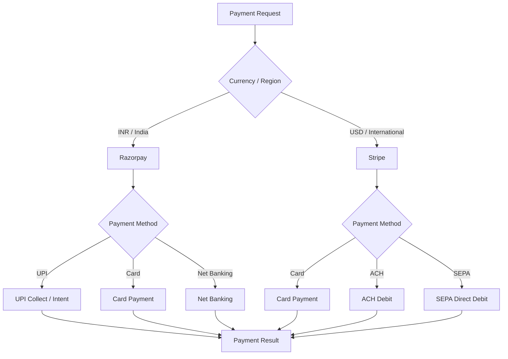
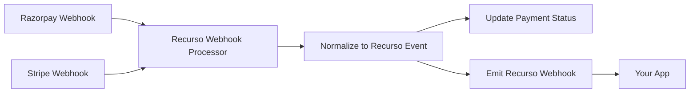

## Overview

Recurso supports multiple payment gateways to collect payments across currencies and regions. Configure Razorpay for INR payments in India (including UPI, cards, and net banking) and Stripe for USD payments internationally (cards, ACH, and SEPA).

<CardGroup cols={2}>
  <Card title="Razorpay" icon="indian-rupee-sign">
    INR payments -- UPI, cards, net banking, wallets, and mandates for recurring billing
  </Card>
  <Card title="Stripe" icon="dollar-sign">
    USD payments -- cards, ACH, SEPA, and automatic card updater for reduced churn
  </Card>
</CardGroup>

## Multi-Gateway Architecture

Recurso routes payments to the appropriate gateway based on currency, customer region, and your configuration rules.



## Configuring Razorpay

### Prerequisites

1. A [Razorpay](https://razorpay.com) account with API access enabled
2. Razorpay Key ID and Key Secret from the Razorpay Dashboard

### Setup

<Steps>
  <Step title="Add Razorpay credentials">
    Configure the following in your Recurso tenant settings or environment:

    ```
    RAZORPAY_KEY_ID=rzp_live_xxxxxxxxxx
    RAZORPAY_KEY_SECRET=xxxxxxxxxxxxxxxx
    ```
  </Step>
  <Step title="Configure webhook endpoint">
    In the Razorpay Dashboard, add a webhook pointing to your Recurso instance:

    ```
    URL: https://api.recurso.dev/webhooks/razorpay
    Events: payment.authorized, payment.captured, payment.failed, refund.created, subscription.charged
    ```
  </Step>
  <Step title="Routing is automatic by currency">
    You don't pick a gateway per subscription — the **smart router** chooses
    it from the invoice currency (INR → Razorpay, others → Stripe by
    default). Subscription create takes no `payment_gateway` field:

    ```bash
    curl -X POST https://api.recurso.dev/v1/subscriptions \
      -H "Authorization: Bearer $API_KEY" -H "Content-Type: application/json" \
      -d '{ "customer_id": "cust_abc123", "plan_id": "plan_pro_inr" }'
    ```

    Override the currency→gateway map at boot with
    `GATEWAY_CURRENCY_OVERRIDES` (e.g. route USD to Razorpay too).
  </Step>
</Steps>

### Razorpay-Specific Features

<AccordionGroup>
  <Accordion title="UPI Payments">
    Razorpay enables UPI collect and UPI intent flows for Indian customers. Recurso supports both:

    - **UPI Collect**: Customer enters their VPA (e.g., `user@upi`) and approves the payment on their UPI app
    - **UPI Intent**: On mobile, opens the customer's UPI app directly for one-tap approval

    UPI is ideal for recurring mandate registration and one-time payments under INR 1,00,000.
  </Accordion>
  <Accordion title="eMandate / Auto-Debit">
    For recurring subscriptions, Razorpay supports eMandate registration via UPI, debit card, or net banking. Once registered, Recurso can auto-debit the customer on each billing cycle without manual intervention.
  </Accordion>
  <Accordion title="Net Banking & Wallets">
    Razorpay supports 50+ Indian banks for net banking and popular wallets like Paytm, PhonePe, and Amazon Pay.
  </Accordion>
</AccordionGroup>

## Configuring Stripe

### Prerequisites

1. A [Stripe](https://stripe.com) account
2. Stripe Publishable Key and Secret Key from the Stripe Dashboard

### Setup

<Steps>
  <Step title="Add Stripe credentials">
    Configure the following in your Recurso tenant settings or environment:

    ```
    STRIPE_PUBLISHABLE_KEY=pk_live_xxxxxxxxxx
    STRIPE_SECRET_KEY=sk_live_xxxxxxxxxx
    ```
  </Step>
  <Step title="Configure webhook endpoint">
    In the Stripe Dashboard, add a webhook endpoint:

    ```
    URL: https://api.recurso.dev/webhooks/stripe
    Events: payment_intent.succeeded, payment_intent.payment_failed, charge.refunded, invoice.payment_succeeded, customer.subscription.updated
    ```
  </Step>
  <Step title="USD routes to Stripe automatically">
    No per-subscription gateway field is needed — a USD invoice routes to
    Stripe by default:

    ```bash
    curl -X POST https://api.recurso.dev/v1/subscriptions \
      -H "Authorization: Bearer $API_KEY" -H "Content-Type: application/json" \
      -d '{ "customer_id": "cust_xyz789", "plan_id": "plan_pro_usd" }'
    ```
  </Step>
</Steps>

### Stripe-Specific Features

<AccordionGroup>
  <Accordion title="Automatic Card Updater">
    Stripe's card network integrations automatically update expired or replaced card numbers, reducing involuntary churn from outdated payment methods.
  </Accordion>
  <Accordion title="3D Secure / SCA">
    Stripe handles Strong Customer Authentication (SCA) requirements for European cards automatically. Recurso passes through the authentication flow seamlessly.
  </Accordion>
  <Accordion title="ACH & SEPA Direct Debit">
    For larger B2B payments, Stripe supports ACH Direct Debit (US) and SEPA Direct Debit (EU) with lower transaction fees than card payments.
  </Accordion>
</AccordionGroup>

### European Local Payment Methods

For Stripe-routed checkouts, Recurso enables localized European payment methods in addition to card, so customers can pay with the method they trust most. The available methods are chosen automatically from the invoice currency when the PaymentIntent is created.

| Invoice currency | Payment methods offered |
|------------------|-------------------------|
| `EUR` | `card`, `sepa_debit`, `ideal`, `bancontact` |
| `USD`, `GBP`, and all others | `card` |

iDEAL (Netherlands), Bancontact (Belgium), and SEPA Direct Debit are euro-only methods, so they are offered only for `EUR` invoices. Every other currency continues to collect with `card` exactly as before (card also carries Apple Pay and Google Pay wallets).

<Warning>
Each localized method must also be **enabled in the Stripe Dashboard** under **Settings -> Payment methods** for your account. If a method is passed to Stripe but not activated in the Dashboard, PaymentIntent creation fails with an "invalid payment method type" error. Enable `card`, `sepa_debit`, `ideal`, and `bancontact` there before going live with EUR billing.
</Warning>

<Info>
**Settlement timing.** Card, iDEAL, and Bancontact confirm within seconds. **SEPA Direct Debit authorizes immediately but funds settle over several business days** — the invoice is only marked **paid** when Stripe delivers the `payment_intent.succeeded` webhook, which fires once settlement completes. Recurso's Stripe webhook handler is payment-method agnostic, so no extra configuration is needed for these asynchronous, redirect-based methods; just ensure your `payment_intent.succeeded` webhook is configured (see above).
</Info>

## Gateway Selection (Smart Routing)

Recurso picks the gateway per **invoice currency** at charge time — you
never set it on the subscription. The default map:

| Invoice currency | Gateway |
|------------------|---------|
| `INR` | Razorpay |
| everything else | Stripe |

```bash
# No gateway field — currency decides. INR → Razorpay, USD → Stripe.
curl -X POST https://api.recurso.dev/v1/subscriptions \
  -H "Authorization: Bearer $API_KEY" \
  -H "Content-Type: application/json" \
  -d '{ "customer_id": "cust_india01", "plan_id": "plan_starter_inr" }'
```

Override the map at boot with the `GATEWAY_CURRENCY_OVERRIDES` env var —
for example, route `USD` to Razorpay if that's where your US entity
settles. Overrides are validated at startup against configured gateways.

## Payment Method Management

The payment instrument is created and stored at the **gateway** during
checkout — Stripe SetupIntent / Razorpay token or UPI mandate — or through
the [customer portal](/portal/self-service). Recurso keeps the display
metadata (brand, last 4, expiry) for the dashboard and dunning emails; see
[Payments → Payment Methods](/core/payments#payment-methods).

### Payment Method Types by Gateway

| Gateway | Method Types | Best For |
|---------|-------------|----------|
| Razorpay | card, UPI, netbanking, wallet, UPI AutoPay mandate | Indian customers, INR billing |
| Stripe | card, ACH debit, SEPA debit, iDEAL, Bancontact | International customers, USD and EUR billing |

### Autopay on your own gateway (BYO)

When you connect your **own** Stripe account, recurring charges run on *that*
account — not the platform's — so the money, the statement descriptor, and the
payout all belong to you. This is automatic once your connection is active:

- **Saving a card** (portal or checkout) creates the Stripe SetupIntent on your
  connected account, and Recurso records which connection saved it.
- **Every off-session charge** for that card — subscription renewal, wallet
  auto-recharge, and dunning retries — is then routed to the **same** account.

A card is only ever chargeable on the gateway that saved it, so Recurso always
charges each saved card on its recorded connection. Cards saved before you
connected (or customers on the platform gateway) keep working unchanged. If a
connection later becomes unavailable, the charge is left for dunning rather than
attempted on the wrong account — it's never silently mischarged.

<Note>
Card autopay routes to your BYO **Stripe** connection. Razorpay recurring uses
UPI AutoPay **mandates** (registered per customer), which already debit on your
connected Razorpay account.
</Note>

## Webhook Handling from Gateways

Recurso receives webhooks from both gateways and normalizes them into a unified event format. You do not need to handle gateway-specific webhook payloads yourself.



### Gateway Webhook to Recurso Event Mapping

| Gateway Event | Recurso Event |
|---------------|---------------|
| Razorpay `payment.captured` | `payment.succeeded` |
| Razorpay `payment.failed` | `payment.failed` |
| Razorpay `refund.created` | `payment.refunded` |
| Stripe `payment_intent.succeeded` | `payment.succeeded` |
| Stripe `payment_intent.payment_failed` | `payment.failed` |
| Stripe `charge.refunded` | `payment.refunded` |

<Info>
Recurso verifies webhook signatures from both Razorpay (using webhook secret) and Stripe (using signing secret) before processing any event. Configure these secrets alongside your API credentials.
</Info>

## Failover Strategies

While Recurso does not automatically fail over between gateways (a Razorpay subscription stays on Razorpay), you can implement retry logic at the application level.

<AccordionGroup>
  <Accordion title="Retry with the same gateway">
    Recurso's built-in dunning system automatically retries failed payments on the same gateway with exponential backoff. Configure retry attempts and intervals in your subscription settings.
  </Accordion>
  <Accordion title="Offer an alternate payment method">
    If a payment method fails, prompt the customer to add a new payment method on the same gateway. Use the customer portal or a custom checkout flow.

    ```typescript
    // After a payment.failed webhook, email the customer a portal magic
    // link so they can re-authorize the mandate / update their card:
    //   POST /portal/auth/request { email }
    await fetch(`${PORTAL_ORIGIN}/portal/auth/request`, {
      method: 'POST',
      headers: { 'Content-Type': 'application/json' },
      body: JSON.stringify({ email: customer.email }),
    });
    ```
  </Accordion>
  <Accordion title="Manual gateway migration">
    For customers switching gateways (e.g., INR to USD billing), cancel the existing subscription with proration and create a new one on the target gateway.
  </Accordion>
</AccordionGroup>

## Gateway Configuration Reference

| Setting | Razorpay | Stripe |
|---------|----------|--------|
| API Key env var | `RAZORPAY_KEY_ID` | `STRIPE_SECRET_KEY` |
| Webhook secret env var | `RAZORPAY_WEBHOOK_SECRET` | `STRIPE_WEBHOOK_SECRET` |
| Supported currencies | INR | USD, EUR, GBP, and 130+ |
| Recurring support | eMandate, auto-debit | Cards, ACH, SEPA |
| Checkout flow | Razorpay Checkout.js | Stripe Elements / Checkout |

## Best Practices

<CardGroup cols={2}>
  <Card title="Match Gateway to Currency" icon="coins">
    Use Razorpay for INR and Stripe for USD to get the best payment success rates and lowest fees
  </Card>
  <Card title="Verify Webhook Secrets" icon="shield-check">
    Always configure webhook signing secrets for both gateways to prevent spoofed payment events
  </Card>
  <Card title="Store Gateway on Subscription" icon="link">
    Let Recurso manage the gateway-to-subscription mapping rather than routing payments yourself
  </Card>
  <Card title="Monitor Payment Success Rates" icon="chart-simple">
    Use Recurso analytics to track payment success rates per gateway and optimize your checkout flow
  </Card>
</CardGroup>

<Warning>
Never expose your gateway secret keys (`RAZORPAY_KEY_SECRET`, `STRIPE_SECRET_KEY`) in client-side code or API responses. Use server-side calls only for payment operations.
</Warning>

## GoCardless & Adyen (experimental)

Two additional gateways ship as **experimental** (API-verified against
their documented request shapes; sandbox certification in progress):

- **GoCardless** — mandate-first bank debit (SEPA, BACS, ACH): the
  European/UK analog of UPI AutoPay. Configure
  `GOCARDLESS_ACCESS_TOKEN` (+ `GOCARDLESS_ENV=sandbox` for testing).
- **Adyen** — global card & wallet processing via Checkout Sessions, with
  off-session charges on stored payment methods. Configure
  `ADYEN_API_KEY`, `ADYEN_MERCHANT_ACCOUNT` (+ `ADYEN_ENV=test`, or
  `ADYEN_LIVE_URL_PREFIX` for live).

Route currencies to them explicitly — the built-in INR→Razorpay /
default→Stripe rule is unchanged unless you say otherwise:

```bash
GATEWAY_CURRENCY_OVERRIDES="EUR=gocardless,GBP=gocardless,SGD=adyen"
```

Overrides are validated at boot: naming an unconfigured gateway refuses to
start rather than misrouting a charge later.
