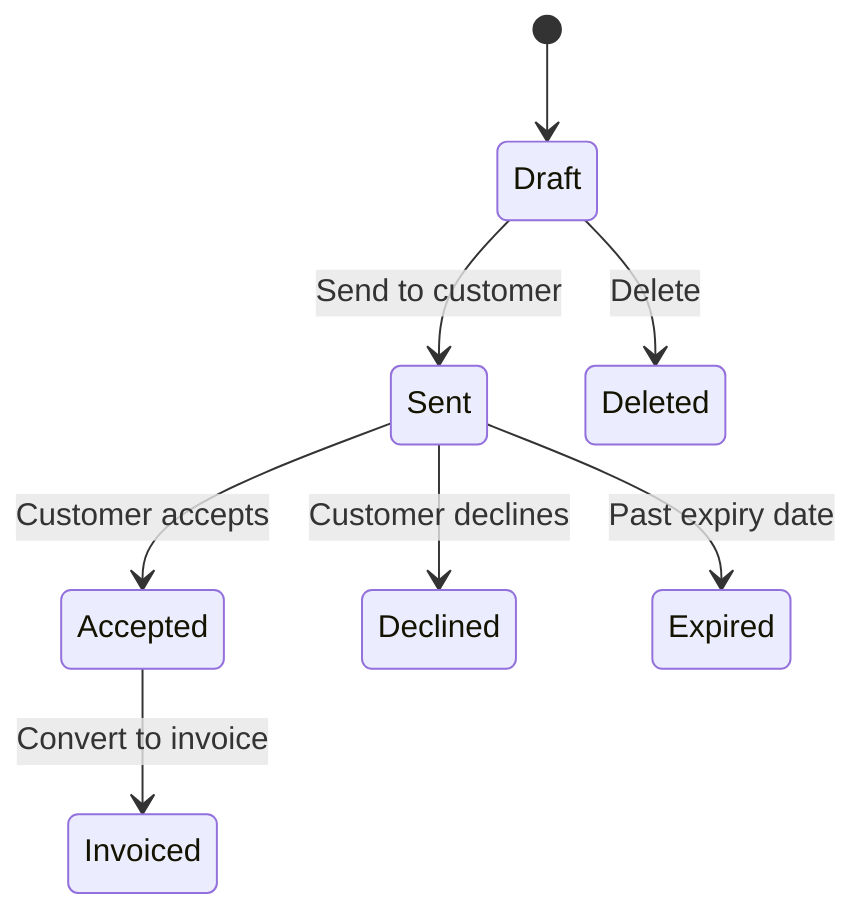

## Overview

Quotes let you create proposals for enterprise customers before committing to a subscription. Once accepted, quotes convert to invoices or subscriptions.

## Create a Quote

```typescript
const quote = await recurso.quotes.create({
  customer_id: 'cust_abc',
  expires_at: '2024-02-15',
  line_items: [
    {
      description: 'Enterprise Plan - Annual',
      quantity: 1,
      unit_amount: 99999
    },
    {
      description: 'Priority Support Add-on',
      quantity: 1,
      unit_amount: 24999
    },
    {
      description: 'Custom Integration',
      quantity: 10,
      unit_amount: 5000  // 10 hours × ₹5000
    }
  ],
  notes: 'Valid for 30 days. Includes dedicated account manager.',
  terms: 'Payment due within 15 days of acceptance.'
});
```

## Quote Lifecycle



| Status | Description |
|--------|-------------|
| `draft` | Being composed |
| `sent` | Sent to customer |
| `accepted` | Customer accepted |
| `declined` | Customer declined |
| `expired` | Past expiration date |
| `invoiced` | Converted to invoice |

## Send to Customer

```typescript
await recurso.quotes.send('quote_xyz');

// Sends email to customer with:
// - PDF attachment
// - Accept/Decline buttons
// - Expiration reminder
```

## Accept Quote (Customer)

Via customer portal or API:

```typescript
await recurso.quotes.accept('quote_xyz');
```

## Convert to Invoice

After acceptance, convert to an invoice:

```typescript
const invoice = await recurso.quotes.convertToInvoice('quote_xyz');

// or convert to subscription
const subscription = await recurso.quotes.convertToSubscription('quote_xyz', {
  plan_id: 'plan_enterprise'
});
```

## Apply Discounts

```typescript
const quote = await recurso.quotes.create({
  customer_id: 'cust_abc',
  line_items: [...],
  discounts: [
    {
      type: 'percentage',
      value: 10,
      description: 'Annual commitment discount'
    }
  ]
});
```

## Download PDF

```typescript
const pdf = await recurso.quotes.pdf('quote_xyz');

// Professional PDF with:
// - Your company branding
// - Line items table
// - Terms and conditions
// - Signature field
```

## Update a Quote

Only draft quotes can be updated:

```typescript
await recurso.quotes.update('quote_xyz', {
  line_items: [...]  // Replace line items
});
```

## List Quotes

```typescript
const quotes = await recurso.quotes.list({
  customer_id: 'cust_abc',
  status: 'sent',
  limit: 20
});
```

## Webhooks

| Event | Description |
|-------|-------------|
| `quote.created` | New quote created |
| `quote.sent` | Quote sent to customer |
| `quote.accepted` | Customer accepted |
| `quote.declined` | Customer declined |
| `quote.expired` | Quote passed expiry |
