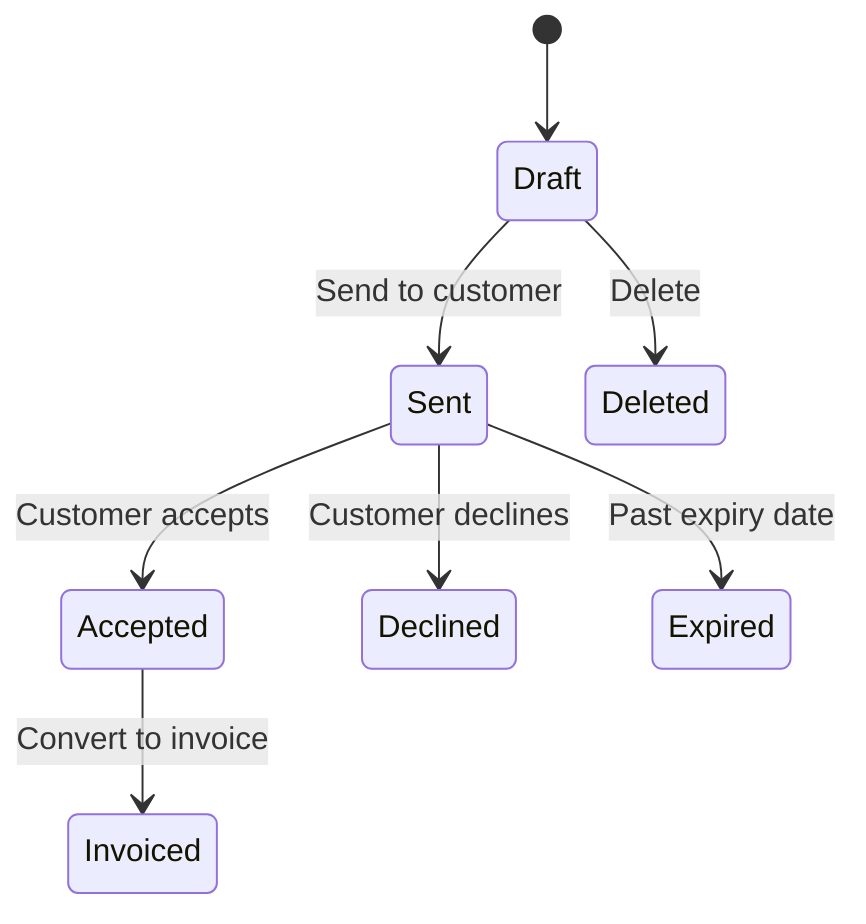

## Overview

Quotes let you create proposals for enterprise customers before committing to a subscription. Once accepted, quotes convert to invoices or subscriptions.

## Create a Quote

```typescript
const quote = await recurso.quotes.create({
  customer_id: 'cust_abc',
  expires_at: '2024-02-15',
  line_items: [
    {
      description: 'Enterprise Plan - Annual',
      quantity: 1,
      unit_amount: 99999
    },
    {
      description: 'Priority Support Add-on',
      quantity: 1,
      unit_amount: 24999
    },
    {
      description: 'Custom Integration',
      quantity: 10,
      unit_amount: 5000  // 10 hours × ₹5000
    }
  ],
  notes: 'Valid for 30 days. Includes dedicated account manager.',
  terms: 'Payment due within 15 days of acceptance.'
});
```

## Quote Lifecycle


```mermaid
stateDiagram-v2
    [*] --> Draft
    Draft --> Sent: Send to customer
    Sent --> Accepted: Customer accepts
    Sent --> Declined: Customer declines
    Sent --> Expired: Past expiry date
    Accepted --> Invoiced: Convert to invoice
    Draft --> Deleted: Delete
```

| Status | Description |
|--------|-------------|
| `draft` | Being composed |
| `sent` | Sent to customer |
| `accepted` | Customer accepted |
| `declined` | Customer declined |
| `expired` | Past expiration date |
| `invoiced` | Converted to invoice |

## Send to Customer

```typescript
await recurso.quotes.send('quote_xyz');

// Sends email to customer with:
// - PDF attachment
// - Accept/Decline buttons
// - Expiration reminder
```

## Accept Quote (Customer)

Via customer portal or API:

```typescript
await recurso.quotes.accept('quote_xyz');
```

## Decline Quote

When a customer declines, the quote is marked as declined and cannot be modified or re-sent:

<CodeGroup>
```typescript TypeScript
await recurso.quotes.decline('quote_xyz');
```

```bash cURL
curl -X POST https://api.recurso.dev/v1/quotes/quote_xyz/decline \
  -H "Authorization: Bearer $API_KEY"
```
</CodeGroup>

<Tip>
If a customer declines, create a new quote with revised terms rather than trying to re-use the declined one.
</Tip>

## Convert to Invoice

After acceptance, convert to an invoice:

```typescript
const invoice = await recurso.quotes.convertToInvoice('quote_xyz');

// or convert to subscription
const subscription = await recurso.quotes.convertToSubscription('quote_xyz', {
  plan_id: 'plan_enterprise'
});
```

## Apply Discounts

```typescript
const quote = await recurso.quotes.create({
  customer_id: 'cust_abc',
  line_items: [...],
  discounts: [
    {
      type: 'percentage',
      value: 10,
      description: 'Annual commitment discount'
    }
  ]
});
```

## Download PDF

```typescript
const pdf = await recurso.quotes.pdf('quote_xyz');

// Professional PDF with:
// - Your company branding
// - Line items table
// - Terms and conditions
// - Signature field
```

## Update a Quote

Only draft quotes can be updated. Once a quote has been sent, create a new one instead.

<CodeGroup>
```typescript TypeScript
await recurso.quotes.update('quote_xyz', {
  line_items: [
    {
      description: 'Enterprise Plan - Annual',
      quantity: 1,
      unit_amount: 89999  // Revised price
    }
  ],
  expires_at: '2024-03-01',  // Extend expiration
  notes: 'Updated pricing per discussion on Feb 1.'
});
```

```bash cURL
curl -X PUT https://api.recurso.dev/v1/quotes/quote_xyz \
  -H "Authorization: Bearer $API_KEY" \
  -H "Content-Type: application/json" \
  -d '{
    "line_items": [
      {
        "description": "Enterprise Plan - Annual",
        "quantity": 1,
        "unit_amount": 89999
      }
    ],
    "expires_at": "2024-03-01"
  }'
```
</CodeGroup>

## Delete a Draft Quote

Remove a draft quote that is no longer needed:

<CodeGroup>
```typescript TypeScript
await recurso.quotes.delete('quote_xyz');
```

```bash cURL
curl -X DELETE https://api.recurso.dev/v1/quotes/quote_xyz \
  -H "Authorization: Bearer $API_KEY"
```
</CodeGroup>

<Warning>
Only draft quotes can be deleted. Sent, accepted, or declined quotes are retained for audit purposes.
</Warning>

## Quote Expiration

When a quote passes its `expires_at` date:
- The status automatically changes to `expired`
- The customer can no longer accept it via the portal or API
- A `quote.expired` webhook is fired

To handle expiration proactively, set up a webhook listener:

```typescript
// In your webhook handler
case 'quote.expired':
  const quoteId = req.body.data.id;
  // Notify sales team to follow up
  // Optionally create a new quote with updated terms
  break;
```

## List Quotes

```typescript
const quotes = await recurso.quotes.list({
  customer_id: 'cust_abc',
  status: 'sent',
  limit: 20
});
```

### Filter Parameters

| Parameter | Type | Description |
|-----------|------|-------------|
| `customer_id` | `string` | Filter by customer |
| `status` | `string` | Filter by status (`draft`, `sent`, `accepted`, `declined`, `expired`) |
| `limit` | `integer` | Results per page (default 20) |
| `offset` | `integer` | Number of results to skip |

## Webhooks

| Event | Description |
|-------|-------------|
| `quote.created` | New quote created |
| `quote.sent` | Quote sent to customer |
| `quote.accepted` | Customer accepted |
| `quote.declined` | Customer declined |
| `quote.expired` | Quote passed expiry |
