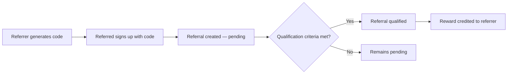
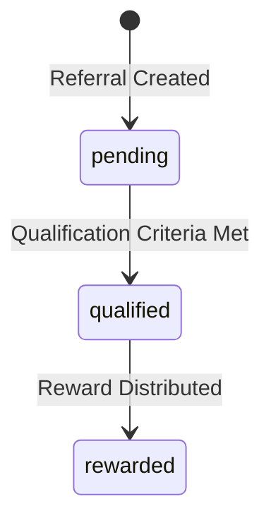

## Overview

Recurso's referral system lets you incentivize existing customers to bring in new users. The platform handles the full lifecycle from code generation to reward payout:

- **Code generation** -- unique, shareable referral codes per customer
- **Referral tracking** -- link referrers to referred customers automatically
- **Qualification rules** -- mark referrals as qualified once conditions are met
- **Reward distribution** -- credit the referrer's account after qualification



## Referral Object

| Field | Type | Description |
|-------|------|-------------|
| `id` | `string` | Unique referral ID (prefixed `ref_`) |
| `tenant_id` | `string` | Your tenant identifier |
| `referrer_id` | `UUID` | Customer ID of the referrer |
| `referred_id` | `UUID` | Customer ID of the referred user |
| `code` | `string` | Referral code used |
| `status` | `string` | `pending`, `qualified`, or `rewarded` |
| `reward_amount` | `integer` | Reward in smallest currency unit (e.g., cents) |
| `currency` | `string` | ISO 4217 currency code |
| `created_at` | `datetime` | When the referral was created |
| `updated_at` | `datetime` | Last update timestamp |
| `qualified_at` | `datetime` | When the referral was qualified (nullable) |

## Referral Statuses



| Status | Description |
|--------|-------------|
| `pending` | Referral recorded but qualification criteria not yet met |
| `qualified` | Referred customer met the required conditions (e.g., first payment) |
| `rewarded` | Reward has been credited to the referrer's account |

## Generate a Referral Code

Each customer can have a unique referral code. Use the generate-code endpoint to create one.

<CodeGroup>
```typescript TypeScript
const result = await recurso.referrals.generateCode({
  customer_id: 'cust_abc123'
});

console.log(result.code); // "RECURSO-X7K9M2"
```

```bash cURL
curl -X POST https://billing.example.com/v1/referrals/generate-code \
  -H "Authorization: Bearer $API_KEY" \
  -H "Content-Type: application/json" \
  -d '{
    "customer_id": "cust_abc123"
  }'
```
</CodeGroup>

<Tip>
Share the generated code via email, in-app banners, or your customer portal. Codes are unique per customer and reusable across multiple referrals.
</Tip>

## Create a Referral

When a referred customer signs up using a referral code, create the referral record to link both parties.

<CodeGroup>
```typescript TypeScript
const referral = await recurso.referrals.create({
  referrer_id: 'cust_abc123',
  referred_id: 'cust_def456',
  reward_amount: 500,   // $5.00 in cents
  currency: 'USD'
});
```

```bash cURL
curl -X POST https://billing.example.com/v1/referrals \
  -H "Authorization: Bearer $API_KEY" \
  -H "Content-Type: application/json" \
  -d '{
    "referrer_id": "cust_abc123",
    "referred_id": "cust_def456",
    "reward_amount": 500,
    "currency": "USD"
  }'
```
</CodeGroup>

### Default Values

| Parameter | Default | Notes |
|-----------|---------|-------|
| `reward_amount` | `500` | 500 cents = $5.00 |
| `currency` | `USD` | Any ISO 4217 currency supported |

<Warning>
Two validation rules are enforced on creation:
- **Self-referral** (`ErrSelfReferral`): A customer cannot refer themselves. `referrer_id` and `referred_id` must differ.
- **Duplicate referral** (`ErrAlreadyReferred`): A customer can only be referred once. If `referred_id` already has a referral on file, the request is rejected.
</Warning>

## Qualify a Referral

Once the referred customer meets your qualification criteria (e.g., completes their first payment, remains active for 30 days), mark the referral as qualified.

<CodeGroup>
```typescript TypeScript
const qualified = await recurso.referrals.qualify('ref_r8n2v4');

console.log(qualified.status);       // "qualified"
console.log(qualified.qualified_at); // "2026-06-23T14:30:00Z"
```

```bash cURL
curl -X POST https://billing.example.com/v1/referrals/ref_r8n2v4/qualify \
  -H "Authorization: Bearer $API_KEY"
```
</CodeGroup>

<Info>
Qualification is a one-way transition. Once a referral is qualified, it cannot revert to `pending`. The `qualified_at` timestamp is set automatically by the server.
</Info>

## List Referrals

Retrieve all referrals with pagination support.

<CodeGroup>
```typescript TypeScript
const referrals = await recurso.referrals.list({
  page: 1,
  per_page: 25
});

// Returns
// {
//   data: [ { id: 'ref_r8n2v4', status: 'qualified', ... }, ... ],
//   page: 1,
//   per_page: 25,
//   total: 142
// }
```

```bash cURL
curl -G https://billing.example.com/v1/referrals \
  -H "Authorization: Bearer $API_KEY" \
  -d page=1 \
  -d per_page=25
```
</CodeGroup>

### Pagination Parameters

| Parameter | Type | Default | Description |
|-----------|------|---------|-------------|
| `page` | `integer` | `1` | Page number |
| `per_page` | `integer` | `20` | Results per page (max 100) |

## Reward Distribution

After a referral moves to `qualified`, Recurso automatically credits the referrer. The reward is applied as account credit on the referrer's next invoice.

```typescript
// Check referral reward details
const referral = await recurso.referrals.get('ref_r8n2v4');

console.log(referral.reward_amount); // 500
console.log(referral.currency);      // "USD"
console.log(referral.status);        // "rewarded"
```

The reward lifecycle:

1. Referral is **qualified** via the `/qualify` endpoint
2. Recurso creates an account credit for the referrer
3. The referral status transitions to **rewarded**
4. Credit is automatically applied on the referrer's next invoice

## Webhooks

Subscribe to referral events to trigger downstream actions like email notifications or analytics updates.

| Event | Description |
|-------|-------------|
| `referral.created` | A new referral was recorded |
| `referral.qualified` | Referral met qualification criteria |
| `referral.rewarded` | Reward was credited to the referrer |

### Example Webhook Payload

```json
{
  "event": "referral.qualified",
  "data": {
    "id": "ref_r8n2v4",
    "referrer_id": "cust_abc123",
    "referred_id": "cust_def456",
    "code": "RECURSO-X7K9M2",
    "status": "qualified",
    "reward_amount": 500,
    "currency": "USD",
    "qualified_at": "2026-06-23T14:30:00Z"
  }
}
```

## Use Cases

<CardGroup cols={2}>
  <Card title="Double-Sided Rewards" icon="gift">
    Give both the referrer and the referred customer a discount. Create a coupon for the referred user and use the referral reward for the referrer.
  </Card>
  <Card title="Tiered Programs" icon="layer-group">
    Increase reward amounts based on referral count. After 5 successful referrals, bump the reward from $5 to $10.
  </Card>
  <Card title="Partner Programs" icon="handshake">
    Use referral codes for affiliate and partner tracking with custom reward amounts per partner.
  </Card>
  <Card title="Growth Campaigns" icon="chart-line">
    Run time-limited referral campaigns with boosted rewards during launch periods.
  </Card>
</CardGroup>

## Best Practices

<AccordionGroup>
  <Accordion title="Automate qualification with webhooks">
    Listen for `subscription.activated` or `payment.succeeded` events and automatically call the `/qualify` endpoint when the referred customer completes their first payment. This removes manual intervention from the reward flow.
  </Accordion>
  <Accordion title="Set sensible reward amounts">
    Keep reward amounts proportional to your customer acquisition cost. A $5-$10 credit works well for most SaaS products. For high-value plans, consider percentage-based rewards instead.
  </Accordion>
  <Accordion title="Prevent abuse">
    Recurso blocks self-referrals and duplicate referrals at the API level. Additionally, consider rate-limiting code generation and monitoring for unusual patterns like bulk signups from the same IP.
  </Accordion>
  <Accordion title="Communicate clearly with customers">
    Send email notifications at each stage -- when a code is generated, when someone signs up with their code, and when the reward is credited. Use the webhook events to trigger these emails.
  </Accordion>
  <Accordion title="Track referral performance">
    Use the list endpoint with pagination to build dashboards showing referral conversion rates, top referrers, and total rewards distributed. Export this data periodically for business reviews.
  </Accordion>
</AccordionGroup>
