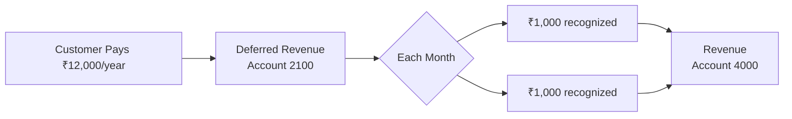
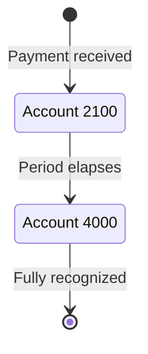

## Overview

Revenue recognition determines when earned income is recorded on your books. For SaaS businesses, you cannot recognize the full value of an annual subscription upfront — it must be spread across the service period. Recurso automates this process using its built-in double-entry ledger.



### Why This Matters

- **ASC 606 / IFRS 15 compliance** — Public and venture-backed companies must follow these standards.
- **Accurate financials** — Revenue is matched to the period in which service is delivered.
- **Investor-ready reporting** — Monthly Recurring Revenue (MRR) and Annual Recurring Revenue (ARR) reflect true earned revenue.
- **Audit readiness** — Every recognition event produces a traceable journal entry.

## ASC 606 Five-Step Model

Recurso implements the core ASC 606 framework automatically:

<Steps>
  <Step title="Identify the Contract">
    A subscription is created between a customer and your business. The subscription object (`sub_`) serves as the contract.
  </Step>
  <Step title="Identify Performance Obligations">
    Each billing period represents a distinct performance obligation — the promise to provide service for that period.
  </Step>
  <Step title="Determine Transaction Price">
    The plan price, adjusted for any coupons or discounts, determines the transaction price. This is stored on the invoice (`inv_`).
  </Step>
  <Step title="Allocate to Performance Obligations">
    For monthly subscriptions, the full invoice amount maps to one period. For annual subscriptions, the amount is divided equally across 12 months.
  </Step>
  <Step title="Recognize Revenue Over Time">
    Recurso creates scheduled journal entries that move amounts from Deferred Revenue (account `2100`) to Revenue (account `4000`) as each period completes.
  </Step>
</Steps>

## How Recurso Handles Revenue Schedules

When a subscription invoice is paid, Recurso creates a revenue recognition schedule based on the subscription interval and the amount paid.

### Monthly Subscription

For a monthly plan at ₹4,999/month, revenue is recognized immediately at the end of the billing period because the service period matches the billing period:

```
On payment (Jan 1):
  Debit   1000 (Cash)               ₹4,999.00
  Credit  1100 (Accounts Receivable) ₹4,999.00

On period end (Jan 31):
  Debit   2100 (Deferred Revenue)    ₹4,999.00
  Credit  4000 (Revenue)             ₹4,999.00
```

### Annual Subscription

For an annual plan at ₹49,990/year (equivalent to ₹4,165.83/month), revenue is recognized in 12 equal installments:

```
On payment (Jan 1):
  Debit   1000 (Cash)               ₹49,990.00
  Credit  2100 (Deferred Revenue)   ₹49,990.00

End of January:
  Debit   2100 (Deferred Revenue)    ₹4,165.83
  Credit  4000 (Revenue)             ₹4,165.83

End of February:
  Debit   2100 (Deferred Revenue)    ₹4,165.83
  Credit  4000 (Revenue)             ₹4,165.83

... (repeated each month through December)

End of December:
  Debit   2100 (Deferred Revenue)    ₹4,165.87
  Credit  4000 (Revenue)             ₹4,165.87
```

<Info>
The final month absorbs any rounding difference to ensure the schedule totals exactly match the original payment amount. In the example above, the last installment is ₹4,165.87 instead of ₹4,165.83 to account for the 4-cent remainder.
</Info>

### Quarterly Subscription

For a quarterly plan at ₹13,499/quarter, revenue is recognized over 3 months:

```
On payment (Jan 1):
  Debit   1000 (Cash)               ₹13,499.00
  Credit  2100 (Deferred Revenue)   ₹13,499.00

End of January:
  Debit   2100 (Deferred Revenue)    ₹4,499.67
  Credit  4000 (Revenue)             ₹4,499.67

End of February:
  Debit   2100 (Deferred Revenue)    ₹4,499.67
  Credit  4000 (Revenue)             ₹4,499.67

End of March:
  Debit   2100 (Deferred Revenue)    ₹4,499.66
  Credit  4000 (Revenue)             ₹4,499.66
```

## Key Accounts

Revenue recognition uses two primary ledger accounts:

| Account | Code | Type | Role |
|---------|------|------|------|
| Deferred Revenue | `2100` | `liability` | Holds prepaid amounts until the service period elapses |
| Revenue | `4000` | `revenue` | Records income as it is earned |

The flow is always the same: money enters Deferred Revenue when collected, then moves to Revenue as the obligation is fulfilled.



## Revenue Recognition Report

The `GET /v1/finance/revrec/report` endpoint provides a consolidated revenue recognition report for a given period. It returns both recognized and deferred amounts, broken down by subscription.

<CodeGroup>
```typescript TypeScript
const report = await recurso.finance.revrecReport({
  start_date: '2026-01-01',
  end_date: '2026-06-30'
});

// Response
{
  data: {
    start_date: '2026-01-01',
    end_date: '2026-06-30',
    total_recognized_amount: 28500000,  // Revenue earned in this period
    total_deferred_amount: 14200000,    // Revenue still deferred at period end
    currency: 'INR',
    subscriptions: [
      {
        subscription_id: 'sub_xyz',
        customer_id: 'cust_abc',
        recognized_amount: 2499500,   // Amount recognized during period
        deferred_amount: 2499500,     // Amount still deferred at period end
        schedule_start: '2026-01-01',
        schedule_end: '2026-12-31'
      }
      // ... one entry per subscription with activity in the period
    ]
  }
}
```

```bash cURL
curl -G https://billing.example.com/v1/finance/revrec/report \
  -H "Authorization: Bearer $API_KEY" \
  -d start_date=2026-01-01 \
  -d end_date=2026-06-30
```
</CodeGroup>

### Report Fields

| Field | Description |
|-------|-------------|
| `recognized_amount` | Revenue that has been earned and moved from Deferred Revenue (2100) to Revenue (4000) during the period |
| `deferred_amount` | Revenue collected but not yet earned — still sitting in Deferred Revenue (2100) at the end of the period |
| `total_recognized_amount` | Sum of `recognized_amount` across all subscriptions |
| `total_deferred_amount` | Sum of `deferred_amount` across all subscriptions |

## Querying Revenue Data

Use the ledger API to retrieve recognition entries for reporting.

### Deferred Revenue Balance

<CodeGroup>
```typescript TypeScript
const accounts = await recurso.ledger.accounts.list();
const deferred = accounts.data.find(a => a.code === "2100");

console.log(`Deferred Revenue: ${deferred.currency} ${deferred.balance / 100}`);
// Deferred Revenue: INR 124975.00
```

```bash cURL
curl https://billing.example.com/v1/ledger/accounts \
  -H "Authorization: Bearer $API_KEY"

# Filter for account code 2100 in the response
```
</CodeGroup>

### Monthly Recognition Entries

<CodeGroup>
```typescript TypeScript
const entries = await recurso.ledger.entries.list({
  account_id: "lacc_rev4000",
  start_date: "2025-06-01",
  end_date: "2025-06-30"
});

// Each entry represents revenue recognized for a subscription period
entries.data.forEach(entry => {
  console.log(
    `${entry.created_at}: ${entry.entries[0].amount / 100} ${entry.entries[0].currency}` +
    ` — ${entry.description}`
  );
});
```

```bash cURL
curl "https://billing.example.com/v1/ledger/entries?account_id=lacc_rev4000&start_date=2025-06-01&end_date=2025-06-30" \
  -H "Authorization: Bearer $API_KEY"
```
</CodeGroup>

## Handling Edge Cases

<AccordionGroup>
  <Accordion title="Mid-cycle cancellations">
    When a subscription is cancelled mid-period, any remaining deferred revenue for future months is reversed:

    ```
    Debit   2100 (Deferred Revenue)    ₹33,327.00  (8 remaining months)
    Credit  1000 (Cash)                ₹33,327.00  (refund issued)
    ```

    If no refund is issued (cancel at end of period), the remaining deferred revenue is recognized as earned at the cancellation date per your refund policy.
  </Accordion>

  <Accordion title="Plan upgrades and downgrades">
    When a customer changes plans mid-cycle, Recurso:

    1. Reverses remaining deferred revenue from the old plan
    2. Creates a new deferred revenue entry for the prorated new plan amount
    3. Adjusts the recognition schedule going forward

    This ensures revenue reflects the actual service delivered at each price point.
  </Accordion>

  <Accordion title="Refunds">
    Refunds create a reversal entry that reduces both Cash and Revenue (or Deferred Revenue if the period has not yet been recognized):

    ```
    Debit   5000 (Refunds)             ₹4,999.00
    Credit  1000 (Cash)                ₹4,999.00
    ```
  </Accordion>

  <Accordion title="Discounts and coupons">
    Discounts reduce the transaction price before the recognition schedule is created. A ₹49,990 annual plan with a 20% discount creates a schedule based on ₹39,992 spread across 12 months. The discount itself is recorded as:

    ```
    Debit   5100 (Discounts)           ₹9,998.00
    Credit  1100 (Accounts Receivable) ₹9,998.00
    ```
  </Accordion>

  <Accordion title="Free trials">
    During a free trial, no revenue is deferred or recognized. Revenue recognition begins only when the first paid invoice is generated after the trial ends.
  </Accordion>
</AccordionGroup>

## Webhook Events

Subscribe to these events for revenue tracking:

| Event | Description |
|-------|-------------|
| `ledger.entry.created` | Fires for every journal entry, including recognition entries |
| `invoice.paid` | Indicates a new recognition schedule has been created |
| `subscription.cancelled` | May trigger deferred revenue reversal |

## Building Revenue Reports

### Monthly Recognized Revenue

Query ledger entries for account `4000` (Revenue) within a date range to calculate recognized revenue for any period:

```typescript
async function getMonthlyRevenue(year: number, month: number) {
  const startDate = `${year}-${String(month).padStart(2, '0')}-01`;
  const endDate = new Date(year, month, 0).toISOString().split('T')[0];

  const entries = await recurso.ledger.entries.list({
    account_id: "lacc_rev4000",
    start_date: startDate,
    end_date: endDate
  });

  const totalRecognized = entries.data.reduce((sum, txn) => {
    return sum + txn.entries
      .filter(e => e.credit_account_id === "lacc_rev4000")
      .reduce((s, e) => s + e.amount, 0);
  }, 0);

  return totalRecognized; // in minor units
}
```

### Deferred Revenue Waterfall

Track how deferred revenue unwinds over time by querying account `2100` balance at the end of each month. This creates a waterfall chart showing your future revenue obligations.

## Best Practices

<CardGroup cols={2}>
  <Card title="Match Billing to Service" icon="calendar">
    Choose billing intervals that align with how you deliver value. Monthly billing is simplest for recognition.
  </Card>
  <Card title="Reconcile Monthly" icon="scale-balanced">
    Verify that Deferred Revenue + Recognized Revenue equals total cash collected for each cohort of subscriptions.
  </Card>
  <Card title="Automate Reporting" icon="chart-line">
    Use the ledger API and revrec report endpoint to build automated revenue reports rather than manual spreadsheets.
  </Card>
  <Card title="Plan for Audits" icon="magnifying-glass">
    Keep ledger entries immutable and use reference IDs to trace every recognition entry back to its source invoice and subscription.
  </Card>
</CardGroup>

<Warning>
Revenue recognition rules vary by jurisdiction and business model. While Recurso automates the mechanical process, consult your accountant or auditor to confirm the recognition policies match your specific requirements.
</Warning>
