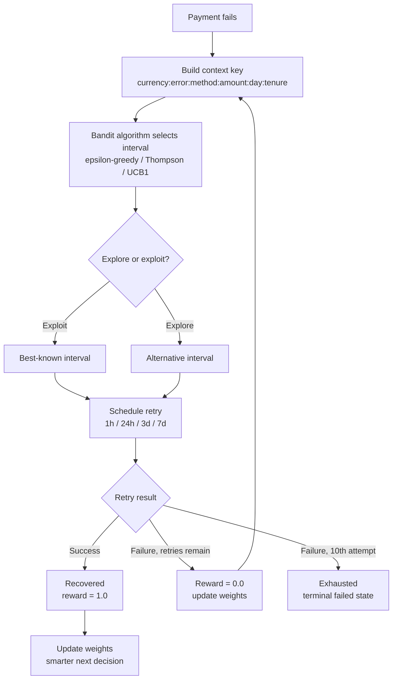
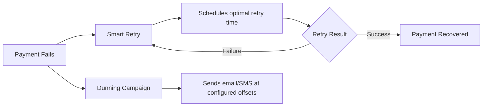

## Overview

Smart Retry uses **reinforcement learning** to optimize when failed payments are retried. Instead of using static retry schedules, Recurso learns from every payment attempt to find the optimal retry timing for each customer context.

Traditional dunning retries payments on fixed intervals regardless of context. Smart Retry considers:

- **Payment method** (card, UPI, bank transfer)
- **Failure reason** (insufficient funds, expired card, network error)
- **Invoice amount** (small, medium, large, enterprise)
- **Customer tenure** (new, established, veteran)
- **Day of week** and **currency**

<Info>
Smart Retry works alongside [Dunning Campaigns](/advanced/dunning-campaigns) to handle the retry timing, while campaigns manage customer communication.
</Info>

## How It Works



## Bandit Algorithms

Smart Retry implements three multi-armed bandit algorithms. Each treats retry intervals as "arms" and learns which interval works best for a given context.

### Algorithm Comparison

| Algorithm | Strategy | Best For |
|-----------|----------|----------|
| `epsilon_greedy` | Exploits best action most of the time, explores randomly with probability epsilon | General use (default) |
| `thompson_sampling` | Samples from probability distributions to balance explore/exploit | High-volume merchants with diverse payment methods |
| `ucb1` | Picks the action with highest upper confidence bound | Low-volume merchants needing faster convergence |

### Epsilon-Greedy (Default)

The default algorithm uses epsilon-greedy with a decaying exploration rate:

- **Base epsilon**: 0.1 (10% exploration)
- **Decay formula**: `epsilon / (1 + 0.001 * totalDecisions)`
- Early on, the system explores more; as it gathers data, it increasingly exploits the best-known strategy

<Tip>
Epsilon-greedy is the recommended starting algorithm. It balances exploration and exploitation well for most payment volumes.
</Tip>

### Thompson Sampling

Uses Bayesian probability distributions to model uncertainty. Actions with less data have wider distributions, naturally encouraging exploration where knowledge is limited.

### UCB1 (Upper Confidence Bound)

Selects the action with the highest upper confidence bound, calculated as:

```
UCB = AverageReward + sqrt(2 * ln(totalTrials) / actionTrials)
```

Actions tried fewer times get a larger confidence bonus, ensuring underexplored intervals are tested.

## Context Keys

Every retry decision is made within a context. The context key captures the relevant dimensions of a payment situation:

```
currency:error_code:payment_method:amount_bucket:day_of_week:customer_age
```

### Context Dimensions

| Dimension | Values | Description |
|-----------|--------|-------------|
| `currency` | `USD`, `INR`, `EUR`, etc. | Payment currency |
| `error_code` | `insufficient_funds`, `expired_card`, `network_error`, etc. | Reason for failure |
| `payment_method` | `card`, `upi`, `bank_transfer` | Customer's payment method |
| `amount_bucket` | `small`, `medium`, `large`, `enterprise` | Invoice amount range |
| `day_of_week` | `0`-`6` | Day payment failed (0 = Sunday) |
| `customer_age` | `new`, `established`, `veteran` | Customer tenure |

### Amount Buckets

| Bucket | Range |
|--------|-------|
| `small` | Less than $10 |
| `medium` | $10 - $100 |
| `large` | $100 - $1,000 |
| `enterprise` | Over $1,000 |

### Customer Age Categories

| Category | Criteria |
|----------|----------|
| `new` | Less than 30 days |
| `established` | 30 days to 1 year |
| `veteran` | Over 1 year |

**Example context key:**

```
USD:insufficient_funds:card:medium:3:established
```

This represents a failed card payment in USD for a medium-sized invoice ($10-$100), on a Wednesday, from an established customer, due to insufficient funds.

## Retry Actions

Smart Retry selects from four possible retry intervals (dunning actions):

| Action ID | Retry Interval | Typical Use Case |
|-----------|----------------|------------------|
| `1` | 1 hour | Transient failures, network errors |
| `2` | 24 hours | Insufficient funds (next-day payroll) |
| `3` | 3 days | Give customer time to resolve issues |
| `4` | 7 days | Last-resort retries, large invoices |

<Warning>
Each invoice is limited to a maximum of **10 retry attempts**. After 10 failed retries, the invoice transitions to a terminal failed state and requires manual intervention.
</Warning>

## Outcome Tracking

Every retry outcome is recorded and used to update the algorithm's weights.

### Weight Updates

Weights are updated using an incremental averaging formula:

```
NewAverage = OldAverage + (Reward - OldAverage) / NewSampleCount
```

- **Reward = 1.0** for successful payment
- **Reward = 0.0** for failed payment

Each weight record tracks:

| Field | Description |
|-------|-------------|
| `context_key` | The context dimensions for this weight |
| `action_id` | Which retry interval this weight applies to |
| `average_reward` | Success rate (0.0 to 1.0) |
| `sample_count` | Number of observations |

<Info>
Weights are cached with a **5-minute TTL** for performance. Changes from recent outcomes may take up to 5 minutes to influence new retry decisions.
</Info>

## API Reference

### View Dunning Overview

Retrieve high-level analytics for your smart retry performance.

<CodeGroup>
```typescript TypeScript
const overview = await recurso.analytics.dunning.overview();

// Returns
{
  total_retries: 12450,
  successful_retries: 8715,
  recovery_rate: 0.70,
  avg_retries_to_recover: 2.3,
  by_algorithm: {
    epsilon_greedy: { attempts: 10200, recovery_rate: 0.71 },
    thompson_sampling: { attempts: 1850, recovery_rate: 0.68 },
    ucb1: { attempts: 400, recovery_rate: 0.65 }
  }
}
```

```bash cURL
curl -X GET https://api.recurso.dev/v1/analytics/dunning/overview \
  -H "Authorization: Bearer $API_KEY"
```
</CodeGroup>

### View Dunning Weights

Inspect the learned weights for specific contexts.

<CodeGroup>
```typescript TypeScript
const weights = await recurso.analytics.dunning.weights({
  context_key: 'USD:insufficient_funds:card:medium',
  limit: 20
});

// Returns
{
  data: [
    {
      context_key: "USD:insufficient_funds:card:medium:3:established",
      action_id: 2,
      average_reward: 0.73,
      sample_count: 284
    },
    {
      context_key: "USD:insufficient_funds:card:medium:3:established",
      action_id: 1,
      average_reward: 0.45,
      sample_count: 156
    }
  ]
}
```

```bash cURL
curl -X GET "https://api.recurso.dev/v1/analytics/dunning/weights?context_key=USD:insufficient_funds:card:medium&limit=20" \
  -H "Authorization: Bearer $API_KEY"
```
</CodeGroup>

## How the System Learns

<Steps>
  <Step title="Payment fails">
    A subscription payment attempt fails. The system captures the failure context: currency, error code, payment method, amount bucket, day of week, and customer age.
  </Step>
  <Step title="Context key is built">
    The dimensions are combined into a context key like `INR:insufficient_funds:upi:small:5:new`.
  </Step>
  <Step title="Algorithm selects action">
    The configured bandit algorithm looks up weights for this context key and selects a retry interval. With epsilon-greedy, it picks the best-known interval 90% of the time and explores a random interval 10% of the time.
  </Step>
  <Step title="Retry is scheduled">
    The payment retry is scheduled according to the selected interval (1h, 24h, 3d, or 7d).
  </Step>
  <Step title="Outcome is recorded">
    After the retry attempt, the result is recorded as a DunningHistory entry with a reward of 1.0 (success) or 0.0 (failure).
  </Step>
  <Step title="Weights are updated">
    The incremental average formula updates the weight for the context-action pair, improving future decisions.
  </Step>
</Steps>

## Webhooks

| Event | Description |
|-------|-------------|
| `dunning.retry_scheduled` | A smart retry has been scheduled for an invoice |
| `dunning.retry_succeeded` | A retry attempt recovered the payment |
| `dunning.retry_failed` | A retry attempt failed |
| `dunning.max_retries_reached` | Invoice reached the 10-retry limit |

## Integration with Dunning Campaigns

Smart Retry handles the **when** to retry, while [Dunning Campaigns](/advanced/dunning-campaigns) handle **what** to communicate. They work together:



## Best Practices

<CardGroup cols={2}>
  <Card title="Start with Epsilon-Greedy" icon="play">
    The default algorithm works well for most payment volumes and converges to good strategies quickly.
  </Card>
  <Card title="Let It Learn" icon="brain">
    Allow at least 500-1000 retry attempts before evaluating algorithm performance. Early results will be noisy.
  </Card>
  <Card title="Monitor Recovery Rates" icon="chart-line">
    Check the dunning overview regularly to track recovery rates by context and identify underperforming segments.
  </Card>
  <Card title="Combine with Campaigns" icon="envelope">
    Pair smart retry with dunning campaigns for both automated retries and customer communication.
  </Card>
</CardGroup>

<AccordionGroup>
  <Accordion title="Why not just retry every day?">
    Fixed schedules ignore context. A network error might resolve in minutes, while insufficient funds might need days. Smart Retry adapts to each situation, increasing recovery rates by 15-30% compared to static schedules.
  </Accordion>
  <Accordion title="How long until the system is effective?">
    The system begins making informed decisions after approximately 100 retry attempts per context key. With the exploration mechanism, it continues to improve over time even as payment patterns change.
  </Accordion>
  <Accordion title="Can I override a scheduled retry?">
    Yes. If a customer updates their payment method, you can trigger an immediate retry through the invoice API regardless of the smart retry schedule.
  </Accordion>
  <Accordion title="What happens with new context keys?">
    When a context key has no historical data, the algorithm explores uniformly across all retry intervals. As outcomes are recorded, it quickly converges on the best strategy for that context.
  </Accordion>
</AccordionGroup>
