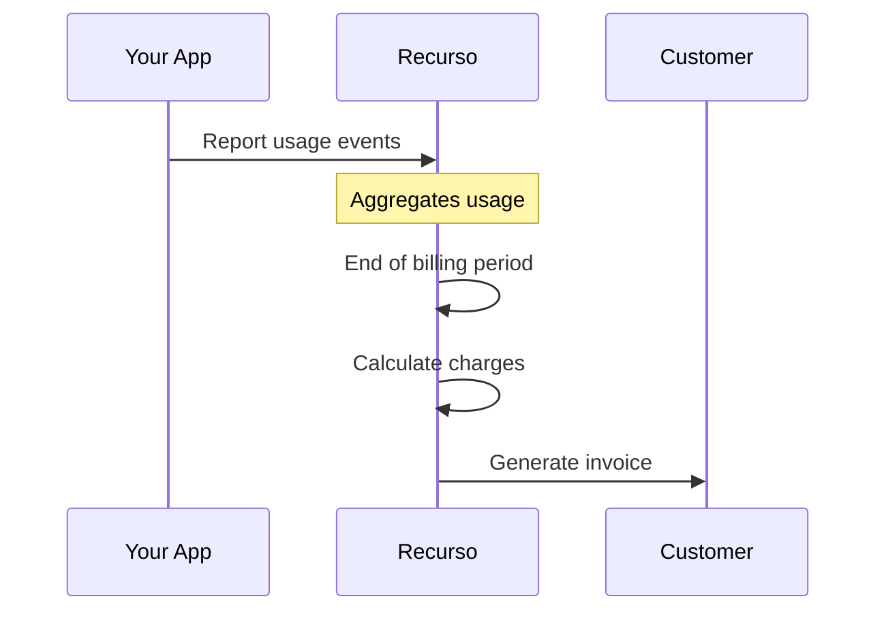

## Overview

Usage-based billing charges customers based on consumption rather than a fixed price. Common use cases:

- API calls
- Storage (GB)
- Compute hours
- Active users
- Transactions processed

## How It Works



## Create a Metered Plan

```typescript
const plan = await recurso.plans.create({
  name: 'API Access',
  interval: 'month',
  billing_scheme: 'metered',
  unit_label: 'API call',
  prices: [{
    currency: 'INR',
    tiers_mode: 'graduated',
    tiers: [
      { up_to: 10000, unit_amount: 0 },        // First 10k free
      { up_to: 100000, unit_amount: 0.05 },    // Next 90k: ₹0.05/call
      { up_to: 'inf', unit_amount: 0.01 }      // Beyond: ₹0.01/call
    ]
  }]
});
```

## Report Usage

Report usage events throughout the billing period:

<CodeGroup>
```typescript TypeScript
await recurso.usage.record({
  subscription_id: 'sub_xyz',
  quantity: 100,
  timestamp: new Date(),
  action: 'increment',  // or 'set' for gauge metrics
  idempotency_key: 'request_abc123'  // Prevent duplicates
});
```

```bash cURL
curl -X POST https://api.recurso.dev/v1/usage \
  -H "Authorization: Bearer $API_KEY" \
  -d '{
    "subscription_id": "sub_xyz",
    "quantity": 100,
    "action": "increment"
  }'
```
</CodeGroup>

### Batch Reporting

For high-volume usage, batch multiple events:

```typescript
await recurso.usage.recordBatch([
  { subscription_id: 'sub_xyz', quantity: 50, timestamp: t1 },
  { subscription_id: 'sub_xyz', quantity: 75, timestamp: t2 },
  { subscription_id: 'sub_xyz', quantity: 120, timestamp: t3 }
]);
```

## Pricing Models

### Graduated Tiers

Each tier applies to its range:

```typescript
tiers: [
  { up_to: 1000, unit_amount: 0.10 },   // 1-1000: ₹100
  { up_to: 5000, unit_amount: 0.05 },   // 1001-5000: ₹200
  { up_to: 'inf', unit_amount: 0.01 }   // 5001+: ₹0.01 each
]
// Example: 7000 calls = ₹100 + ₹200 + ₹20 = ₹320
```

### Volume Tiers

Final tier applies to ALL units:

```typescript
tiers_mode: 'volume',
tiers: [
  { up_to: 1000, unit_amount: 0.10 },
  { up_to: 5000, unit_amount: 0.05 },
  { up_to: 'inf', unit_amount: 0.01 }
]
// Example: 7000 calls = 7000 × ₹0.01 = ₹70
```

### Package Pricing

Charge per bundle:

```typescript
tiers: [
  { up_to: 1000, flat_amount: 999 },    // ₹999 for up to 1000
  { up_to: 5000, flat_amount: 1999 },   // ₹1999 for up to 5000
  { up_to: 'inf', flat_amount: 4999 }   // ₹4999 for unlimited
]
```

## Get Current Usage

```typescript
const usage = await recurso.usage.summary('sub_xyz');

// Returns
{
  subscription_id: 'sub_xyz',
  period_start: '2024-01-01',
  period_end: '2024-01-31',
  total_usage: 45230,
  estimated_amount: 1523
}
```

## Hybrid Billing

Combine base fee with usage:

```typescript
const plan = await recurso.plans.create({
  name: 'Pro + Usage',
  interval: 'month',
  prices: [
    { amount: 4999, currency: 'INR' }  // Base fee
  ],
  usage_prices: [{
    unit_label: 'API call',
    tiers: [...]
  }]
});
```

## Best Practices

<CardGroup cols={2}>
  <Card title="Use Idempotency" icon="fingerprint">
    Always include idempotency keys to prevent duplicate charges
  </Card>
  <Card title="Report Often" icon="clock">
    Report usage frequently (hourly) rather than in one batch
  </Card>
  <Card title="Show Estimates" icon="chart-line">
    Display current usage to customers in real-time
  </Card>
  <Card title="Set Alerts" icon="bell">
    Notify customers when approaching usage limits
  </Card>
</CardGroup>
