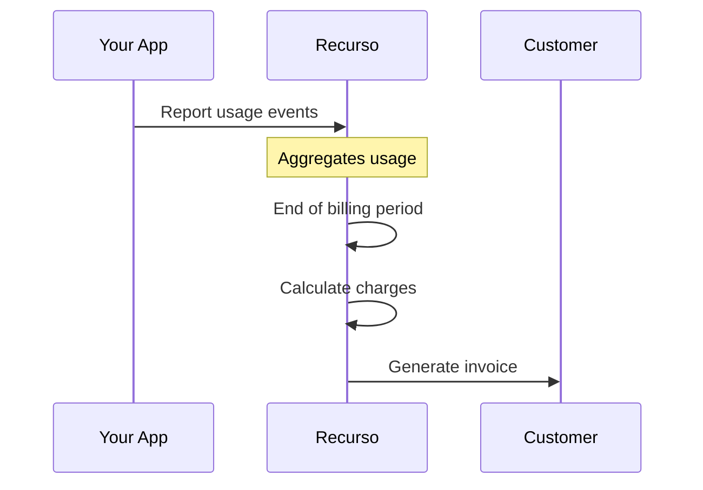

## Overview

Usage-based billing charges customers based on consumption rather than a fixed price. Common use cases:

- API calls
- Storage (GB)
- Compute hours
- Active users
- Transactions processed

## How It Works


```mermaid
sequenceDiagram
    participant App as Your App
    participant R as Recurso
    participant C as Customer

    App->>R: Report usage events
    Note over R: Aggregates usage
    R->>R: End of billing period
    R->>R: Calculate charges
    R->>C: Generate invoice
```

Metered billing is three pieces:

1. A **billable metric** — a named meter that reduces raw usage events to
   one quantity per period (eight [aggregations](#aggregations), from `count`
   to a sandboxed `custom` expression).
2. A **charge** — a [pricing model](#2-attach-charges-to-a-plan) (`per_unit`,
   `graduated`, `volume`, `package`, `percentage`, `graduated_percentage`, or
   `dynamic`) attaching that metric to a plan.
3. **Rating** — at period close, Recurso aggregates the elapsed period's
   events per metric, prices them, and adds the result to the renewal
   invoice as its own tax-resolved line item (billed **in arrears**).

Flat plan prices are untouched: a plan holding both a price and charges is
*hybrid* — flat fee billed in advance, usage billed in arrears, on the same
invoice.

## 1. Define a Billable Metric

The metric's `code` doubles as the event `dimension` it aggregates, so any
events you already report keep working.

```bash
curl -X POST https://api.recurso.dev/v1/billable-metrics \
  -H "Authorization: Bearer $API_KEY" \
  -H "Content-Type: application/json" \
  -d '{
    "name": "API calls",
    "code": "api_calls",
    "aggregation_type": "sum"
  }'
```

### Aggregations

| Aggregation | Reduces a period's events to |
|---|---|
| `count` | the number of events (quantity ignored) |
| `sum` | the sum of `quantity` |
| `max` | the largest single-event `quantity` |
| `unique` | distinct values of one event property (`field_name`), e.g. active users by `user_id` |
| `latest` | the most recent event's `quantity` in the period |
| `percentile` | the p-th percentile of event quantities (`field_name` holds the percentile 1–99, e.g. `"95"` for p95 latency-SLO billing) |
| `weighted_sum` | the **time-weighted average** of a running level: each event's `quantity` is a signed delta (`+5`/`-2` seats), and the metric bills the average level over the period, carried forward from before it |
| `custom` | the **sum of a sandboxed per-event expression** (`expression`) over `quantity` and numeric `properties.*` |

A `unique` metric needs the property to count; `percentile` puts the percentile
in `field_name`:

```json
{ "name": "Active users", "code": "active_users",
  "aggregation_type": "unique", "field_name": "user_id" }

{ "name": "p95 latency", "code": "latency_ms",
  "aggregation_type": "percentile", "field_name": "95" }
```

A **`weighted_sum`** metric time-weights a running level built from signed
deltas — ideal for per-second resources like seats or provisioned units. Report
`+5` when five seats are added and `-2` when two are removed; the metric bills
the average level held over the period (5 seats for 15 days + 10 for 15 days →
7.5). The starting level carries forward, so a resource active before the period
counts from day one.

A **`custom`** metric evaluates an expression against every event and sums the
results, so you can price on arithmetic over event fields without a bespoke
aggregation:

```json
{ "name": "Storage (GB-hours)", "code": "storage",
  "aggregation_type": "custom",
  "expression": "properties.bytes / 1000000" }
```

<Info>
The `custom` expression is sandboxed: it reads only `quantity` and numeric
`properties.*`, has no functions or external access, is bounded in time and
memory, and must return a number. It is validated when the metric is created, so
an invalid expression is rejected up front — never at invoice time.
</Info>

## 2. Attach Charges to a Plan

`PUT /v1/plans/{id}/charges` replaces the plan's full charge set (same
semantics as entitlements). Rates are decimal strings in **major** currency
units — sub-paise pricing like ₹0.0035/call is first-class — while flat and
package amounts are integers in minor units.

```bash
curl -X PUT https://api.recurso.dev/v1/plans/$PLAN_ID/charges \
  -H "Authorization: Bearer $API_KEY" \
  -H "Content-Type: application/json" \
  -d '[{
    "metric_id": "'$METRIC_ID'",
    "charge_model": "graduated",
    "amounts": {
      "INR": {
        "tiers": [
          { "up_to": 10000,  "unit_amount": "0" },
          { "up_to": 100000, "unit_amount": "0.05" },
          { "up_to": null,   "unit_amount": "0.01" }
        ]
      }
    }
  }]'
```

## Report Usage

Report usage events throughout the billing period. The `POST /v1/usage/events` endpoint accepts:

<ParamField body="subscription_id" type="string" required>
  The subscription to report usage for. Must belong to your tenant (`404` otherwise).
</ParamField>
<ParamField body="customer_id" type="string" required>
  The subscription's customer (`400` if it doesn't match).
</ParamField>
<ParamField body="dimension" type="string" required>
  Usage dimension/meter name, e.g. `api_calls` — matches a billable metric's `code`.
</ParamField>
<ParamField body="quantity" type="integer" required>
  Amount of usage to record. Must be greater than zero.
</ParamField>
<ParamField body="properties" type="object">
  Optional string attributes (max 20; keys ≤100 chars, values ≤255) —
  `unique` metrics count distinct values of one of them.
</ParamField>
<ParamField body="transaction_id" type="string">
  Your idempotency key for this event (≤255 chars) — retries collapse to the
  original event instead of double-counting.
</ParamField>

<CodeGroup>
```typescript TypeScript
await recurso.usage.record({
  subscription_id: 'sub_xyz',
  customer_id: 'cust_abc123',
  dimension: 'api_calls',
  quantity: 100,
});
```

```bash cURL
curl -X POST https://api.recurso.dev/v1/usage/events \
  -H "Authorization: Bearer $API_KEY" \
  -H "Content-Type: application/json" \
  -d '{
    "subscription_id": "sub_xyz",
    "customer_id": "cust_abc123",
    "dimension": "api_calls",
    "quantity": 100
  }'
```
</CodeGroup>

<Warning>
Recording is ownership-checked: the subscription must belong to your tenant
(`404` otherwise) and `customer_id` must match the subscription's customer
(`400` otherwise). See the
[Record Usage Event reference](/api-reference/usage/record-event).
</Warning>

### Idempotent ingestion

Add a `transaction_id` (your own unique key, ≤255 chars) and retries can
never double-count: a duplicate `(subscription, transaction_id)` collapses
to the original event — the API answers `200` with
`"status": "duplicate"` and the original `event_id`.

```json
{ "subscription_id": "sub_x", "customer_id": "cus_y",
  "dimension": "api_calls", "quantity": 100,
  "transaction_id": "req_8f3ka92" }
```

### Batch ingestion

`POST /v1/usage/events/batch` accepts up to **500 events** with per-item
results — one bad event never fails the batch:

```json
// request
{ "events": [ { "subscription_id": "...", "customer_id": "...",
                "dimension": "api_calls", "quantity": 100,
                "transaction_id": "evt-1" }, ... ] }

// response — index-aligned with the request
{ "data": [
  { "index": 0, "status": "recorded",  "event_id": "..." },
  { "index": 1, "status": "duplicate", "event_id": "..." },
  { "index": 2, "status": "error", "error": "quantity must be greater than zero" }
] }
```

## Charge Models

The same 7,000-call month prices very differently depending on the model —
switch the tabs to compare:

<Tabs>
  <Tab title="per_unit">
    Every unit at one rate.

    ```json
    { "charge_model": "per_unit", "unit_amount": "0.0035" }
    ```

    1,500 calls × ₹0.0035 = **₹5.25**. Sub-paise rates are computed
    exactly (big-rational arithmetic) and rounded half-up once per line.
  </Tab>
  <Tab title="graduated">
    Each tier prices **only the units inside it** — like income-tax slabs.

    ```json
    "tiers": [
      { "up_to": 1000, "unit_amount": "0.10" },
      { "up_to": 5000, "unit_amount": "0.05" },
      { "up_to": null, "unit_amount": "0.01" }
    ]
    ```

    7,000 calls = 1,000×0.10 + 4,000×0.05 + 2,000×0.01 = **₹320**.
  </Tab>
  <Tab title="volume">
    The **whole** quantity is priced at the single tier it reaches.

    With the same tiers as graduated, 7,000 calls land in the last tier:
    7,000 × 0.01 = **₹70**.
  </Tab>
  <Tab title="package">
    Bundles — partial bundles round **up**.

    ```json
    { "package_amount": 500, "package_size": 1000 }
    ```

    ₹5.00 per 1,000 calls — 5,200 calls bills 6 bundles = **₹30**.
  </Tab>
  <Tab title="percentage">
    A percentage of an aggregated **monetary base** (e.g. payment volume in
    minor units). Optional `free_units` (base exempt before the rate), a flat
    `fixed_amount`, and `min_amount`/`max_amount` clamps.

    ```json
    { "rate": "2.5", "fixed_amount": 30, "free_units": 100000,
      "min_amount": 0, "max_amount": 500000 }
    ```

    2.5% of the base above the first ₹1,000, plus ₹0.30, capped at ₹5,000.
  </Tab>
  <Tab title="graduated_percentage">
    The percentage analogue of `graduated`: each band of the monetary base is
    charged at that band's `rate` (plus an optional per-band `flat_amount`).

    ```json
    { "tiers": [
      { "up_to": 1000000, "rate": "3" },
      { "up_to": null,    "rate": "2" }
    ] }
    ```

    3% on the first ₹10,000 of base, 2% above it.
  </Tab>
  <Tab title="dynamic">
    You supply the exact price with each event (`dynamic_amount`, minor units);
    the charge bills their sum — no rate applied. For prices you compute
    yourself (usage-based AI tokens, per-shipment freight, …).

    ```json
    { "charge_model": "dynamic", "amounts": { "INR": {} } }
    ```
  </Tab>
</Tabs>

<Note>
Tier rules: bounds are strictly ascending; the last tier must leave
`up_to` null (unbounded); a tier's optional `flat_amount` (minor units) is
added once when any unit lands in it. Amounts are validated at `PUT` time
with the same code path that rates invoices, so a config that saves cannot
fail at billing time.
</Note>

## What the Invoice Looks Like

At period close the renewal invoice carries the flat fee (in advance, as
today) plus one line per charge with usage (in arrears). Zero-usage charges
add no line. Each metered line is taxed through the normal per-line GST/HSN
resolution — the charge's `hsn_code` wins, falling back to the plan's, then
the tenant SAC.

| Line Item | Amount |
|-----------|--------|
| Pro Plan | ₹4,999.00 |
| API calls — 45000 × usage (1 Jun 2026 to 1 Jul 2026) | ₹1,750.00 |
| IGST (18%) | ₹1,214.82 |
| **Total** | **₹7,963.82** |

Rated windows are recorded in a `usage_ratings` claim keyed by
`(subscription, charge, period_start)`, so a retried invoice generation can
never bill the same window twice. Immediate cancellation generates a final
usage-only invoice for the partial elapsed window.

## Bill in advance (per event)

By default usage bills **in arrears** at period close. Set `pay_in_advance` on a
charge to bill each event's usage the moment it's reported — captured as a
pending charge that folds onto the next invoice. Only non-cumulative models
qualify (`per_unit`, `percentage`, `dynamic`), since a graduated/volume price
depends on the whole period's total.

```json
{ "metric_id": "...", "charge_model": "per_unit",
  "amounts": { "INR": { "unit_amount": "0.10" } },
  "pay_in_advance": true }
```

## Dimensional pricing (charge filters)

Price distinct values of one event property differently under a single charge.
Set `filter_key` to the property and give per-value `amounts`; events matching no
value fall to the charge's base `amounts`.

```json
{ "metric_id": "...", "charge_model": "per_unit",
  "amounts": { "INR": { "unit_amount": "0.01" } },
  "filter_key": "region",
  "filters": [
    { "value": "us", "amounts": { "INR": { "unit_amount": "0.02" } } },
    { "value": "eu", "amounts": { "INR": { "unit_amount": "0.03" } } }
  ] }
```

Each value bills as its own invoice line, all under one rating claim. (Filters
aren't combined with the `custom`/`weighted_sum` aggregations or the `dynamic`
model, which compute their quantity a different way.)

## Progressive billing (interim invoices)

For high-usage customers you can bill **before** period close. Set a
`progressive_billing_threshold` (minor units) on the subscription: once accrued
usage crosses it, an interim invoice bills the delta since the last one, and the
renewal invoice settles the remainder. A per-charge **watermark** guarantees
every unit is billed exactly once — interim bills + close always sum to the same
total as pure arrears, no double-billing across retries or concurrent runs. A
background sweep triggers interim invoices automatically; you can also force one
with `POST /v1/subscriptions/{id}/bill-usage`.

## Simulate a price before you ship it

`POST /v1/pricing/simulate` rates a **proposed** charge set against sample or
real usage without persisting anything — compare pricing options, see the rated
lines and a balanced GL preview, and catch a mistake before it reaches an
invoice.

## Preview the Current Period

`GET /v1/subscriptions/{id}/usage-amount` prices the running period as of
now — what the customer would owe if invoiced this second:

```bash
curl https://api.recurso.dev/v1/subscriptions/$SUB_ID/usage-amount \
  -H "Authorization: Bearer $API_KEY"
```

```json
{
  "data": {
    "subscription_id": "sub_xyz",
    "currency": "INR",
    "current_period_start": "2026-07-01T00:00:00Z",
    "as_of": "2026-07-18T09:30:00Z",
    "charges": [{
      "metric_code": "api_calls",
      "metric_name": "API calls",
      "aggregation_type": "sum",
      "charge_model": "graduated",
      "quantity": 45231,
      "amount": 176155
    }],
    "total_amount": 176155
  }
}
```

<Tip>
Hybrid billing works well for plans where you want a minimum commitment
(the flat price) while still charging for heavy usage. Customers who stay
inside a free first tier only pay the flat fee.
</Tip>

## Query Usage Over Time

`GET /v1/usage` aggregates events into time buckets (`day` or `month`) over
an arbitrary window — the endpoint behind usage charts. Scope by
`subscription_id`, `customer_id`, or both, and optionally filter to one
dimension. The window defaults to the last 30 days.

<CodeGroup>
```typescript TypeScript
const chart = await recurso.usage.query({
  subscription_id: 'sub_xyz',
  dimension: 'api_calls',
  from: '2026-06-01T00:00:00Z',
  to: '2026-07-01T00:00:00Z',
  granularity: 'day',        // 'day' (default) | 'month'
});

// {
//   data: [
//     { period: '2026-06-01T00:00:00Z', dimension: 'api_calls', quantity: 1204 },
//     { period: '2026-06-02T00:00:00Z', dimension: 'api_calls', quantity: 987 },
//     ...
//   ],
//   from: '2026-06-01T00:00:00Z',
//   to: '2026-07-01T00:00:00Z',
//   granularity: 'day'
// }
```

```bash cURL
curl "https://api.recurso.dev/v1/usage?subscription_id=sub_xyz&dimension=api_calls&granularity=day" \
  -H "Authorization: Bearer $API_KEY"
```
</CodeGroup>

To discover which dimensions your services have been reporting, list the
tenant's dimension catalog:

```typescript
const catalog = await recurso.usage.dimensions();
// { data: [{ dimension: 'api_calls', event_count: 48210,
//            first_seen: '...', last_seen: '...' }, ...] }
```

## Show Customers Their Usage

`GET /v1/subscriptions/{id}/usage` answers the question every usage-based
product has to put on a dashboard: **"you've used 4,231 of 10,000 API
calls this month."**

It returns each dimension's total inside the current billing period plus
its lifetime total — and here is the wiring that makes the "of 10,000"
part work: when the customer holds an entitlement **limit** whose
`feature_key` equals the dimension name, the effective `limit_value` and
remaining headroom are joined into the row automatically.

```typescript
// 1. Grant a limit on the plan with a feature_key matching the dimension
await recurso.entitlements.setForPlan(plan.id, [
  { feature_key: 'api_calls', kind: 'limit', limit_value: 10000 },
]);

// 2. Meter usage against the dimension of the same name
await recurso.usage.record({
  subscription_id: sub.id,
  customer_id: customer.id,
  dimension: 'api_calls',
  quantity: 150,
});

// 3. Read back period usage with entitlement headroom
const usage = await recurso.subscriptions.usage(sub.id);

// {
//   subscription_id: 'sub_xyz',
//   customer_id: 'cust_abc123',
//   current_period_start: '2026-07-01T00:00:00Z',
//   current_period_end: '2026-08-01T00:00:00Z',
//   dimensions: [{
//     dimension: 'api_calls',
//     period_quantity: 4231,       // this billing period
//     lifetime_quantity: 61540,    // all time
//     limit_value: 10000,          // from the entitlement
//     remaining: 5769              // limit_value - period_quantity
//   }]
// }

const api = usage.dimensions.find((d) => d.dimension === 'api_calls');
banner.show(`You've used ${api.period_quantity} of ${api.limit_value} API calls`);
```

Dimensions without a matching entitlement limit report `limit_value: null`
and `remaining: null`; `remaining` goes **negative** when the customer is
over their limit — a natural trigger for an upgrade prompt. See the
[Entitlements guide](/advanced/entitlements) for how limits resolve across
multiple subscriptions.

## Best Practices

<CardGroup cols={2}>
  <Card title="Use Idempotency" icon="fingerprint">
    Always include idempotency keys to prevent duplicate charges. See the [Idempotency guide](/advanced/idempotency).
  </Card>
  <Card title="Report Often" icon="clock">
    Report usage frequently (hourly) rather than in one batch
  </Card>
  <Card title="Show Estimates" icon="chart-line">
    Display current usage to customers in real-time
  </Card>
  <Card title="Set Alerts" icon="bell">
    Notify customers when approaching usage limits
  </Card>
</CardGroup>
