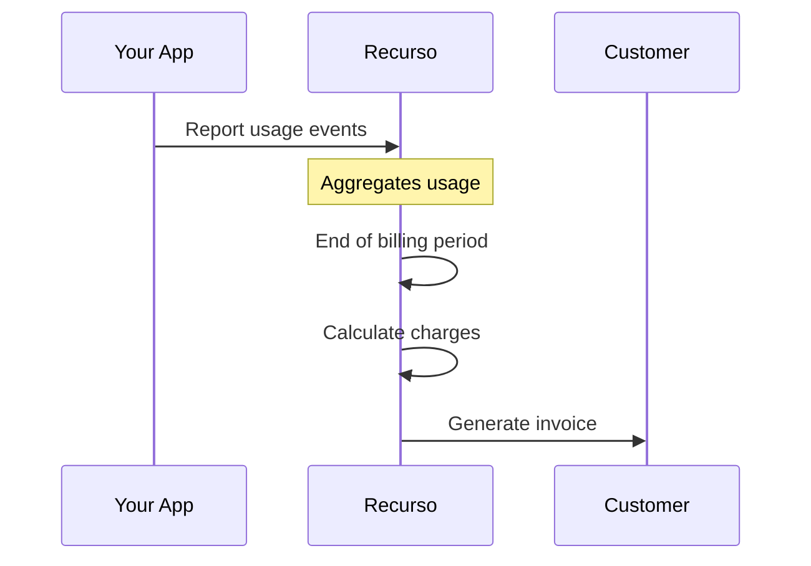

## Overview

Usage-based billing charges customers based on consumption rather than a fixed price. Common use cases:

- API calls
- Storage (GB)
- Compute hours
- Active users
- Transactions processed

## How It Works


```mermaid
sequenceDiagram
    participant App as Your App
    participant R as Recurso
    participant C as Customer

    App->>R: Report usage events
    Note over R: Aggregates usage
    R->>R: End of billing period
    R->>R: Calculate charges
    R->>C: Generate invoice
```

## Create a Metered Plan

```typescript
const plan = await recurso.plans.create({
  name: 'API Access',
  interval: 'month',
  billing_scheme: 'metered',
  unit_label: 'API call',
  prices: [{
    currency: 'INR',
    tiers_mode: 'graduated',
    tiers: [
      { up_to: 10000, unit_amount: 0 },        // First 10k free
      { up_to: 100000, unit_amount: 0.05 },    // Next 90k: ₹0.05/call
      { up_to: 'inf', unit_amount: 0.01 }      // Beyond: ₹0.01/call
    ]
  }]
});
```

## Report Usage

Report usage events throughout the billing period. The `POST /v1/usage/events` endpoint accepts the following fields (all required):

| Field | Type | Description |
|-------|------|-------------|
| `subscription_id` | `string` | The subscription to report usage for |
| `customer_id` | `string` | The subscription's customer |
| `dimension` | `string` | Usage dimension/meter name, e.g. `api_calls` |
| `quantity` | `number` | Amount of usage to record |

<CodeGroup>
```typescript TypeScript
await recurso.usage.record({
  subscription_id: 'sub_xyz',
  customer_id: 'cust_abc123',
  dimension: 'api_calls',
  quantity: 100,
});
```

```bash cURL
curl -X POST https://billing.example.com/v1/usage/events \
  -H "Authorization: Bearer $API_KEY" \
  -H "Content-Type: application/json" \
  -d '{
    "subscription_id": "sub_xyz",
    "customer_id": "cust_abc123",
    "dimension": "api_calls",
    "quantity": 100
  }'
```
</CodeGroup>

<Warning>
Recording is ownership-checked: the subscription must belong to your tenant
(`404` otherwise) and `customer_id` must match the subscription's customer
(`400` otherwise). See the
[Record Usage Event reference](/api-reference/usage/record-event).
</Warning>

## Pricing Models

### Graduated Tiers

Each tier applies to its range:

```typescript
tiers: [
  { up_to: 1000, unit_amount: 0.10 },   // 1-1000: ₹100
  { up_to: 5000, unit_amount: 0.05 },   // 1001-5000: ₹200
  { up_to: 'inf', unit_amount: 0.01 }   // 5001+: ₹0.01 each
]
// Example: 7000 calls = ₹100 + ₹200 + ₹20 = ₹320
```

### Volume Tiers

Final tier applies to ALL units:

```typescript
tiers_mode: 'volume',
tiers: [
  { up_to: 1000, unit_amount: 0.10 },
  { up_to: 5000, unit_amount: 0.05 },
  { up_to: 'inf', unit_amount: 0.01 }
]
// Example: 7000 calls = 7000 × ₹0.01 = ₹70
```

### Package Pricing

Charge per bundle:

```typescript
tiers: [
  { up_to: 1000, flat_amount: 999 },    // ₹999 for up to 1000
  { up_to: 5000, flat_amount: 1999 },   // ₹1999 for up to 5000
  { up_to: 'inf', flat_amount: 4999 }   // ₹4999 for unlimited
]
```

## Hybrid Billing

Combine a flat base fee with metered usage charges. This is the most common model for SaaS products that want predictable revenue with a usage component.

```typescript
const plan = await recurso.plans.create({
  name: 'Pro + Usage',
  interval: 'month',
  prices: [
    { amount: 4999, currency: 'INR' }  // Base fee: ₹49.99/mo
  ],
  usage_prices: [{
    unit_label: 'API call',
    currency: 'INR',
    tiers_mode: 'graduated',
    tiers: [
      { up_to: 10000, unit_amount: 0 },      // 10k calls included
      { up_to: 100000, unit_amount: 0.05 },   // Overage: ₹0.05/call
      { up_to: 'inf', unit_amount: 0.01 }
    ]
  }]
});
```

At invoice time, the customer sees two line items:

| Line Item | Amount |
|-----------|--------|
| Pro Plan - Base Fee | ₹4,999.00 |
| API Calls - 45,000 calls (10,000 included, 35,000 overage) | ₹1,750.00 |
| **Total** | **₹6,749.00** |

<Tip>
Hybrid billing works well for plans where you want a minimum commitment (the base fee) while still charging for heavy usage. Customers who stay under the included usage only pay the flat fee.
</Tip>

## Query Usage Over Time

`GET /v1/usage` aggregates events into time buckets (`day` or `month`) over
an arbitrary window — the endpoint behind usage charts. Scope by
`subscription_id`, `customer_id`, or both, and optionally filter to one
dimension. The window defaults to the last 30 days.

<CodeGroup>
```typescript TypeScript
const chart = await recurso.usage.query({
  subscription_id: 'sub_xyz',
  dimension: 'api_calls',
  from: '2026-06-01T00:00:00Z',
  to: '2026-07-01T00:00:00Z',
  granularity: 'day',        // 'day' (default) | 'month'
});

// {
//   data: [
//     { period: '2026-06-01T00:00:00Z', dimension: 'api_calls', quantity: 1204 },
//     { period: '2026-06-02T00:00:00Z', dimension: 'api_calls', quantity: 987 },
//     ...
//   ],
//   from: '2026-06-01T00:00:00Z',
//   to: '2026-07-01T00:00:00Z',
//   granularity: 'day'
// }
```

```bash cURL
curl "https://billing.example.com/v1/usage?subscription_id=sub_xyz&dimension=api_calls&granularity=day" \
  -H "Authorization: Bearer $API_KEY"
```
</CodeGroup>

To discover which dimensions your services have been reporting, list the
tenant's dimension catalog:

```typescript
const catalog = await recurso.usage.dimensions();
// { data: [{ dimension: 'api_calls', event_count: 48210,
//            first_seen: '...', last_seen: '...' }, ...] }
```

## Show Customers Their Usage

`GET /v1/subscriptions/{id}/usage` answers the question every usage-based
product has to put on a dashboard: **"you've used 4,231 of 10,000 API
calls this month."**

It returns each dimension's total inside the current billing period plus
its lifetime total — and here is the wiring that makes the "of 10,000"
part work: when the customer holds an entitlement **limit** whose
`feature_key` equals the dimension name, the effective `limit_value` and
remaining headroom are joined into the row automatically.

```typescript
// 1. Grant a limit on the plan with a feature_key matching the dimension
await recurso.entitlements.setForPlan(plan.id, [
  { feature_key: 'api_calls', kind: 'limit', limit_value: 10000 },
]);

// 2. Meter usage against the dimension of the same name
await recurso.usage.record({
  subscription_id: sub.id,
  customer_id: customer.id,
  dimension: 'api_calls',
  quantity: 150,
});

// 3. Read back period usage with entitlement headroom
const usage = await recurso.subscriptions.usage(sub.id);

// {
//   subscription_id: 'sub_xyz',
//   customer_id: 'cust_abc123',
//   current_period_start: '2026-07-01T00:00:00Z',
//   current_period_end: '2026-08-01T00:00:00Z',
//   dimensions: [{
//     dimension: 'api_calls',
//     period_quantity: 4231,       // this billing period
//     lifetime_quantity: 61540,    // all time
//     limit_value: 10000,          // from the entitlement
//     remaining: 5769              // limit_value - period_quantity
//   }]
// }

const api = usage.dimensions.find((d) => d.dimension === 'api_calls');
banner.show(`You've used ${api.period_quantity} of ${api.limit_value} API calls`);
```

Dimensions without a matching entitlement limit report `limit_value: null`
and `remaining: null`; `remaining` goes **negative** when the customer is
over their limit — a natural trigger for an upgrade prompt. See the
[Entitlements guide](/advanced/entitlements) for how limits resolve across
multiple subscriptions.

## Best Practices

<CardGroup cols={2}>
  <Card title="Use Idempotency" icon="fingerprint">
    Always include idempotency keys to prevent duplicate charges. See the [Idempotency guide](/advanced/idempotency).
  </Card>
  <Card title="Report Often" icon="clock">
    Report usage frequently (hourly) rather than in one batch
  </Card>
  <Card title="Show Estimates" icon="chart-line">
    Display current usage to customers in real-time
  </Card>
  <Card title="Set Alerts" icon="bell">
    Notify customers when approaching usage limits
  </Card>
</CardGroup>
