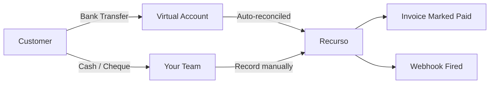
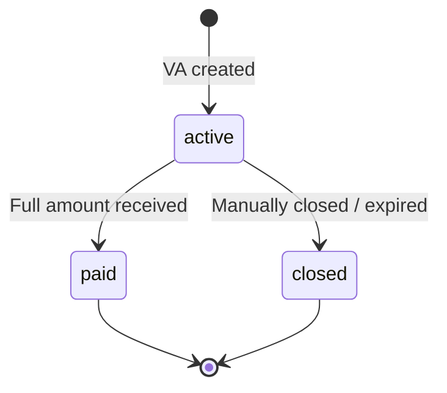

## Overview

Not every customer pays by card. Recurso supports offline payment methods — bank transfers, cash, and cheques — through two complementary features:

- **Virtual Accounts** — Unique bank accounts generated per customer or invoice via Razorpay, enabling automatic reconciliation of incoming bank transfers
- **Offline Payments** — Manual recording of payments received outside your payment gateway (cash, cheques, NEFT/RTGS transfers)



## Virtual Accounts

A virtual account is a unique bank account number assigned to a specific customer or invoice. When the customer transfers funds to that account, Razorpay notifies Recurso, and the payment is automatically matched and reconciled.

### Create a Virtual Account

<CodeGroup>

```bash cURL
curl -X POST https://api.recurso.dev/v1/virtual-accounts \
  -H "Authorization: Bearer $API_KEY" \
  -H "Content-Type: application/json" \
  -d '{
    "customer_id": "cust_8Tj3mKvR",
    "invoice_id": "inv_Q4xnL92p",
    "amount": 49900
  }'
```
</CodeGroup>

### Virtual Account Parameters

| Parameter | Type | Required | Description |
|-----------|------|----------|-------------|
| `customer_id` | string | Yes | The customer this account is for (prefix `cust_`) |
| `invoice_id` | string | No | Link to a specific invoice (prefix `inv_`) |
| `amount` | integer | Yes | Expected payment amount in smallest currency unit (must be > 0) |

### Virtual Account Object

| Field | Type | Description |
|-------|------|-------------|
| `id` | string | Unique identifier (prefix `va_`) |
| `tenant_id` | string | Your tenant identifier |
| `customer_id` | string | Associated customer |
| `invoice_id` | string | Associated invoice, if any |
| `account_number` | string | The virtual bank account number |
| `ifsc_code` | string | IFSC code for bank transfers |
| `bank_name` | string | Name of the issuing bank |
| `beneficiary_name` | string | Beneficiary name shown to the payer |
| `razorpay_va_id` | string | Razorpay's internal virtual account ID |
| `status` | string | `active`, `paid`, or `closed` |
| `amount_expected` | integer | Amount the customer should transfer |
| `amount_received` | integer | Amount received so far |
| `closed_at` | string | ISO 8601 timestamp when the VA was closed |
| `created_at` | string | ISO 8601 timestamp of creation |

### List Virtual Accounts

<CodeGroup>

```bash cURL
curl -X GET "https://api.recurso.dev/v1/virtual-accounts?customer_id=cust_8Tj3mKvR&status=active" \
  -H "Authorization: Bearer $API_KEY"
```
</CodeGroup>

### Virtual Account Lifecycle



<Info>
When a virtual account receives the full expected amount, Recurso automatically marks the linked invoice as **paid** and fires a `virtual_account.paid` webhook event.
</Info>

### Reconciliation Flow

<Steps>
  <Step title="Create virtual account">
    Generate a virtual account for the customer or invoice. Share the account number, IFSC code, and beneficiary name with the customer.
  </Step>
  <Step title="Customer initiates transfer">
    The customer sends funds via NEFT, RTGS, IMPS, or UPI to the virtual account number.
  </Step>
  <Step title="Razorpay notifies Recurso">
    When the transfer settles, Razorpay sends a callback. Recurso updates `amount_received` on the virtual account.
  </Step>
  <Step title="Automatic matching">
    If `amount_received >= amount_expected`, Recurso marks the virtual account as `paid`, updates the linked invoice, and fires webhook events.
  </Step>
</Steps>

## Offline Payments

For payments received outside your payment gateway — cash at a counter, a mailed cheque, or a bank transfer you identified manually — use the offline payments API to record them in Recurso.

### Record an Offline Payment

<CodeGroup>

```bash cURL
curl -X POST https://api.recurso.dev/v1/payments/offline \
  -H "Authorization: Bearer $API_KEY" \
  -H "Content-Type: application/json" \
  -d '{
    "customer_id": "cust_8Tj3mKvR",
    "invoice_id": "inv_Q4xnL92p",
    "payment_type": "bank_transfer",
    "amount": 49900,
    "currency": "INR",
    "reference_number": "NEFT-20250710-4829",
    "notes": "Received via NEFT from HDFC account ending 4821",
    "recorded_by": "ops_sanjay@acme.com"
  }'
```
</CodeGroup>

### Offline Payment Parameters

| Parameter | Type | Required | Description |
|-----------|------|----------|-------------|
| `customer_id` | string | Yes | Customer who made the payment (prefix `cust_`) |
| `invoice_id` | string | No | Invoice to apply the payment to (prefix `inv_`) |
| `payment_type` | string | Yes | One of `bank_transfer`, `cash`, or `cheque` |
| `amount` | integer | Yes | Payment amount in smallest currency unit (must be > 0) |
| `currency` | string | No | Three-letter ISO currency code (defaults to `INR`) |
| `reference_number` | string | No | External reference (UTR, cheque number, receipt ID) |
| `notes` | string | No | Free-text notes for internal tracking |
| `recorded_by` | string | No | Email or identifier of the team member recording the payment |

### Payment Types

<AccordionGroup>
  <Accordion title="Bank Transfer">
    Use `bank_transfer` for NEFT, RTGS, IMPS, and wire transfers identified manually. Always include the `reference_number` (UTR number) for audit trails.
  </Accordion>
  <Accordion title="Cash">
    Use `cash` for in-person payments. Include the `recorded_by` field to track which team member accepted the payment. Consider requiring a `notes` field describing the receipt issued.
  </Accordion>
  <Accordion title="Cheque">
    Use `cheque` for cheque payments. Set the `reference_number` to the cheque number. Record the payment only after the cheque has cleared to avoid bounced-cheque scenarios.
  </Accordion>
</AccordionGroup>

### List Offline Payments

<CodeGroup>

```bash cURL
curl -X GET "https://api.recurso.dev/v1/payments/offline?customer_id=cust_8Tj3mKvR" \
  -H "Authorization: Bearer $API_KEY"
```
</CodeGroup>

## Webhook Events

| Event | Description |
|-------|-------------|
| `virtual_account.created` | A new virtual account was generated |
| `virtual_account.paid` | Virtual account received the full expected amount |
| `virtual_account.closed` | Virtual account was closed without full payment |
| `offline_payment.recorded` | An offline payment was manually recorded |
| `invoice.paid` | Fired when a VA payment or offline payment settles an invoice |

<Warning>
When recording offline payments linked to an invoice, Recurso automatically updates the invoice status. Do not manually update the invoice status separately, as this may cause inconsistencies.
</Warning>

## Invoice Linking

When you provide an `invoice_id` to either a virtual account or an offline payment, Recurso handles the downstream effects automatically:

1. The invoice `amount_due` is reduced by the payment amount
2. If the invoice is fully paid, its status transitions to `paid`
3. The subscription associated with the invoice (if any) is updated accordingly
4. An `invoice.paid` webhook event is fired

<Tip>
For partial payments, you can record multiple offline payments against the same invoice. Recurso tracks the running total and only marks the invoice as paid when the full amount is covered.
</Tip>

## Best Practices

<CardGroup cols={2}>
  <Card title="Always Include References" icon="hashtag">
    Use `reference_number` for every offline payment to maintain a clear audit trail linking your records to bank statements.
  </Card>
  <Card title="Record Who Entered It" icon="user">
    Populate `recorded_by` so you can trace which team member recorded each payment during audits.
  </Card>
  <Card title="Wait for Cheque Clearance" icon="clock">
    Only record cheque payments after they clear. Recording a bounced cheque as paid creates reconciliation headaches.
  </Card>
  <Card title="Use VAs for Recurring Transfers" icon="repeat">
    For customers who always pay by bank transfer, create a long-lived virtual account tied to the customer rather than individual invoices.
  </Card>
  <Card title="Monitor VA Expiry" icon="calendar">
    Virtual accounts can expire if unused. Set up alerts on the `virtual_account.closed` webhook to follow up with customers.
  </Card>
  <Card title="Reconcile Daily" icon="check-double">
    Review unmatched virtual account payments and pending offline entries daily to keep your ledger accurate.
  </Card>
</CardGroup>
