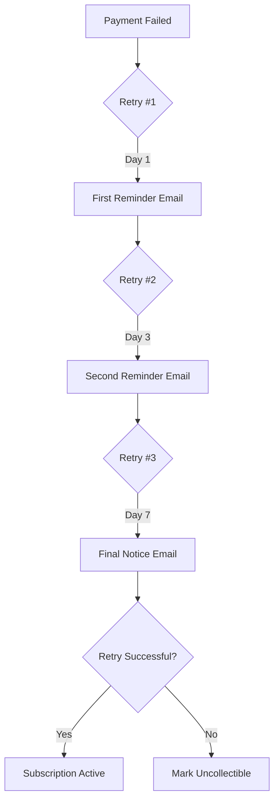

## Overview

Dunning handles failed payments through:

- Automatic payment retries
- Escalating email notifications
- Grace periods before service suspension
- Recovery analytics

## How It Works



## Configuration

```typescript
await recurso.settings.dunning.update({
  // Retry schedule (days after due date)
  retry_schedule: [1, 3, 7],
  
  // Email notifications
  emails: {
    first_reminder: { day: 1, template: 'dunning_first' },
    second_reminder: { day: 3, template: 'dunning_second' },
    final_notice: { day: 7, template: 'dunning_final' }
  },
  
  // Actions
  suspend_after_days: 14,
  cancel_after_days: 30,
  
  // Behavior
  allow_customer_retry: true,
  update_payment_url: true
});
```

## Email Templates

### First Reminder (Day 1)

```
Subject: Action Required: Payment Failed

Hi {CustomerName},

We couldn't process your payment for {InvoiceNumber}.

Amount: {Amount}
Due Date: {DueDate}

Please update your payment method to avoid service interruption.

[Update Payment Method]
[Pay Now]
```

### Second Reminder (Day 3)

```
Subject: ⚠️ Payment Still Pending

Your payment of {Amount} is still outstanding.

We'll attempt to charge your card again on {NextRetryDate}.

To avoid service interruption on {SuspensionDate}:
[Update Payment Method]
```

### Final Notice (Day 7)

```
Subject: 🚨 Final Notice: Service Suspension

This is your final notice before service suspension.

If we don't receive payment by {SuspensionDate}, your subscription will be suspended.

[Pay Now to Keep Access]
```

## Recovery Actions

### Customer Can Retry

Enable self-service payment update:

```typescript
{
  allow_customer_retry: true,
  retry_url: '{portal}/pay/{invoice_id}'
}
```

### Automatic Card Update

If using Stripe, enable Network Tokenization to automatically update expired cards.

## Monitor Dunning

### Dashboard Metrics

- **At Risk**: Invoices in dunning
- **Recovered**: Successfully collected
- **Churned**: Cancelled due to non-payment

### Webhook Events

| Event | Description |
|-------|-------------|
| `invoice.payment_failed` | Payment attempt failed |
| `invoice.past_due` | Invoice entered dunning |
| `payment.recovered` | Dunning succeeded |
| `subscription.suspended` | Service suspended |
| `invoice.uncollectible` | Written off |

## Best Practices

<CardGroup cols={2}>
  <Card title="Early Contact" icon="envelope">
    Send first reminder within 24 hours of failure
  </Card>
  <Card title="Easy Resolution" icon="credit-card">
    Make payment update frictionless
  </Card>
  <Card title="Escalate Tone" icon="stairs">
    Increase urgency with each email
  </Card>
  <Card title="Human Touch" icon="user">
    Consider manual outreach for high-value customers
  </Card>
</CardGroup>

## Analytics

Track recovery performance:

```typescript
const metrics = await recurso.analytics.dunning({
  period: 'last_30_days'
});

// Returns
{
  invoices_entered: 45,
  recovered: 38,
  recovery_rate: 84.4,
  uncollectible: 7,
  average_days_to_recovery: 2.3
}
```
