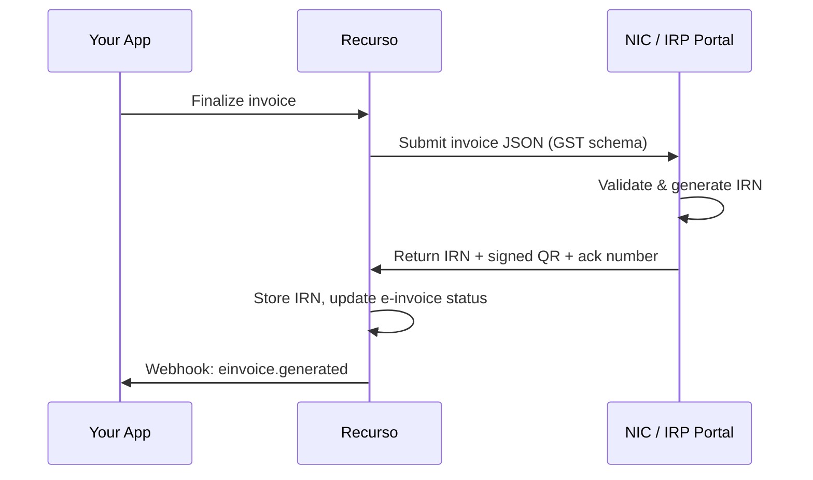

## Overview

India's e-invoicing system requires businesses above the prescribed turnover threshold to report B2B invoices electronically to the Invoice Registration Portal (IRP) maintained by NIC (National Informatics Centre). Recurso integrates directly with the IRP to:

- **Auto-submit** invoices to the IRP when they are finalized
- **Generate IRN** (Invoice Reference Number) for each invoice
- **Attach signed QR codes** for verification
- **Retry** failed submissions automatically
- **Cancel** e-invoices when needed

<Info>
E-invoicing is mandatory for businesses with aggregate turnover exceeding the applicable threshold (currently Rs. 5 crore). Recurso handles the technical integration so you can focus on your business.
</Info>

## How It Works



## Configure IRP Credentials

Before e-invoices can be submitted, configure your IRP connection credentials. Recurso supports both sandbox and production environments.

### Update IRP Configuration

<CodeGroup>
```typescript TypeScript
await recurso.settings.irp.update({
  client_id: 'your_irp_client_id',
  client_secret: 'your_irp_client_secret',
  username: 'your_irp_username',
  password: 'your_irp_password',
  gstin: '27AABCU9603R1ZM',
  environment: 'production',  // or 'sandbox'
  is_enabled: true
});
```

```bash cURL
curl -X PUT https://billing.example.com/v1/settings/irp \
  -H "Authorization: Bearer $API_KEY" \
  -H "Content-Type: application/json" \
  -d '{
    "client_id": "your_irp_client_id",
    "client_secret": "your_irp_client_secret",
    "username": "your_irp_username",
    "password": "your_irp_password",
    "gstin": "27AABCU9603R1ZM",
    "environment": "production",
    "is_enabled": true
  }'
```
</CodeGroup>

### IRP Configuration Parameters

| Parameter | Type | Required | Description |
|-----------|------|----------|-------------|
| `client_id` | `string` | Yes | IRP API client ID |
| `client_secret` | `string` | Yes | IRP API client secret |
| `username` | `string` | Yes | IRP portal username |
| `password` | `string` | Yes | IRP portal password |
| `gstin` | `string` | Yes | Your business GSTIN (15 characters) |
| `environment` | `string` | Yes | `sandbox` for testing, `production` for live |
| `is_enabled` | `boolean` | Yes | Enable or disable e-invoice auto-submission |

<Warning>
Always test with `environment: "sandbox"` before switching to production. Sandbox submissions are not reported to the GST portal and are safe for development and testing.
</Warning>

### View Current Configuration

Retrieve the current IRP configuration. Secrets are returned in a masked format for security.

<CodeGroup>
```typescript TypeScript
const config = await recurso.settings.irp.get();

// Returns
// {
//   client_id: "your_ir****ent_id",
//   client_secret: "****",
//   username: "your_i****ername",
//   password: "****",
//   gstin: "27AABCU9603R1ZM",
//   environment: "production",
//   is_enabled: true
// }
```

```bash cURL
curl https://billing.example.com/v1/settings/irp \
  -H "Authorization: Bearer $API_KEY"
```
</CodeGroup>

### Test IRP Connection

Validate that your credentials are correct and the IRP portal is reachable before going live.

<CodeGroup>
```typescript TypeScript
const result = await recurso.settings.irp.test();

// Returns
// { success: true, message: "IRP connection successful" }
```

```bash cURL
curl -X POST https://billing.example.com/v1/settings/irp/test \
  -H "Authorization: Bearer $API_KEY"
```
</CodeGroup>

## Automatic Submission

Once IRP credentials are configured and `is_enabled` is set to `true`, Recurso automatically submits every finalized invoice to the IRP. No additional API calls are needed.

<Steps>
  <Step title="Invoice is finalized">
    When an invoice transitions to the `finalized` status (via subscription billing or manual finalization), Recurso prepares the e-invoice payload in the NIC-prescribed JSON schema.
  </Step>
  <Step title="Submission to IRP">
    The payload is sent to the IRP. On success, the IRP returns an IRN, acknowledgement number, and a digitally signed QR code.
  </Step>
  <Step title="E-invoice data stored">
    Recurso attaches the IRN and QR code to the invoice record. The e-invoice status is updated accordingly.
  </Step>
  <Step title="Webhook notification">
    A webhook event is fired so your application can update its UI or trigger downstream processes.
  </Step>
</Steps>

## Check E-Invoice Status

Retrieve the e-invoice status for any invoice.

<CodeGroup>
```typescript TypeScript
const status = await recurso.invoices.einvoice.getStatus('inv_001');

// Returns
// {
//   invoice_id: "inv_001",
//   status: "generated",
//   irn: "a1b2c3d4e5f6a1b2c3d4e5f6a1b2c3d4e5f6a1b2c3d4e5f6a1b2c3d4",
//   ack_number: "1234567890",
//   ack_date: "2026-06-23T10:00:00Z",
//   signed_qr: "eyJhbGciOi..."
// }
```

```bash cURL
curl https://billing.example.com/v1/invoices/inv_001/einvoice \
  -H "Authorization: Bearer $API_KEY"
```
</CodeGroup>

### E-Invoice Statuses

| Status | Description |
|--------|-------------|
| `pending` | Invoice finalized; submission to IRP queued |
| `generated` | IRN generated successfully |
| `failed` | Submission failed (check error details) |
| `cancelled` | E-invoice cancelled on the IRP |

## Retry Failed E-Invoices

If a submission fails (network error, IRP downtime, validation issue), retry it after fixing the underlying problem.

<CodeGroup>
```typescript TypeScript
const result = await recurso.invoices.einvoice.retry('inv_001');

console.log(result.data);    // Updated e-invoice object
console.log(result.message); // "E-invoice resubmitted successfully"
```

```bash cURL
curl -X POST https://billing.example.com/v1/invoices/inv_001/einvoice/retry \
  -H "Authorization: Bearer $API_KEY"
```
</CodeGroup>

<Tip>
Common failure reasons include incorrect GSTIN, missing mandatory fields (buyer address, HSN/SAC code), or IRP downtime. Check the error details in the e-invoice status response before retrying.
</Tip>

## Cancel an E-Invoice

E-invoices can be cancelled within 24 hours of generation on the IRP. You must provide a cancellation code and reason.

<CodeGroup>
```typescript TypeScript
await recurso.invoices.einvoice.cancel('inv_001', {
  cancel_code: 1,
  reason: 'Duplicate invoice generated in error'
});
```

```bash cURL
curl -X POST https://billing.example.com/v1/invoices/inv_001/einvoice/cancel \
  -H "Authorization: Bearer $API_KEY" \
  -H "Content-Type: application/json" \
  -d '{
    "cancel_code": 1,
    "reason": "Duplicate invoice generated in error"
  }'
```
</CodeGroup>

### Cancel Codes

| Code | Description |
|------|-------------|
| `1` | Duplicate |
| `2` | Data entry mistake |
| `3` | Order cancelled |
| `4` | Others |

<Warning>
E-invoice cancellation must be done within 24 hours of IRN generation. After 24 hours, you must issue a credit note instead. The `reason` field is mandatory and must clearly explain the cancellation.
</Warning>

## Webhooks

| Event | Description |
|-------|-------------|
| `einvoice.generated` | IRN successfully generated for an invoice |
| `einvoice.failed` | E-invoice submission to IRP failed |
| `einvoice.cancelled` | E-invoice was cancelled on the IRP |

### Example Webhook Payload

```json
{
  "event": "einvoice.generated",
  "data": {
    "invoice_id": "inv_001",
    "irn": "a1b2c3d4e5f6a1b2c3d4e5f6a1b2c3d4e5f6a1b2c3d4e5f6a1b2c3d4",
    "ack_number": "1234567890",
    "ack_date": "2026-06-23T10:00:00Z",
    "status": "generated"
  }
}
```

## IRP Configuration Object

| Field | Type | Description |
|-------|------|-------------|
| `tenant_id` | `string` | Your tenant identifier |
| `environment` | `string` | `sandbox` or `production` |
| `client_id` | `string` | IRP API client ID |
| `client_secret` | `string` | IRP API client secret (masked in GET responses) |
| `username` | `string` | IRP portal username |
| `password` | `string` | IRP portal password (masked in GET responses) |
| `gstin` | `string` | Business GSTIN registered with the IRP |
| `is_enabled` | `boolean` | Whether auto-submission is active |

## Best Practices

<AccordionGroup>
  <Accordion title="Start with sandbox environment">
    Always configure `environment: "sandbox"` first. Submit a few test invoices to verify your GSTIN, address details, and SAC/HSN codes are accepted by the IRP before switching to production.
  </Accordion>
  <Accordion title="Test your IRP connection before going live">
    Use the `POST /v1/settings/irp/test` endpoint after every credential change. This validates connectivity without submitting an actual invoice.
  </Accordion>
  <Accordion title="Monitor failed submissions">
    Subscribe to the `einvoice.failed` webhook and set up alerts. Common issues include expired IRP tokens, incorrect buyer GSTIN, or missing address fields. Resolve errors promptly and use the retry endpoint.
  </Accordion>
  <Accordion title="Handle cancellations within the 24-hour window">
    If you need to cancel an e-invoice, act within 24 hours of IRN generation. After that, you must issue a credit note via `POST /v1/credit-notes` and generate a new e-invoice for the credit note.
  </Accordion>
  <Accordion title="Keep customer GSTIN data accurate">
    E-invoice failures often stem from incorrect buyer GSTIN or address. Validate GSTIN at customer creation time using the GST portal's public API and keep billing addresses up to date.
  </Accordion>
  <Accordion title="Store IRN for your records">
    The IRN is your proof of compliance. Store it alongside the invoice in your system and include it on printed/PDF copies of the invoice. The signed QR code should also be embedded in invoice PDFs.
  </Accordion>
</AccordionGroup>
