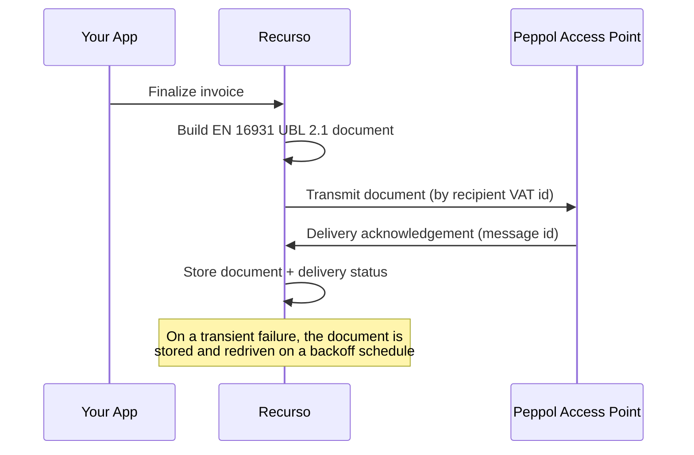

<Frame caption="The EU e-invoicing settings page in the Recurso dashboard">
  
</Frame>

## Overview

The EU is rolling out structured e-invoicing mandates country by country — public sector (B2G) first, private sector (B2B) on national timelines. A structured e-invoice is not a PDF: it is a machine-readable document following the **EN 16931** semantic model, expressed in a syntax and delivered over a network.

Recurso generates a fully-structured e-invoice for a finalized invoice:

- **EN 16931 semantic model** — the pan-European standard for the invoice content
- **UBL 2.1 syntax** — the OASIS Universal Business Language, the Peppol BIS Billing 3.0 default
- **Per-tenant opt-in** — off by default, because the mandate landscape is fragmented; you enable it only for the workspace and tenants where a mandate applies
- **Automatic delivery retries** — a transient delivery failure is redriven on a backoff, not lost

<Info>
EU e-invoicing is **isolated from** India's GST e-invoicing (IRN clearance). They are separate compliance regimes with separate configuration — enabling one has no effect on the other. See [E-Invoicing (India)](/compliance/e-invoicing) for the IRP/IRN flow.
</Info>

<Note>
Recurso generates and stores the EN 16931 document today and hands it to a pluggable **transport** for delivery. Connecting a production **Peppol Access Point** is a configuration step performed with your chosen provider's credentials — until that is wired, documents are generated, validated, stored, and retrievable, and the delivery step is exercised by a built-in transport. The generation and retry behaviour described below is unchanged once a live Access Point is connected.
</Note>

## How it works



Generation runs **after** the invoice is committed — it never blocks or rolls back invoicing. A tenant that has not opted in is a silent no-op.

## Enable EU e-invoicing

Configuration is a single per-tenant object: the opt-in flag plus your EN 16931 **seller identity**. You can manage it in the dashboard under **Settings → EU e-invoicing**, or via the API.

### Update configuration

<CodeGroup>

```bash cURL
curl -X PUT https://api.recurso.dev/v1/settings/eu-einvoice \
  -H "Authorization: Bearer $API_KEY" \
  -H "Content-Type: application/json" \
  -d '{
    "enabled": true,
    "legal_name": "Acme GmbH",
    "vat_number": "DE123456789",
    "country_code": "DE",
    "street": "Hauptstr. 1",
    "city": "Berlin",
    "postal_zone": "10115"
  }'
```

</CodeGroup>

### Configuration parameters

| Parameter | Type | Required | Description |
|-----------|------|----------|-------------|
| `enabled` | `boolean` | Yes | When `true`, finalized invoices generate an EN 16931 (UBL 2.1) e-invoice. Off by default. |
| `legal_name` | `string` | To enable | Seller registered/legal name (EN 16931 field BT-27). |
| `vat_number` | `string` | To enable | Seller VAT identifier **including** the country prefix, e.g. `DE123456789` (BT-31). |
| `country_code` | `string` | To enable | Seller country as an ISO 3166-1 alpha-2 code, e.g. `DE` (BT-40). Exactly two letters. |
| `street` | `string` | Recommended | Seller street address (BG-5). |
| `city` | `string` | Recommended | Seller city (BG-5). |
| `postal_zone` | `string` | Recommended | Seller postal code (BG-5). |

<Warning>
Setting `enabled: true` requires `legal_name`, `vat_number`, and a valid two-letter `country_code` — an EN 16931 document cannot be built without a complete seller identity. The request is rejected if any are missing.
</Warning>

### View current configuration

<CodeGroup>

```bash cURL
curl https://api.recurso.dev/v1/settings/eu-einvoice \
  -H "Authorization: Bearer $API_KEY"
```

</CodeGroup>

Returns the stored config, or an empty disabled default when none is set.

## Automatic generation

Once enabled, Recurso generates an e-invoice for every finalized invoice — no extra API calls.

<Steps>
  <Step title="Invoice is finalized">
    When an invoice is committed (via subscription billing or manual finalization), Recurso projects the **seller** from your EU config and the **buyer** from the customer.
  </Step>
  <Step title="Document is built">
    An EN 16931 document is generated in UBL 2.1 syntax, with per-rate VAT subtotals reconciled to the invoice total to the cent.
  </Step>
  <Step title="Delivery">
    The document is handed to the transport for delivery to the recipient's Access Point. On success, the delivery message id and `sent` status are stored.
  </Step>
  <Step title="Stored and retrievable">
    The document and its delivery status are stored against the invoice.
  </Step>
</Steps>

### The buyer party

The buyer is projected from the customer record:

- **VAT id** comes from the customer's tax id
- **Country** is normalized to an ISO 3166-1 alpha-2 code (common EU country names are mapped; a two-letter code passes through)
- **Name** and **postal address** come from the customer's billing details

<Tip>
For a cross-border B2B sale, the customer's VAT id drives reverse-charge treatment. Keep customer tax ids and billing countries accurate — a missing VAT id or an unrecognized country is the most common reason generation fails.
</Tip>

## Delivery status and retries

Each stored e-invoice carries a status:

| Status | Description |
|--------|-------------|
| `generated` | The EN 16931 document was built and validated, not yet delivered. |
| `sent` | The document was accepted by the transport for delivery (message id stored). |
| `failed` | Generation or delivery did not complete. |

Recurso distinguishes the two ways an e-invoice can fail, and treats them differently:

<AccordionGroup>
  <Accordion title="Delivery failure — retried automatically">
    The document is built and stored, but the transport (Access Point) could not be reached — a transient problem. A background worker **redrives delivery** on an exponential backoff (5 minutes → 15 minutes → 1 hour → 6 hours → 24 hours), re-transmitting the already-generated document. After 5 failed attempts the record is left `failed` for manual attention.
  </Accordion>
  <Accordion title="Generation failure — surfaced for correction">
    The document could not be built — typically a data problem such as a missing buyer VAT id or an invalid country. This will not fix itself on retry, so it is **not** auto-redriven: the record is left `failed` so you can correct the customer data and regenerate. Regenerating replaces the record.
  </Accordion>
</AccordionGroup>

## Connecting a Peppol Access Point

Delivery to the Peppol network is handled through a pluggable transport. To go live you connect a Peppol Access Point provider (for example a certified service provider) with its credentials; the generation, validation, storage, and retry behaviour above are unchanged — only the delivery hop becomes a live Peppol transmission.

<Info>
Reach out if you are selecting an Access Point provider — the transport is designed so a provider is a configuration step, not a code change.
</Info>

## Best practices

<AccordionGroup>
  <Accordion title="Enable only where a mandate applies">
    EU e-invoicing is per-tenant and off by default for a reason: mandates differ by country and by B2G vs B2B. Enable it for the tenants and workspaces that need it, rather than globally.
  </Accordion>
  <Accordion title="Set a complete seller identity first">
    `legal_name`, `vat_number` (with country prefix), and `country_code` are mandatory to enable. Fill the address fields too — they are recommended for a fully-compliant document.
  </Accordion>
  <Accordion title="Keep customer VAT ids and countries accurate">
    Most generation failures come from the buyer side — a missing VAT id or an unrecognized country. Validate these at customer creation and keep them current.
  </Accordion>
  <Accordion title="Let the worker handle transient delivery failures">
    A failed delivery is redriven automatically on a backoff. You do not need to retry it yourself; watch for records still `failed` after the retry window, which indicate a persistent problem.
  </Accordion>
</AccordionGroup>
