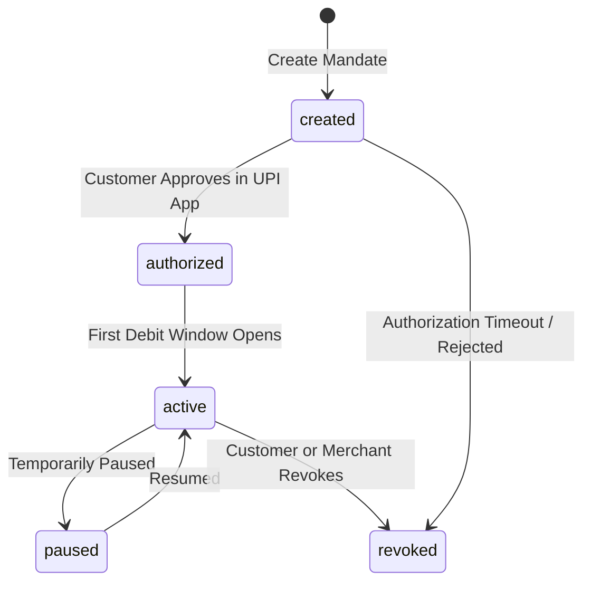
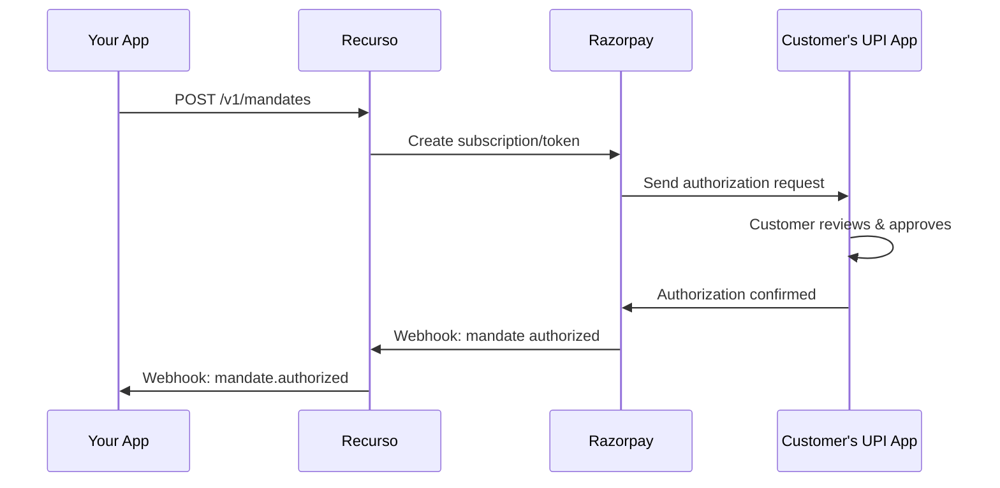

## Overview

UPI Autopay allows Indian customers to authorize recurring payments directly from their UPI-linked bank account. Recurso integrates with Razorpay to manage the full mandate lifecycle:

- **Create mandates** against a customer's VPA (Virtual Payment Address)
- **Authorize** via the customer's UPI app (Google Pay, PhonePe, BHIM, etc.)
- **Auto-debit** on schedule with mandatory pre-debit notifications
- **Revoke** mandates when no longer needed

<Info>
UPI Autopay mandates are governed by NPCI (National Payments Corporation of India) guidelines. Recurso handles pre-debit notifications and frequency rules automatically so you stay compliant.
</Info>

## Mandate Object

| Field | Type | Description |
|-------|------|-------------|
| `id` | `string` | Unique mandate ID (prefixed `mdt_`) |
| `tenant_id` | `string` | Your tenant identifier |
| `customer_id` | `UUID` | The customer this mandate belongs to |
| `subscription_id` | `UUID` | Linked subscription (nullable) |
| `mandate_type` | `string` | Type of mandate (e.g., `upi_autopay`) |
| `payment_method` | `string` | Payment method used |
| `vpa` | `string` | Customer's UPI VPA (e.g., `user@upi`) |
| `razorpay_token_id` | `string` | Razorpay token ID for the mandate |
| `razorpay_subscription_id` | `string` | Razorpay subscription ID (if linked) |
| `max_amount` | `integer` | Maximum debit amount per transaction (in paise) |
| `frequency` | `string` | `weekly`, `monthly`, `quarterly`, or `yearly` |
| `status` | `string` | Current mandate status |
| `authorized_at` | `datetime` | When the customer authorized the mandate |
| `activated_at` | `datetime` | When the mandate became active for debits |
| `revoked_at` | `datetime` | When the mandate was revoked (nullable) |
| `last_debit_at` | `datetime` | Timestamp of the most recent debit |
| `next_debit_at` | `datetime` | Scheduled time for the next debit |
| `pre_debit_notified` | `boolean` | Whether the pre-debit notification was sent for the upcoming debit |
| `created_at` | `datetime` | When the mandate was created |
| `updated_at` | `datetime` | Last update timestamp |

## Mandate Lifecycle



| Status | Description |
|--------|-------------|
| `created` | Mandate created; awaiting customer authorization via UPI app |
| `authorized` | Customer approved the mandate in their UPI app |
| `active` | Mandate is active and debits can be executed |
| `paused` | Mandate temporarily paused; no debits will occur |
| `revoked` | Mandate permanently cancelled; no further debits possible |

## Create a Mandate

Create a UPI autopay mandate for a customer. Optionally link it to a subscription for automatic recurring billing.

<CodeGroup>
```typescript TypeScript
const mandate = await recurso.mandates.create({
  customer_id: 'cust_abc123',
  subscription_id: 'sub_s9n3v7',   // optional
  vpa: 'customer@okicici',
  max_amount: 1000000,              // Rs. 10,000 in paise
  frequency: 'monthly'
});

console.log(mandate.id);     // "mdt_m3k7p9"
console.log(mandate.status); // "created"
```

```bash cURL
curl -X POST https://billing.example.com/v1/mandates \
  -H "Authorization: Bearer $API_KEY" \
  -H "Content-Type: application/json" \
  -d '{
    "customer_id": "cust_abc123",
    "subscription_id": "sub_s9n3v7",
    "vpa": "customer@okicici",
    "max_amount": 1000000,
    "frequency": "monthly"
  }'
```
</CodeGroup>

### Create Parameters

| Parameter | Type | Required | Description |
|-----------|------|----------|-------------|
| `customer_id` | `UUID` | Yes | Customer to create the mandate for |
| `subscription_id` | `UUID` | No | Link mandate to a subscription for auto-billing |
| `vpa` | `string` | Yes | Customer's UPI Virtual Payment Address |
| `max_amount` | `integer` | Yes | Max debit per transaction in paise (must be > 0) |
| `frequency` | `string` | Yes | `weekly`, `monthly`, `quarterly`, or `yearly` |

<Warning>
The `max_amount` must be greater than zero and represents the ceiling for any single debit. Set this to at least the subscription plan amount plus any applicable taxes. Individual debits that exceed `max_amount` will fail.
</Warning>

## Authorization Flow

After mandate creation, the customer must authorize it through their UPI app. Recurso orchestrates this via Razorpay.



<Steps>
  <Step title="Mandate creation">
    Your application calls `POST /v1/mandates`. Recurso creates the mandate in `created` status and registers it with Razorpay.
  </Step>
  <Step title="UPI collect request">
    Razorpay sends a collect request to the customer's UPI VPA. The customer receives a notification in their UPI app.
  </Step>
  <Step title="Customer authorization">
    The customer opens their UPI app, reviews the mandate details (amount, frequency, merchant), and approves it with their UPI PIN.
  </Step>
  <Step title="Mandate activated">
    Once authorized, the mandate transitions through `authorized` to `active`. The `razorpay_token_id` is populated, and Recurso can now execute debits.
  </Step>
</Steps>

<Tip>
Display clear instructions to the customer after mandate creation: "Please check your UPI app and approve the autopay request from [Your Business Name]. The request will expire in 15 minutes."
</Tip>

## Get a Mandate

<CodeGroup>
```typescript TypeScript
const mandate = await recurso.mandates.get('mdt_m3k7p9');

// Returns full mandate object with all fields
console.log(mandate.status);        // "active"
console.log(mandate.next_debit_at); // "2026-07-01T00:00:00Z"
console.log(mandate.pre_debit_notified); // true
```

```bash cURL
curl https://billing.example.com/v1/mandates/mdt_m3k7p9 \
  -H "Authorization: Bearer $API_KEY"
```
</CodeGroup>

## List Mandates

Retrieve all mandates for your tenant.

<CodeGroup>
```typescript TypeScript
const mandates = await recurso.mandates.list();

// Returns
// {
//   data: [
//     { id: 'mdt_m3k7p9', status: 'active', vpa: 'customer@okicici', ... },
//     { id: 'mdt_m5n2r8', status: 'revoked', vpa: 'user@ybl', ... },
//     ...
//   ]
// }
```

```bash cURL
curl https://billing.example.com/v1/mandates \
  -H "Authorization: Bearer $API_KEY"
```
</CodeGroup>

## Pre-Debit Notifications

NPCI mandates that customers must be notified at least 24 hours before any auto-debit. Recurso handles this automatically.

| Step | Timing | Action |
|------|--------|--------|
| Pre-debit notification sent | 24-48 hours before debit | Customer is notified via UPI about the upcoming debit amount and date |
| `pre_debit_notified` set to `true` | After notification delivery | Recurso updates the mandate record |
| Debit executed | On `next_debit_at` | Payment is collected from the customer's linked bank account |
| `last_debit_at` updated | After successful debit | Recurso updates the timestamp and schedules the next debit |

<Info>
If the pre-debit notification fails (e.g., UPI service downtime), the debit will not be attempted. Recurso will retry the notification and reschedule the debit accordingly.
</Info>

## Revoke a Mandate

Permanently cancel a mandate. No further debits will be executed.

<CodeGroup>
```typescript TypeScript
const revoked = await recurso.mandates.revoke('mdt_m3k7p9');

console.log(revoked.status);     // "revoked"
console.log(revoked.revoked_at); // "2026-06-23T16:00:00Z"
```

```bash cURL
curl -X POST https://billing.example.com/v1/mandates/mdt_m3k7p9/revoke \
  -H "Authorization: Bearer $API_KEY"
```
</CodeGroup>

<Warning>
Revoking a mandate is irreversible. If the mandate is linked to a subscription, the subscription will need a new payment method to continue billing. Consider pausing the subscription first if the customer intends to set up a new mandate.
</Warning>

## Linking Mandates to Subscriptions

When a `subscription_id` is provided during mandate creation, Recurso automatically uses the mandate to collect recurring payments for that subscription.

```typescript
// Create a subscription
const subscription = await recurso.subscriptions.create({
  customer_id: 'cust_abc123',
  plan_id: 'plan_pro',
  payment_gateway: 'razorpay'
});

// Create a mandate linked to the subscription
const mandate = await recurso.mandates.create({
  customer_id: 'cust_abc123',
  subscription_id: subscription.id,
  vpa: 'customer@okicici',
  max_amount: 1000000,
  frequency: 'monthly'
});

// Once authorized, subscription invoices are auto-collected via UPI
```

### How Linked Billing Works

1. When the subscription's billing cycle triggers a new invoice, Recurso checks for an active mandate.
2. A pre-debit notification is sent to the customer 24 hours before the scheduled debit.
3. On the debit date, the invoice amount is collected from the customer's bank account via UPI.
4. The invoice is marked as `paid` and the mandate's `last_debit_at` and `next_debit_at` are updated.

## Frequency Options

| Frequency | Description | Use Case |
|-----------|-------------|----------|
| `weekly` | Debit once per week | Weekly SaaS plans, micro-subscriptions |
| `monthly` | Debit once per month | Standard monthly subscriptions |
| `quarterly` | Debit once per quarter | Quarterly billing cycles |
| `yearly` | Debit once per year | Annual subscriptions |

<Tip>
Match the mandate `frequency` to the subscription billing interval. A monthly subscription should use a `monthly` mandate frequency.
</Tip>

## Webhooks

| Event | Description |
|-------|-------------|
| `mandate.created` | Mandate created; awaiting authorization |
| `mandate.authorized` | Customer authorized the mandate via UPI app |
| `mandate.activated` | Mandate is now active and ready for debits |
| `mandate.paused` | Mandate was temporarily paused |
| `mandate.revoked` | Mandate was permanently revoked |
| `mandate.debit.success` | Auto-debit executed successfully |
| `mandate.debit.failed` | Auto-debit failed (insufficient funds, etc.) |
| `mandate.pre_debit_notified` | Pre-debit notification sent to customer |

### Example Webhook Payload

```json
{
  "event": "mandate.authorized",
  "data": {
    "id": "mdt_m3k7p9",
    "customer_id": "cust_abc123",
    "subscription_id": "sub_s9n3v7",
    "vpa": "customer@okicici",
    "max_amount": 1000000,
    "frequency": "monthly",
    "status": "authorized",
    "authorized_at": "2026-06-23T12:30:00Z",
    "razorpay_token_id": "token_abc123xyz"
  }
}
```

## Best Practices

<AccordionGroup>
  <Accordion title="Set max_amount with headroom">
    Set `max_amount` higher than the current plan price to accommodate tax variations, plan upgrades, or price changes. A good rule is 1.5x the expected debit amount. If the actual debit exceeds `max_amount`, the payment will fail and require a new mandate.
  </Accordion>
  <Accordion title="Handle authorization timeouts gracefully">
    UPI authorization requests typically expire in 15 minutes. If the customer does not approve in time, the mandate remains in `created` status. Show a re-initiation option in your UI and listen for the `mandate.authorized` webhook to update the UI in real time.
  </Accordion>
  <Accordion title="Monitor debit failures">
    Subscribe to `mandate.debit.failed` events. Common failure reasons include insufficient funds, bank server errors, or customer-initiated blocks. Implement retry logic and notify the customer to ensure their bank account has sufficient balance.
  </Accordion>
  <Accordion title="Validate VPA before mandate creation">
    Verify the customer's VPA is valid and active before creating a mandate. An invalid VPA will cause the authorization request to fail silently. Use Razorpay's VPA validation API for this check.
  </Accordion>
  <Accordion title="Keep customers informed throughout the lifecycle">
    Send notifications at each stage: when the mandate is created (with approval instructions), when it is authorized, before each debit (in addition to the NPCI-mandated notification), and if a debit fails. Clear communication reduces mandate revocations and support tickets.
  </Accordion>
  <Accordion title="Plan for mandate revocations">
    Customers can revoke mandates at any time from their UPI app, bypassing your API. Listen for the `mandate.revoked` webhook and promptly handle the subscription impact -- notify the customer and offer alternative payment methods.
  </Accordion>
</AccordionGroup>
