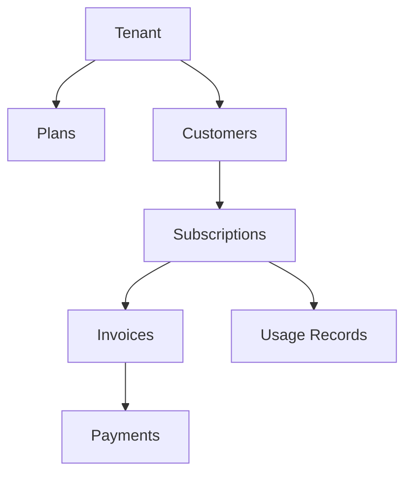
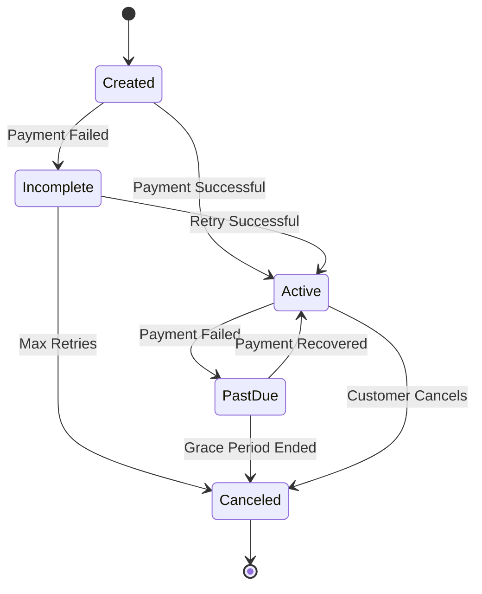

## Overview

Recurso uses a simple hierarchy of objects to manage billing:



## Tenants

A **Tenant** represents your business or a customer's business in multi-tenant setups.

| Field | Description |
|-------|-------------|
| `id` | Unique identifier |
| `name` | Business name |
| `gstin` | GST number (for Indian businesses) |
| `settings` | Billing preferences |

<Info>
Most single-product SaaS companies will have just one tenant.
</Info>

## Plans

A **Plan** defines what you're selling and how much it costs.

```typescript
const plan = {
  id: 'plan_pro',
  name: 'Pro Plan',
  description: 'For growing teams',
  interval: 'month',        // month, year, week, day
  interval_count: 1,        // e.g., 2 for bimonthly
  prices: [
    { amount: 4999, currency: 'INR' },
    { amount: 999, currency: 'USD' }
  ],
  trial_days: 14,
  features: ['Unlimited users', 'Priority support']
};
```

### Pricing Models

<AccordionGroup>
  <Accordion title="Flat Rate" icon="dollar-sign">
    Fixed price per billing period.
    ```typescript
    { amount: 4999, currency: 'INR' }
    ```
  </Accordion>
  <Accordion title="Per-Seat" icon="users">
    Price based on number of users/seats.
    ```typescript
    { amount: 499, currency: 'INR', billing_scheme: 'per_unit' }
    ```
  </Accordion>
  <Accordion title="Usage-Based" icon="chart-line">
    Price based on consumption (API calls, storage, etc.)
    ```typescript
    { 
      billing_scheme: 'tiered',
      tiers: [
        { up_to: 1000, unit_amount: 0.10 },
        { up_to: 10000, unit_amount: 0.05 },
        { up_to: 'inf', unit_amount: 0.01 }
      ]
    }
    ```
  </Accordion>
</AccordionGroup>

## Customers

A **Customer** is someone who pays you.

```typescript
const customer = {
  id: 'cust_abc123',
  name: 'Acme Corp',
  email: 'billing@acme.com',
  phone: '+919876543210',
  gstin: '29ABCDE1234F1Z5',  // Optional, for B2B
  address: {
    line1: '123 Main St',
    city: 'Bangalore',
    state: 'Karnataka',
    postal_code: '560001',
    country: 'IN'
  }
};
```

## Subscriptions

A **Subscription** connects a customer to a plan.

```typescript
const subscription = {
  id: 'sub_xyz789',
  customer_id: 'cust_abc123',
  plan_id: 'plan_pro',
  status: 'active',
  current_period_start: '2024-01-01T00:00:00Z',
  current_period_end: '2024-02-01T00:00:00Z',
  billing_anchor: 1,  // Day of month to bill
  cancel_at_period_end: false
};
```

### Subscription States



| Status | Description |
|--------|-------------|
| `created` | Subscription created, awaiting first payment |
| `active` | Subscription is active and paid |
| `past_due` | Payment failed, in dunning |
| `incomplete` | Initial payment failed |
| `canceled` | Subscription ended |
| `trialing` | In trial period |

## Invoices

An **Invoice** is a record of what the customer owes.

```typescript
const invoice = {
  id: 'inv_001',
  customer_id: 'cust_abc123',
  subscription_id: 'sub_xyz789',
  invoice_number: 'REC/2024/0001',
  status: 'paid',
  currency: 'INR',
  subtotal: 4999,
  tax_amount: 900,  // 18% GST
  total: 5899,
  due_date: '2024-01-15T00:00:00Z',
  paid_at: '2024-01-10T12:30:00Z'
};
```

### Invoice States

| Status | Description |
|--------|-------------|
| `draft` | Not yet finalized |
| `open` | Awaiting payment |
| `paid` | Payment received |
| `past_due` | Payment overdue |
| `uncollectible` | Marked as bad debt |
| `void` | Cancelled |

## Payments

A **Payment** records successful transactions.

```typescript
const payment = {
  id: 'pay_123',
  invoice_id: 'inv_001',
  amount: 5899,
  currency: 'INR',
  status: 'succeeded',
  gateway: 'razorpay',
  gateway_payment_id: 'pay_AbCdEf123456'
};
```

## Webhooks

Webhooks notify your app about billing events.

| Event | Description |
|-------|-------------|
| `subscription.created` | New subscription |
| `subscription.activated` | Subscription became active |
| `subscription.cancelled` | Subscription cancelled |
| `payment.succeeded` | Payment received |
| `payment.failed` | Payment failed |
| `invoice.created` | New invoice generated |
| `invoice.paid` | Invoice paid |

## Next Steps

<CardGroup cols={2}>
  <Card title="Plans" icon="list" href="/core/plans">
    Create and manage pricing plans
  </Card>
  <Card title="Subscriptions" icon="repeat" href="/core/subscriptions">
    Manage customer subscriptions
  </Card>
</CardGroup>
