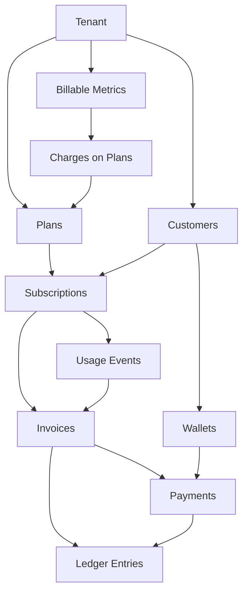
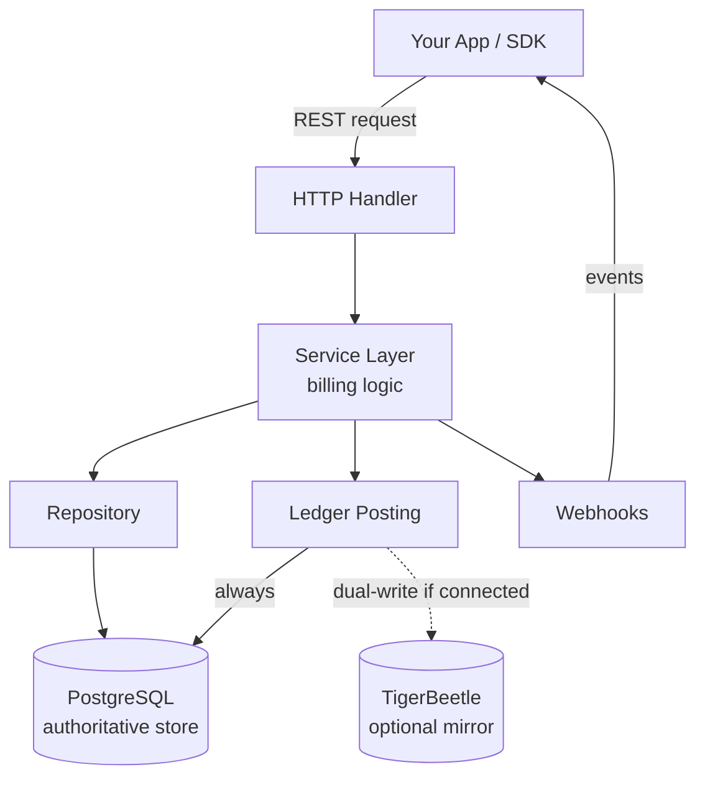
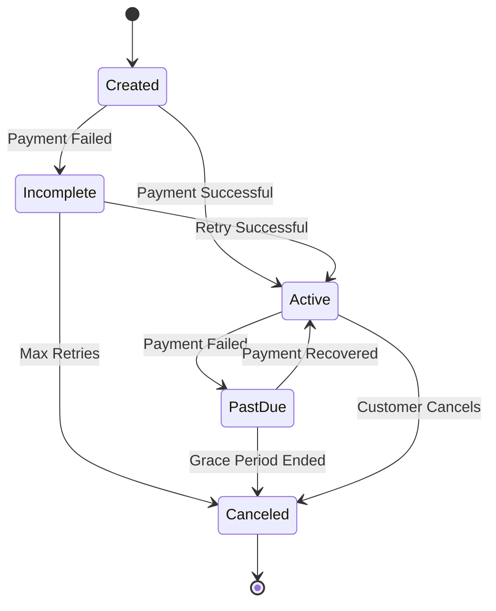

## Overview

Recurso uses a simple hierarchy of objects to manage billing. A **plan** (flat
prices plus usage **charges**) and a **customer** meet in a **subscription**,
which generates **invoices** each cycle — flat fees in advance, metered usage
in arrears. **Payments** settle those invoices (draining any prepaid
**wallet** first), and every financial movement lands in the **ledger**.


```mermaid
graph TD
    A[Tenant] --> B[Plans]
    A --> C[Customers]
    A --> M[Billable Metrics]
    B --> D[Subscriptions]
    C --> D
    M --> K[Charges on Plans]
    K --> B
    D --> E[Invoices]
    E --> F[Payments]
    D --> G[Usage Events]
    G --> E
    C --> W[Wallets]
    W --> F
    E --> H[Ledger Entries]
    F --> H
```

## Architecture

Every request flows through the same layers, and every financial event is written
to a proper set of books. Recurso keeps a **double-entry ledger** with PostgreSQL
as the authoritative store; when a [TigerBeetle](https://tigerbeetle.com) backend
is connected, each posting is also dual-written to it as an optional
high-throughput mirror.


```mermaid
flowchart TD
    Client["Your App / SDK"] -->|REST request| API["HTTP Handler"]
    API --> SVC["Service Layer<br/>billing logic"]
    SVC --> REPO["Repository"]
    REPO --> PG[("PostgreSQL<br/>authoritative store")]
    SVC --> LEDGER["Ledger Posting"]
    LEDGER -->|always| PG
    LEDGER -.->|dual-write if connected| TB[("TigerBeetle<br/>optional mirror")]
    SVC --> WH["Webhooks"]
    WH -->|events| Client
```

<Info>
PostgreSQL is always authoritative. TigerBeetle is optional and reconciled
against Postgres by transaction ID — see the [Double-Entry Ledger](/advanced/ledger)
guide.
</Info>

## Tenants

A **Tenant** represents your business or a customer's business in multi-tenant setups.

| Field | Description |
|-------|-------------|
| `id` | Unique identifier |
| `name` | Business name |
| `gstin` | GST number (for Indian businesses) |
| `settings` | Billing preferences |

<Info>
Most single-product SaaS companies will have just one tenant.
</Info>

## Plans

A **Plan** defines what you're selling and how much it costs.

```typescript
const plan = {
  id: 'plan_pro',
  name: 'Pro Plan',
  description: 'For growing teams',
  interval: 'month',        // month, year, week, day
  interval_count: 1,        // e.g., 2 for bimonthly
  prices: [
    { amount: 4999, currency: 'INR' },
    { amount: 999, currency: 'USD' }
  ],
  trial_days: 14,
  features: ['Unlimited users', 'Priority support']
};
```

### Pricing Models

A plan combines **flat prices** (billed in advance) with optional **usage
charges** (billed in arrears at period close). A plan holding both is
*hybrid* — one invoice carries the flat fee and the metered lines.

<AccordionGroup>
  <Accordion title="Flat rate" icon="dollar-sign">
    Fixed price per billing period, per currency, in minor units.
    ```json
    { "amount": 4999, "currency": "INR", "type": "recurring" }
    ```
  </Accordion>
  <Accordion title="Per-unit usage" icon="chart-line">
    Every metered unit at one rate — decimal strings support sub-paise
    pricing like ₹0.0035/call.
    ```json
    { "charge_model": "per_unit",
      "amounts": { "INR": { "unit_amount": "0.0035" } } }
    ```
  </Accordion>
  <Accordion title="Graduated & volume tiers" icon="layer-group">
    Graduated prices each band's units at its own rate; volume prices the
    whole quantity at the tier it reaches.
    ```json
    { "charge_model": "graduated",
      "amounts": { "INR": { "tiers": [
        { "up_to": 10000, "unit_amount": "0" },
        { "up_to": null,  "unit_amount": "0.05" }
      ]}}}
    ```
  </Accordion>
  <Accordion title="Package" icon="box">
    Bundles that round up: ₹5.00 per 1,000 calls.
    ```json
    { "charge_model": "package",
      "amounts": { "INR": { "package_amount": 500, "package_size": 1000 } } }
    ```
  </Accordion>
</AccordionGroup>

See the [Usage-Based Billing guide](/advanced/usage-billing) for the full
pipeline from event to invoice line.

## Customers

A **Customer** is someone who pays you.

```typescript
const customer = {
  id: 'cust_abc123',
  name: 'Acme Corp',
  email: 'billing@acme.com',
  phone: '+919876543210',
  gstin: '29ABCDE1234F1Z5',  // Optional, for B2B
  address: {
    line1: '123 Main St',
    city: 'Bangalore',
    state: 'Karnataka',
    postal_code: '560001',
    country: 'IN'
  }
};
```

## Subscriptions

A **Subscription** connects a customer to a plan.

```typescript
const subscription = {
  id: 'sub_xyz789',
  customer_id: 'cust_abc123',
  plan_id: 'plan_pro',
  status: 'active',
  current_period_start: '2024-01-01T00:00:00Z',
  current_period_end: '2024-02-01T00:00:00Z',
  billing_anchor: 1,  // Day of month to bill
  cancel_at_period_end: false
};
```

### Subscription States


```mermaid
stateDiagram-v2
    [*] --> Created
    Created --> Active: Payment Successful
    Created --> Incomplete: Payment Failed
    Incomplete --> Active: Retry Successful
    Incomplete --> Canceled: Max Retries
    Active --> PastDue: Payment Failed
    PastDue --> Active: Payment Recovered
    PastDue --> Canceled: Grace Period Ended
    Active --> Canceled: Customer Cancels
    Canceled --> [*]
```

| Status | Description |
|--------|-------------|
| `created` | Subscription created, awaiting first payment |
| `active` | Subscription is active and paid |
| `past_due` | Payment failed, in dunning |
| `incomplete` | Initial payment failed |
| `canceled` | Subscription ended |
| `trialing` | In trial period |

## Invoices

An **Invoice** is a record of what the customer owes.

```typescript
const invoice = {
  id: 'inv_001',
  customer_id: 'cust_abc123',
  subscription_id: 'sub_xyz789',
  invoice_number: 'REC/2024/0001',
  status: 'paid',
  currency: 'INR',
  subtotal: 4999,
  tax_amount: 900,  // 18% GST
  total: 5899,
  due_date: '2024-01-15T00:00:00Z',
  paid_at: '2024-01-10T12:30:00Z'
};
```

### Invoice States

| Status | Description |
|--------|-------------|
| `draft` | Not yet finalized |
| `open` | Awaiting payment |
| `paid` | Payment received |
| `past_due` | Payment overdue |
| `uncollectible` | Marked as bad debt |
| `void` | Cancelled |

## Payments

A **Payment** records successful transactions.

```typescript
const payment = {
  id: 'pay_123',
  invoice_id: 'inv_001',
  amount: 5899,
  currency: 'INR',
  status: 'succeeded',
  gateway: 'razorpay',
  gateway_payment_id: 'pay_AbCdEf123456'
};
```

## Billable Metrics & Usage

A **billable metric** is a named meter over usage events — its `code`
doubles as the event `dimension` it aggregates (`count`, `sum`, `max`, or
`unique` property values). Events ingest one at a time or in batches of
500, with optional `transaction_id` idempotency so retries never
double-count. At period close, each charge on the plan aggregates the
elapsed period's events and prices them onto the renewal invoice — exactly
once, guarded by a rated-window claim.

## Wallets, Commitments & Alerts

- **Wallets** hold prepaid balance per customer and currency. Invoices
  drain the wallet *before* credit notes and the payment gateway;
  promotional credit can expire, and auto-recharge tops balances up from
  the saved payment method. ([guide](/advanced/wallets))
- **Commitments** set a per-period revenue floor: shortfalls bill an
  automatic true-up line at period close. ([guide](/advanced/commitments))
- **Usage alerts** watch a metric against a threshold — absolute or a
  percent of the entitlement limit — and fire once per billing period via
  webhook and email. ([guide](/advanced/usage-alerts))

## Webhooks

Webhooks notify your app about billing events.

| Event | Description |
|-------|-------------|
| `subscription.created` | New subscription |
| `subscription.activated` | Subscription became active |
| `subscription.cancelled` | Subscription cancelled |
| `payment.succeeded` | Payment received |
| `payment.failed` | Payment failed |
| `invoice.created` | New invoice generated |
| `invoice.paid` | Invoice paid |

## Next Steps

<CardGroup cols={2}>
  <Card title="Plans" icon="list" href="/core/plans">
    Create and manage pricing plans
  </Card>
  <Card title="Subscriptions" icon="repeat" href="/core/subscriptions">
    Manage customer subscriptions
  </Card>
</CardGroup>
