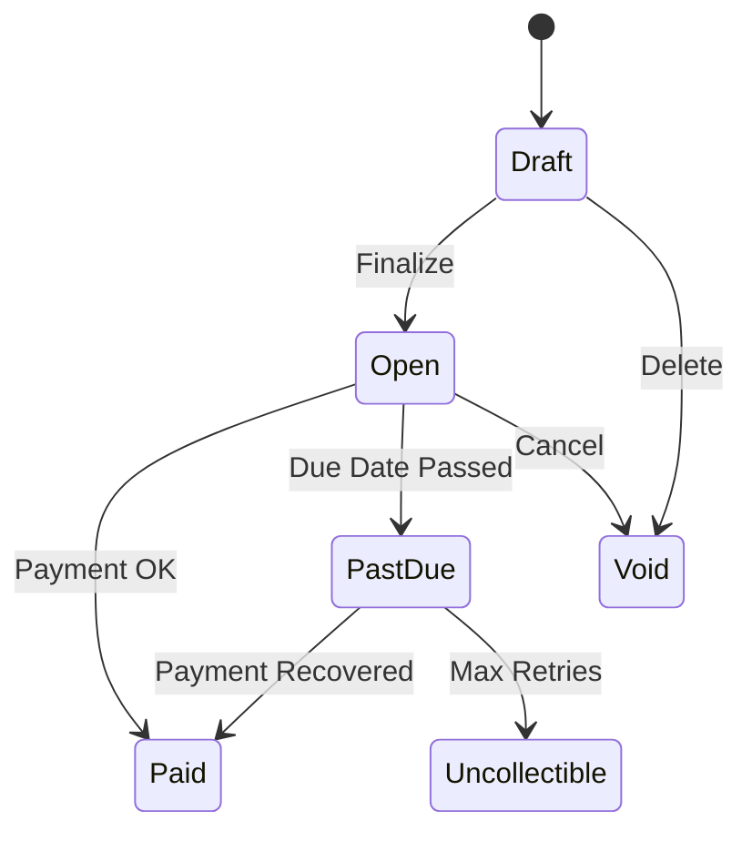

## Overview

Invoices are automatically generated when:
- A subscription is created (first invoice)
- A billing cycle ends (recurring invoices)
- Usage is metered (usage invoices)
- A one-off charge is added

## Invoice Lifecycle



| Status | Description |
|--------|-------------|
| `draft` | Being composed, not visible to customer |
| `open` | Finalized, awaiting payment |
| `paid` | Payment received in full |
| `past_due` | Due date passed, in dunning |
| `uncollectible` | Written off as bad debt |
| `void` | Cancelled, no longer valid |

## Get an Invoice

```typescript
const invoice = await recurso.invoices.get('inv_001');

// Returns
{
  id: 'inv_001',
  invoice_number: 'REC/2024/0001',
  customer_id: 'cust_abc123',
  subscription_id: 'sub_xyz',
  status: 'open',
  
  // Amounts (in smallest currency unit)
  currency: 'INR',
  subtotal: 4999,
  tax_amount: 900,
  total: 5899,
  amount_paid: 0,
  amount_due: 5899,
  
  // Dates
  created_at: '2024-01-01T00:00:00Z',
  due_date: '2024-01-15T00:00:00Z',
  
  // Line items
  lines: [
    {
      description: 'Pro Plan - Jan 2024',
      quantity: 1,
      unit_amount: 4999,
      amount: 4999
    }
  ],
  
  // GST details (India)
  gstin: '29ABCDE1234F1Z5',
  cgst_amount: 450,
  sgst_amount: 450,
  hsn_code: '998311'
}
```

## List Invoices

```typescript
const invoices = await recurso.invoices.list({
  customer_id: 'cust_abc123',
  status: 'open',
  limit: 20
});
```

## GST Invoicing (India)

For Indian businesses, Recurso generates GST-compliant invoices:

```typescript
// Automatically included for Indian invoices:
{
  gstin: '29ABCDE1234F1Z5',        // Customer GSTIN
  seller_gstin: '27BBBBB0000B1Z5', // Your GSTIN
  place_of_supply: 'Karnataka',
  
  // Interstate (IGST) or Intrastate (CGST+SGST)
  igst_amount: 0,
  cgst_amount: 450,
  sgst_amount: 450,
  
  hsn_code: '998311',  // SAC for SaaS services
  irn: 'xxx',          // E-invoice IRN
  qr_code: 'xxx'       // Signed QR (for e-invoices)
}
```

<Info>
GST is calculated automatically based on seller/buyer state codes. Same state = CGST+SGST, different state = IGST.
</Info>

## Download PDF

```typescript
// Get PDF as buffer
const pdf = await recurso.invoices.pdf('inv_001');

// Or get a signed URL
const { url } = await recurso.invoices.pdfUrl('inv_001');
// URL valid for 1 hour
```

## Pay an Invoice

```typescript
// Collect payment manually
const payment = await recurso.invoices.pay('inv_001');

// Or send payment link to customer
const { payment_url } = await recurso.invoices.paymentLink('inv_001');
// https://pay.yourapp.com/inv/xxx
```

## Void an Invoice

Cancel an invoice (no refund generated):

```typescript
await recurso.invoices.void('inv_001');
```

## Credit Notes

Issue refunds through credit notes:

```typescript
const creditNote = await recurso.creditNotes.create({
  invoice_id: 'inv_001',
  amount: 2500,  // Partial refund
  reason: 'Customer requested downgrade'
});
```

## Webhooks

| Event | Description |
|-------|-------------|
| `invoice.created` | New invoice generated |
| `invoice.finalized` | Invoice ready for payment |
| `invoice.paid` | Payment received |
| `invoice.payment_failed` | Payment attempt failed |
| `invoice.past_due` | Invoice overdue |
