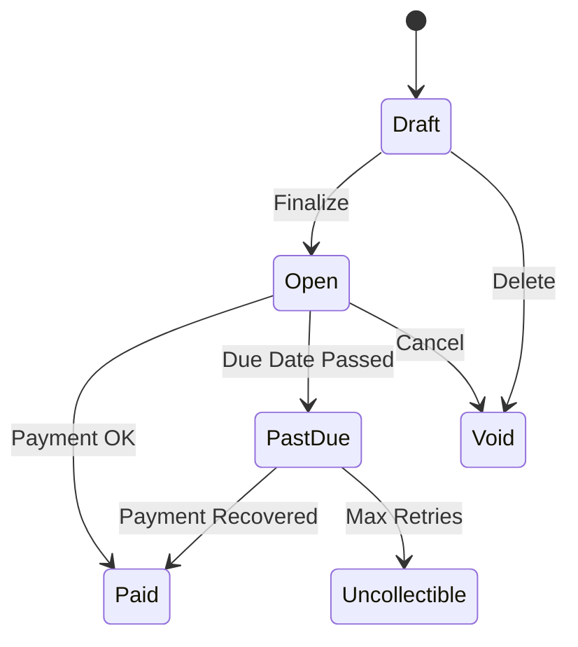

## Overview

Invoices are automatically generated when:
- A subscription is created (first invoice)
- A billing cycle ends (recurring invoices)
- Usage is metered (usage invoices)
- A one-off charge is added

## Invoice Lifecycle


```mermaid
stateDiagram-v2
    [*] --> Draft
    Draft --> Open: Finalize
    Open --> Paid: Payment OK
    Open --> PastDue: Due Date Passed
    PastDue --> Paid: Payment Recovered
    PastDue --> Uncollectible: Max Retries
    Draft --> Void: Delete
    Open --> Void: Cancel
```

| Status | Description |
|--------|-------------|
| `draft` | Being composed, not visible to customer |
| `open` | Finalized, awaiting payment |
| `paid` | Payment received in full |
| `past_due` | Due date passed, in dunning |
| `uncollectible` | Written off as bad debt |
| `void` | Cancelled, no longer valid |

## The Invoice Object

Invoices come back from `GET /v1/invoices` (and inside subscription and
checkout responses). The shape, on real fields:

```json
{
  "id": "9b2f6c1e-…",
  "invoice_number": "INV-2026-0042",
  "customer_id": "…",
  "subscription_id": "…",
  "billing_reason": "subscription_cycle",
  "status": "open",

  "currency": "INR",
  "subtotal": 499900,
  "tax_amount": 89982,
  "total": 589882,
  "amount_paid": 0,
  "credit_applied": 0,
  "amount_due": 589882,

  "cgst_amount": 44991,
  "sgst_amount": 44991,
  "igst_amount": 0,
  "hsn_code": "998314",
  "irn": "8f21…c4d9",
  "e_invoice_status": "generated",
  "tds_amount": 0,

  "line_items": [
    { "description": "Pro Plan", "quantity": 1, "unit_amount": 499900, "amount": 499900 }
  ],
  "created_at": "2026-07-01T00:00:00Z"
}
```

<Note>
All amounts are minor units. `amount_due = total − amount_paid −
credit_applied` — account credit from adjustment credit notes applies at
billing time while `total` stays gross. Each line item is taxed at its own
HSN/SAC rate.
</Note>

## List Invoices

```bash
curl https://api.recurso.dev/v1/invoices \
  -H "Authorization: Bearer $API_KEY"
```

Returns every invoice for the tenant, newest first. There are no query
filters on this endpoint today — filter client-side, or start from a
subscription's invoices in the dashboard.

## GST Invoicing (India)

For Indian businesses, Recurso generates GST-compliant invoices:

```typescript
// Automatically included for Indian invoices:
{
  gstin: '29ABCDE1234F1Z5',        // Customer GSTIN
  seller_gstin: '27BBBBB0000B1Z5', // Your GSTIN
  place_of_supply: 'Karnataka',

  // Interstate (IGST) or Intrastate (CGST+SGST)
  igst_amount: 0,
  cgst_amount: 450,
  sgst_amount: 450,

  hsn_code: '998311',  // SAC for SaaS services
  irn: 'xxx',          // E-invoice IRN
  qr_code: 'xxx'       // Signed QR (for e-invoices)
}
```

<Info>
GST is calculated automatically based on seller/buyer state codes. Same state = CGST+SGST, different state = IGST. See the [GST Invoicing guide](/compliance/gst-invoicing) for configuration.
</Info>

## Download PDF

Generate and download invoice PDFs:

<CodeGroup>
```typescript TypeScript
// Fetch the print-ready document (HTML; print-to-PDF in the browser)
const doc = await recurso.invoices.pdf('9b2f6c1e-...');
```

```bash cURL
# Authenticated + tenant-scoped — invoices are never publicly fetchable by UUID
curl https://api.recurso.dev/v1/invoices/9b2f6c1e-.../pdf \
  -H "Authorization: Bearer $API_KEY" \
  -o invoice.html
```
</CodeGroup>

The rendering is jurisdiction-aware (India-GST tax invoice vs. plain invoice) and requires authentication — see the [endpoint reference](/api-reference/invoices/pdf).

## Invoice Preview (HTML)

`GET /v1/invoices/{id}/preview` returns the same tenant-scoped,
authenticated rendering as the PDF endpoint, as HTML — useful for showing
an invoice inline in your own UI:

```bash
curl https://api.recurso.dev/v1/invoices/{invoice_id}/preview \
  -H "Authorization: Bearer $API_KEY"
```

<Note>
This renders an **existing** invoice. To estimate a plan change before
committing it, use the proration preview on the subscription — see
[Upgrade / Downgrade](/core/subscriptions#upgrade--downgrade).
</Note>

## Payment Wall

Dunning campaigns can raise a **payment wall** on an overdue invoice —
the customer portal then blocks usage-related pages until it is settled.
Check whether the wall is active:

```bash
curl https://api.recurso.dev/v1/invoices/{invoice_id}/payment-wall \
  -H "Authorization: Bearer $API_KEY"
```

```json
{ "invoice_id": "…", "payment_wall_active": true }
```

See [Dunning Campaigns](/advanced/dunning-campaigns) for configuring wall
steps.

## Paying an Invoice

Customers pay on Recurso's **hosted checkout** — there is no server-side
"pay" API (card data never touches your backend):

```text
https://billing.example.com/checkout/{invoice_id}
```

The checkout creates the gateway order, drives Stripe's Payment Element or
Razorpay Checkout.js, verifies settlement server-side, and posts the
payment through the ledger. Offline settlements (bank transfer, cheque)
are recorded with
[`POST /v1/payments/offline`](/api-reference/payments/record-offline).
See [Payments](/core/payments) for the full flow.

## Due Date Calculation

Invoice due dates are determined by the subscription's payment terms:

| Payment Terms | Invoice Date | Due Date |
|---------------|-------------|----------|
| `net0` | Jan 1 | Jan 1 |
| `net15` | Jan 1 | Jan 16 |
| `net30` | Jan 1 | Jan 31 |
| `net60` | Jan 1 | Mar 2 |

If no payment terms are set on the subscription, the default is `net0` (due immediately).

See the [Subscriptions guide](/core/subscriptions#payment-terms) for configuring payment terms.

## E-Invoice Status

For invoices subject to India's e-invoicing rules, check the IRN state at
`GET /v1/invoices/{id}/einvoice`:

```bash
curl https://api.recurso.dev/v1/invoices/{invoice_id}/einvoice \
  -H "Authorization: Bearer $API_KEY"
```

```json
{
  "data": {
    "invoice_id": "…",
    "invoice_number": "INV-2026-0042",
    "e_invoice_status": "generated",
    "irn": "8f21…c4d9",
    "ack_no": "112010036563",
    "ack_date": "2026-07-11 10:30:00",
    "signed_qr_code": "…",
    "retry_count": 0,
    "next_retry_at": null
  }
}
```

Failed generations retry automatically with backoff; you can also force
one with [`POST /v1/invoices/{id}/einvoice/retry`](/api-reference/einvoice/retry)
or cancel the IRN within the 24-hour window via
[`POST /v1/invoices/{id}/einvoice/cancel`](/api-reference/einvoice/cancel).
See the [E-Invoicing guide](/compliance/e-invoicing) for IRP configuration.

## Multi-Currency Invoices

Invoices are generated in the **subscription's currency** — a USD plan
bills a USD invoice, end to end. Invoices don't store an exchange rate;
FX normalization happens at the reporting layer, where MRR and revenue
are converted to your reporting currency with daily rates. See the
[Multi-Currency guide](/advanced/multi-currency).

<Note>
Tax on an invoice depends on the seller's jurisdiction: India uses GST
(see [GST Invoicing](/compliance/gst-invoicing)); US sellers get live
jurisdiction-level sales tax via TaxJar — or an honest 0% marked
`sales_tax_stub` when TaxJar is not configured (see
[US Sales Tax](/compliance/us-sales-tax)).
</Note>

## Advance Invoicing

Bill a subscription ahead of schedule — useful for customers who want to
prepay:

```bash
curl -X POST https://api.recurso.dev/v1/subscriptions/{subscription_id}/advance \
  -H "Authorization: Bearer $API_KEY" \
  -H "Content-Type: application/json" \
  -d '{ "periods": 3 }'
```

Returns the created invoice covering the next 3 billing periods. One-off
charges outside the cycle use
[`POST /v1/subscriptions/{id}/charges`](/advanced/advanced-billing).

## Adjustments & Refunds

There is no void endpoint — issued invoices are adjusted the accounting
way, with **credit notes** (full or partial, refund or account credit):

```bash
curl -X POST https://api.recurso.dev/v1/credit-notes \
  -H "Authorization: Bearer $API_KEY" \
  -H "Content-Type: application/json" \
  -d '{
    "type": "adjustment",
    "customer_id": "…",
    "invoice_id": "…",
    "amount": 250000,
    "currency": "INR",
    "reason": "Customer requested downgrade"
  }'
```

See the [Credit Notes guide](/advanced/credit-notes) for full credit note management.

## Webhooks

| Event | Description |
|-------|-------------|
| `invoice.created` | New invoice generated |
| `invoice.paid` | Payment received and settled through the ledger |
| `invoice.payment_failed` | Payment attempt failed (dunning may start) |
