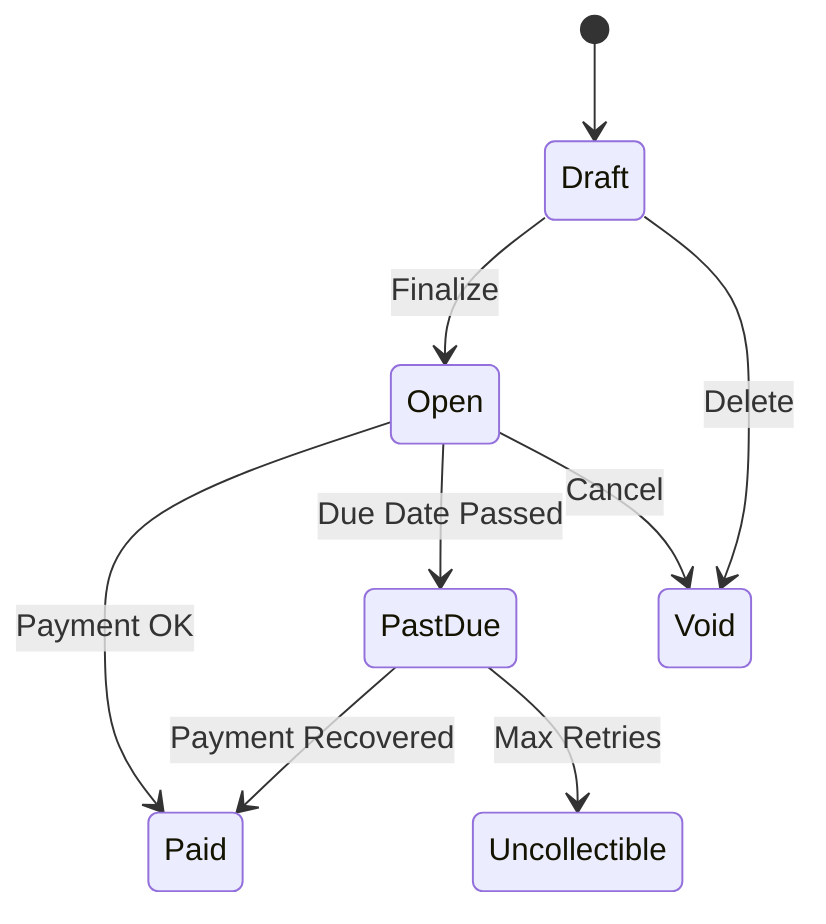

## Overview

Invoices are automatically generated when:
- A subscription is created (first invoice)
- A billing cycle ends (recurring invoices)
- Usage is metered (usage invoices)
- A one-off charge is added

## Invoice Lifecycle


```mermaid
stateDiagram-v2
    [*] --> Draft
    Draft --> Open: Finalize
    Open --> Paid: Payment OK
    Open --> PastDue: Due Date Passed
    PastDue --> Paid: Payment Recovered
    PastDue --> Uncollectible: Max Retries
    Draft --> Void: Delete
    Open --> Void: Cancel
```

| Status | Description |
|--------|-------------|
| `draft` | Being composed, not visible to customer |
| `open` | Finalized, awaiting payment |
| `paid` | Payment received in full |
| `past_due` | Due date passed, in dunning |
| `uncollectible` | Written off as bad debt |
| `void` | Cancelled, no longer valid |

## Get an Invoice

```typescript
const invoice = await recurso.invoices.get('inv_001');

// Returns
{
  id: 'inv_001',
  invoice_number: 'REC/2024/0001',
  customer_id: 'cust_abc123',
  subscription_id: 'sub_xyz',
  status: 'open',

  // Amounts (in smallest currency unit)
  currency: 'INR',
  subtotal: 4999,
  tax_amount: 900,
  total: 5899,
  amount_paid: 0,
  amount_due: 5899,

  // Dates
  created_at: '2024-01-01T00:00:00Z',
  due_date: '2024-01-15T00:00:00Z',

  // Line items
  lines: [
    {
      description: 'Pro Plan - Jan 2024',
      quantity: 1,
      unit_amount: 4999,
      amount: 4999
    }
  ],

  // GST details (India)
  gstin: '29ABCDE1234F1Z5',
  cgst_amount: 450,
  sgst_amount: 450,
  hsn_code: '998311'
}
```

## List Invoices

```typescript
const invoices = await recurso.invoices.list({
  customer_id: 'cust_abc123',
  status: 'open',
  limit: 20
});
```

## GST Invoicing (India)

For Indian businesses, Recurso generates GST-compliant invoices:

```typescript
// Automatically included for Indian invoices:
{
  gstin: '29ABCDE1234F1Z5',        // Customer GSTIN
  seller_gstin: '27BBBBB0000B1Z5', // Your GSTIN
  place_of_supply: 'Karnataka',

  // Interstate (IGST) or Intrastate (CGST+SGST)
  igst_amount: 0,
  cgst_amount: 450,
  sgst_amount: 450,

  hsn_code: '998311',  // SAC for SaaS services
  irn: 'xxx',          // E-invoice IRN
  qr_code: 'xxx'       // Signed QR (for e-invoices)
}
```

<Info>
GST is calculated automatically based on seller/buyer state codes. Same state = CGST+SGST, different state = IGST. See the [GST Invoicing guide](/compliance/gst-invoicing) for configuration.
</Info>

## Download PDF

Generate and download invoice PDFs:

<CodeGroup>
```typescript TypeScript
// Fetch the print-ready document (HTML; print-to-PDF in the browser)
const doc = await recurso.invoices.pdf('9b2f6c1e-...');
```

```bash cURL
# Authenticated + tenant-scoped — invoices are never publicly fetchable by UUID
curl https://api.recurso.dev/v1/invoices/9b2f6c1e-.../pdf \
  -H "Authorization: Bearer $API_KEY" \
  -o invoice.html
```
</CodeGroup>

The rendering is jurisdiction-aware (India-GST tax invoice vs. plain invoice) and requires authentication — see the [endpoint reference](/api-reference/invoices/pdf).

## Invoice Preview

Preview what an invoice will look like before it is finalized. This is useful for showing customers their upcoming charges:

<CodeGroup>
```typescript TypeScript
const preview = await recurso.invoices.preview({
  customer_id: 'cust_abc123',
  subscription_id: 'sub_xyz'
});

// Returns the same structure as a real invoice
// but with status: 'preview' and no invoice number
```

```bash cURL
curl -X POST https://api.recurso.dev/v1/invoices/preview \
  -H "Authorization: Bearer $API_KEY" \
  -H "Content-Type: application/json" \
  -d '{
    "customer_id": "cust_abc123",
    "subscription_id": "sub_xyz"
  }'
```
</CodeGroup>

## Payment Wall

For overdue invoices, generate a payment wall URL that blocks access until the customer pays:

```typescript
const { url } = await recurso.invoices.paymentWall('inv_001');
// https://pay.yourapp.com/wall/inv_001?token=xxx

// Redirect the customer to this URL
// They must complete payment before continuing
```

The payment wall displays the outstanding invoice amount and provides a payment form. After successful payment, the customer is redirected to your `return_url`.

## Pay an Invoice

```typescript
// Collect payment manually
const payment = await recurso.invoices.pay('inv_001');

// Or send payment link to customer
const { payment_url } = await recurso.invoices.paymentLink('inv_001');
// https://pay.yourapp.com/inv/xxx
```

## Due Date Calculation

Invoice due dates are determined by the subscription's payment terms:

| Payment Terms | Invoice Date | Due Date |
|---------------|-------------|----------|
| `net0` | Jan 1 | Jan 1 |
| `net15` | Jan 1 | Jan 16 |
| `net30` | Jan 1 | Jan 31 |
| `net60` | Jan 1 | Mar 2 |

If no payment terms are set on the subscription, the default is `net0` (due immediately).

See the [Subscriptions guide](/core/subscriptions#payment-terms) for configuring payment terms.

## E-Invoice Status

For invoices subject to India's e-invoicing rules, check the IRN generation status:

<CodeGroup>
```typescript TypeScript
const status = await recurso.invoices.einvoiceStatus('inv_001');

// Returns
{
  invoice_id: 'inv_001',
  irn: 'xxxxxxxxxxxxxxxxxxxxxxxx',
  status: 'generated',  // 'pending', 'generated', 'failed', 'cancelled'
  ack_number: '12345678',
  ack_date: '2026-01-15T10:30:00Z',
  signed_qr: 'base64_encoded_qr_data'
}
```

```bash cURL
curl https://api.recurso.dev/v1/invoices/inv_001/einvoice-status \
  -H "Authorization: Bearer $API_KEY"
```
</CodeGroup>

See the [E-Invoicing guide](/compliance/e-invoicing) for IRP configuration and troubleshooting.

## Multi-Currency Invoices

When a subscription uses a non-default currency, invoices are generated in the customer's currency:

```typescript
// Invoice for a USD customer
{
  currency: 'USD',
  subtotal: 999,
  tax_amount: 0,
  total: 999,
  exchange_rate: 83.50,  // USD to INR at time of invoice
  base_currency_total: 83415  // Total in your base currency (INR)
}
```

Exchange rates are locked at the time the invoice is generated. See the [Multi-Currency guide](/advanced/multi-currency) for exchange rate handling.

<Note>
Tax on an invoice depends on the seller's jurisdiction: India uses GST
(see [GST Invoicing](/compliance/gst-invoicing)); US sellers get live
jurisdiction-level sales tax via TaxJar — or an honest 0% marked
`sales_tax_stub` when TaxJar is not configured (see
[US Sales Tax](/compliance/us-sales-tax)).
</Note>

## Advance Invoicing

Generate invoices for future billing periods ahead of schedule. This is useful for customers who want to prepay:

```bash
curl -X POST https://api.recurso.dev/v1/billing/advance-invoice \
  -H "Authorization: Bearer $API_KEY" \
  -H "Content-Type: application/json" \
  -d '{
    "subscription_id": "sub_xyz",
    "periods": 3
  }'
```

This generates invoices for the next 3 billing periods immediately. See the [Advanced Billing guide](/advanced/advanced-billing) for more advance invoicing options.

## Void an Invoice

Cancel an invoice (no refund generated):

```typescript
await recurso.invoices.void('inv_001');
```

## Credit Notes

Issue refunds through credit notes:

```typescript
const creditNote = await recurso.creditNotes.create({
  invoice_id: 'inv_001',
  amount: 2500,  // Partial refund
  reason: 'Customer requested downgrade'
});
```

See the [Credit Notes guide](/advanced/credit-notes) for full credit note management.

## Webhooks

| Event | Description |
|-------|-------------|
| `invoice.created` | New invoice generated |
| `invoice.finalized` | Invoice ready for payment |
| `invoice.paid` | Payment received |
| `invoice.payment_failed` | Payment attempt failed |
| `invoice.past_due` | Invoice overdue |
