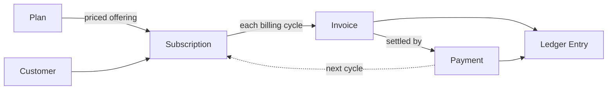

## Overview

Core Billing is the backbone of Recurso. A handful of objects work together to run a subscription business: a **plan** defines what you sell and how much it costs, a **customer** subscribes to it, **subscriptions** generate **invoices** on each billing cycle, and **payments** settle those invoices. Everything else in Recurso — usage billing, taxes, revenue recognition, recovery — builds on top of these primitives.

The cycle repeats on each renewal: the subscription cuts a new invoice, the
payment settles it, and both post balanced entries to the [double-entry
ledger](/advanced/ledger).

## Key capabilities

- **Flexible pricing** — flat-rate, per-seat, tiered, and usage-based plans in one or more currencies
- **Full subscription lifecycle** — trials, proration, billing anchors, pause/resume, and cancellation
- **Automatic invoicing** — invoices generated per cycle with tax breakup and PDF export
- **Multi-gateway payments** — settle via Razorpay (India) or Stripe (Global) with smart currency routing

## Explore Core Billing

<CardGroup cols={2}>
  <Card title="Plans & Pricing" icon="list" href="/core/plans">
    Define what you sell — flat, per-seat, tiered, or usage-based pricing across currencies.
  </Card>
  <Card title="Customers" icon="user" href="/core/customers">
    Create and manage the people and businesses who pay you, including B2B GSTIN details.
  </Card>
  <Card title="Subscriptions" icon="repeat" href="/core/subscriptions">
    Connect customers to plans and manage the full lifecycle from trial to cancellation.
  </Card>
  <Card title="Invoices" icon="file-invoice" href="/core/invoices">
    Generate itemized, tax-compliant invoices automatically on each billing cycle.
  </Card>
  <Card title="Payments" icon="credit-card" href="/core/payments">
    Record and reconcile settled transactions across your payment gateways.
  </Card>
</CardGroup>
