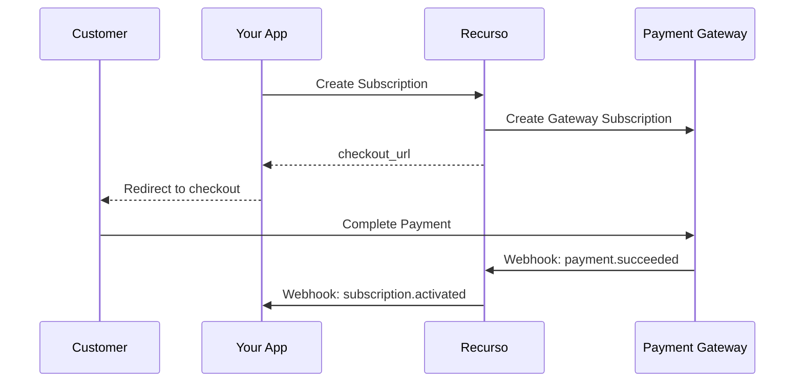

## Overview

Recurso integrates with payment gateways to handle:
- Subscription payments
- One-time charges
- Payment retries (dunning)
- Refunds

## Supported Gateways

| Gateway | Regions | Currencies |
|---------|---------|------------|
| **Razorpay** | India | INR |
| **Stripe** | Global | 135+ currencies |

## Payment Flow



## Configuration

Configure gateways in your environment:

```bash .env
# Razorpay (India)
RAZORPAY_KEY_ID=rzp_live_xxx
RAZORPAY_KEY_SECRET=xxx

# Stripe (Global)
STRIPE_SECRET_KEY=sk_live_xxx
STRIPE_WEBHOOK_SECRET=whsec_xxx
```

## Collect Payment

### For Subscriptions

```typescript
const subscription = await recurso.subscriptions.create({
  customer_id: 'cust_abc123',
  plan_id: 'plan_pro',
  payment_gateway: 'razorpay'  // or 'stripe'
});

// Redirect customer to complete payment
window.location.href = subscription.checkout_url;
```

### One-Time Charges

```typescript
const invoice = await recurso.invoices.create({
  customer_id: 'cust_abc123',
  auto_finalize: true,
  items: [
    { description: 'Onboarding Fee', amount: 9999 }
  ]
});

// Collect immediately
await recurso.invoices.pay(invoice.id);
```

## Payment Methods

Save payment methods for future charges:

```typescript
// Attach a saved method
await recurso.customers.attachPaymentMethod('cust_abc123', {
  gateway: 'razorpay',
  gateway_token: 'token_xxx',
  set_default: true
});

// Future invoices charge the default method automatically
```

## Retrying Failed Payments

When payments fail, Recurso automatically:

1. Sends payment failure notification
2. Schedules retry based on dunning config
3. Escalates with reminder emails
4. Suspends subscription after max retries

```typescript
// Configure dunning schedule
{
  retry_days: [1, 3, 7],     // Retry on day 1, 3, 7
  max_retries: 3,
  suspend_after_days: 14,
  cancel_after_days: 30
}
```

## Manual Payment

Record offline payments:

```typescript
await recurso.payments.record({
  invoice_id: 'inv_001',
  amount: 5899,
  payment_method: 'bank_transfer',
  reference: 'REF123456'
});
```

## Refunds

Issue refunds through the gateway:

```typescript
const refund = await recurso.refunds.create({
  payment_id: 'pay_123',
  amount: 2500,  // Partial refund
  reason: 'Customer requested'
});
```

## Webhooks

| Event | Description |
|-------|-------------|
| `payment.succeeded` | Payment completed |
| `payment.failed` | Payment attempt failed |
| `payment.refunded` | Refund issued |
| `payment.disputed` | Chargeback/dispute |
