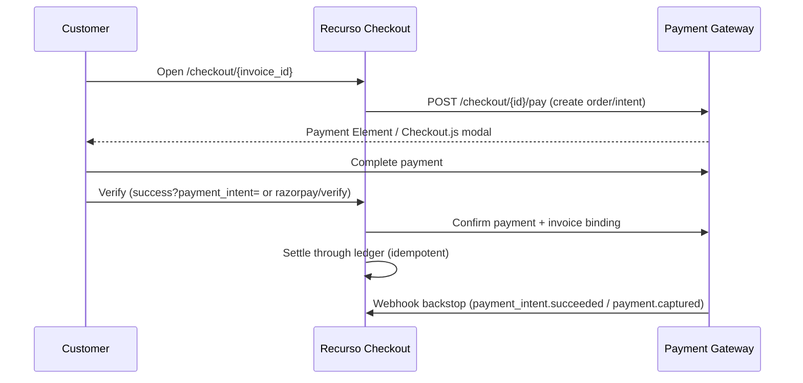

## Overview

Recurso integrates with payment gateways to handle:
- Subscription payments
- One-time charges
- Payment retries (dunning)
- Refunds

## Supported Gateways

| Gateway | Regions | Currencies |
|---------|---------|------------|
| **Razorpay** | India | INR |
| **Stripe** | Global | 135+ currencies |

## Payment Flow

Recurso generates the invoice; the customer pays it on Recurso's **hosted checkout page** at `{your-recurso-origin}/checkout/{invoice_id}`. The checkout initiates a gateway order, drives the right client flow (Stripe Payment Element or Razorpay Checkout.js), and settlement is always **verified server-side** — the checkout confirms the payment with the gateway and binds it to the invoice before anything is marked paid. Gateway webhooks remain the authoritative backstop.


```mermaid
sequenceDiagram
    participant C as Customer
    participant R as Recurso Checkout
    participant G as Payment Gateway

    C->>R: Open /checkout/{invoice_id}
    R->>G: POST /checkout/{id}/pay (create order/intent)
    G-->>C: Payment Element / Checkout.js modal
    C->>G: Complete payment
    C->>R: Verify (success?payment_intent= or razorpay/verify)
    R->>G: Confirm payment + invoice binding
    R->>R: Settle through ledger (idempotent)
    G->>R: Webhook backstop (payment_intent.succeeded / payment.captured)
```

## Configuration

Configure gateways in your environment:

```bash .env
# Razorpay (India)
RAZORPAY_KEY_ID=rzp_live_xxx
RAZORPAY_KEY_SECRET=xxx

# Stripe (Global)
STRIPE_SECRET_KEY=sk_live_xxx
STRIPE_PUBLISHABLE_KEY=pk_live_xxx   # required for hosted checkout & portal card update
STRIPE_WEBHOOK_SECRET=whsec_xxx
```

<Warning>
`STRIPE_PUBLISHABLE_KEY` (and `RAZORPAY_KEY_ID` for INR) are handed to the buyer's browser by the hosted checkout. If the browser-side key is missing, checkout initiation fails loudly with a `503` instead of dead-ending the buyer.
</Warning>

See the [Payment Gateways guide](/advanced/payment-gateways) for detailed setup instructions.

## Collect Payment

### For Subscriptions

Creating a subscription generates its first invoice. Send the customer to the hosted checkout for that invoice — the gateway is chosen automatically by currency (INR → Razorpay, others → Stripe):

```typescript
const subscription = await recurso.subscriptions.create({
  customer_id: 'cust_abc123',
  plan_id: 'plan_pro'
});

const [invoice] = await recurso.invoices.list({ subscription_id: subscription.id });

// Redirect the customer to the hosted checkout
window.location.href = `https://billing.yourdomain.com/checkout/${invoice.id}`;
```

The checkout page handles everything from there: card + local methods via the Stripe Payment Element (with real failure states — a declined payment shows "Payment not completed" with retry, never a false success), or the Razorpay modal for INR (UPI, cards, netbanking).

### One-Time Charges

```typescript
const invoice = await recurso.invoices.create({
  customer_id: 'cust_abc123',
  auto_finalize: true,
  items: [
    { description: 'Onboarding Fee', amount: 9999 }
  ]
});

// Collect immediately
await recurso.invoices.pay(invoice.id);
```

## Create Payment Order

For direct payment collection outside of subscriptions, create a payment order through the gateway:

<CodeGroup>
```typescript TypeScript
const order = await recurso.payments.createOrder({
  invoice_id: 'inv_001',
  gateway: 'razorpay',
  amount: 5899,
  currency: 'INR'
});

// Response
{
  order_id: 'order_xyz',
  gateway: 'razorpay',
  gateway_order_id: 'order_AbCdEf123456',
  amount: 5899,
  currency: 'INR',
  status: 'created'
}
```

```bash cURL
curl -X POST https://api.recurso.dev/v1/payments/order \
  -H "Authorization: Bearer $API_KEY" \
  -H "Content-Type: application/json" \
  -d '{
    "invoice_id": "inv_001",
    "gateway": "razorpay",
    "amount": 5899,
    "currency": "INR"
  }'
```
</CodeGroup>

For most integrations you won't call this directly — the hosted checkout's [`POST /checkout/{id}/pay`](/api-reference/checkout/pay) wraps order creation and returns everything the browser flow needs (`gateway`, Stripe `client_secret` + `publishable_key`, or `razorpay_key_id`). Settle only via the verify endpoints ([success](/api-reference/checkout/success) / [razorpay/verify](/api-reference/checkout/razorpay-verify)); never mark invoices paid from the client.

## Payment Methods

Save payment methods for future charges:

```typescript
// Attach a saved method
await recurso.customers.attachPaymentMethod('cust_abc123', {
  gateway: 'razorpay',
  gateway_token: 'token_xxx',
  set_default: true
});

// Future invoices charge the default method automatically
```

### Update Payment Method

When a customer's card expires or they want to switch payment methods:

```typescript
await recurso.customers.updatePaymentMethod('cust_abc123', {
  gateway: 'razorpay',
  gateway_token: 'token_new_card',
  set_default: true
});
```

See the [Customers guide](/core/customers#update-payment-method) for the full update flow.

## Record Offline Payment

Record payments received outside of Recurso (bank transfers, cash, cheques):

<CodeGroup>
```typescript TypeScript
await recurso.payments.recordOffline({
  invoice_id: 'inv_001',
  amount: 5899,
  payment_method: 'bank_transfer',
  reference: 'NEFT-REF-123456',
  received_at: '2026-06-20T10:30:00Z',
  notes: 'NEFT transfer from HDFC account'
});
```

```bash cURL
curl -X POST https://api.recurso.dev/v1/payments/offline \
  -H "Authorization: Bearer $API_KEY" \
  -H "Content-Type: application/json" \
  -d '{
    "invoice_id": "inv_001",
    "amount": 5899,
    "payment_method": "bank_transfer",
    "reference": "NEFT-REF-123456",
    "received_at": "2026-06-20T10:30:00Z"
  }'
```
</CodeGroup>

### Offline Payment Methods

| Method | Value |
|--------|-------|
| Bank transfer (NEFT/RTGS/IMPS) | `bank_transfer` |
| Cash | `cash` |
| Cheque | `cheque` |
| Wire transfer | `wire` |
| Other | `other` |

## List Offline Payments

Retrieve all offline payments recorded for an invoice or customer:

<CodeGroup>
```typescript TypeScript
const payments = await recurso.payments.listOffline({
  invoice_id: 'inv_001',
  limit: 20
});

// Response
{
  data: [
    {
      id: 'opay_001',
      invoice_id: 'inv_001',
      amount: 5899,
      payment_method: 'bank_transfer',
      reference: 'NEFT-REF-123456',
      received_at: '2026-06-20T10:30:00Z'
    }
  ]
}
```

```bash cURL
curl -G https://api.recurso.dev/v1/payments/offline \
  -H "Authorization: Bearer $API_KEY" \
  -d invoice_id=inv_001
```
</CodeGroup>

## Virtual Accounts for Bank Transfers

For customers who prefer to pay via bank transfer, create a virtual account that auto-reconciles incoming payments:

```typescript
const va = await recurso.virtualAccounts.create({
  customer_id: 'cust_abc123',
  description: 'Payment for Acme Corp'
});

// Share these bank details with the customer
console.log(va.account_number);  // Virtual account number
console.log(va.ifsc);            // IFSC code
```

When the customer transfers to this account, Recurso automatically matches the payment to the correct invoice. See the [Virtual Accounts guide](/advanced/virtual-accounts) for setup.

## Retrying Failed Payments

When payments fail, Recurso automatically:

1. Sends payment failure notification
2. Schedules retry based on dunning config
3. Escalates with reminder emails
4. Suspends subscription after max retries

```typescript
// Configure dunning schedule
{
  retry_days: [1, 3, 7],     // Retry on day 1, 3, 7
  max_retries: 3,
  suspend_after_days: 14,
  cancel_after_days: 30
}
```

For intelligent retry timing based on payment success patterns, see the [Smart Retry guide](/advanced/smart-retry). For configuring email sequences during payment recovery, see the [Dunning Campaigns guide](/advanced/dunning-campaigns).

## Refunds

Issue refunds through the gateway:

```typescript
const refund = await recurso.refunds.create({
  payment_id: 'pay_123',
  amount: 2500,  // Partial refund
  reason: 'Customer requested'
});
```

## Webhooks

| Event | Description |
|-------|-------------|
| `payment.succeeded` | Payment completed |
| `payment.failed` | Payment attempt failed |
| `payment.refunded` | Refund issued |
| `payment.disputed` | Chargeback/dispute |
