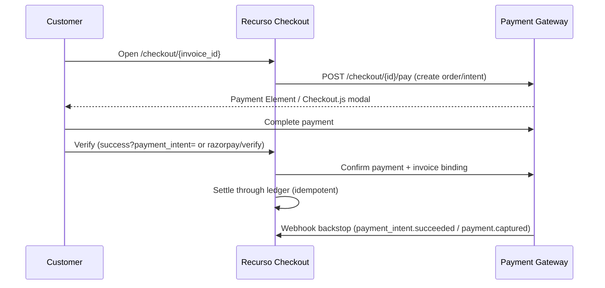

## Overview

Recurso integrates with payment gateways to handle:
- Subscription payments
- One-time charges
- Payment retries (dunning)
- Refunds

## Supported Gateways

| Gateway | Regions | Currencies |
|---------|---------|------------|
| **Razorpay** | India | INR |
| **Stripe** | Global | 135+ currencies |

## Payment Flow

Recurso generates the invoice; the customer pays it on Recurso's **hosted checkout page** at `{your-recurso-origin}/checkout/{invoice_id}`. The checkout initiates a gateway order, drives the right client flow (Stripe Payment Element or Razorpay Checkout.js), and settlement is always **verified server-side** — the checkout confirms the payment with the gateway and binds it to the invoice before anything is marked paid. Gateway webhooks remain the authoritative backstop.


```mermaid
sequenceDiagram
    participant C as Customer
    participant R as Recurso Checkout
    participant G as Payment Gateway

    C->>R: Open /checkout/{invoice_id}
    R->>G: POST /checkout/{id}/pay (create order/intent)
    G-->>C: Payment Element / Checkout.js modal
    C->>G: Complete payment
    C->>R: Verify (success?payment_intent= or razorpay/verify)
    R->>G: Confirm payment + invoice binding
    R->>R: Settle through ledger (idempotent)
    G->>R: Webhook backstop (payment_intent.succeeded / payment.captured)
```

## Configuration

Configure gateways in your environment:

```bash .env
# Razorpay (India)
RAZORPAY_KEY_ID=rzp_live_xxx
RAZORPAY_KEY_SECRET=xxx

# Stripe (Global)
STRIPE_SECRET_KEY=sk_live_xxx
STRIPE_PUBLISHABLE_KEY=pk_live_xxx   # required for hosted checkout & portal card update
STRIPE_WEBHOOK_SECRET=whsec_xxx
```

<Warning>
`STRIPE_PUBLISHABLE_KEY` (and `RAZORPAY_KEY_ID` for INR) are handed to the buyer's browser by the hosted checkout. If the browser-side key is missing, checkout initiation fails loudly with a `503` instead of dead-ending the buyer.
</Warning>

See the [Payment Gateways guide](/advanced/payment-gateways) for detailed setup instructions.

## Collect Payment

### For Subscriptions

Creating a subscription generates its first invoice. Send the customer to the hosted checkout for that invoice — the gateway is chosen automatically by currency (INR → Razorpay, others → Stripe):

```typescript
const subscription = await recurso.subscriptions.create({
  customer_id: 'cust_abc123',
  plan_id: 'plan_pro'
});

const [invoice] = await recurso.invoices.list({ subscription_id: subscription.id });

// Redirect the customer to the hosted checkout
window.location.href = `https://billing.yourdomain.com/checkout/${invoice.id}`;
```

The checkout page handles everything from there: card + local methods via the Stripe Payment Element (with real failure states — a declined payment shows "Payment not completed" with retry, never a false success), or the Razorpay modal for INR (UPI, cards, netbanking).

### One-Time Charges

There's no standalone invoice-create API — one-off charges attach to a
subscription and bill on its **next** invoice, or land immediately via an
advance invoice:

```bash
# Add a one-off charge (bills on the next recurring invoice)
curl -X POST https://api.recurso.dev/v1/subscriptions/{sub_id}/charges \
  -H "Authorization: Bearer $API_KEY" \
  -H "Content-Type: application/json" \
  -d '{ "description": "Onboarding fee", "amount": 999900, "currency": "INR" }'

# …or bill ahead of schedule right now
curl -X POST https://api.recurso.dev/v1/subscriptions/{sub_id}/advance \
  -H "Authorization: Bearer $API_KEY" \
  -H "Content-Type: application/json" \
  -d '{ "periods": 1 }'
```

See [Advanced Billing](/advanced/advanced-billing) for details.

## Create Payment Order

The hosted checkout calls this for you; if you build a custom payment UI,
create the gateway order directly. It is a **public, rate-limited**
endpoint (no API key — it powers buyer-facing pages) that takes only the
invoice id and picks the gateway by the invoice's currency:

```bash
curl -X POST https://billing.example.com/payments/order \
  -H "Content-Type: application/json" \
  -d '{ "invoice_id": "9b2f6c1e-…" }'
```

For most integrations use the checkout wrapper instead —
[`POST /checkout/{id}/pay`](/api-reference/checkout/pay) returns everything
the browser flow needs (`gateway`, Stripe `client_secret` +
`publishable_key`, or `razorpay_key_id`). Settle only via the verify
endpoints ([success](/api-reference/checkout/success) /
[razorpay/verify](/api-reference/checkout/razorpay-verify)); never mark
invoices paid from the client.

## Payment Methods

The payment instrument lives at the **gateway**, attached during checkout
(Stripe SetupIntent / Razorpay token or UPI mandate) or through the
[customer portal](/portal/self-service). Renewals then charge it
automatically. On the Recurso side you can update the card-on-file
display metadata shown in the dashboard and dunning emails:

```bash
curl -X PUT https://api.recurso.dev/v1/customers/{customer_id}/payment-method \
  -H "Authorization: Bearer $API_KEY" \
  -H "Content-Type: application/json" \
  -d '{ "card_brand": "visa", "card_last4": "4242",
        "card_exp_month": 12, "card_exp_year": 2028 }'
```

<Tip>
When a card expires, send the customer a [magic link](/portal/magic-links)
— the portal walks them through a fresh SetupIntent or mandate.
</Tip>

## Record Offline Payment

Record payments received outside of Recurso — bank transfers, cash,
cheques — optionally against an invoice, with TDS handled first-class:

```bash
curl -X POST https://api.recurso.dev/v1/payments/offline \
  -H "Authorization: Bearer $API_KEY" \
  -H "Content-Type: application/json" \
  -d '{
    "customer_id": "…",
    "invoice_id": "…",
    "payment_type": "bank_transfer",
    "amount": 589882,
    "tds_amount": 58988,
    "currency": "INR",
    "reference_number": "NEFT-REF-123456",
    "notes": "NEFT from HDFC account"
  }'
```

<ParamField body="payment_type" type="string" required>
  `bank_transfer`, `cash`, or `cheque`.
</ParamField>
<ParamField body="amount" type="integer" required>
  Cash actually received, in minor units.
</ParamField>
<ParamField body="tds_amount" type="integer">
  Tax deducted at source by the customer (Indian B2B). Posts to the TDS
  Receivable account — `amount + tds_amount` settles the invoice.
</ParamField>
<ParamField body="reference_number" type="string">
  Bank/UTR/cheque reference for reconciliation.
</ParamField>

## List Offline Payments

Retrieve all offline payments recorded for an invoice or customer:

<CodeGroup>
```typescript TypeScript
const payments = await recurso.payments.listOffline({
  invoice_id: 'inv_001',
  limit: 20
});

// Response
{
  data: [
    {
      id: 'opay_001',
      invoice_id: 'inv_001',
      amount: 5899,
      payment_type: 'bank_transfer',
      reference_number: 'NEFT-REF-123456',
      received_at: '2026-06-20T10:30:00Z'
    }
  ]
}
```

```bash cURL
curl -G https://api.recurso.dev/v1/payments/offline \
  -H "Authorization: Bearer $API_KEY" \
  -d invoice_id=inv_001
```
</CodeGroup>

## Virtual Accounts for Bank Transfers

For customers who prefer to pay via bank transfer, create a virtual account that auto-reconciles incoming payments:

```typescript
const va = await recurso.virtualAccounts.create({
  customer_id: 'cust_abc123',
  description: 'Payment for Acme Corp'
});

// Share these bank details with the customer
console.log(va.account_number);  // Virtual account number
console.log(va.ifsc);            // IFSC code
```

When the customer transfers to this account, Recurso automatically matches the payment to the correct invoice. See the [Virtual Accounts guide](/advanced/virtual-accounts) for setup.

## Retrying Failed Payments

When payments fail, Recurso automatically:

1. Sends payment failure notification
2. Schedules retry based on dunning config
3. Escalates with reminder emails
4. Suspends subscription after max retries

```typescript
// Configure dunning schedule
{
  retry_days: [1, 3, 7],     // Retry on day 1, 3, 7
  max_retries: 3,
  suspend_after_days: 14,
  cancel_after_days: 30
}
```

For intelligent retry timing based on payment success patterns, see the [Smart Retry guide](/advanced/smart-retry). For configuring email sequences during payment recovery, see the [Dunning Campaigns guide](/advanced/dunning-campaigns).

## Refunds

Issue refunds through the gateway:

```typescript
const refund = await recurso.refunds.create({
  payment_id: 'pay_123',
  amount: 2500,  // Partial refund
  reason: 'Customer requested'
});
```

## Webhooks

| Event | Description |
|-------|-------------|
| `payment.succeeded` | Payment completed |
| `payment.failed` | Payment attempt failed |
| `payment.refunded` | Refund issued |
| `payment.disputed` | Chargeback/dispute |
