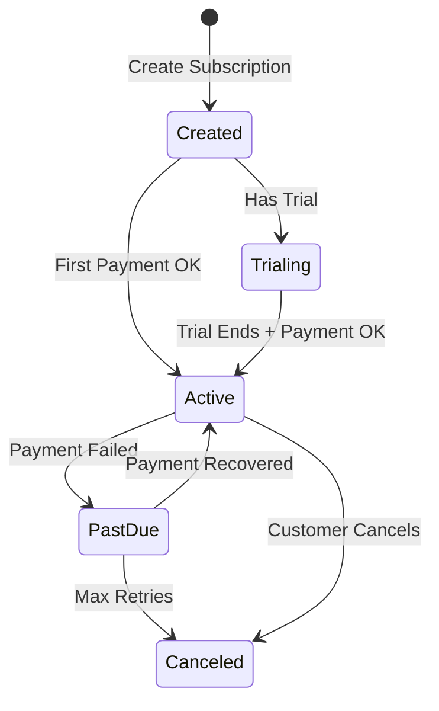

## Overview

Subscriptions connect customers to plans and handle the billing cycle automatically. Recurso manages:

- Recurring invoicing
- Payment collection
- Trial periods
- Proration for upgrades/downgrades
- Dunning for failed payments

## Create a Subscription

<CodeGroup>
```typescript TypeScript
const subscription = await recurso.subscriptions.create({
  customer_id: 'cust_abc123',
  plan_id: 'plan_pro',
  payment_gateway: 'razorpay'  // or 'stripe'
});

// For payment page integration
if (subscription.status === 'created') {
  // Redirect to complete payment
  window.location.href = subscription.checkout_url;
}
```

```bash cURL
curl -X POST https://api.recurso.dev/v1/subscriptions \
  -H "Authorization: Bearer $API_KEY" \
  -H "Content-Type: application/json" \
  -d '{
    "customer_id": "cust_abc123",
    "plan_id": "plan_pro"
  }'
```
</CodeGroup>

## Subscription Lifecycle



| Status | Description |
|--------|-------------|
| `created` | Awaiting first payment |
| `trialing` | In free trial period |
| `active` | Active and paid |
| `past_due` | Payment failed, in dunning |
| `canceled` | Subscription ended |

## Free Trials

Start customers with a free trial:

```typescript
// Plan-level trial
const plan = await recurso.plans.create({
  name: 'Pro',
  trial_days: 14,
  ...
});

// Or subscription-level override
const subscription = await recurso.subscriptions.create({
  customer_id: 'cust_abc123',
  plan_id: 'plan_pro',
  trial_end: new Date('2024-02-15')  // Custom trial end
});
```

<Info>
During trial, no invoice is generated. The first invoice is created when trial ends.
</Info>

## Quantity (Per-Seat)

For per-seat plans, specify quantity:

```typescript
const subscription = await recurso.subscriptions.create({
  customer_id: 'cust_abc123',
  plan_id: 'plan_team',
  quantity: 10  // 10 seats
});

// Update seats
await recurso.subscriptions.update('sub_xyz', {
  quantity: 15  // Upgrade to 15 seats
});
// Invoice prorated automatically
```

## Upgrade / Downgrade

Change plans mid-cycle:

```typescript
await recurso.subscriptions.update('sub_xyz', {
  plan_id: 'plan_enterprise',
  proration_behavior: 'create_prorations'  // default
});

// Proration options:
// - 'create_prorations': Credit remaining time, charge new plan
// - 'none': No proration, change at next renewal
// - 'always_invoice': Invoice immediately
```

## Cancel Subscription

### At Period End (Recommended)

```typescript
await recurso.subscriptions.cancel('sub_xyz', {
  cancel_at_period_end: true
});

// subscription.status remains 'active'
// subscription.cancel_at_period_end = true
// Customer retains access until current_period_end
```

### Immediately

```typescript
await recurso.subscriptions.cancel('sub_xyz', {
  immediately: true
});

// subscription.status = 'canceled'
// Access revoked immediately
// Optionally prorate and refund
```

## Pause Subscription

Temporarily pause billing:

```typescript
await recurso.subscriptions.pause('sub_xyz', {
  resume_at: new Date('2024-03-01')
});

// subscription.status = 'paused'
// No invoices generated until resumed
```

## Billing Anchor

Control when subscriptions bill:

```typescript
const subscription = await recurso.subscriptions.create({
  customer_id: 'cust_abc123',
  plan_id: 'plan_pro',
  billing_anchor: 1  // Always bill on 1st of month
});
```

<Tip>
Use `billing_anchor` for enterprise customers who need invoices on specific dates.
</Tip>

## Get Subscription

```typescript
const subscription = await recurso.subscriptions.get('sub_xyz');

// Returns
{
  id: 'sub_xyz',
  customer_id: 'cust_abc123',
  plan: { id: 'plan_pro', name: 'Pro Plan', ... },
  status: 'active',
  current_period_start: '2024-01-01T00:00:00Z',
  current_period_end: '2024-02-01T00:00:00Z',
  cancel_at_period_end: false,
  invoices: [...]
}
```

## List Subscriptions

```typescript
const subscriptions = await recurso.subscriptions.list({
  customer_id: 'cust_abc123',  // Filter by customer
  status: 'active',            // Filter by status
  limit: 20
});
```

## Webhooks

Subscribe to subscription events:

| Event | Description |
|-------|-------------|
| `subscription.created` | New subscription |
| `subscription.activated` | First payment succeeded |
| `subscription.updated` | Plan changed |
| `subscription.cancelled` | Subscription cancelled |
| `subscription.past_due` | Payment failed |
