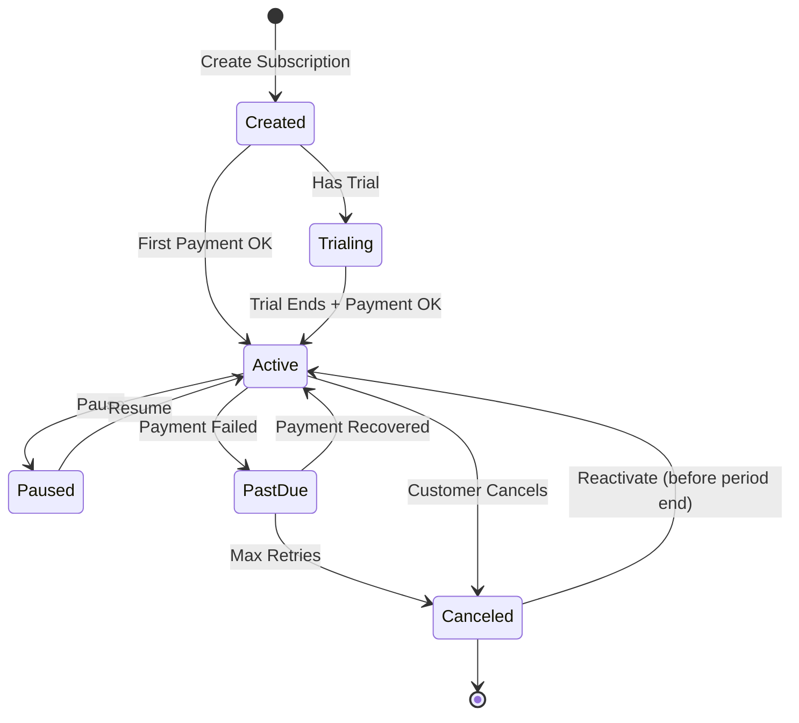

## Overview

Subscriptions connect customers to plans and handle the billing cycle automatically. Recurso manages:

- Recurring invoicing
- Payment collection
- Trial periods
- Proration for upgrades/downgrades
- Dunning for failed payments

## Create a Subscription

<CodeGroup>
```typescript TypeScript
const subscription = await recurso.subscriptions.create({
  customer_id: 'cust_abc123',
  plan_id: 'plan_pro',
  payment_gateway: 'razorpay'  // or 'stripe'
});

// For payment page integration
if (subscription.status === 'created') {
  // Redirect to complete payment
  window.location.href = subscription.checkout_url;
}
```

```bash cURL
curl -X POST https://api.recurso.dev/v1/subscriptions \
  -H "Authorization: Bearer $API_KEY" \
  -H "Content-Type: application/json" \
  -d '{
    "customer_id": "cust_abc123",
    "plan_id": "plan_pro"
  }'
```
</CodeGroup>

### Apply a Coupon at Creation

Apply a discount coupon when creating a subscription:

```typescript
const subscription = await recurso.subscriptions.create({
  customer_id: 'cust_abc123',
  plan_id: 'plan_pro',
  payment_gateway: 'razorpay',
  coupon_id: 'coupon_launch20'  // 20% off first 3 months
});
```

The coupon discount is applied to invoices for the duration specified in the coupon configuration. See the [Coupons guide](/advanced/coupons) for creating and managing coupons.

## Subscription Lifecycle


```mermaid
stateDiagram-v2
    [*] --> Created: Create Subscription
    Created --> Trialing: Has Trial
    Created --> Active: First Payment OK
    Trialing --> Active: Trial Ends + Payment OK
    Active --> Paused: Pause
    Paused --> Active: Resume
    Active --> PastDue: Payment Failed
    PastDue --> Active: Payment Recovered
    PastDue --> Canceled: Max Retries
    Active --> Canceled: Customer Cancels
    Canceled --> Active: Reactivate (before period end)
    Canceled --> [*]
```

| Status | Description |
|--------|-------------|
| `created` | Awaiting first payment |
| `trialing` | In free trial period |
| `active` | Active and paid |
| `paused` | Billing temporarily suspended; no invoices generated |
| `past_due` | Payment failed, in dunning |
| `canceled` | Subscription ended |

## Free Trials

Start customers with a free trial:

```typescript
// Plan-level trial
const plan = await recurso.plans.create({
  name: 'Pro',
  trial_days: 14,
  ...
});

// Or subscription-level override
const subscription = await recurso.subscriptions.create({
  customer_id: 'cust_abc123',
  plan_id: 'plan_pro',
  trial_end: new Date('2024-02-15')  // Custom trial end
});
```

<Info>
During trial, no invoice is generated. The first invoice is created when trial ends.
</Info>

## Per-Seat Quantities (Add-ons)

Subscriptions don't carry a bare `quantity` — seats are modeled as an
**add-on**: an existing plan attached to the subscription with a quantity,
billed as its own line (add-on price × quantity, taxed independently) from
the next recurring invoice:

```bash
# 10 seats of the per-seat plan on top of the base plan
curl -X POST https://api.recurso.dev/v1/subscriptions/{sub_id}/addons \
  -H "Authorization: Bearer $API_KEY" \
  -H "Content-Type: application/json" \
  -d '{ "plan_id": "plan_seat", "quantity": 10 }'
```

<Tip>
Seats that fluctuate mid-period are often better metered: a billable
metric with `max(seats)` aggregation bills the period's high-water mark
with no proration bookkeeping — see
[usage-based billing](/advanced/usage-billing).
</Tip>

## Upgrade / Downgrade

Change plans mid-cycle:

```typescript
await recurso.subscriptions.update('sub_xyz', {
  plan_id: 'plan_enterprise',
  proration_behavior: 'create_prorations'  // default
});

// Proration options:
// - 'create_prorations': Credit remaining time, charge new plan
// - 'none': No proration, change at next renewal
// - 'always_invoice': Invoice immediately
```

### How Proration Works

When a customer upgrades mid-cycle with `create_prorations`:

1. Recurso calculates a credit for the unused portion of the current plan
2. Recurso calculates the charge for the new plan for the remaining period
3. The net difference appears as a line item on the next invoice

**Example**: Customer upgrades from ₹4,999/mo to ₹9,999/mo on day 15 of a 30-day cycle:
- Credit for old plan: ₹4,999 × (15/30) = ₹2,499.50
- Charge for new plan: ₹9,999 × (15/30) = ₹4,999.50
- Net charge on next invoice: ₹2,500.00

## Cancel Subscription

### At Period End (Recommended)

```typescript
await recurso.subscriptions.cancel('sub_xyz', {
  cancel_at_period_end: true
});

// subscription.status remains 'active'
// subscription.cancel_at_period_end = true
// Customer retains access until current_period_end
```

### Immediately

```typescript
await recurso.subscriptions.cancel('sub_xyz', {
  immediately: true
});

// subscription.status = 'canceled'
// Access revoked immediately
// Optionally prorate and refund
```

For advanced cancellation flows with retention offers, see the [Cancel Flows guide](/advanced/cancel-flows).

## Reactivate a Cancelled Subscription

If a subscription was cancelled with `cancel_at_period_end: true` and the period has not yet ended, you can reactivate it:

<CodeGroup>
```typescript TypeScript
await recurso.subscriptions.reactivate('sub_xyz');

// subscription.cancel_at_period_end = false
// Billing resumes as normal at next renewal
```

```bash cURL
curl -X POST https://api.recurso.dev/v1/subscriptions/sub_xyz/reactivate \
  -H "Authorization: Bearer $API_KEY"
```
</CodeGroup>

<Warning>
Reactivation is only possible while the subscription is still active (before `current_period_end`). Once the status changes to `canceled`, you must create a new subscription.
</Warning>

## Pause Subscription

Temporarily pause billing:

```typescript
await recurso.subscriptions.pause('sub_xyz', {
  resume_at: new Date('2024-03-01')
});

// subscription.status = 'paused'
// No invoices generated until resumed
```

## Billing Anchor

Control when subscriptions bill. The billing anchor determines which day of the month the subscription renews.

### Acquisition Date (Default)

By default, the billing anchor is the day the subscription was created. A subscription created on the 15th renews on the 15th of each month.

### Fixed Date (First of Month)

For enterprise customers who need invoices on a consistent date:

```typescript
const subscription = await recurso.subscriptions.create({
  customer_id: 'cust_abc123',
  plan_id: 'plan_pro',
  billing_anchor: 1  // Always bill on 1st of month
});
```

When the billing anchor differs from the subscription start date, the first period is prorated. For example, a subscription starting on January 15 with `billing_anchor: 1` generates a prorated invoice for January 15-31, then full invoices from February 1 onward.

<Tip>
Use `billing_anchor` for enterprise customers who need invoices on specific dates.
</Tip>

## Payment Terms

Configure when invoices are due relative to when they are generated:

```typescript
const subscription = await recurso.subscriptions.create({
  customer_id: 'cust_abc123',
  plan_id: 'plan_enterprise',
  payment_terms: 'net30'  // Due 30 days after invoice date
});
```

| Term | Due Date |
|------|----------|
| `net0` | Due immediately (same day as invoice) |
| `net15` | Due 15 days after invoice date |
| `net30` | Due 30 days after invoice date |
| `net60` | Due 60 days after invoice date |

<Info>
Payment terms are commonly used for enterprise and B2B subscriptions where customers need time to process payments through their accounts payable workflow.
</Info>

## UPI Mandates

For Indian customers paying via UPI, you can set up a UPI mandate for automatic recurring payments:

```typescript
const subscription = await recurso.subscriptions.create({
  customer_id: 'cust_abc123',
  plan_id: 'plan_pro',
  payment_gateway: 'razorpay',
  mandate: {
    type: 'upi',
    max_amount: 9999  // Maximum amount per debit
  }
});
```

The customer authorizes the mandate once, and subsequent payments are charged automatically. See the [UPI Mandates guide](/compliance/upi-mandates) for setup details.

## Consent Tracking

Track customer consent for billing-related communications:

```typescript
const subscription = await recurso.subscriptions.create({
  customer_id: 'cust_abc123',
  plan_id: 'plan_pro',
  consent: {
    billing_emails: true,
    marketing_emails: false,
    auto_renewal: true
  }
});
```

See the [Consent Tracking guide](/compliance/consent-tracking) for compliance requirements.

## Get Subscription

```typescript
const subscription = await recurso.subscriptions.get('sub_xyz');

// Returns
{
  id: 'sub_xyz',
  customer_id: 'cust_abc123',
  plan: { id: 'plan_pro', name: 'Pro Plan', ... },
  status: 'active',
  current_period_start: '2024-01-01T00:00:00Z',
  current_period_end: '2024-02-01T00:00:00Z',
  cancel_at_period_end: false,
  invoices: [...]
}
```

## List Subscriptions

```typescript
const subscriptions = await recurso.subscriptions.list({
  customer_id: 'cust_abc123',  // Filter by customer
  status: 'active',            // Filter by status
  limit: 20
});
```

## Webhooks

Subscribe to subscription events:

| Event | Description |
|-------|-------------|
| `subscription.created` | New subscription |
| `subscription.created` | First payment succeeded |
| `subscription.updated` | Plan changed |
| `subscription.canceled` | Subscription cancelled |
| `subscription.past_due` | Payment failed |
