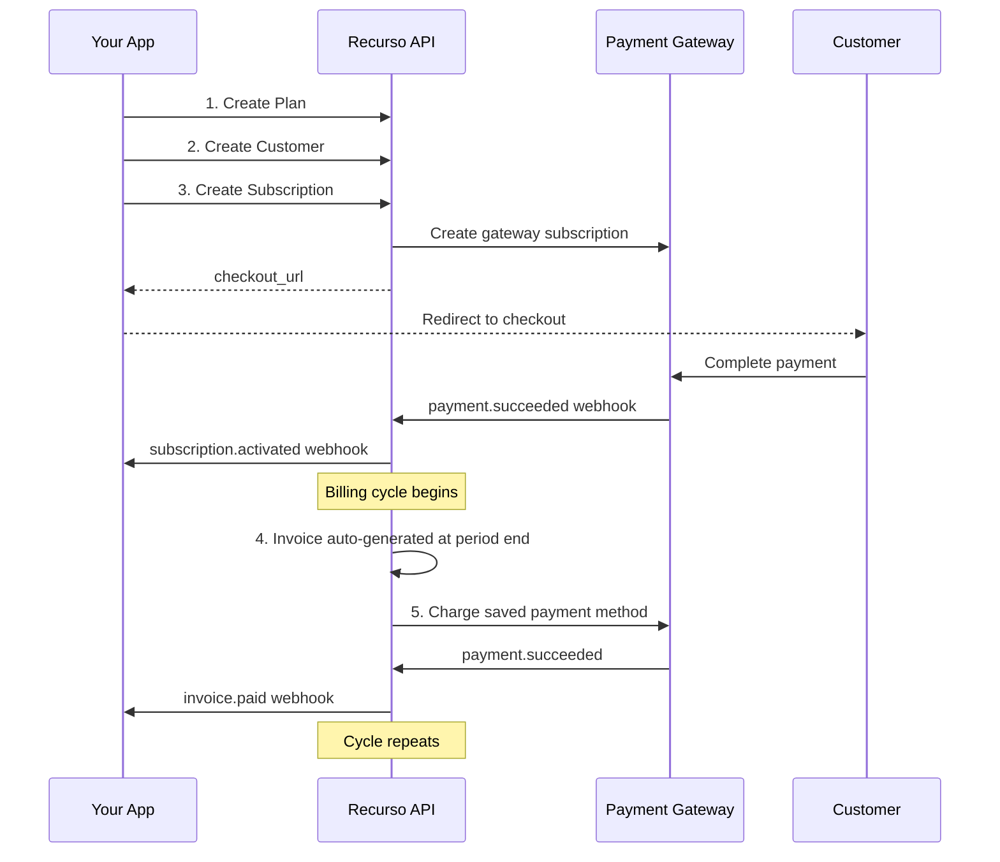

## Overview

This guide walks through the complete happy path of billing a customer with Recurso. By the end, you will have created a plan, added a customer, started a subscription, and collected payment — with webhooks firing at each stage.



## Step 1: Create a Plan

Define what you are selling and how much it costs.

```bash
curl -X POST https://api.recurso.dev/v1/plans \
  -H "Authorization: Bearer $API_KEY" \
  -H "Content-Type: application/json" \
  -d '{
    "name": "Pro Plan",
    "description": "For growing teams",
    "interval": "month",
    "trial_days": 0,
    "prices": [
      { "amount": 4999, "currency": "INR" },
      { "amount": 999, "currency": "USD" }
    ]
  }'
```

**Response:**

```json
{
  "data": {
    "id": "plan_pro01",
    "name": "Pro Plan",
    "interval": "month",
    "prices": [
      { "amount": 4999, "currency": "INR" },
      { "amount": 999, "currency": "USD" }
    ],
    "active": true
  }
}
```

Save the `id` — you will use it in step 3.

<Info>
For pricing model options (flat rate, per-seat, tiered, usage-based), see the [Plans guide](/core/plans).
</Info>

## Step 2: Create a Customer

Add the person or company who will be billed.

```bash
curl -X POST https://api.recurso.dev/v1/customers \
  -H "Authorization: Bearer $API_KEY" \
  -H "Content-Type: application/json" \
  -d '{
    "name": "Acme Corporation",
    "email": "billing@acme.com",
    "phone": "+919876543210",
    "address": {
      "line1": "123 MG Road",
      "city": "Bangalore",
      "state": "Karnataka",
      "postal_code": "560001",
      "country": "IN"
    }
  }'
```

**Response:**

```json
{
  "data": {
    "id": "cust_acme01",
    "name": "Acme Corporation",
    "email": "billing@acme.com"
  }
}
```

Save the `id` for the next step.

<Tip>
For B2B customers in India, include the `gstin` field to get GST-compliant invoices. See the [GST Invoicing guide](/compliance/gst-invoicing).
</Tip>

## Step 3: Create a Subscription

Connect the customer to the plan. This starts the billing relationship.

```bash
curl -X POST https://api.recurso.dev/v1/subscriptions \
  -H "Authorization: Bearer $API_KEY" \
  -H "Content-Type: application/json" \
  -d '{
    "customer_id": "cust_acme01",
    "plan_id": "plan_pro01",
    "payment_gateway": "razorpay"
  }'
```

**Response:**

```json
{
  "data": {
    "id": "sub_xyz789",
    "customer_id": "cust_acme01",
    "plan_id": "plan_pro01",
    "status": "created",
    "checkout_url": "https://api.recurso.dev/checkout/sub_xyz789"
  }
}
```

Redirect the customer to `checkout_url` to complete payment. After payment succeeds, Recurso fires these webhooks:

### Webhook: `subscription.activated`

```json
{
  "type": "subscription.activated",
  "data": {
    "id": "sub_xyz789",
    "customer_id": "cust_acme01",
    "plan_id": "plan_pro01",
    "status": "active",
    "current_period_start": "2026-06-24T00:00:00Z",
    "current_period_end": "2026-07-24T00:00:00Z"
  }
}
```

### Webhook: `payment.succeeded`

```json
{
  "type": "payment.succeeded",
  "data": {
    "id": "pay_001",
    "invoice_id": "inv_001",
    "amount": 5899,
    "currency": "INR",
    "gateway": "razorpay"
  }
}
```

<Info>
Grant access to your product when you receive `subscription.activated`. See the [Webhooks guide](/advanced/webhooks) for signature verification.
</Info>

## Step 4: Invoice Auto-Generated

At the end of each billing period, Recurso automatically generates the next invoice. No API call is needed from your side.

### Webhook: `invoice.created`

```json
{
  "type": "invoice.created",
  "data": {
    "id": "inv_002",
    "invoice_number": "REC/2026/0002",
    "customer_id": "cust_acme01",
    "subscription_id": "sub_xyz789",
    "status": "open",
    "currency": "INR",
    "subtotal": 4999,
    "tax_amount": 900,
    "total": 5899,
    "due_date": "2026-08-08T00:00:00Z"
  }
}
```

You can fetch any invoice at any time:

```bash
curl https://api.recurso.dev/v1/invoices?customer_id=cust_acme01 \
  -H "Authorization: Bearer $API_KEY"
```

## Step 5: Payment Collected

Recurso charges the customer's saved payment method automatically. On success:

### Webhook: `invoice.paid`

```json
{
  "type": "invoice.paid",
  "data": {
    "id": "inv_002",
    "status": "paid",
    "amount_paid": 5899,
    "paid_at": "2026-07-24T00:05:00Z"
  }
}
```

If payment fails, Recurso enters the [dunning flow](/advanced/dunning-campaigns) — retrying payment on a configurable schedule and sending reminder emails to the customer.

### Webhook: `invoice.payment_failed`

```json
{
  "type": "invoice.payment_failed",
  "data": {
    "id": "inv_002",
    "status": "past_due",
    "next_retry_at": "2026-07-25T00:00:00Z"
  }
}
```

## Step 6: Subscription Renews

After payment succeeds, the subscription period advances automatically:

- `current_period_start` moves to the start of the new period
- `current_period_end` moves forward by one billing interval
- A new invoice is generated at the next period end

This cycle repeats until the subscription is cancelled or paused.

## What Happens Next

Once the basic flow is running, you can layer on additional features:

<CardGroup cols={2}>
  <Card title="Add Coupons" icon="ticket" href="/advanced/coupons">
    Apply discounts to subscriptions at creation time
  </Card>
  <Card title="Usage Billing" icon="gauge" href="/advanced/usage-billing">
    Add metered billing on top of flat-rate plans
  </Card>
  <Card title="Customer Portal" icon="user" href="/portal/overview">
    Let customers self-manage subscriptions and invoices
  </Card>
  <Card title="Webhooks" icon="webhook" href="/advanced/webhooks">
    Set up production webhook endpoints with signature verification
  </Card>
  <Card title="Smart Retry" icon="rotate" href="/advanced/smart-retry">
    Configure intelligent payment retry logic
  </Card>
  <Card title="Go to Production" icon="rocket" href="/going-to-production">
    Switch from test to live keys and prepare for launch
  </Card>
</CardGroup>
