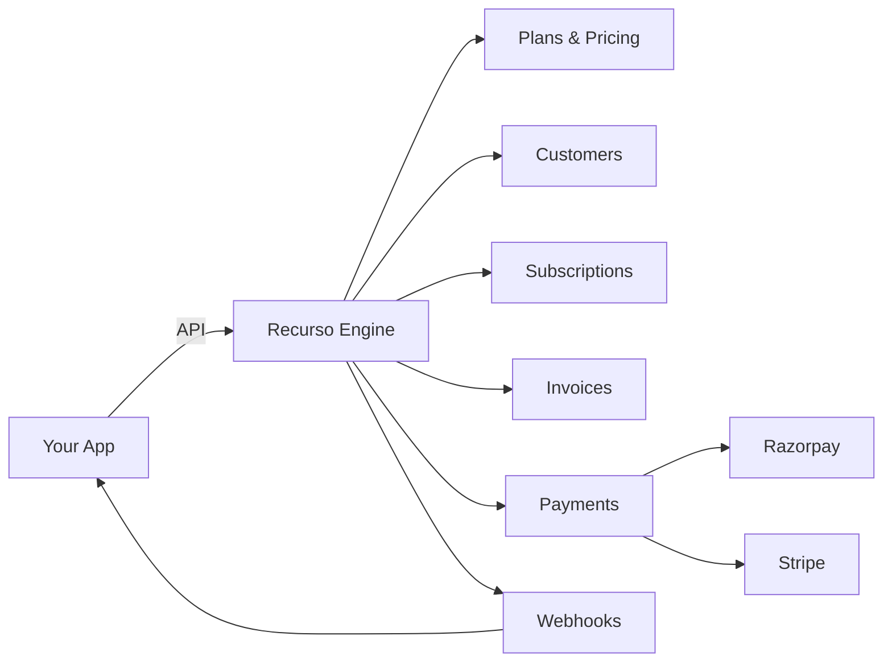

## What is Recurso?

Recurso is an **open-source billing engine** designed for SaaS companies, subscription businesses, and developers who need complete control over their billing infrastructure.

<CardGroup cols={2}>
  <Card title="Quick Start" icon="rocket" href="/quickstart">
    Get up and running in under 5 minutes
  </Card>
  <Card title="Core Concepts" icon="book" href="/concepts">
    Understand the building blocks
  </Card>
  <Card title="API Reference" icon="code" href="/api-reference/introduction">
    Complete API documentation
  </Card>
  <Card title="Self-Host" icon="server" href="/quickstart#self-hosting">
    Deploy on your own infrastructure
  </Card>
</CardGroup>

## Key Features

<AccordionGroup>
  <Accordion title="Flexible Subscription Billing" icon="repeat">
    Create plans with any pricing model: flat-rate, per-seat, usage-based, or hybrid. Support for trials, billing anchors, and proration.
  </Accordion>
  <Accordion title="Multi-Gateway Payments" icon="credit-card">
    Integrate with Razorpay (India) and Stripe (Global). Smart routing based on customer currency.
  </Accordion>
  <Accordion title="GST-Compliant Invoicing" icon="file-invoice">
    Generate invoices with GSTIN, SAC codes, CGST/SGST/IGST breakup, and e-invoice support.
  </Accordion>
  <Accordion title="Customer Portal" icon="user">
    White-label portal with magic link authentication. Customers can manage subscriptions, view invoices, and update payment methods.
  </Accordion>
  <Accordion title="Real-time Webhooks" icon="bell">
    Get notified instantly about subscription changes, payment events, and invoice updates.
  </Accordion>
  <Accordion title="Developer-First" icon="terminal">
    Clean REST API, TypeScript SDK, and comprehensive documentation.
  </Accordion>
</AccordionGroup>

## Why Recurso?

| Feature | Recurso | Stripe Billing | Chargebee |
|---------|---------|----------------|-----------|
| **Open Source** | ✅ Yes | ❌ No | ❌ No |
| **Self-Hosted** | ✅ Yes | ❌ No | ❌ No |
| **GST Support** | ✅ Native | 🟡 Limited | ✅ Yes |
| **Razorpay** | ✅ Yes | ❌ No | ✅ Yes |
| **Usage Billing** | ✅ Yes | ✅ Yes | ✅ Yes |
| **Pricing** | Free | 0.5% + fees | $249+/mo |

## Architecture



## Get Started

<Steps>
  <Step title="Install the SDK">
    ```bash
    npm install @recurso/sdk
    ```
  </Step>
  <Step title="Create a customer">
    ```typescript
    const customer = await recurso.customers.create({
      name: 'Acme Corp',
      email: 'billing@acme.com'
    });
    ```
  </Step>
  <Step title="Start a subscription">
    ```typescript
    const subscription = await recurso.subscriptions.create({
      customer_id: customer.id,
      plan_id: 'plan_pro_monthly'
    });
    ```
  </Step>
</Steps>

<Card title="Ready to build?" icon="arrow-right" href="/quickstart">
  Follow our quickstart guide to set up Recurso in your project
</Card>
