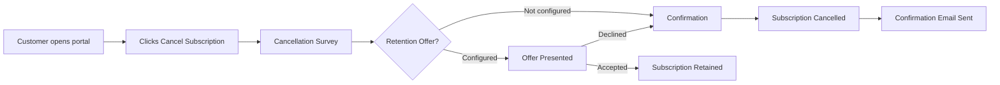
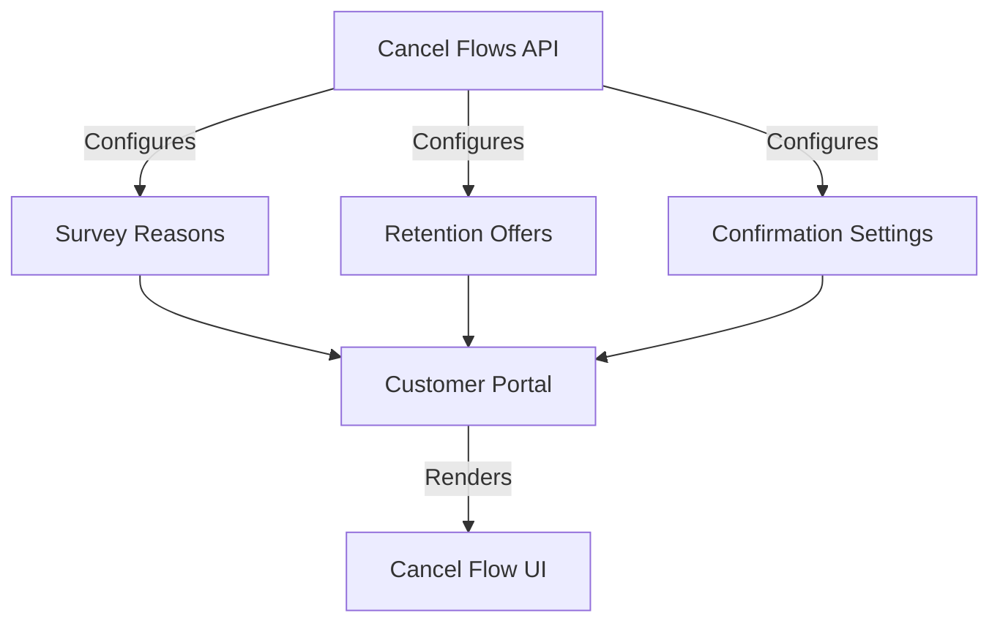

## Overview

Portal cancel self-service lets your customers initiate subscription cancellations directly from the customer portal, without contacting support. Behind the scenes, Recurso presents a multi-step retention flow — survey, offer, confirmation — designed to reduce involuntary churn while respecting the customer's intent.

This feature integrates directly with the [Cancel Flows API](/core/cancel-flows) to render your configured surveys, retention offers, and confirmation steps inside the portal experience.



## Portal Authentication

Before a customer can access the cancel flow, they must authenticate with the customer portal. Recurso uses **magic links** — one-time, time-limited URLs sent to the customer's email address.

<CodeGroup>
```typescript TypeScript
// Generate a portal magic link for a customer
const session = await recurso.portal.sessions.create({
  customer_id: "cust_8Tj3mKvR",
  return_url: "https://app.acme.com/account"   // redirect after portal session
});

// Response
{
  id: "psess_Lk9mNx2p",
  customer_id: "cust_8Tj3mKvR",
  url: "https://portal.recurso.dev/s/psess_Lk9mNx2p?token=mtk_a1b2c3d4...",
  expires_at: "2025-07-10T09:30:00Z"   // valid for 60 minutes
}
```

```bash cURL
curl -X POST https://api.recurso.dev/v1/portal/sessions \
  -H "Authorization: Bearer $API_KEY" \
  -H "Content-Type: application/json" \
  -d '{
    "customer_id": "cust_8Tj3mKvR",
    "return_url": "https://app.acme.com/account"
  }'
```
</CodeGroup>

<Info>
Magic links expire after 60 minutes and can only be used once. After the customer clicks the link, a session is created that lasts for 24 hours.
</Info>

## Cancel Flow in the Portal

When a customer clicks "Cancel Subscription" in the portal, Recurso renders the cancel flow you have configured via the Cancel Flows API. The flow proceeds through up to three steps.

### Step 1: Cancellation Survey

The customer is asked why they want to cancel. This data feeds into your churn analytics.

```typescript
// Configure survey reasons displayed in the portal
await recurso.cancelFlows.update("cf_default", {
  survey: {
    enabled: true,
    title: "We're sorry to see you go",
    subtitle: "Help us improve by sharing why you're cancelling",
    reasons: [
      { id: "too_expensive", label: "Too expensive for my budget" },
      { id: "not_using", label: "I'm not using it enough" },
      { id: "missing_features", label: "Missing features I need" },
      { id: "switching", label: "Switching to a different solution" },
      { id: "technical_issues", label: "Too many technical issues" },
      { id: "other", label: "Other reason", allows_comment: true }
    ]
  }
});
```

| Survey Field | Type | Description |
|-------------|------|-------------|
| `enabled` | boolean | Show or hide the survey step |
| `title` | string | Heading displayed above reasons |
| `subtitle` | string | Supporting text below the heading |
| `reasons` | array | Selectable cancellation reasons |
| `reasons[].id` | string | Unique identifier for analytics |
| `reasons[].label` | string | Display text shown to the customer |
| `reasons[].allows_comment` | boolean | Show a free-text comment field when selected |

### Step 2: Retention Offer

Based on the cancellation reason, Recurso can present a targeted retention offer. If the customer accepts, the cancellation is aborted and the offer is applied.

```typescript
await recurso.cancelFlows.update("cf_default", {
  offers: [
    {
      trigger_reason: "too_expensive",
      type: "discount",
      title: "How about 30% off for the next 3 months?",
      description: "We'd love to keep you. Here's a special discount.",
      coupon_id: "cpn_save30_3mo",
      cta_accept: "Apply Discount",
      cta_decline: "No thanks, continue cancelling"
    },
    {
      trigger_reason: "not_using",
      type: "pause",
      title: "Would you prefer to pause instead?",
      description: "Pause your subscription for up to 3 months. Your data stays safe.",
      pause_duration_days: 90,
      cta_accept: "Pause My Subscription",
      cta_decline: "No thanks, cancel"
    },
    {
      trigger_reason: "*",
      type: "downgrade",
      title: "Switch to our Starter plan?",
      description: "Keep access at a lower price. You can always upgrade later.",
      downgrade_plan_id: "plan_starter",
      cta_accept: "Switch to Starter",
      cta_decline: "Continue cancelling"
    }
  ]
});
```

#### Offer Types

| Type | Description | Applied Action |
|------|-------------|----------------|
| `discount` | Apply a coupon to the subscription | Links to a `cpn_` coupon |
| `pause` | Pause the subscription for a set duration | Pauses for `pause_duration_days` |
| `downgrade` | Switch to a cheaper plan | Changes to `downgrade_plan_id` |
| `extension` | Extend the trial period | Adds `extension_days` to trial |
| `custom` | Show a custom message with a link | Redirects to `custom_url` |

<Tip>
Use the wildcard reason `"*"` to set a fallback offer shown when no reason-specific offer matches. This ensures every cancelling customer sees at least one retention attempt.
</Tip>

### Step 3: Confirmation

If the customer declines the offer (or no offer is configured), they see a final confirmation screen:

```typescript
await recurso.cancelFlows.update("cf_default", {
  confirmation: {
    title: "Confirm your cancellation",
    message: "Your subscription will remain active until the end of your current billing period on {period_end_date}. You can reactivate anytime before then.",
    behavior: "end_of_period",    // "end_of_period" or "immediate"
    show_period_end_date: true,
    cta_confirm: "Cancel My Subscription",
    cta_back: "Keep My Subscription"
  }
});
```

| Behavior | Description |
|----------|-------------|
| `end_of_period` | Subscription remains active until the current billing period ends, then cancels |
| `immediate` | Subscription is cancelled immediately; proration may apply |

## Customer Experience Walkthrough

<Steps>
  <Step title="Customer accesses the portal">
    The customer clicks a portal link in your app or email. They authenticate via a magic link or an existing portal session.
  </Step>
  <Step title="Customer navigates to subscription">
    In the portal, the customer sees their active subscriptions, invoices, and payment methods. They click "Cancel Subscription" on the subscription they wish to end.
  </Step>
  <Step title="Survey step">
    The customer selects a cancellation reason and optionally provides a comment. This data is stored on the cancellation record for your analytics.
  </Step>
  <Step title="Retention offer">
    If a retention offer is configured for the selected reason, it is presented. The customer can accept (subscription is retained with the offer applied) or decline (proceeds to confirmation).
  </Step>
  <Step title="Confirmation">
    The customer confirms cancellation. Recurso schedules the cancellation based on the configured behavior (end of period or immediate).
  </Step>
  <Step title="Post-cancellation">
    A confirmation email is sent. Webhook events are fired. If the behavior is `end_of_period`, the customer retains access until the period ends and can reactivate before then.
  </Step>
</Steps>

## Configuring Portal Cancel Settings

Control which cancel flow features appear in the portal:

<CodeGroup>
```typescript TypeScript
await recurso.settings.portal.update({
  self_service: {
    allow_cancel: true,
    cancel_flow_id: "cf_default",
    require_cancellation_reason: true,
    show_retention_offers: true,
    allow_reactivate: true,
    allow_pause: true
  }
});
```

```bash cURL
curl -X PUT https://api.recurso.dev/v1/settings/portal \
  -H "Authorization: Bearer $API_KEY" \
  -H "Content-Type: application/json" \
  -d '{
    "self_service": {
      "allow_cancel": true,
      "cancel_flow_id": "cf_default",
      "require_cancellation_reason": true,
      "show_retention_offers": true,
      "allow_reactivate": true,
      "allow_pause": true
    }
  }'
```
</CodeGroup>

| Setting | Type | Description |
|---------|------|-------------|
| `allow_cancel` | boolean | Enable or disable the cancel button in the portal |
| `cancel_flow_id` | string | Which cancel flow to use (prefix `cf_`) |
| `require_cancellation_reason` | boolean | Require a reason before proceeding |
| `show_retention_offers` | boolean | Display retention offers to cancelling customers |
| `allow_reactivate` | boolean | Let customers reactivate after cancelling |
| `allow_pause` | boolean | Show "Pause instead" as an alternative to cancellation |

## Gift Subscription Redemption

The customer portal also supports gift subscription redemption. Gift recipients can redeem a gift code in the portal to activate their subscription without entering payment details.

```typescript
// Customer redeems a gift code in the portal
// This happens through the portal UI, but you can also do it via API:
const redemption = await recurso.gifts.redeem({
  code: "GIFT-ACME-2025-XK9M",
  customer_id: "cust_newUser42"
});

// Response
{
  id: "gred_Pk3nLx7m",
  gift_id: "gift_Wn8kRp4x",
  customer_id: "cust_newUser42",
  subscription_id: "sub_Hm2xNk9p",
  redeemed_at: "2025-07-10T10:15:00Z"
}
```

<Info>
Gift subscriptions skip the payment method requirement during redemption. When the gift period ends, the customer is prompted to add a payment method to continue.
</Info>

## Webhook Events

The following events are fired during the portal cancel flow:

| Event | Description |
|-------|-------------|
| `portal.session_created` | Customer authenticated and started a portal session |
| `cancel_flow.started` | Customer initiated the cancel flow |
| `cancel_flow.survey_completed` | Customer submitted a cancellation reason |
| `cancel_flow.offer_presented` | A retention offer was shown to the customer |
| `cancel_flow.offer_accepted` | Customer accepted a retention offer |
| `cancel_flow.offer_declined` | Customer declined a retention offer |
| `cancel_flow.completed` | Cancellation was confirmed by the customer |
| `subscription.cancelled` | Subscription cancellation was scheduled or executed |
| `subscription.reactivated` | Customer reactivated a cancelled subscription |

### Example Webhook Payload

```json
{
  "id": "evt_Rk4nMx8p",
  "type": "cancel_flow.completed",
  "created_at": "2025-07-10T14:35:00Z",
  "data": {
    "cancel_flow_id": "cf_default",
    "customer_id": "cust_8Tj3mKvR",
    "subscription_id": "sub_Hm2xNk9p",
    "reason": "too_expensive",
    "reason_comment": null,
    "offer_presented": "discount",
    "offer_accepted": false,
    "cancellation_behavior": "end_of_period",
    "effective_at": "2025-08-01T00:00:00Z"
  }
}
```

## Integration with Cancel Flows API

The portal cancel experience is driven entirely by your Cancel Flows configuration. Any changes you make via the [Cancel Flows API](/core/cancel-flows) are immediately reflected in the portal.



<Warning>
If you disable `allow_cancel` in portal settings but a customer has a direct link to the cancel flow, the portal will redirect them to the subscription overview page without showing the cancel option. Always test your portal configuration after making changes.
</Warning>

## Best Practices

<CardGroup cols={2}>
  <Card title="Always Enable Surveys" icon="clipboard-question">
    Cancellation reasons are your most valuable churn data. Require a reason for every cancellation to build actionable analytics.
  </Card>
  <Card title="Match Offers to Reasons" icon="bullseye">
    A "too expensive" customer responds to discounts, not feature announcements. Map specific offers to specific reasons for maximum retention.
  </Card>
  <Card title="Keep Flows Short" icon="forward">
    Customers who want to cancel will leave frustrated if the flow has too many steps. Stick to survey, one offer, and confirmation.
  </Card>
  <Card title="Respect the Decision" icon="handshake">
    If a customer declines the offer, do not add more friction. Let them confirm and leave gracefully. Aggressive retention backfires.
  </Card>
  <Card title="Test in the Portal" icon="flask">
    Use a test customer and magic link to walk through the full cancel flow yourself. Verify that offers display correctly and webhooks fire as expected.
  </Card>
  <Card title="Monitor Retention Rates" icon="chart-line">
    Track offer acceptance rates per reason. If a particular offer has low acceptance, experiment with alternatives.
  </Card>
</CardGroup>
