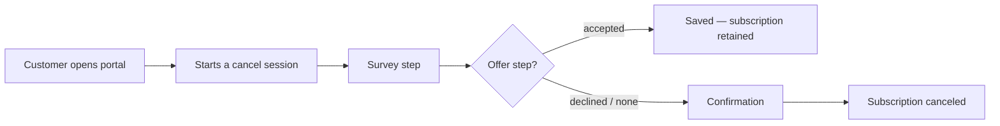

## Overview

Cancel self-service lets customers end a subscription from the portal
without contacting support. Recurso runs a **cancel flow** — a sequence of
steps (survey → retention offer → confirmation) designed to reduce churn
while respecting the customer's intent. The flow you build with the
[Cancel Flows API](/advanced/cancel-flows) is what the customer walks
through.



## 1. Authenticate the customer

Cancellation happens inside a portal session — get the customer signed in
with a [magic link](/portal/magic-links) first:

```bash
curl -X POST https://billing.example.com/portal/auth/request \
  -H "Content-Type: application/json" \
  -d '{ "email": "billing@acme.com" }'
```

There is no merchant-side "create portal session" call — the customer
authenticates themselves via the emailed link.

## 2. Build the flow (steps)

A cancel flow is a name plus **ordered steps**. Each step has a
`step_type` and a free-form `config`; `cooldown_days` sets how long a saved
customer waits before re-entering the flow. Survey, offer, and confirmation
are simply three step types:

```bash
curl -X POST https://api.recurso.dev/v1/cancel-flows \
  -H "Authorization: Bearer $API_KEY" -H "Content-Type: application/json" \
  -d '{
    "name": "Standard retention",
    "is_default": true,
    "cooldown_days": 30,
    "steps": [
      {
        "step_order": 1,
        "step_type": "survey",
        "config": {
          "title": "We are sorry to see you go",
          "reasons": [
            { "id": "too_expensive", "label": "Too expensive" },
            { "id": "not_using", "label": "Not using it enough" },
            { "id": "missing_features", "label": "Missing features", "allows_comment": true }
          ]
        }
      },
      {
        "step_order": 2,
        "step_type": "offer",
        "config": {
          "trigger_reason": "too_expensive",
          "type": "discount",
          "coupon_code": "SAVE30",
          "title": "30% off for 3 months?"
        }
      },
      {
        "step_order": 3,
        "step_type": "confirm",
        "config": { "behavior": "end_of_period" }
      }
    ]
  }'
```

<Note>
`config` is stored as-is and rendered by your portal UI, so the exact keys
(`reasons`, `type`, `coupon_code`, `behavior`, …) are your convention —
these are conventions the reference portal uses, not enforced schema.
Offer types you'll commonly model: `discount` (a coupon), `pause`,
`downgrade`.
</Note>

Manage the flow with the rest of the [Cancel Flows API](/advanced/cancel-flows):
`PUT /v1/cancel-flows/{id}`, `POST /v1/cancel-flows/{id}/steps`,
`PUT|DELETE /v1/cancel-flows/steps/{id}`.

## 3. Run a cancel session

When the customer clicks "Cancel", start a session and advance it step by
step. The session carries the state your portal reads:

```bash
# Start
curl -X POST https://api.recurso.dev/v1/cancel-flows/sessions/start \
  -H "Authorization: Bearer $API_KEY" -H "Content-Type: application/json" \
  -d '{ "customer_id": "cust_abc", "subscription_id": "sub_xyz" }'

# Submit each step (reason, offer response, confirmation)
curl -X POST https://api.recurso.dev/v1/cancel-flows/sessions/{session_id}/submit \
  -H "Authorization: Bearer $API_KEY" -H "Content-Type: application/json" \
  -d '{ "reason": "too_expensive" }'
```

The session object reports progress:

| Field | Meaning |
|-------|---------|
| `status` | `in_progress`, `completed`, `cancelled`, or `saved` |
| `current_step_index` | Which step the customer is on |
| `cancellation_reason` | Reason chosen in the survey |
| `offer_presented` / `offer_accepted` | Retention-offer outcome |
| `saved_by_offer` | `true` when an accepted offer kept the customer |

Aggregate outcomes (saves vs. cancels) come from
`GET /v1/cancel-flows/stats`.

## Confirmation behavior

The confirmation step's `behavior` decides timing:

| Behavior | Description |
|----------|-------------|
| `end_of_period` | Stays active until the period ends, then cancels (the customer can reactivate before then) |
| `immediate` | Cancels at once; proration may apply |

## Which actions the portal exposes

Whether the cancel button appears, and which flow it uses, is a
**dashboard setting** (Settings → Portal) — there is no
`/v1/settings/portal` endpoint.

## Gift redemption

The portal also redeems [gift](/advanced/gifts) codes. Customers do this in
the portal UI (`POST /portal/api/redeem`); the merchant-side equivalent is:

```bash
curl -X POST https://api.recurso.dev/v1/gifts/redeem \
  -H "Authorization: Bearer $API_KEY" -H "Content-Type: application/json" \
  -d '{ "code": "GIFT-ACME-2025-XK9M", "customer_id": "cust_new42" }'
```

## Events

Recurso emits `subscription.canceled` when a cancellation takes effect
(and `subscription.renewed` if a saved customer's billing continues). The
per-step cancel-session state (survey answer, offer outcome, `saved_by_offer`)
lives on the **session object** above and in `GET /v1/cancel-flows/stats` —
not as separate webhook events.

## Best Practices

<CardGroup cols={2}>
  <Card title="Always survey" icon="clipboard-question">
    The cancellation reason is your most valuable churn signal — capture it
    on every cancel.
  </Card>
  <Card title="Match offers to reasons" icon="bullseye">
    A "too expensive" customer responds to a discount, not a feature
    announcement.
  </Card>
  <Card title="Keep it short" icon="forward">
    Survey, one offer, confirm. Extra friction on someone who wants to leave
    backfires.
  </Card>
  <Card title="Respect the decision" icon="handshake">
    If they decline the offer, let them confirm and go gracefully.
  </Card>
</CardGroup>
