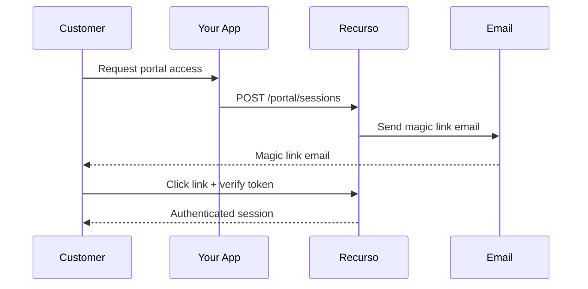

## Overview

Magic links provide secure, passwordless access to the customer portal. Customers click a link in their email to authenticate.

## How It Works



## Generate Magic Link

```typescript
const session = await recurso.portal.createSession({
  customer_id: 'cust_abc',
  return_url: 'https://yourapp.com/account',
  expires_in: 900  // 15 minutes (default)
});

// Option 1: Redirect directly
res.redirect(session.url);

// Option 2: Send via your own email
await sendEmail({
  to: customer.email,
  subject: 'Access Your Billing Portal',
  body: `Click here to access your billing: ${session.url}`
});
```

## Configuration

### Email Template

Customize the magic link email:

```typescript
await recurso.settings.portal.update({
  magic_link_email: {
    subject: 'Access Your {{company_name}} Billing',
    from_name: 'YourBrand Billing',
    button_text: 'Access Portal',
    logo_url: 'https://yourapp.com/logo.png'
  }
});
```

### Security Settings

```typescript
await recurso.settings.portal.update({
  magic_link: {
    expires_in: 900,  // 15 minutes
    single_use: true,  // Token expires after use
    ip_validation: false  // Strict IP matching
  }
});
```

## Verify Token (Custom Flow)

For custom integrations:

```typescript
const verification = await recurso.portal.verifyToken(token);

if (verification.valid) {
  const customer = verification.customer;
  // Create your own session
} else {
  // Token expired or invalid
}
```

## Request Magic Link (Frontend)

Endpoint for customers to request access:

```typescript
// Your backend
app.post('/request-portal-access', async (req, res) => {
  const { email } = req.body;
  
  const customer = await recurso.customers.getByEmail(email);
  
  if (customer) {
    await recurso.portal.createSession({
      customer_id: customer.id,
      send_email: true  // Recurso sends the email
    });
  }
  
  // Always return success to prevent email enumeration
  res.json({ message: 'If that email exists, we sent a link.' });
});
```

## Email Delivery

Magic link emails include:

- Your company logo
- Clear call-to-action button
- Expiration notice
- Security footer

## Troubleshooting

| Issue | Solution |
|-------|----------|
| Link expired | Default is 15 min, increase `expires_in` |
| Email not received | Check spam, verify email settings |
| Token already used | `single_use: true` invalidates after click |
