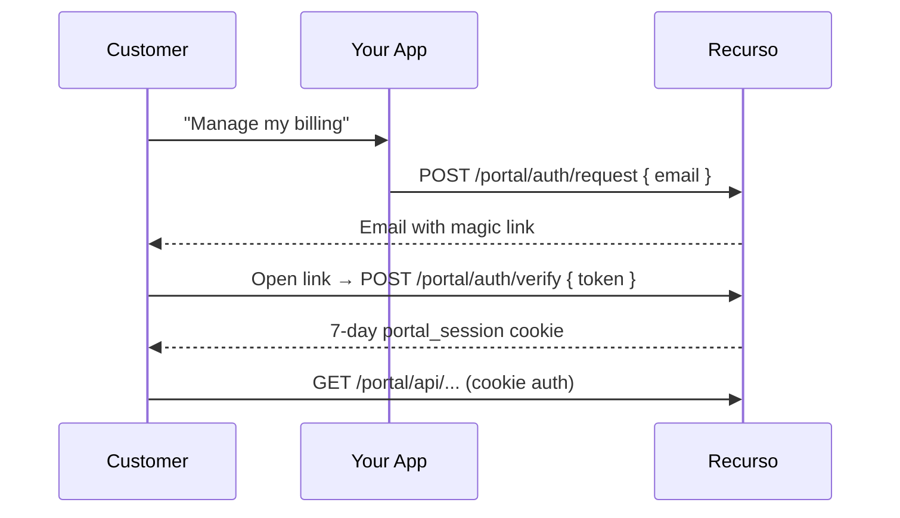

## Overview

Customers sign into the portal with a **magic link** — no passwords, no
accounts to manage. The flow is two endpoints: request a link, then verify
the token it carries.

## 1. Request a link

`POST /portal/auth/request` is **public** (no API key). Call it from your
app when a customer clicks "Manage billing", or let the customer enter
their email on a page you host:

```bash
curl -X POST https://billing.example.com/portal/auth/request \
  -H "Content-Type: application/json" \
  -d '{ "email": "billing@acme.com" }'
```

```json
{ "message": "If that email exists, we've sent a login link." }
```

<Note>
The response is identical whether or not the email belongs to a customer —
this prevents email enumeration. In development (`APP_ENV=development`) the
response also includes a `_dev_link` so you can click through without a
mailbox.
</Note>

## 2. Verify the token

The emailed link points at your portal with a one-time token. Exchanging it
starts a **7-day session** and sets the `portal_session` cookie:

```bash
curl -X POST https://billing.example.com/portal/auth/verify \
  -H "Content-Type: application/json" \
  -d '{ "token": "<token-from-the-link>" }' \
  -c cookies.txt
```

```json
{ "message": "Signed in.", "session_token": "<opaque-session-token>" }
```

From here, every `/portal/api/*` call is authenticated by the
`portal_session` cookie (browsers send it automatically):

```bash
curl https://billing.example.com/portal/api/invoices -b cookies.txt
```

## Flow


```mermaid
sequenceDiagram
    participant C as Customer
    participant A as Your App
    participant R as Recurso
    C->>A: "Manage my billing"
    A->>R: POST /portal/auth/request { email }
    R-->>C: Email with magic link
    C->>R: Open link → POST /portal/auth/verify { token }
    R-->>C: 7-day portal_session cookie
    C->>R: GET /portal/api/... (cookie auth)
```

## Security

- **Single-use tokens** with a short expiry — a link works once.
- **Sessions last 7 days**; `POST /portal/api/logout` ends one early.
- **Enumeration-safe** request endpoint (always a positive response).

<Note>
Email branding (from-name, logo, subject) is a **dashboard setting** under
**Settings → Portal**, not an API field — there is no
`/v1/settings/portal` endpoint.
</Note>

## Next Steps

<Card title="Self-Service" icon="user-gear" href="/portal/self-service">
  What a signed-in customer can do: invoices, card updates, mandates,
  disputes, gifts.
</Card>
