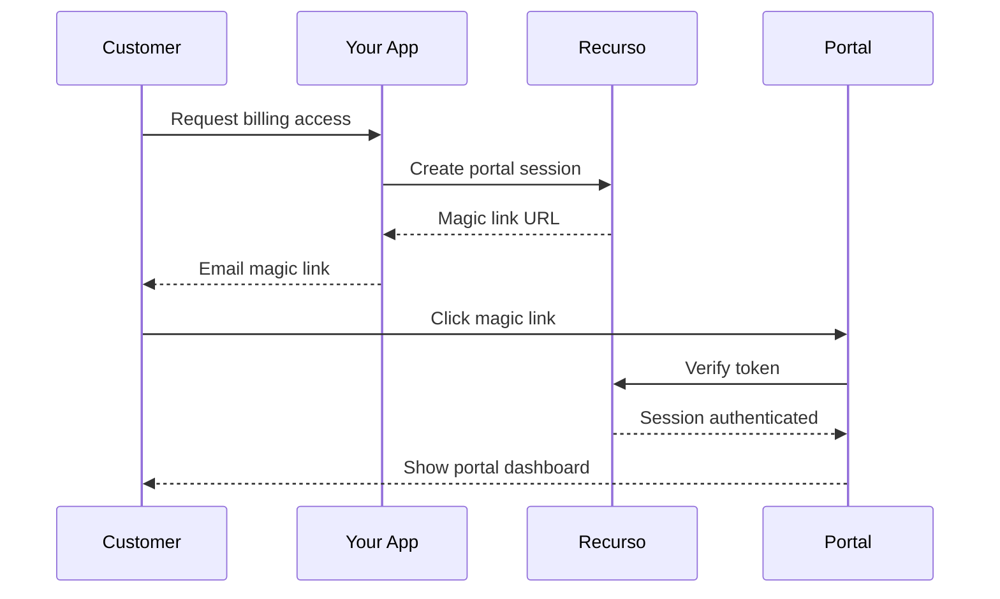

## Overview

The Customer Portal is a white-label interface where your customers can:

- View and pay invoices
- Manage subscriptions
- Update payment methods
- Download invoices as PDF
- Cancel subscriptions

## Features

<CardGroup cols={2}>
  <Card title="Magic Links" icon="wand-magic-sparkles">
    Passwordless authentication via email
  </Card>
  <Card title="Invoice Management" icon="file-invoice">
    View, pay, and download invoices
  </Card>
  <Card title="Subscription Control" icon="sliders">
    Upgrade, downgrade, or cancel
  </Card>
  <Card title="Payment Methods" icon="credit-card">
    Add or update payment methods
  </Card>
</CardGroup>

## Access Portal

### Generate Magic Link

```typescript
const session = await recurso.portal.createSession({
  customer_id: 'cust_abc',
  return_url: 'https://yourapp.com/account'
});

// Redirect customer or email the link
console.log(session.url);
// https://portal.yourapp.com/verify?token=xxx
```

### Embed in Your App

```typescript
// Create embedded session
const embedded = await recurso.portal.createEmbeddedSession({
  customer_id: 'cust_abc'
});

// Use in iframe
<iframe src={embedded.url} />
```

## Portal URLs

| URL | Purpose |
|-----|---------|
| `/portal` | Dashboard home |
| `/portal/invoices` | Invoice list |
| `/portal/subscriptions` | Subscription management |
| `/portal/payment-methods` | Payment methods |
| `/portal/pay/:invoice_id` | Pay specific invoice |

## Customization

### Branding

```typescript
await recurso.settings.portal.update({
  logo_url: 'https://yourapp.com/logo.png',
  primary_color: '#10B981',
  company_name: 'YourBrand',
  support_email: 'support@yourapp.com'
});
```

### Enable/Disable Features

```typescript
await recurso.settings.portal.update({
  allow_cancel: true,
  allow_upgrade: true,
  allow_downgrade: false,  // Require contacting support
  show_invoices: true,
  show_usage: true
});
```

## Self-Service Actions

### Cancel Subscription

Customers can cancel from the portal:

1. Go to Subscriptions
2. Click "Cancel Subscription"
3. Select reason
4. Confirm cancellation

<Info>
Configure cancellation behavior in settings: immediate vs end of period.
</Info>

### Update Payment Method

1. Go to Payment Methods
2. Add new card via Razorpay/Stripe
3. Set as default
4. Remove old methods

### Pay Invoice

1. Click "Pay Now" on invoice
2. Complete payment via gateway
3. Receive confirmation email

## Architecture



## Security

- **Time-limited tokens**: Magic links expire in 15 minutes
- **Session duration**: Portal sessions last 24 hours
- **IP validation**: Optional IP restriction
- **Audit logs**: All actions logged

## Next Steps

<CardGroup cols={2}>
  <Card title="Magic Links" icon="wand-magic-sparkles" href="/portal/magic-links">
    Configure passwordless auth
  </Card>
  <Card title="Self-Service" icon="user-gear" href="/portal/self-service">
    Enable customer actions
  </Card>
</CardGroup>
