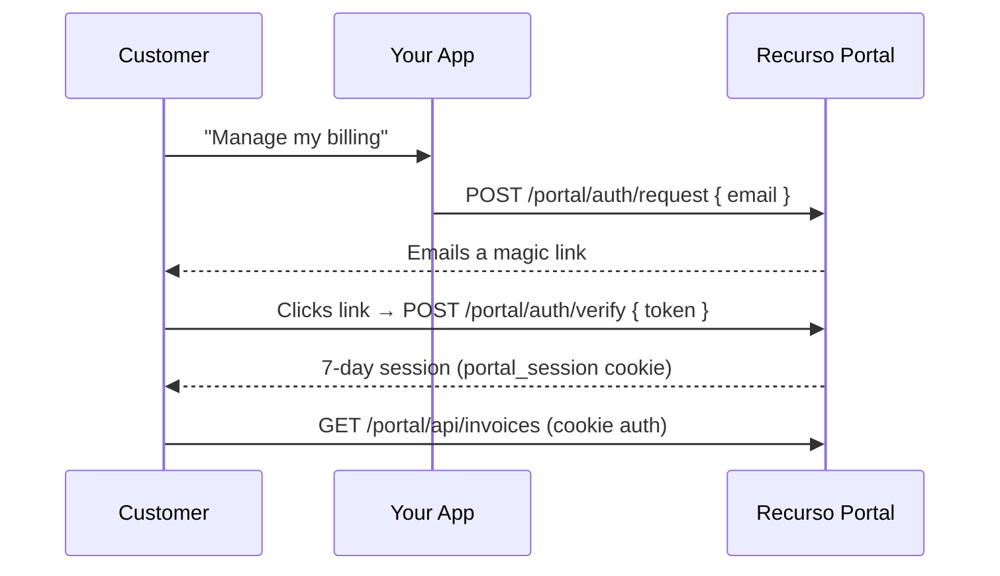

## Overview

The Customer Portal is a **customer-facing** surface: your customers sign
in passwordlessly with a magic link and manage their own billing. It is a
separate API from the merchant `/v1` API — portal endpoints live under
`/portal` and authenticate with a session cookie, not your API key. Your
backend never proxies these calls; you only kick off the magic link.

What a signed-in customer can do today:

<CardGroup cols={2}>
  <Card title="View & pay invoices" icon="file-invoice">
    List invoices, open the hosted checkout, download a PDF.
  </Card>
  <Card title="Update the card on file" icon="credit-card">
    Stripe SetupIntent for cards, or re-authorize a UPI AutoPay mandate.
  </Card>
  <Card title="Raise a dispute" icon="circle-question">
    Query or dispute one of their own invoices.
  </Card>
  <Card title="Redeem a gift code" icon="gift">
    Apply a [gift](/advanced/gifts) code to their account.
  </Card>
</CardGroup>

<Note>
Subscription **cancellation** is handled by the separate
[cancel-flows](/portal/cancel-self-service) feature (surveys, retention
offers, confirmation) rather than a raw portal endpoint.
</Note>

## How authentication works

```mermaid
sequenceDiagram
    participant C as Customer
    participant A as Your App
    participant R as Recurso Portal
    C->>A: "Manage my billing"
    A->>R: POST /portal/auth/request { email }
    R-->>C: Emails a magic link
    C->>R: Clicks link → POST /portal/auth/verify { token }
    R-->>C: 7-day session (portal_session cookie)
    C->>R: GET /portal/api/invoices (cookie auth)
```

There is **no merchant-side "create session" call**. Your app (or the
customer) posts the email; Recurso emails the link; clicking it starts the
session. Full flow in [Magic Links](/portal/magic-links).

## Portal API surface

All data endpoints require the `portal_session` cookie set by
`/portal/auth/verify`.

| Endpoint | Purpose |
|----------|---------|
| `POST /portal/auth/request` | Email a magic login link (public) |
| `POST /portal/auth/verify` | Exchange the token for a 7-day session |
| `GET /portal/api/profile` | The signed-in customer's profile |
| `GET /portal/api/invoices` | Their invoices |
| `GET /portal/api/invoices/{id}/pdf` | Download an invoice PDF |
| `POST /portal/api/payment-method/setup-intent` | Start a card update (Stripe) |
| `POST /portal/api/payment-method/mandate` | Re-authorize a UPI AutoPay mandate |
| `POST /portal/api/invoices/{id}/dispute` | Raise a dispute on an invoice |
| `POST /portal/api/redeem` | Redeem a gift code |
| `POST /portal/api/logout` | End the session |

## Branding & configuration

Portal branding (logo, colors, support email) and which self-service
actions are exposed are **dashboard settings**, not API calls — configure
them under **Settings → Portal** in the Recurso dashboard. There is no
`/v1/settings/portal` endpoint.

## Security

- **Time-limited magic links** — single-use tokens, short expiry.
- **Session cookie** — `portal_session`, valid 7 days.
- **Email-enumeration safe** — `/portal/auth/request` always responds
  positively, whether or not the email exists.
- **Audit trail** — portal actions land in the append-only audit log.

## Next Steps

<CardGroup cols={2}>
  <Card title="Magic Links" icon="wand-magic-sparkles" href="/portal/magic-links">
    The passwordless auth flow, end to end.
  </Card>
  <Card title="Self-Service" icon="user-gear" href="/portal/self-service">
    Invoices, card updates, mandates, disputes.
  </Card>
  <Card title="Cancellation Flows" icon="door-open" href="/portal/cancel-self-service">
    Surveys, retention offers, and confirmation.
  </Card>
  <Card title="Gifts" icon="gift" href="/advanced/gifts">
    How gift codes are purchased and redeemed.
  </Card>
</CardGroup>
